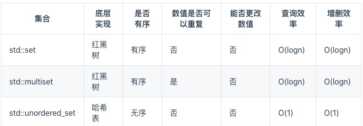
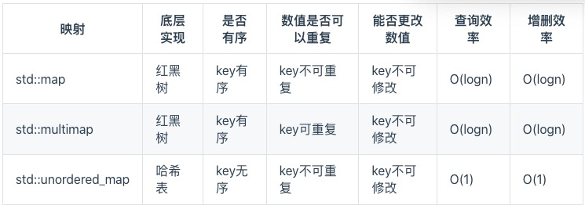
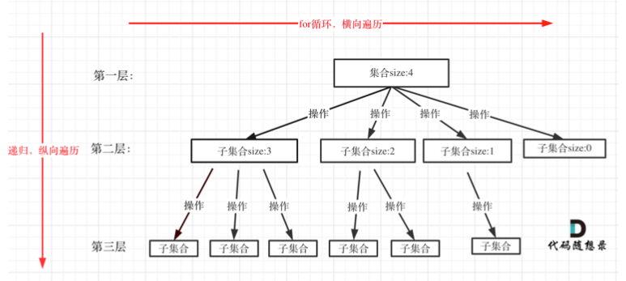

<!-- TOC -->

- [0、模版总结](#0模版总结)
  - [0.1、二叉树总结](#01二叉树总结)
    - [必刷题目](#必刷题目)
  - [0.2、回溯法总结](#02回溯法总结)
    - [2.1、backtracking programming template](#21backtracking-programming-template)
  - [0.3、贪心总结](#03贪心总结)
    - [3.1、greedy algorithm template](#31greedy-algorithm-template)
  - [0.4、动态规划总结](#04动态规划总结)
    - [4.1、dynamic programming template](#41dynamic-programming-template)
    - [4.2、注意事项](#42注意事项)
    - [4.3、背包问题总结](#43背包问题总结)
      - [4.3.1、背包递推公式](#431背包递推公式)
      - [4.3.2、遍历顺序](#432遍历顺序)
  - [0.5、回溯法总结](#05回溯法总结)
- [1、数组](#1数组)
  - [1.0、binary search question](#10binary-search-question)
  - [1.1、二分查找（数组）](#11二分查找数组)
  - [1.2、数组总结](#12数组总结)
    - [1.2.1、数组理论基础](#121数组理论基础)
    - [1.2.2、数组的经典题目](#122数组的经典题目)
- [2、链表](#2链表)
  - [2.1、链表的类型](#21链表的类型)
    - [2.1.1、单链表](#211单链表)
    - [2.1.2、双链表](#212双链表)
    - [2.1.3、循环链表](#213循环链表)
  - [2.2、链表的存储方式](#22链表的存储方式)
  - [2.3、链表的定义](#23链表的定义)
  - [2.4、链表的操作](#24链表的操作)
  - [2.5、链表题目](#25链表题目)
- [3、哈希表](#3哈希表)
  - [3.1、哈希函数](#31哈希函数)
  - [3.2、哈希碰撞](#32哈希碰撞)
    - [线性探测法](#线性探测法)
    - [拉链法](#拉链法)
  - [3.3、常见的三种哈希结构](#33常见的三种哈希结构)
  - [3.4、总结](#34总结)
  - [3.5、题目](#35题目)
- [4、字符串](#4字符串)
  - [普通字符串题目处理思路](#普通字符串题目处理思路)
  - [KMP算法](#kmp算法)
    - [KMP有什么用](#kmp有什么用)
    - [什么是前缀表](#什么是前缀表)
    - [最长公共前后缀？](#最长公共前后缀)
    - [为什么一定要用前缀表?](#为什么一定要用前缀表)
- [5、双指针法](#5双指针法)
- [6、栈与队列](#6栈与队列)
- [7、二叉树](#7二叉树)
  - [7.1、二叉树的定义](#71二叉树的定义)
  - [7.2、二叉树的种类](#72二叉树的种类)
  - [7.3、二叉树的存储方式](#73二叉树的存储方式)
  - [7.4、二叉树的遍历方式](#74二叉树的遍历方式)
    - [递归算法的三个要素](#递归算法的三个要素)
  - [7.5、二叉树题目汇总](#75二叉树题目汇总)
    - [二叉树的深度遍历](#二叉树的深度遍历)
      - [recursively method](#recursively-method)
      - [Iterative method](#iterative-method)
    - [二叉树的层序遍历](#二叉树的层序遍历)
    - [二叉树有意义的题目](#二叉树有意义的题目)
    - [一些概念](#一些概念)
- [8、回溯算法](#8回溯算法)
  - [8.1、什么是回溯法](#81什么是回溯法)
  - [8.2、回溯法的效率](#82回溯法的效率)
  - [8.3、回溯法解决的问题](#83回溯法解决的问题)
  - [8.4、如何理解回溯法](#84如何理解回溯法)
  - [8.5、回溯法模板](#85回溯法模板)
  - [8.6、回溯法题目](#86回溯法题目)
    - [组合](#组合)
    - [分割](#分割)
    - [子集](#子集)
    - [排列](#排列)
    - [棋盘问题](#棋盘问题)
    - [其他](#其他)
- [9、贪心算法](#9贪心算法)
  - [9.1、什么是贪心](#91什么是贪心)
  - [9.2、贪心的套路(什么时候用贪心)](#92贪心的套路什么时候用贪心)
  - [9.3、贪心一般解题步骤](#93贪心一般解题步骤)
  - [9.4、总结](#94总结)
  - [9.5、题目汇总](#95题目汇总)
- [10、动态规划](#10动态规划)
  - [10.1、动态规划和贪心](#101动态规划和贪心)
  - [10.2、动态规划的解题步骤](#102动态规划的解题步骤)
  - [10.3、动态规划应该如何debug](#103动态规划应该如何debug)
  - [10.4、动态规划题目汇总](#104动态规划题目汇总)
    - [1、基础题目](#1基础题目)
    - [2、背包问题](#2背包问题)
      - [2.1、01背包](#2101背包)
      - [2.2、完全背包](#22完全背包)
      - [2.3、多重背包](#23多重背包)
      - [2.4、背包问题总结](#24背包问题总结)
        - [2.4.1、背包递推公式](#241背包递推公式)
        - [2.4.2、遍历顺序](#242遍历顺序)
    - [3、打家劫舍（待完成）](#3打家劫舍待完成)
    - [4、股票问题（待完成）](#4股票问题待完成)
    - [5、子序列问题（待完成）](#5子序列问题待完成)
      - [5.1、子序列（不连续）](#51子序列不连续)
      - [5.2、子序列（连续）](#52子序列连续)
      - [5.3、编辑距离](#53编辑距离)
      - [5.4、回文](#54回文)

<!-- /TOC -->
## 0、模版总结

### 0.1、二叉树总结

#### 必刷题目

二叉树的递归、迭代方式的深度优先、广度优先（层序遍历）遍历。


### 0.2、回溯法总结
#### 2.1、backtracking programming template
回溯算法模板框架如下:

* 回溯三部曲

```
1、回溯函数模板返回值以及参数
2、回溯函数终止条件
3、回溯搜索的遍历过程
```

* 回溯算法模板框架

```
void backtracking(参数) { 
	if (终止条件) {
		存放结果;
		return; 
	}
	for (选择:本层集合中元素(树中节点孩子的数量就是集合的大小)) {
		处理节点;
		backtracking(路径，选择列表); // 递归:控制树的纵向遍历
		回溯，撤销处理结果
	} 
}
```

### 0.3、贪心总结

#### 3.1、greedy algorithm template

* **确定问题可以通过局部最优，推出整体最优，并想不出反例。**
* **将问题分解为若干个子问题**
* **找出适合的贪心策略**
* **求解每一个子问题的最优解**
* **将局部最优解堆叠成全局最优解**

贪心算法一般分为如下四步:


### 0.4、动态规划总结

#### 4.1、dynamic programming template

动态规划算法模板框架如下:

对于动态规划问题，我将拆解为如下五步曲，这五步都搞清楚了，才能说把动态规划真的掌握了!

* **1、确定dp数组(dp table)以及下标的含义**；   

* **2、确定递推公式**；

* **3、dp数组如何初始化**；

* **4、确定遍历顺序**；

* **5、举例推导dp数组**；

  

#### 4.2、注意事项

* 内、外循环的顺序

**<u>求排列时需要将背包（target）放在外循环，将物品（nums）放在内循环。</u>**(377. 组合总和 IV)

**<u>求组合时需要将物品（nums）放在外循环，将背包（target）放在内循环。</u>**(518.零钱兑换II)

**<u>要求价值最少/大时，两个循环的先后顺序就无所谓了。</u>** (322.零钱兑换)

* 内循环遍历顺序

**<u>每一步可以走多次，这是完全背包，内循环需要从前向后遍历。</u>**(322.零钱兑换)

**<u>每一步可以走一次，这是01背包，内循环需要从后向前遍历。</u>**(见01背包)


#### 4.3、背包问题总结

在讲解背包问题的时候，我们都是按照如下五部来逐步分析，相信大家也体会到，把这五部都搞透了， 算是对动规来理解深入了。

1. 确定dp数组(dp table)以及下标的含义 
2. 确定递推公式
3. dp数组如何初始化
4. 确定遍历顺序
5. 举例推导dp数组

其实这五部里哪一步都很关键，但确定递推公式和确定遍历顺序都具有规律性和代表性，所以下面我从这两点来对背包问题做一做总结。

##### 4.3.1、背包递推公式

问能否能装满背包(或者最多装多少): dp[j] = max(dp[j], dp[j - nums[i]] + nums[i]); ，对应题目如下:

* 动态规划:416.分割等和子集 
* 动态规划:1049.最后一块石头的重量 II

问装满背包有几种方法: dp[j] += dp[j - nums[i]] ，对应题目如下:

* 动态规划:494.目标和
* 动态规划:518. 零钱兑换 II 动态规划:377.组合总和IV
* 动态规划:70. 爬楼梯进阶版(完全背包)

问背包装满最大价值:dp[j] = max(dp[j], dp[j - weight[i]] + value[i]); ，对应题目如下: 

* 动态规划:474.一和零

问装满背包所有物品的最小个数:dp[j] = min(dp[j - coins[i]] + 1, dp[j])；，对应题目如下: 

* 动态规划:322.零钱兑换
* 动态规划:279.完全平方数 

##### 4.3.2、遍历顺序

**01**背包：

关于01背包问题的二维dp数组解法，先遍历物品还是先遍历背包都是可以的，且第二层for循环是从小到大遍历。 

**关于01背包问题的滚动数组解法，我们讲解一维dp数组01背包只能先遍历物品再遍历背包容量，且第二层for循环是从大到小遍历。** 一维dp数组的背包在遍历顺序上和二维dp数组实现的01背包其实是有很大差异的，大家需要注意!

完全背包：

**纯完全背包的一维dp数组实现，先遍历物品还是先遍历背包都是可以的，且第二层for循环是从小到大遍历。**

**但是仅仅是纯完全背包的遍历顺序是这样的，题目稍有变化，两个for循环的先后顺序就不一样了。** 

**如果求组合数就是外层for循环遍历物品，内层for遍历背包。**

**如果求排列数就是外层for遍历背包，内层for循环遍历物品。**

相关题目如下:

* 求组合数:动态规划:518.零钱兑换II
* 求排列数:动态规划:377. 组合总和 IV、动态规划:70. 爬楼梯进阶版(完全背包)

如果求最小数，那么两层for循环的先后顺序就无所谓了，相关题目如下: 

* 求最小数:动态规划:322. 零钱兑换、动态规划:279.完全平方数

对于背包问题，其实递推公式算是容易的，难是难在遍历顺序上，如果把遍历顺序搞透，才算是真正理解了。


### 0.5、回溯法总结

回溯法也可以叫做回溯搜索法，它是一种搜索的方式。回溯法并不是什么高效的算法。<u>**因为回溯的本质是穷举，穷举所有可能，然后选出我们想要的答案**</u>，如果想让回溯法高效一些，可以加一些剪枝的操作，但也改不了回溯法就是穷举的本质。

* 动态规划

如果某一问题有很多重叠子问题，使用动态规划是最有效的。<u>**所以动态规划中每一个状态一定是由上一个状态推导出来的**</u>，这一点就区分于贪心，贪心没有状态推导，而是从局部最优解直接选出全局最优解的。


## 1、数组

### 1.0、binary search question
[binary-search](https://leetcode-cn.com/problems/binary-search/)  
给定一个 n 个元素有序的（升序）整型数组 nums 和一个目标值 target  ，写一个函数搜索 nums 中的 target，如果目标值存在返回下标，否则返回 -1。

示例 1:
```
输入: nums = [-1,0,3,5,9,12], target = 9     
输出: 4       
解释: 9 出现在 nums 中并且下标为 4     
示例 2:

输入: nums = [-1,0,3,5,9,12], target = 2     
输出: -1        
解释: 2 不存在 nums 中因此返回 -1        
提示：
```
你可以假设 nums 中的所有元素是不重复的。
n 将在 [1, 10000]之间。
nums 的每个元素都将在 [-9999, 9999]之间。

```cpp
// 版本一
class Solution {
public:
    int search(vector<int>& nums, int target) {
        int left = 0;
        int right = nums.size() - 1; // 定义target在左闭右闭的区间里，[left, right]
        while (left <= right) { // 当left==right，区间[left, right]依然有效，所以用 <=
            int middle = left + ((right - left) / 2);// 防止溢出 等同于(left + right)/2
            if (nums[middle] > target) {
                right = middle - 1; // target 在左区间，所以[left, middle - 1]
            } else if (nums[middle] < target) {
                left = middle + 1; // target 在右区间，所以[middle + 1, right]
            } else { // nums[middle] == target
                return middle; // 数组中找到目标值，直接返回下标
            }
        }
        // 未找到目标值
        return -1;
    }
};
```

```cpp
// 版本二
class Solution {
public:
    int search(vector<int>& nums, int target) {
        int left = 0;
        int right = nums.size(); // 定义target在左闭右开的区间里，即：[left, right)
        while (left < right) { // 因为left == right的时候，在[left, right)是无效的空间，所以使用 <
            int middle = left + ((right - left) >> 1);
            if (nums[middle] > target) {
                right = middle; // target 在左区间，在[left, middle)中
            } else if (nums[middle] < target) {
                left = middle + 1; // target 在右区间，在[middle + 1, right)中
            } else { // nums[middle] == target
                return middle; // 数组中找到目标值，直接返回下标
            }
        }
        // 未找到目标值
        return -1;
    }
};
```

### 1.1、二分查找（数组）

* 704.二分查找

  **这道题目的前提是数组为有序数组**，同时题目还强调**数组中无重复元素**，因为一旦有重复元素，使用二分查找法返回的元素下标可能不是唯一的，这些都是使用二分法的前提条件，当大家看到题目描述满足如上条件的时候，可要想一想是不是可以用二分法了。

  * 二分法第一种写法

    第一种写法，我们定义 target 是在一个在左闭右闭的区间里，**也就是[left, right] （这个很重要非常重要）**。

    区间的定义这就决定了二分法的代码应该如何写，**因为定义target在[left, right]区间，所以有如下两点：**

    - while (left <= right) 要使用 <= ，因为left == right是有意义的，所以使用 <=

    - if (nums[middle] > target) right 要赋值为 middle - 1，因为当前这个nums[middle]一定不是target，那么接下来要查找的左区间结束下标位置就是 middle - 1

      

  * 二分法第二种写法

    如果说定义 target 是在一个在左闭右开的区间里，**也就是[left, right)** ，那么二分法的边界处理方式则截然不同。

    有如下两点：

    * while (left < right)，这里使用 < ,因为left == right在区间[left, right)是没有意义的

    * if (nums[middle] > target) right 更新为 middle，因为当前nums[middle]不等于target，去左区间继续寻找，而寻找区间是左闭右开区间，所以right更新为middle，即：下一个查询区间不会去比较nums[middle]

* 二分查找总结

  二分法是非常重要的基础算法，为什么很多同学对于二分法都是**一看就会，一写就废**？其实主要就是对区间的定义没有理解清楚，在循环中没有始终坚持根据查找区间的定义来做边界处理。

  **区间的定义就是不变量，那么在循环中坚持根据查找区间的定义来做边界处理，就是循环不变量规则。**


* 二分查找题目

  * 704.二分查找

  - [35.搜索插入位置(opens new window)](https://programmercarl.com/0035.搜索插入位置.html)
  - 34.在排序数组中查找元素的第一个和最后一个位置 【这个题目有点儿难度-medium】
  - 69.x 的平方根
  - 367.有效的完全平方数


### 1.2、数组总结

#### 1.2.1、数组理论基础

**数组是存放在连续内存空间上的相同类型数据的集合。**

- **数组下标都是从0开始的。**
- **数组内存空间的地址是连续的**

正是**因为数组的在内存空间的地址是连续的，所以我们在删除或者增添元素的时候，就难免要移动其他元素的地址。**

**数组的元素是不能删的，只能覆盖。**

使用C++的话，要注意vector 和 array的区别，vector的底层实现是array，严格来讲vector是容器，不是数组。

**那么二维数组在内存的空间地址是连续的么？**


所以**二维数据在内存中不是 `3*4` 的连续地址空间，而是四条连续的地址空间组成！**


#### 1.2.2、数组的经典题目

* 二分法

  题目：

  * 704.二分查找

  - [35.搜索插入位置(opens new window)](https://programmercarl.com/0035.搜索插入位置.html)
  - [34.在排序数组中查找元素的第一个和最后一个位置(opens new window)](https://programmercarl.com/0034.在排序数组中查找元素的第一个和最后一个位置.html)
  - 69.x 的平方根
  - 367.有效的完全平方数

  在这道题目中我们讲到了**循环不变量原则**，只有在循环中坚持对区间的定义，才能清楚的把握循环中的各种细节。

  **二分法是算法面试中的常考题，建议通过这道题目，锻炼自己手撕二分的能力**。

  

* 双指针法

  题目：

  * 977.有序数组的平方
  * 27.移除元素

  双指针法（快慢指针法）：**通过一个快指针和慢指针在一个for循环下完成两个for循环的工作。**

  

* 滑动窗口

  题目：

  * 76.最小覆盖字串
  * 209.长度最小的子数组

  **滑动窗口的精妙之处在于根据当前子序列和大小的情况，不断调节子序列的起始位置。从而将O(n^2)的暴力解法降为O(n)。**

  

* 模拟行为

  题目：

  * 59.螺旋矩阵2
  * 54.螺旋矩阵

  在这道题目中，我们再一次介绍到了**循环不变量原则**，其实这也是写程序中的重要原则


## 2、链表

什么是链表，链表是一种通过指针串联在一起的线性结构，每一个节点由两部分组成，一个是数据域一个是指针域（存放指向下一个节点的指针），最后一个节点的指针域指向null（空指针的意思）。

### 2.1、链表的类型

#### 2.1.1、单链表

每一个节点由两部分组成，一个是数据域一个是指针域（存放指向下一个节点的指针），最后一个节点的指针域指向null（空指针的意思）。


#### 2.1.2、双链表

单链表中的节点只能指向节点的下一个节点。

双链表：每一个节点有两个指针域，一个指向下一个节点，一个指向上一个节点。

双链表既可以向前查询也可以向后查询。


#### 2.1.3、循环链表

循环链表，顾名思义，就是链表首尾相连。

循环链表可以用来解决约瑟夫环问题。


### 2.2、链表的存储方式

数组是在内存中是连续分布的，但是链表在内存中可不是连续分布的。

链表是通过指针域的指针链接在内存中各个节点。

所以链表中的节点在内存中不是连续分布的 ，而是散乱分布在内存中的某地址上，分配机制取决于操作系统的内存管理。


### 2.3、链表的定义

链表节点的定义，很多同学在面试的时候都写不好。

这是因为平时在刷leetcode的时候，链表的节点都默认定义好了，直接用就行了，所以同学们都没有注意到链表的节点是如何定义的。

```
// 单链表
struct ListNode {
    int val;  // 节点上存储的元素
    ListNode *next;  // 指向下一个节点的指针
    ListNode(int x) : val(x), next(NULL) {}  // 节点的构造函数
};
```


### 2.4、链表的操作

* 删除节点

* 增加节点

* 性能分析

  再把链表的特性和数组的特性进行一个对比，如图所示：

  

  数组在定义的时候，长度就是固定的，如果想改动数组的长度，就需要重新定义一个新的数组。

  链表的长度可以是不固定的，并且可以动态增删， 适合数据量不固定，频繁增删，较少查询的场景。


### 2.5、链表题目

* 203.移除链表元素


## 3、哈希表

哈希表是根据关键码的值而直接进行访问的数据结构。


### 3.1、哈希函数


### 3.2、哈希碰撞

数据规模是dataSize， 哈希表的大小为tableSize

#### 线性探测法

使用线性探测法，一定要保证tableSize大于dataSize。 我们需要依靠哈希表中的空位来解决碰撞问题。


#### 拉链法


### 3.3、常见的三种哈希结构

当我们想使用哈希法来解决问题的时候，我们一般会选择如下三种数据结构。

- 数组
- set （集合）
- map(映射)

这里数组就没啥可说的了，我们来看一下set。

在C++中，set 和 map 分别提供以下三种数据结构，其底层实现以及优劣如下表所示：



std::unordered_set底层实现为哈希表，std::set 和std::multiset 的底层实现是红黑树，红黑树是一种平衡二叉搜索树，所以key值是有序的，但key不可以修改，改动key值会导致整棵树的错乱，所以只能删除和增加。



std::unordered_map 底层实现为哈希表，std::map 和std::multimap 的底层实现是红黑树。同理，std::map 和std::multimap 的key也是有序的（这个问题也经常作为面试题，考察对语言容器底层的理解）。

当我们要使用集合来解决哈希问题的时候，优先使用unordered_set，因为它的查询和增删效率是最优的（O(1)），如果需要集合是有序的，那么就用set，如果要求不仅有序还要有重复数据的话，那么就用multiset。


**虽然std::set、std::multiset 的底层实现是红黑树，不是哈希表，但是std::set、std::multiset 依然使用哈希函数来做映射，只不过底层的符号表使用了红黑树来存储数据，所以使用这些数据结构来解决映射问题的方法，我们依然称之为哈希法。 map也是一样的道理。**


### 3.4、总结

总结一下，**当我们遇到了要快速判断一个元素是否出现集合里的时候，就要考虑哈希法**。

但是哈希法也是**牺牲了空间换取了时间**，因为我们要使用额外的数组，set或者是map来存放数据，才能实现快速的查找。

如果在做面试题目的时候遇到需要判断一个元素是否出现过的场景也应该第一时间想到哈希法！


### 3.5、题目

[15.三数之和 (opens new window)](https://programmercarl.com/0015.三数之和.html)的双指针解法是一层for循环num[i]为确定值，然后循环内有left和right下表作为双指针，找到nums[i] + nums[left] + nums[right] == 0。

四数之和的双指针解法是两层for循环nums[k] + nums[i]为确定值，依然是循环内有left和right下表作为双指针，找出nums[k] + nums[i] + nums[left] + nums[right] == target的情况，三数之和的时间复杂度是O(n^2)，四数之和的时间复杂度是O(n^3) 。

那么一样的道理，五数之和、六数之和等等都采用这种解法。

对于[15.三数之和 (opens new window)](https://programmercarl.com/0015.三数之和.html)双指针法就是将原本暴力O(n^3)的解法，降为O(n^2)的解法，四数之和的双指针解法就是将原本暴力O(n^4)的解法，降为O(n^3)的解法。

之前我们讲过哈希表的经典题目：[454.四数相加II (opens new window)](https://programmercarl.com/0454.四数相加II.html)，相对于本题简单很多，因为本题是要求在一个集合中找出四个数相加等于target，同时四元组不能重复。

而[454.四数相加II (opens new window)](https://programmercarl.com/0454.四数相加II.html)是四个独立的数组，只要找到A[i] + B[j] + C[k] + D[l] = 0就可以，不用考虑有重复的四个元素相加等于0的情况，所以相对于本题还是简单了不少！

我们来回顾一下，几道题目使用了双指针法。

双指针法将时间复杂度O(n^2)的解法优化为 O(n)的解法。也就是降一个数量级，题目如下：

- [27.移除元素(opens new window)](https://programmercarl.com/0027.移除元素.html)
- [15.三数之和(opens new window)](https://programmercarl.com/0015.三数之和.html)
- [18.四数之和(opens new window)](https://programmercarl.com/0018.四数之和.html)

操作链表：

- [206.反转链表(opens new window)](https://programmercarl.com/0206.翻转链表.html)
- [19.删除链表的倒数第N个节点(opens new window)](https://programmercarl.com/0019.删除链表的倒数第N个节点.html)
- [面试题 02.07. 链表相交(opens new window)](https://programmercarl.com/面试题02.07.链表相交.html)
- [142题.环形链表II(opens new window)](https://programmercarl.com/0142.环形链表II.html)

双指针法在字符串题目中还有很多应用，后面还会介绍到。


## 4、字符串

### 普通字符串题目处理思路

1、考虑双指针

2、如果字符串都是a-z & A-Z，则考虑用数组存储

ASKII码典型对照表

```
十进制		字符/缩写			解释

0		    NUL (NULL)	  空字符
32    	(Space)	       空格
48			0							数字0-9
57			9
65			A							字符串A-Z
90			Z
97			a							字符串a-z
122			z
127			DEL (Delete)	删除
结束
```


### KMP算法

KMP的经典思想就是:**当出现字符串不匹配时，可以记录一部分之前已经匹配的文本内容，利用这些信息避免从头再去做匹配。**


#### KMP有什么用

KMP主要应用在字符串匹配上。

KMP的主要思想是**当出现字符串不匹配时，可以知道一部分之前已经匹配的文本内容，可以利用这些信息避免从头再去做匹配了。**

所以如何记录已经匹配的文本内容，是KMP的重点，也是next数组肩负的重任。


#### 什么是前缀表

next数组就是一个前缀表（prefix table）。

前缀表有什么作用呢？

**前缀表是用来回退的，它记录了<u>模式串与主串(文本串)不匹配</u>的时候，模式串应该从哪里开始重新匹配。**

此时就要问了**前缀表是如何记录的呢？**

首先要知道前缀表的任务是当前位置匹配失败，找到之前已经匹配上的位置，再重新匹配，此也意味着在某个字符失配时，前缀表会告诉你下一步匹配中，模式串应该跳到哪个位置。

那么什么是前缀表：**记录下标i之前（包括i）的字符串中，有多大长度的相同前缀后缀。**


#### 最长公共前后缀？ 

文章中字符串的**前缀是指不包含最后一个字符的所有以第一个字符开头的连续子串**。

**后缀是指不包含第一个字符的所有以最后一个字符结尾的连续子串**。

**正确理解什么是前缀什么是后缀很重要**!


#### 为什么一定要用前缀表?

前缀表具有告诉我们当前位置匹配失败，跳到之前已经匹配过的地方的能力。


## 5、双指针法


## 6、栈与队列


## 7、二叉树

### 7.1、二叉树的定义

二叉树有两种存储方式顺序存储，和链式存储，顺序存储就是用数组来存，这个定义没啥可说的，我们来看看链式存储的二叉树节点的定义方式。

```
 struct TreeNode {
    int val;
    TreeNode *left;
    TreeNode *right;
    TreeNode(int x) : val(x), left(NULL), right(NULL) {}
};
```

大家会发现二叉树的定义和链表是差不多的，相对于链表 ，二叉树的节点里多了一个指针， 有两个指针，指向左右孩子。


### 7.2、二叉树的种类

* 满二叉树  

  如果一棵二叉树只有度为0的结点和度为2的结点，并且度为0的结点在同一层上，则这棵二叉树为满二叉树。（也可以说深度为k，有(2^k)-1个节点的二叉树）

* 完全二叉树

  在完全二叉树中，除了最底层节点可能没填满外，其余每层节点数都达到最大值，并且最下面一层的节点都集中在该层最左边的若干位置。若最底层为第 h 层，则该层包含 1~ 2^(h -1)个节点。（优先级队列其实是一个堆，堆就是一棵完全二叉树，同时保证父子节点的顺序关系）

* 二叉搜索树

  前面介绍的树，都没有数值的，而二叉搜索树是有数值的了，二叉搜索树是一个有序树。

  若它的左子树不空，则左子树上所有结点的值均小于它的根结点的值; 

  若它的右子树不空，则右子树上所有结点的值均大于它的根结点的值;

  它的左、右子树也分别为二叉排序树。

* 平衡二叉搜索树（AVL树、红黑树）

  平衡二叉搜索树又被称为AVL(Adelson-Velsky and Landis)树，且具有以下性质:它是一棵空树或它的左右两个子树的高度差的绝对值不超过1，并且左右两个子树都是一棵平衡二叉树。（C++中map、set、multimap**，**multiset的底层实现都是平衡二叉搜索树，所以map、set的增删操作时间时间复杂度是logn，注意我这里没有说unordered_map、unordered_set，unordered_map、 unordered_map底层实现是哈希表。）

* 平衡多路查找树（B树(多用于做文件系统的索引)、B+树(B+树是B树的变种，有着比B树更高的查询效率)）

  

### 7.3、二叉树的存储方式

二叉树可以链式存储，也可以顺序存储。

那么链式存储方式就用指针， 顺序存储的方式就是用数组。

顾名思义就是顺序存储的元素在内存是连续分布的，而链式存储则是通过指针把分布在散落在各个地址的节点串联一起。

* 用数组来存储二叉树如何遍历的呢?

如果父节点的数组下表是**i**，那么它的左孩子就是**i \* 2 + 1**，右孩子就是 **i \* 2 + 2**。 但是用链式表示的二叉树，更有利于我们理解，所以一般我们都是用链式存储二叉树。


### 7.4、二叉树的遍历方式

二叉树主要有两种遍历方式:

1. 深度优先遍历:先往深走，遇到叶子节点再往回走。
2. 广度优先遍历:一层一层的去遍历。

那么从深度优先遍历和广度优先遍历进一步拓展，才有如下遍历方式:

* 深度优先遍历

  前序遍历(递归法，迭代法—144.二叉树的前序遍历)   

  中序遍历(递归法，迭代法—94.二叉树的中序遍历)   

  后序遍历(递归法，迭代法—145.二叉树的后序遍历）

* 广度优先遍历

  层次遍历(迭代法，迭代法—102/107)

所谓前中后，都是针对根节点来讲的，记住这点即可准确写出前中后三种遍历的顺序。

最后再说一说二叉树中深度优先和广度优先遍历实现方式，我们做二叉树相关题目，经常会使用递归的方式来实现深度优先遍历，也就是实现前中后序遍历，使用递归是比较方便的。

之前我们讲栈与队列的时候，就说过栈其实就是递归的一种是实现结构，也就说**<u>前中后序遍历的逻辑其实都是可以借助栈使用非递归的方式来实现的</u>**。

而**广度优先遍历的实现一般使用队列来实现**，这也是队列先进先出的特点所决定的，因为需要先进先出的结构，才能一层一层的来遍历二叉树。

#### 递归算法的三个要素

```
1. 确定递归函数的参数和返回值: 
确定哪些参数是递归的过程中需要处理的，那么就在递归函数里加上这个参数，并且还要明确每次递归的返回值是什么进而确定递归函数的返回类型。
  
2. 确定终止条件:
写完了递归算法, 运行的时候，经常会遇到栈溢出的错误，就是没写终止条件或者终止条件写的不对，操作系统也是用一个栈的结构来保存每一层递归的信息，如果递归没有终止，操作系统的内存栈必然就会溢出。

3. 确定单层递归的逻辑: 
确定每一层递归需要处理的信息。在这里也就会􏰀复调用自己来实现递归的过程。
```


### 7.5、二叉树题目汇总

#### 二叉树的深度遍历

递归法、迭代法、统一迭代法

##### recursively method
* 前续遍历 (144.二叉树的前序遍历) 
```cpp
class Solution {
public:
    void traversal(TreeNode* cur, vector<int>& vec) {
        if (cur == NULL) return;
        vec.push_back(cur->val);    // 中
        traversal(cur->left, vec);  // 左
        traversal(cur->right, vec); // 右
    }
    vector<int> preorderTraversal(TreeNode* root) {
        vector<int> result;
        traversal(root, result);
        return result;
    }
};
```

* 后续遍历 (145.二叉树的后序遍历)
```cpp
void traversal(TreeNode* cur, vector<int>& vec) {
    if (cur == NULL) return;
    traversal(cur->left, vec);  // 左
    traversal(cur->right, vec); // 右
    vec.push_back(cur->val);    // 中
}
```

* 中续遍历(94.二叉树的中序遍历)  
```cpp  
void traversal(TreeNode* cur, vector<int>& vec) {
    if (cur == NULL) return;
    traversal(cur->left, vec);  // 左
    vec.push_back(cur->val);    // 中
    traversal(cur->right, vec); // 右
}
```

##### Iterative method
* 前序遍历
```cpp
class Solution {
public:
    vector<int> preorderTraversal(TreeNode* root) {
        stack<TreeNode*> st;
        vector<int> result;
        if (root == NULL) return result;
        st.push(root);
        while (!st.empty()) {
            TreeNode* node = st.top();                       // 中
            st.pop();
            result.push_back(node->val);
            if (node->right) st.push(node->right);           // 右（空节点不入栈）
            if (node->left) st.push(node->left);             // 左（空节点不入栈）
        }
        return result;
    }
};
```

* 中序遍历
```cpp
class Solution {
public:
    vector<int> inorderTraversal(TreeNode* root) {
        vector<int> result;
        stack<TreeNode*> st;
        TreeNode* cur = root;
        while (cur != NULL || !st.empty()) {
            if (cur != NULL) { // 指针来访问节点，访问到最底层
                st.push(cur); // 将访问的节点放进栈
                cur = cur->left;                // 左
            } else {
                cur = st.top(); // 从栈里弹出的数据，就是要处理的数据（放进result数组里的数据）
                st.pop();
                result.push_back(cur->val);     // 中
                cur = cur->right;               // 右
            }
        }
        return result;
    }
};
```

* 后续遍历
```cpp
class Solution {
public:
    vector<int> postorderTraversal(TreeNode* root) {
        stack<TreeNode*> st;
        vector<int> result;
        if (root == NULL) return result;
        st.push(root);
        while (!st.empty()) {
            TreeNode* node = st.top();
            st.pop();
            result.push_back(node->val);
            if (node->left) st.push(node->left); // 相对于前序遍历，这更改一下入栈顺序 （空节点不入栈）
            if (node->right) st.push(node->right); // 空节点不入栈
        }
        reverse(result.begin(), result.end()); // 将结果反转之后就是左右中的顺序了
        return result;
    }
};
```

#### 二叉树的层序遍历

- 02.二叉树的层序遍历
- 107.二叉树的层次遍历II
- 199.二叉树的右视图
- 637.二叉树的层平均值
- 429.N叉树的前序遍历
- 515.在每个树行中找最大值
- 116.填充每个节点的下一个右侧节点指针
- 117.填充每个节点的下一个右侧节点指针II
- 104.二叉树的最大深度
- 111.二叉树的最小深度

#### 二叉树有意义的题目

101.对称二叉树（很好的一个题目）

104.二叉树的最大深度（层序遍历或者递归）

**<u>257.二叉树的所有路径（回溯+遍历，是一道非常好的题目）</u>**


#### 一些概念

- 二叉树节点的深度：指从根节点到该节点的最长简单路径边的条数。
- 二叉树节点的高度：指从该节点到叶子节点的最长简单路径边的条数。

见110.平衡二叉树

见104.二叉树的最大深度

## 8、回溯算法

### 8.1、什么是回溯法

回溯法也可以叫做回溯搜索法，它是一种搜索的方式。  
<u>**回溯是递归的副产品，只要有递归就会有回溯。**</u>（二叉树深度遍历递归解法中都隐藏着回溯）


### 8.2、回溯法的效率

虽然回溯法很难，很不好理解，<u>**但是回溯法并不是什么高效的算法。因为回溯的本质是穷举，穷举所有可能，然后选出我们想要的答案，如果想让回溯法高效一些，可以加一些剪枝的操作，但也改不了回溯法就是穷举的本质。**</u>


### 8.3、回溯法解决的问题

回溯法，一般可以解决如下几种问题:

* 组合问题:N个数里面按一定规则找出k个数的集合   
* 切割问题:一个字符串按一定规则有几种切割方式   
* 子集问题:一个N个数的集合里有多少符合条件的子集   
* 排列问题:N个数按一定规则全排列，有几种排列方式   
* 棋盘问题:N皇后，解数独等等

注：组合是不强调元素顺序的，排列是强调元素顺序。记住组合无序，排列有序，就可以了。


### 8.4、如何理解回溯法 

回溯法解决的问题都可以抽象为树形结构（递归就要有终止条件，所以必然是一颗高度有限的树(N叉树)），是的，我指的是所有回溯法的问题都可以抽象为树形结构。

**因为回溯法解决的都是在集合中递归查找子集，集合的大小就构成了树的宽度，递归的深度就构成的树的深度。**


### 8.5、回溯法模板

* 回溯函数模板返回值以及参数

在回溯算法中，我的习惯是函数起名字为backtracking，这个起名大家随意。

回溯算法中函数返回值一般为void。

再来看一下参数，因为回溯算法需要的参数可不像二叉树递归的时候那么容易一次性确定下来，所以一 般是先写逻辑，然后需要什么参数，就填什么参数。

但后面的回溯题目的讲解中，为了方便大家理解，我在一开始就帮大家把参数确定下来。 回溯函数伪代码如下:

```
void backtracking(参数)
```

* 回溯函数终止条件

既然是树形结构，那么我们在讲解二叉树的递归的时候，就知道遍历树形结构一定要有终止条件。

所以回溯也有要终止条件。

什么时候达到了终止条件，树中就可以看出，一般来说搜到叶子节点了，也就找到了满足条件的一条答案，把这个答案存放起来，并结束本层递归。

所以回溯函数终止条件伪代码如下:

```
if (终止条件) { 
  存放结果;
	return; 
}
```

* 回溯搜索的遍历过程

在上面我们提到了，回溯法一般是在集合中递归搜索，集合的大小构成了树的宽度，递归的深度构成了树的深度。

如图:



注意图中，我特意举例集合大小和孩子的数量是相等的!   

回溯函数遍历过程伪代码如下:

```
for (选择:本层集合中元素(树中节点孩子的数量就是集合的大小)) { 
	处理节点;
	backtracking(路径，选择列表); // 递归
	回溯，撤销处理结果
}
```

for循环就是遍历集合区间，可以理解一个节点有多少个孩子，这个for循环就执行多少次。 backtracking这里自己调用自己，实现递归。

大家可以从图中看出**for**循环可以理解是横向遍历，**backtracking**(递归)就是纵向遍历，这样就把这棵树全遍历完了，一般来说，搜索叶子节点就是找的其中一个结果了。

分析完过程，回溯算法模板框架如下:

* 回溯三部曲

```
1、回溯函数模板返回值以及参数
2、回溯函数终止条件
3、回溯搜索的遍历过程
```

* 回溯算法模板框架

```
void backtracking(参数) { 
	if (终止条件) {
		存放结果;
		return; 
	}
	for (选择:本层集合中元素(树中节点孩子的数量就是集合的大小)) {
		处理节点;
		backtracking(路径，选择列表); // 递归:控制树的纵向遍历
		回溯，撤销处理结果
	} 
}
```


### 8.6、回溯法题目
#### 组合
77.组合（AC）
17.电话号码的字母组合 (AC)
39.组合总和
40.组合总和2
216.组合总和3（AC）


#### 分割
131.分割回文串
93.复原ip地址（AC）
#### 子集
78.子集
90.子集2
#### 排列
46.全排列
47.全排列2
#### 棋盘问题
51.N皇后
37.解数独
#### 其他
491.递增子序列（和子集问题很像）
322.重新安排行程
101.对称二叉树（很好的一个题目）
## 9、贪心算法
### 9.1、什么是贪心

**<u>贪心的本质是选择每一阶段的局部最优，从而达到全局最优。</u>**

这么说有点抽象，来举一个例子:

例如，有一堆钞票，你可以拿走十张，如果想达到最大的金额，你要怎么拿?

指定每次拿最大的，最终结果就是拿走最大数额的钱。

每次拿最大的就是局部最优，最后拿走最大数额的钱就是推出全局最优。

再举一个例子如果是有一堆盒子，你有一个背包体积为n，如何把背包尽可能装满，如果还每次选最大的盒子，就不行了。这时候就需要动态规划。动态规划的问题在下一个系列会详细讲解。


### 9.2、贪心的套路(什么时候用贪心)

很多同学做贪心的题目的时候，想不出来是贪心，想知道有没有什么套路可以一看就看出来是贪心。**说实话贪心算法并没有固定的套路。**
**所以唯一的难点就是如何通过局部最优，推出整体最优。 **

**那么如何能看出局部最优是否能推出整体最优呢?有没有什么固定策略或者套路呢? **

**不好意思，也没有! 靠自己手动模拟，如果模拟可行，就可以试一试贪心策略，如果不可行，可能需要动态规划。**

有同学问了如何验证可不可以用贪心算法呢? 

**最好用的策略就是举反例，如果想不到反例，那么就试一试贪心吧。** 

可有有同学认为手动模拟，举例子得出的结论不靠谱，想要严格的数学证明。 

一般数学证明有如下两种方法:

* 数学归纳法 

* 反证法

看教课书上讲解贪心可以是一堆公式，估计大家连看都不想看，所以数学证明就不在我要讲解的范围内 了。

**面试中基本不会让面试者现场证明贪心的合理性，代码写出来跑过测试用例即可，或者自己能自圆其说理由就行了。刷题或者面试的时候，手动模拟一下感觉可以局部最优推出整体最优，而且想不到反例，那么就试一试贪心。** 

### 9.3、贪心一般解题步骤

贪心算法一般分为如下四步:

```
确定问题可以通过局部最优，推出整体最优。
将问题分解为若干个子问题 
找出适合的贪心策略 
求解每一个子问题的最优解 
将局部最优解堆叠成全局最优解
```

其实这个分的有点细了，真正做题的时候很难分出这么详细的解题步骤，可能就是因为贪心的题目往往还和其他方面的知识混在一起。

### 9.4、总结

本篇给出了什么是贪心以及大家关心的贪心算法固定套路。

**<u>不好意思了，贪心没有套路，说白了就是常识性推导加上举反例。</u>**

### 9.5、题目汇总

455.分发饼干  
376.摆动序列
## 10、动态规划
### 10.1、动态规划和贪心

动态规划，英文:Dynamic Programming，简称DP，<u>**如果某一问题有很多重叠子问题，使用动态规划是最有效的。**</u>

<u>**所以动态规划中每一个状态一定是由上一个状态推导出来的，这一点就区分于贪心，贪心没有状态推导，而是从局部最优解直接选出全局最优解的。**</u>

在关于[贪心算法，你该了解这些!](https://mp.weixin.qq.com/s/O935TaoHE9Eexwe_vSbRAg) 中我举了一个背包问题的例子。

例如:有N件物品和一个最多能背重量为W 的背包。第i件物品的重量是weight[i]，得到的价值是value[i]

。每件物品只能用一次，求解将哪些物品装入背包里物品价值总和最大。

动态规划中dp[j]是由dp[j-weight[i]]推导出来的，然后取max(dp[j], dp[j - weight[i]] + value[i])。

但如果是贪心呢，每次拿物品选一个最大的或者最小的就完事了，和上一个状态没有关系。

所以贪心解决不了动态规划的问题。


### 10.2、动态规划的解题步骤

对于动态规划问题，我将拆解为如下五步曲，这五步都搞清楚了，才能说把动态规划真的掌握了!

* **1、确定dp数组(dp table)以及下标的含义**；   
* **2、确定递推公式**；
* **3、dp数组如何初始化**；
* **4、确定遍历顺序**；
* **5、举例推导dp数组**；

一些同学可能想为什么要先确定递推公式，然后在考虑初始化呢?

因为一些情况是递推公式决定了dp数组要如何初始化!


### 10.3、动态规划应该如何debug

写动规题目，代码出问题很正常! 找问题的最好方式就是把dp数组打印出来，看看究竟是不是按照自己思路推导的!

一些同学对于dp的学习是黑盒的状态，就是不清楚dp数组的含义，不懂为什么这么初始化，递推公式背下来了，遍历顺序靠习惯就是这么写的，然后一鼓作气写出代码，如果代码能通过万事大吉，通过不了 的话就凭感觉改一改。

这是一个很不好的习惯!

做动规的题目，写代码之前一定要把状态转移在dp数组的上具体情况模拟一遍，心中有数，确定最后推出的是想要的结果。

然后再写代码，如果代码没通过就打印dp数组，看看是不是和自己预先推导的哪里不一样。 **如果打印出来和自己预先模拟推导是一样的，那么就是自己的递归公式、初始化或者遍历顺序有问题了。**

如果和自己预先模拟推导的不一样，那么就是代码实现细节有问题。

这样才是一个完整的思考过程，而不是一旦代码出问题，就毫无头绪的东改改⻄改改，最后过不了，或者说是稀里糊涂的过了。这也是我为什么在动规五步曲里强调推导dp数组的重要性。

举个例子哈:在「代码随想录」刷题小分队微信群里，一些录友可能代码通过不了，会把代码抛到讨论群里问:我这里代码都已经和题解一模一样了，为什么通过不了呢? 发出这样的问题之前，其实可以自己先思考这三个问题:

**这道题目我举例推导状态转移公式了么?**

**我打印dp数组的日志了么?**

**打印出来了dp数组和我想的一样么?**

如果这灵魂三问自己都做到了，基本上这道题目也就解决了，或者更清晰的知道自己究竟是哪一点不明白，是状态转移不明白，还是实现代码不知道该怎么写，还是不理解遍历dp数组的顺序。

### 10.4、动态规划题目汇总
#### 1、基础题目

509.斐波那契数 (AC)

70.爬楼梯（AC）

746.使用最小花费爬楼梯(AC)

62.不同路径(AC)

63.不同路径2(AC)

343.整数分拆（AC）

96.不同的二叉搜索树（AC 需要反思的题）

#### 2、背包问题

对于面试的话，其实掌握01背包，和完全背包，就够用了，最多可以再来一个多重背包。

至于背包九讲其其他背包，面试几乎不会问，都是竞赛级别的了，leetcode上连多重背包的题目都没 有，所以题库也告诉我们，01背包和完全背包就够用了。

所以背包问题的理论基础重中之重是**01**背包，一定要理解透!

leetcode上没有纯01背包的问题，都是01背包应用方面的题目，也就是需要转化为01背包问题。

所以我先通过纯**01**背包问题，把**01**背包原理讲清楚，后续再讲解**leetcode**题目的时候，重点就是讲解如何转化为**01**背包问题了。

##### 2.1、01背包

有N件物品和一个最多能被重量为W 的背包。第i件物品的重量是weight[i]，得到的价值是value[i] 。每件物品只能用一次，求解将哪些物品装入背包里物品价值总和最大。

* 递推公式

```
装入背包里物品价值总和最大的递推公式
dp[j] = max(dp[j], dp[j - weight[i]] + value[i];
例题：
416.分割等和子集
1049. 最后一块石头的重量 II
474.一和零

求装满背包有几种方法的情况下(区分于最大值)的递推公式一般为:
dp[j] += dp[j - nums[i]];
例题：494.目标和
```

* 01背包的核心代码

````
 for(int i = 0; i < weight.size(); i++) { // 遍历物品
  for(int j = bagWeight; j >= weight[i]; j--) { // 遍历背包容量(从大到小遍历，防止多次加同一个物品)
    dp[j] = max(dp[j], dp[j - weight[i]] + value[i]); 
  }
}
````

##### 2.2、完全背包

有N件物品和一个最多能背重量为W的背包。第i件物品的重量是weight[i]，得到的价值是value[i] 。每件物品都有无限个(也就是可以放入背包多次）

完全背包和**01**背包问题唯一不同的地方就是，每种物品有无限件。

同样leetcode上没有纯完全背包问题，都是需要完全背包的各种应用，需要转化成完全背包问题，所以

我这里还是以纯完全背包问题进行讲解理论和原理。

* 完全背包的核心代码

我们知道01背包内嵌的循环是从大到小遍历，为了保证每个物品仅被添加一次。 而完全背包的物品是可以添加多次的，所以要从小到大去遍历，即:

```
// 先遍历物品，再遍历背包
for(int i = 0; i < weight.size(); i++) { // 遍历物品
	for(int j = weight[i]; j < bagWeight ; j++) { // 遍历背包容量 (从小到大遍历，同一个物品可以加多次)
		dp[j] = max(dp[j], dp[j - weight[i]] + value[i]);
	} 
}
```

* 问题

1、为什么遍历物品在外层循环，遍历背包容量在内层循环?

01背包中，二维dp数组的两个for遍历的先后循序是可以颠倒的，一维dp数组的两个for循环先后循序一定是先遍历物品，再遍历背包容量。

在完全背包中，二维dp数组的两个for遍历的先后循序是可以颠倒了，对于一维**dp**数组来说，其实两个**for**循环嵌套顺序同样无所谓。

最后，又可以出一道面试题了，就是纯完全背包，要求先用二维**dp**数组实现，然后再用一维**dp**数组实现，最后在问，两个**for**循环的先后是否可以颠倒? 为什么?


2、题目提问技巧

全文我说的都是对于纯完全背包问题，其**for**循环的先后循环是可以颠倒的! 

但如果题目稍稍有点变化，就会体现在遍历顺序上。

如果问装满背包有几种方式的话? 那么两个for循环的先后顺序就有很大区别了，而leetcode上的题目都是这种稍有变化的类型。

**<u>总结下来就是（重点）：</u>**

* 内、外循环的顺序

**<u>求排列时需要将背包（target）放在外循环，将物品（nums）放在内循环。</u>**(377. 组合总和 IV)

**<u>求组合时需要将物品（nums）放在外循环，将背包（target）放在内循环。</u>**(518.零钱兑换II)

**<u>要求价值最少/大时，两个循环的先后顺序就无所谓了。</u>** (322.零钱兑换)

* 内循环遍历顺序

**<u>每一步可以走多次，这是完全背包，内循环需要从前向后遍历。</u>**(322.零钱兑换)

**<u>每一步可以走一次，这是01背包，内循环需要从后向前遍历。</u>**(见01背包)


* 题目

518. 零钱兑换 II

如果求组合数就是外层**for**循环遍历物品，内层**for**遍历背包。 

如果求排列数就是外层**for**遍历背包，内层**for**循环遍历物品。


在动态规划:494.目标和 、 动态规划:518.零钱兑换II、动态规划:377. 组合总和 IV中我们都讲过了，

求装满背包有几种方法，递推公式一般都是dp[i] += dp[i - nums[j]];

每一步可以走多次，这是完全背包，内循环需要从前向后遍历。

每一步可以走一次，这是01背包，内循环需要从后向前遍历。

##### 2.3、多重背包

对于多重背包，我在力扣上还没发现对应的题目，所以这里就做一下简单介绍，大家大概了解一下。

有N种物品和一个容量为V 的背包。第i种物品最多有Mi件可用，每件耗费的空间是Ci ，价值是Wi 。求解将哪些物品装入背包可使这些物品的耗费的空间总和不超过背包容量，且价值总和最大。

**多重背包和01背包是非常像的， 为什么和01背包像呢? 每件物品最多有Mi件可用，把Mi件摊开（将多个价值相等的物品Mi插入物品集中即可），其实就是一个01背包问题了。**

##### 2.4、背包问题总结

在讲解背包问题的时候，我们都是按照如下五部来逐步分析，相信大家也体会到，把这五部都搞透了， 算是对动规来理解深入了。

其实这五部里哪一步都很关键，但确定递推公式和确定遍历顺序都具有规律性和代表性，所以下面我从

这两点来对背包问题做一做总结。 背包递推公式

1. 确定dp数组(dp table)以及下标的含义 

2. 确定递推公式

3. dp数组如何初始化

4. 确定遍历顺序

5. 举例推导dp数组

   其实这五部里哪一步都很关键，但确定递推公式和确定遍历顺序都具有规律性和代表性，所以下面我从

这两点来对背包问题做一做总结。

###### 2.4.1、背包递推公式

问能否能装满背包(或者最多装多少): dp[j] = max(dp[j], dp[j - nums[i]] + nums[i]); ，对应题目如下:

* 动态规划:416.分割等和子集 
* 动态规划:1049.最后一块石头的重量 II

问装满背包有几种方法: dp[j] += dp[j - nums[i]] ，对应题目如下:

* 动态规划:494.目标和
* 动态规划:518. 零钱兑换 II 动态规划:377.组合总和IV
* 动态规划:70. 爬楼梯进阶版(完全背包)

问背包装满最大价值:dp[j] = max(dp[j], dp[j - weight[i]] + value[i]); ，对应题目如下: 

* 动态规划:474.一和零

问装满背包所有物品的最小个数:dp[j] = min(dp[j - coins[i]] + 1, dp[j]); ，对应题目如下: 

* 动态规划:322.零钱兑换
* 动态规划:279.完全平方数 

###### 2.4.2、遍历顺序

**01**背包：

关于01背包问题的二维dp数组解法，先遍历物品还是先遍历背包都是可以的，且第二层for循环是从小到大遍历。 

**关于01背包问题的滚动数组解法，我们讲解一维dp数组01背包只能先遍历物品再遍历背包容量，且第二层for循环是从大到小遍历。**一维dp数组的背包在遍历顺序上和二维dp数组实现的01背包其实是有很大差异的，大家需要注意!

完全背包：

**纯完全背包的一维dp数组实现，先遍历物品还是先遍历背包都是可以的，且第二层for循环是从小到大遍历。**

**但是仅仅是纯完全背包的遍历顺序是这样的，题目稍有变化，两个for循环的先后顺序就不一样了。** 

**如果求组合数就是外层for循环遍历物品，内层for遍历背包。**

**如果求排列数就是外层for遍历背包，内层for循环遍历物品。**

相关题目如下:

* 求组合数:动态规划:518.零钱兑换II
* 求排列数:动态规划:377. 组合总和 IV、动态规划:70. 爬楼梯进阶版(完全背包)

如果求最小数，那么两层for循环的先后顺序就无所谓了，相关题目如下: 

* 求最小数:动态规划:322. 零钱兑换、动态规划:279.完全平方数

对于背包问题，其实递推公式算是容易的，难是难在遍历顺序上，如果把遍历顺序搞透，才算是真正理解了。

#### 3、打家劫舍（待完成）

198.打家劫舍

213.打家劫舍2

337.打家劫舍3

#### 4、股票问题（待完成）

121.买卖股票的最佳时机（只能买卖一次）

122.买卖股票的最佳时机2（可以买卖多次）

123.买卖股票的最佳时机3（最多买卖两次）

188.买卖股票的最佳时机4（最多买卖K次）

309.最佳买卖股票时机含冷冻期（买卖多次，卖出有一天冷冻期）

714.最佳买卖股票时机含手续费（买卖多次，每次有手续费）

#### 5、子序列问题（待完成）
##### 5.1、子序列（不连续）

300.最长上升子序列

1143.最长公共子序列

1035.不相交的线
##### 5.2、子序列（连续）

674.最长连续递增序列

718.最长重复子数组

53.最大子序和

##### 5.3、编辑距离

392.判断子序列

115.不同的子序列

583.两个字符串的删除操作

72.编辑距离

##### 5.4、回文

647.回文子串

516.最长回文子序列