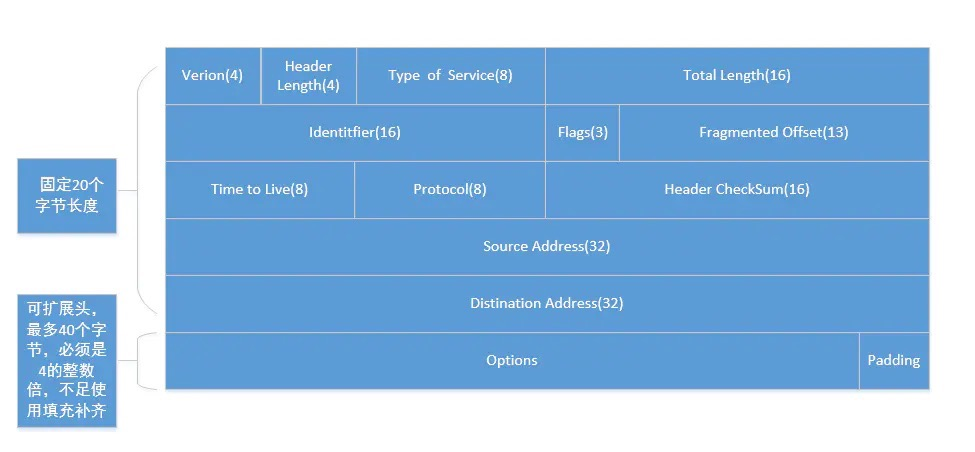

<!-- TOC -->

- [计算机网络体系结构](#计算机网络体系结构)
- [各层作用及协议](#各层作用及协议)
- [物理层](#物理层)
- [数据链路层](#数据链路层)
  - [PPP](#ppp)
  - [广播信道](#广播信道)
- [网络层](#网络层)
  - [IP（Internet Protocol）](#ipinternet-protocol)
    - [IP 地址分类](#ip-地址分类)
    - [IP Head（20-60 Bytes）](#ip-head20-60-bytes)
    - [IP Head中各字段的意义和作用](#ip-head中各字段的意义和作用)
  - [ICMP（Internet Control Message Protocol）](#icmpinternet-control-message-protocol)
    - [ICMP 报文格式](#icmp-报文格式)
    - [ICMP应用——PING,TTL](#icmp应用pingttl)
  - [内部网关协议(RIP,OSPF)](#内部网关协议ripospf)
  - [外部网关协议(BGP)](#外部网关协议bgp)
  - [IP多播(IGMP,多播路由选择协议)](#ip多播igmp多播路由选择协议)
  - [VPN 和 NAT](#vpn-和-nat)
  - [路由表包含什么？](#路由表包含什么)
- [运输层](#运输层)
  - [TCP](#tcp)
    - [TCP 报文结构](#tcp-报文结构)
    - [TCP Head（20-60 Bytes）](#tcp-head20-60-bytes)
    - [TCP Head中各字段的意义和作用](#tcp-head中各字段的意义和作用)
  - [UDP](#udp)
    - [UDP 报文结构](#udp-报文结构)
    - [UDP Head（8 Bytes）](#udp-head8-bytes)
  - [TCP 与 UDP 的区别](#tcp-与-udp-的区别)
  - [TCP 黏包问题](#tcp-黏包问题)
    - [原因](#原因)
    - [解决](#解决)
  - [TCP 流量控制](#tcp-流量控制)
    - [概念](#概念)
    - [方法](#方法)
  - [TCP 拥塞控制](#tcp-拥塞控制)
    - [概念](#概念-1)
    - [方法](#方法-1)
  - [TCP 传输连接管理](#tcp-传输连接管理)
    - [TCP 三次握手建立连接](#tcp-三次握手建立连接)
    - [TCP 为什么要进行三次握手？](#tcp-为什么要进行三次握手)
    - [TCP 四次挥手释放连接](#tcp-四次挥手释放连接)
    - [TCP 为什么要进行四次挥手？](#tcp-为什么要进行四次挥手)
  - [TCP 有限状态机](#tcp-有限状态机)
- [应用层](#应用层)
  - [DNS](#dns)
  - [FTP](#ftp)
  - [TELNET](#telnet)
  - [WWW](#www)
    - [URL](#url)
    - [HTTP](#http)
    - [其他协议（SMTP,DHCP,SNMP）](#其他协议smtpdhcpsnmp)

<!-- /TOC -->


> 本节部分知识点来自《计算机网络（第 7 版）》

### 计算机网络体系结构


### 各层作用及协议

| 分层       | 作用                                                | 协议                                                |
| ---------- | --------------------------------------------------- | --------------------------------------------------- |
| 应用层     | 允许访问OSI环境的手段（应用协议数据单元 APDU）      | FTP、DNS、Telnet、SMTP、HTTP、WWW、NFS              |
| 表示层     | 对数据进行翻译、加密和压缩（表示协议数据单元 PPDU） | JPEG、MPEG、ASII                                    |
| 会话层     | 建立、管理和终止会话（会话协议数据单元 SPDU）       | NFS、SQL、NETBIOS、RPC                              |
| 运输层     | 提供端到端的可靠报文传递和错误恢复（ 段Segment）    | TCP、UDP、SPX                                       |
| 网络层     | 负责数据包从源到宿的传递和网际互连（包 Packet）     | IP、ICMP、ARP、RARP、OSPF、IPX、RIP、IGRP（路由器） |
| 数据链路层 | 将比特组装成帧和点到点的传递（帧 Frame）            | PPP、FR、HDLC、VLAN、MAC（网桥，交换机）            |
| 物理层     | 通过媒介传输比特，确定机械及电气规范（比特 Bit）    | RJ45、CLOCK、IEEE802.3（中继器，集线器）            |


### 物理层

* 传输数据的单位：比特
* 数据传输系统：源系统（源点、发送器） --> 传输系统 --> 目的系统（接收器、终点）

通道：
* 单向通道（单工通道）：只有一个方向通信，没有反方向交互，如广播
* 双向交替通信（半双工通信）：通信双方都可发消息，但不能同时发送或接收
* 双向同时通信（全双工通信）：通信双方可以同时发送和接收信息

通道复用技术：
* 频分复用（FDM，Frequency Division Multiplexing）：不同用户在不同频带，所用用户在同样时间占用不同带宽资源
* 时分复用（TDM，Time Division Multiplexing）：不同用户在同一时间段的不同时间片，所有用户在不同时间占用同样的频带宽度
* 波分复用（WDM，Wavelength Division Multiplexing）：光的频分复用
* 码分复用（CDM，Code Division Multiplexing）：不同用户使用不同的码，可以在同样时间使用同样频带通信

### 数据链路层

主要信道：
* 点对点信道
* 广播信道

#### PPP
PPP——点对点信道

* 数据单元：帧

三个基本问题：
* 封装成帧：把网络层的 IP 数据报封装成帧，`SOH - 数据部分 - EOT`
* 透明传输：不管数据部分什么字符，都能传输出去；可以通过字节填充方法解决（冲突字符前加转义字符）
* 差错检测：降低误码率（BER，Bit Error Rate），广泛使用循环冗余检测（CRC，Cyclic Redundancy Check）

点对点协议（Point-to-Point Protocol）：
* 点对点协议（Point-to-Point Protocol）：用户计算机和 ISP 通信时所使用的协议

#### 广播信道

广播通信：
* 硬件地址（物理地址、MAC 地址）
* 单播（unicast）帧（一对一）：收到的帧的 MAC 地址与本站的硬件地址相同
* 广播（broadcast）帧（一对全体）：发送给本局域网上所有站点的帧
* 多播（multicast）帧（一对多）：发送给本局域网上一部分站点的帧

### 网络层

* IP（Internet Protocol，网际协议）是为计算机网络相互连接进行通信而设计的协议。
* ARP（Address Resolution Protocol，地址解析协议）
* ICMP（Internet Control Message Protocol，网际控制报文协议）
* IGMP（Internet Group Management Protocol，网际组管理协议）

#### IP（Internet Protocol）
IP（Internet Protocol）——网际协议

##### IP 地址分类  
* `IP 地址 ::= {<网络号>,<主机号>}`

| IP 地址类别 | 网络号                                 | 网络范围               | 主机号 | IP 地址范围                  |
| ----------- | -------------------------------------- | ---------------------- | ------ | ---------------------------- |
| A 类        | 8bit，第一位固定为 0                   | 0 —— 127               | 24bit  | 1.0.0.0 —— 127.255.255.255   |
| B 类        | 16bit，前两位固定为  10                | 128.0 —— 191.255       | 16bit  | 128.0.0.0 —— 191.255.255.255 |
| C  类       | 24bit，前三位固定为  110               | 192.0.0 —— 223.255.255 | 8bit   | 192.0.0.0 —— 223.255.255.255 |
| D  类       | 前四位固定为 1110，后面为多播地址      |
| E  类       | 前五位固定为 11110，后面保留为今后所用 |

##### IP Head（20-60 Bytes）  
IP 数据报格式:  


  

##### IP Head中各字段的意义和作用  
* Version（版本号）：
  IP 协议版本号。目前只有两个版本：IPv4 和 IPv6
* Header Length（IP 协议头部长度）：  
  IP 协议头部的长度，单位字节（32 bit）需要这个值是因为任选字段的长度是可变的， 这个字段占4bit（最多能表示15个32bit的的字，即4*15=60个字节的首部长度），<u>因此IP 头部最多有60字节长度。正常的长度是20字节；</u> 如果有额外的 IP 的 options 选项，还得加上 option 的长度。
* Type of Service (服务类型)：  
  标示包传输优先级。总共8位，是由3个优先权位（不再使用），4个 TOS 位，1个固定的0组成。  
  4个 TOS 位：最新延迟、最大吞吐量、最高可靠性、最小成本，只能4选一。
* Total Length（包长度）：  
  整个IP包的长度，16位，最大可以标示 65536个字节，Total Length - Header Length = 数据长度。通过 Header Length 和 Total Length 就可以知道数据的起始位置和结束位置。
* Identifier（标识符）：  
  网络中转发的IP报文的长度可以不同，但如果报文长度超过了数据链路所支持的最大长度，则报文就需要分割成若干个小的片段才能在链路上传输。比如以太网帧中数据最大长度（MTU）为 1500字节，大于 MTU 的都会被分割，被分割的每个包都有相同的一个值，表示这是同一个 ip 包。
* Flag（标志位）：   
  标志字段在IP报头中占3位。
  ```
  第1位作为保留；
  第2位，分段，是否允许分片;（如果不允许分片，包超过了数据连路支持的最大长度，则丢弃该包，返回发送者一个 ICMP 错误）
  第3位，更多分段。表示是否最后一个分片。
  当目的主机接收到一个IP数据报时，会首先查看该数据报的标识符，并且检查标志位的第3位是置0或置1，以确定是否还有更多的分段。如果还有后续报文，接收主机则将接收到的报文放在缓存直到接收完所有具有相同标识符的数据报，然后再进行重组。
  ```
* Fragmented Offset（偏移量）：  
  当某个 IP 大包分成多片时，各个分片是不按顺序达到目的地的，IP 包根据分片的偏移量进行重组包。（跟TCP 原理一样）
* Time to Live（生存时间）：  
  表示数据包经过的路由器个数。如果网络上有些路由器的路由表配置不合理，路由寻址可能会导致死循环，数据包会一直循环传输。 IP 包发送的时候可以设置一个 TTL 值，比如 TTL=64，每经过一个路由器 TTL 减1，减到0 还没到到目的地，路由器会抛弃这个IP包，并使用一个ICMP消息通知发送方。
* Protocal（协议）：
  协议类型 1：ICMP， 2：IGMP， 6：TCP， 17：UDP。
* Source Address（源IP）： 请求方 IP
* Distination Address（目的IP）： 响应方 IP
* Options（可选字段）： IP支持很多可选选项。

#### ICMP（Internet Control Message Protocol）
ICMP——网际控制报文协议

##### ICMP 报文格式


##### ICMP应用——PING,TTL  
* PING（Packet InterNet Groper，分组网间探测）测试两个主机之间的连通性
* TTL（Time To Live，生存时间）该字段指定 IP 包被路由器丢弃之前允许通过的最大网段数量

#### 内部网关协议(RIP,OSPF)

* RIP（Routing Information Protocol，路由信息协议）
* OSPF（Open Sortest Path First，开放最短路径优先）

#### 外部网关协议(BGP)

* BGP（Border Gateway Protocol，边界网关协议）

#### IP多播(IGMP,多播路由选择协议)

* IGMP（Internet Group Management Protocol，网际组管理协议）
* 多播路由选择协议

#### VPN 和 NAT

* VPN（Virtual Private Network，虚拟专用网）
* NAT（Network Address Translation，网络地址转换）

#### 路由表包含什么？

1. 网络 ID（Network ID, Network number）：就是目标地址的网络 ID。
2. 子网掩码（subnet mask）：用来判断 IP 所属网络
3. 下一跳地址/接口（Next hop / interface）：就是数据在发送到目标地址的旅途中下一站的地址。其中 interface 指向 next hop（即为下一个 route）。一个自治系统（AS, Autonomous system）中的 route 应该包含区域内所有的子网络，而默认网关（Network id: `0.0.0.0`, Netmask: `0.0.0.0`）指向自治系统的出口。

根据应用和执行的不同，路由表可能含有如下附加信息：

1. 花费（Cost）：就是数据发送过程中通过路径所需要的花费。
2. 路由的服务质量
3. 路由中需要过滤的出/入连接列表

### 运输层

协议：

* TCP（Transmission Control Protocol，传输控制协议）
* UDP（User Datagram Protocol，用户数据报协议）

端口：

| 应用程序 | FTP | TELNET | SMTP | DNS | TFTP | HTTP | HTTPS | SNMP |
| -------- | --- | ------ | ---- | --- | ---- | ---- | ----- | ---- |
| 端口号   | 21  | 23     | 25   | 53  | 69   | 80   | 443   | 161  |

#### TCP

* TCP（Transmission Control Protocol，传输控制协议）是一种面向连接的、可靠的、基于字节流的传输层通信协议，其传输的单位是报文段。

特征：
* 面向连接
* 只能点对点（一对一）通信
* 可靠交互
* 全双工通信
* 面向字节流

TCP 如何保证可靠传输：
* 确认和超时重传
* 数据合理分片和排序
* 流量控制
* 拥塞控制
* 数据校验

##### TCP 报文结构


##### TCP Head（20-60 Bytes）


TCP：状态控制码（Code，Control Flag），占 6 比特，含义如下：
* URG：紧急比特（urgent），当 `URG＝1` 时，表明紧急指针字段有效，代表该封包为紧急封包。它告诉系统此报文段中有紧急数据，应尽快传送(相当于高优先级的数据)， 且上图中的 Urgent Pointer 字段也会被启用。
* ACK：确认比特（Acknowledge）。只有当 `ACK＝1` 时确认号字段才有效，代表这个封包为确认封包。当 `ACK＝0` 时，确认号无效。
* PSH：（Push function）若为 1 时，代表要求对方立即传送缓冲区内的其他对应封包，而无需等缓冲满了才送。
* RST：复位比特(Reset)，当 `RST＝1` 时，表明 TCP 连接中出现严重差错（如由于主机崩溃或其他原因），必须释放连接，然后再重新建立运输连接。
* SYN：同步比特(Synchronous)，SYN 置为 1，就表示这是一个连接请求或连接接受报文，通常带有 SYN 标志的封包表示『主动』要连接到对方的意思。
* FIN：终止比特(Final)，用来释放一个连接。当 `FIN＝1` 时，表明此报文段的发送端的数据已发送完毕，并要求释放运输连接。

##### TCP Head中各字段的意义和作用
* 源端口和目的端口 Port  
  源端口号：16位的源端口中包含初始化通信的端口。源端口和源IP地址的作用是标识报文的返回地址。
  目的端口号：16位的目的端口域定义传输的目的。这个端口指明报文接收计算机上的应用程序地址接口。
  计算机通过端口号识别访问哪个服务,比如http服务或ftp服务，发送方端口号是进行随机端口，目标端口号决定了接收方哪个程序来接收 分别占用16位，也就是端口号最大是2^16，所以端口号的范围是0~65536。
  ```
  端口号的分配：
  知名端口号一般位于：1 --- 255 之间
  256 --- 1023的端口号，通常是由Unix系统占用（系统占用）
  1024 ---5000 是大多数TCP、IP实现的临时分配
  大于5000的一般是给其他服务预留的（Internet上并不常用的服务）
  ```

* 序号 Sequence Number  
  TCP用序列号对数据包进行标记，以便在到达目的地后重新重装，假设当前的序列号为 s，发送数据长度为 l，则下次发送数据时的序列号为 s + l。在建立连接时通常由计算机生成一个随机数作为序列号的初始值。

* 确认号 Acknowledgemt Number  
  占 4 个字节，表示期望收到对方下一个报文段的序号值。 TCP 的可靠性，是建立在「每一个数据报文都需要确认收到」的基础之上的。
  
  就是说，通讯的任何一方在收到对方的一个报文之后，都要发送一个相对应的「确认报文」，来表达确认收到。 那么，确认报文，就会包含确认号。 例如，通讯的一方收到了第一个 25kb 的报文，该报文的 序号值=0，那么就需要回复一个确认报文，其中的确认号 = 25600.

* 数据偏移 Offset  
  占 0.5 个字节 (4 位)。 这个字段实际上是指出了 TCP 报文段的首部长度 ，它指出了 TCP报文段的数据起始处 距离 TCP报文的起始处 有多远。（注意 数据起始处 和 报文起始处 的意思）
  
  一个数据偏移量 = 4 byte，由于 4 位二进制数能表示的最大十进制数字是 15，因此数据偏移的最大值是 60 byte，这也侧面限制了 TCP 首部的最大长度。

* 保留 Reserved  
  占 0.75 个字节 (6 位)。 保留为今后使用，但目前应置为 0。

* 标志位 TCP Flags    

* 窗口大小 Window Size  
  占 2 字节, 该字段明确指出了现在允许对方发送的数据量，它告诉对方本端的 TCP 接收缓冲区还能容纳多少字节的数据，这样对方就可以控制发送数据的速度。 窗口大小的值是指，从本报文段首部中的确认号算起，接收方目前允许对方发送的数据量。

  例如，假如确认号是 701 ，窗口字段是 1000。这就表明，从 701 号算起，发送此报文段的一方还有接收 1000 （字节序号是 701 ~ 1700） 个字节的数据的接收缓存空间。

* 校验和 TCP Checksum  
  占 2 个字节。 由发送端填充，接收端对 TCP 报文段执行 CRC 算法，以检验 TCP 报文段在传输过程中是否损坏，如果损坏这丢弃。

  检验范围包括首部和数据两部分，这也是 TCP 可靠传输的一个重要保障。

* 紧急指针 Urgent Pointer  
  占 2 个字节。 仅在 URG = 1 时才有意义，它指出本报文段中的紧急数据的字节数。 当 URG = 1 时，发送方 TCP 就把紧急数据插入到本报文段数据的最前面，而在紧急数据后面的数据仍是普通数据。

  因此，紧急指针指出了紧急数据的末尾在报文段中的位置。

#### UDP

* UDP（User Datagram Protocol，用户数据报协议）是 OSI（Open System Interconnection 开放式系统互联） 参考模型中一种无连接的传输层协议，提供面向事务的简单不可靠信息传送服务，其传输的单位是用户数据报。

特征：
* 无连接
* 尽最大努力交付
* 面向报文
* 没有拥塞控制
* 支持一对一、一对多、多对一、多对多的交互通信
* 首部开销小

##### UDP 报文结构


##### UDP Head（8 Bytes）


> TCP/UDP 图片来源于：<https://github.com/JerryC8080/understand-tcp-udp>

#### TCP 与 UDP 的区别

1. TCP 面向连接，UDP 是无连接的；  
2. TCP 提供可靠的服务，也就是说，通过 TCP 连接传送的数据，无差错，不丢失，不重复，且按序到达；UDP 尽最大努力交付，即不保证可靠交付；  
3. TCP 的逻辑通信信道是全双工的可靠信道；UDP 则是不可靠信道；  
5. 每一条 TCP 连接只能是点到点的；UDP 支持一对一，一对多，多对一和多对多的交互通信；  
6. TCP 面向字节流（可能出现黏包问题），实际上是 TCP 把数据看成一连串无结构的字节流；UDP 是面向报文的（不会出现黏包问题）；  
7. UDP 没有拥塞控制，因此网络出现拥塞不会使源主机的发送速率降低（对实时应用很有用，如 IP 电话，实时视频会议等）；  
8. TCP 首部开销20字节；UDP 的首部开销小，只有 8 个字节；  

#### TCP 黏包问题

##### 原因

TCP 是一个基于字节流的传输服务（UDP 基于报文的），“流” 意味着 TCP 所传输的数据是没有边界的。所以可能会出现两个数据包黏在一起的情况。

##### 解决

* 发送定长包。如果每个消息的大小都是一样的，那么在接收对等方只要累计接收数据，直到数据等于一个定长的数值就将它作为一个消息。
* 包头加上包体长度。包头是定长的 4 个字节，说明了包体的长度。接收对等方先接收包头长度，依据包头长度来接收包体。
* 在数据包之间设置边界，如添加特殊符号 `\r\n` 标记。FTP 协议正是这么做的。但问题在于如果数据正文中也含有 `\r\n`，则会误判为消息的边界。
* 使用更加复杂的应用层协议。

#### TCP 流量控制

##### 概念

流量控制（flow control）就是让发送方的发送速率不要太快，要让接收方来得及接收。

##### 方法

利用可变窗口进行流量控制


#### TCP 拥塞控制

##### 概念

拥塞控制就是防止过多的数据注入到网络中，这样可以使网络中的路由器或链路不致过载。

##### 方法

* 慢开始( slow-start )
* 拥塞避免( congestion avoidance )
* 快重传( fast retransmit )
* 快恢复( fast recovery )

TCP的拥塞控制图


#### TCP 传输连接管理

> 因为 TCP 三次握手建立连接、四次挥手释放连接很重要，所以附上《计算机网络（第 7 版）-谢希仁》书中对此章的详细描述：<https://gitee.com/huihut/interview/raw/master/images/TCP-transport-connection-management.png>

##### TCP 三次握手建立连接


【TCP 建立连接全过程解释】

1. 客户端发送 SYN 给服务器，说明客户端请求建立连接；
2. 服务端收到客户端发的 SYN，并回复 SYN+ACK 给客户端（同意建立连接）；
3. 客户端收到服务端的 SYN+ACK 后，回复 ACK 给服务端（表示客户端收到了服务端发的同意报文）；
4. 服务端收到客户端的 ACK，连接已建立，可以数据传输。

##### TCP 为什么要进行三次握手？

【答案一】因为信道不可靠，而 TCP 想在不可靠信道上建立可靠地传输，那么三次通信是理论上的最小值。（而 UDP 则不需建立可靠传输，因此 UDP 不需要三次握手。）

> [Google Groups . TCP 建立连接为什么是三次握手？{技术}{网络通信}](https://groups.google.com/forum/#!msg/pongba/kF6O7-MFxM0/5S7zIJ4yqKUJ)

【答案二】因为双方都需要确认对方收到了自己发送的序列号，确认过程最少要进行三次通信。

> [知乎 . TCP 为什么是三次握手，而不是两次或四次？](https://www.zhihu.com/question/24853633/answer/115173386)

【答案三】为了防止已失效的连接请求报文段突然又传送到了服务端，因而产生错误。

> [《计算机网络（第 7 版）-谢希仁》](https://gitee.com/huihut/interview/raw/master/images/TCP-transport-connection-management.png)

##### TCP 四次挥手释放连接


【TCP 释放连接全过程解释】

1. 客户端发送 FIN 给服务器，说明客户端不必发送数据给服务器了（请求释放从客户端到服务器的连接）；
2. 服务器接收到客户端发的 FIN，并回复 ACK 给客户端（同意释放从客户端到服务器的连接）；
3. 客户端收到服务端回复的 ACK，此时从客户端到服务器的连接已释放（但服务端到客户端的连接还未释放，并且客户端还可以接收数据）；
4. 服务端继续发送之前没发完的数据给客户端；
5. 服务端发送 FIN+ACK 给客户端，说明服务端发送完了数据（请求释放从服务端到客户端的连接，就算没收到客户端的回复，过段时间也会自动释放）；
6. 客户端收到服务端的 FIN+ACK，并回复 ACK 给客户端（同意释放从服务端到客户端的连接）；
7. 服务端收到客户端的 ACK 后，释放从服务端到客户端的连接。

##### TCP 为什么要进行四次挥手？

【问题一】TCP 为什么要进行四次挥手？ / 为什么 TCP 建立连接需要三次，而释放连接则需要四次？

【答案一】<u>因为 TCP 是全双工模式，客户端请求关闭连接后，客户端向服务端的连接关闭（一二次挥手），服务端继续传输之前没传完的数据给客户端（数据传输），服务端向客户端的连接关闭（三四次挥手）。所以 TCP 释放连接时服务器的 ACK 和 FIN 是分开发送的（中间隔着数据传输），而 TCP 建立连接时服务器的 ACK 和 SYN 是一起发送的（第二次握手），所以 TCP 建立连接需要三次，而释放连接则需要四次。</u>

【问题二】为什么 TCP 连接时可以 ACK 和 SYN 一起发送，而释放时则 ACK 和 FIN 分开发送呢？（ACK 和 FIN 分开是指第二次和第三次挥手）

【答案二】因为客户端请求释放时，服务器可能还有数据需要传输给客户端，因此服务端要先响应客户端 FIN 请求（服务端发送 ACK），然后数据传输，传输完成后，服务端再提出 FIN 请求（服务端发送 FIN）；而连接时则没有中间的数据传输，因此连接时可以 ACK 和 SYN 一起发送。

【问题三】为什么客户端释放最后需要 TIME-WAIT 等待 2MSL 呢？
 > MSL，Maximum Segment Lifetime，最大报文段生存时间  
 
 【答案三】

1. 为了保证客户端发送的最后一个 ACK 报文能够到达服务端。若未成功到达，则服务端超时重传 FIN+ACK 报文段，客户端再重传 ACK，并重新计时。
2. 防止已失效的连接请求报文段出现在本连接中。TIME-WAIT 持续 2MSL 可使本连接持续的时间内所产生的所有报文段都从网络中消失，这样可使下次连接中不会出现旧的连接报文段。

#### TCP 有限状态机

TCP 有限状态机图片


### 应用层

#### DNS

* DNS（Domain Name System，域名系统）是互联网的一项服务。它作为将域名和 IP 地址相互映射的一个分布式数据库，能够使人更方便地访问互联网。DNS 使用 TCP 和 UDP 端口 53。当前，对于每一级域名长度的限制是 63 个字符，域名总长度则不能超过 253 个字符。

域名：
* `域名 ::= {<三级域名>.<二级域名>.<顶级域名>}`，如：`blog.huihut.com`

#### FTP

* FTP（File Transfer Protocol，文件传输协议）是用于在网络上进行文件传输的一套标准协议，使用客户/服务器模式，使用 TCP 数据报，提供交互式访问，双向传输。
* TFTP（Trivial File Transfer Protocol，简单文件传输协议）一个小且易实现的文件传输协议，也使用客户-服务器方式，使用UDP数据报，只支持文件传输而不支持交互，没有列目录，不能对用户进行身份鉴定

#### TELNET

* TELNET 协议是 TCP/IP 协议族中的一员，是 Internet 远程登陆服务的标准协议和主要方式。它为用户提供了在本地计算机上完成远程主机工作的能力。
* HTTP（HyperText Transfer Protocol，超文本传输协议）是用于从 WWW（World Wide Web，万维网）服务器传输超文本到本地浏览器的传送协议。
* SMTP（Simple Mail Transfer Protocol，简单邮件传输协议）是一组用于由源地址到目的地址传送邮件的规则，由它来控制信件的中转方式。SMTP 协议属于 TCP/IP 协议簇，它帮助每台计算机在发送或中转信件时找到下一个目的地。
* Socket 建立网络通信连接至少要一对端口号（Socket）。Socket 本质是编程接口（API），对 TCP/IP 的封装，TCP/IP 也要提供可供程序员做网络开发所用的接口，这就是 Socket 编程接口。

#### WWW

* WWW（World Wide Web，环球信息网，万维网）是一个由许多互相链接的超文本组成的系统，通过互联网访问

##### URL

* URL（Uniform Resource Locator，统一资源定位符）是因特网上标准的资源的地址（Address）

标准格式：

* `协议类型:[//服务器地址[:端口号]][/资源层级UNIX文件路径]文件名[?查询][#片段ID]`
    
完整格式：

* `协议类型:[//[访问资源需要的凭证信息@]服务器地址[:端口号]][/资源层级UNIX文件路径]文件名[?查询][#片段ID]`

> 其中【访问凭证信息@；:端口号；?查询；#片段ID】都属于选填项  
> 如：`https://github.com/huihut/interview#cc`

##### HTTP

HTTP（HyperText Transfer Protocol，超文本传输协议）是一种用于分布式、协作式和超媒体信息系统的应用层协议。HTTP 是万维网的数据通信的基础。

请求方法

| 方法    | 意义                                                                                                                                  |
| ------- | ------------------------------------------------------------------------------------------------------------------------------------- |
| OPTIONS | 请求一些选项信息，允许客户端查看服务器的性能                                                                                          |
| GET     | 请求指定的页面信息，并返回实体主体                                                                                                    |
| HEAD    | 类似于 get 请求，只不过返回的响应中没有具体的内容，用于获取报头                                                                       |
| POST    | 向指定资源提交数据进行处理请求（例如提交表单或者上传文件）。数据被包含在请求体中。POST请求可能会导致新的资源的建立和/或已有资源的修改 |
| PUT     | 从客户端向服务器传送的数据取代指定的文档的内容                                                                                        |
| DELETE  | 请求服务器删除指定的页面                                                                                                              |
| TRACE   | 回显服务器收到的请求，主要用于测试或诊断                                                                                              |

状态码（Status-Code）

* 1xx：表示通知信息，如请求收到了或正在进行处理
    * 100 Continue：继续，客户端应继续其请求
    * 101 Switching Protocols 切换协议。服务器根据客户端的请求切换协议。只能切换到更高级的协议，例如，切换到 HTTP 的新版本协议
* 2xx：表示成功，如接收或知道了
    * 200 OK: 请求成功
* 3xx：表示重定向，如要完成请求还必须采取进一步的行动
    * 301 Moved Permanently: 永久移动。请求的资源已被永久的移动到新 URL，返回信息会包括新的 URL，浏览器会自动定向到新 URL。今后任何新的请求都应使用新的 URL 代替
* 4xx：表示客户的差错，如请求中有错误的语法或不能完成
    * 400 Bad Request: 客户端请求的语法错误，服务器无法理解
    * 401 Unauthorized: 请求要求用户的身份认证
    * 403 Forbidden: 服务器理解请求客户端的请求，但是拒绝执行此请求（权限不够）
    * 404 Not Found: 服务器无法根据客户端的请求找到资源（网页）。通过此代码，网站设计人员可设置 “您所请求的资源无法找到” 的个性页面
    * 408 Request Timeout: 服务器等待客户端发送的请求时间过长，超时
* 5xx：表示服务器的差错，如服务器失效无法完成请求
    * 500 Internal Server Error: 服务器内部错误，无法完成请求
    * 503 Service Unavailable: 由于超载或系统维护，服务器暂时的无法处理客户端的请求。延时的长度可包含在服务器的 Retry-After 头信息中
    * 504 Gateway Timeout: 充当网关或代理的服务器，未及时从远端服务器获取请求

> 更多状态码：[菜鸟教程 . HTTP状态码](http://www.runoob.com/http/http-status-codes.html)

##### 其他协议（SMTP,DHCP,SNMP）

* SMTP（Simple Main Transfer Protocol，简单邮件传输协议）是在 Internet 传输 Email 的标准，是一个相对简单的基于文本的协议。在其之上指定了一条消息的一个或多个接收者（在大多数情况下被确认是存在的），然后消息文本会被传输。可以很简单地通过 Telnet 程序来测试一个 SMTP 服务器。SMTP 使用 TCP 端口 25。
* DHCP（Dynamic Host Configuration Protocol，动态主机设置协议）是一个局域网的网络协议，使用 UDP 协议工作，主要有两个用途：
    * 用于内部网络或网络服务供应商自动分配 IP 地址给用户
    * 用于内部网络管理员作为对所有电脑作中央管理的手段
* SNMP（Simple Network Management Protocol，简单网络管理协议）构成了互联网工程工作小组（IETF，Internet Engineering Task Force）定义的 Internet 协议族的一部分。该协议能够支持网络管理系统，用以监测连接到网络上的设备是否有任何引起管理上关注的情况。