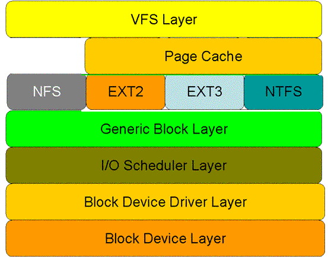

## linux read 系统调用剖析   
### Read 系统调用在用户空间中的处理过程  
Linux 系统调用（SCI，system call interface）的实现机制实际上是一个多路汇聚以及分解的过程，该汇聚点就是 0x80 中断这个入口点（X86 系统结构）。也就是说，所有系统调用都从用户空间中汇聚到 0x80 中断点，同时保存具体的系统调用号。当 0x80 中断处理程序运行时，将根据系统调用号对不同的系统调用分别处理（调用不同的内核函数处理）。

Read 系统调用也不例外，当调用发生时，库函数在保存 read 系统调用号以及参数后，陷入 0x80 中断。这时库函数工作结束。Read 系统调用在用户空间中的处理也就完成了。

### Read 系统调用在核心空间中的处理过程  
0x80 中断处理程序接管执行后，先检察其系统调用号，然后根据系统调用号查找系统调用表，并从系统调用表中得到处理 read 系统调用的内核函数 sys_read ，最后传递参数并运行 sys_read 函数。至此，内核真正开始处理 read 系统调用（sys_read 是 read 系统调用的内核入口）。

在讲解 read 系统调用在核心空间中的处理部分中，首先介绍了内核处理磁盘请求的层次模型，然后再按该层次模型从上到下的顺序依次介绍磁盘读请求在各层的处理过程。

#### Read 系统调用在核心空间中处理的层次模型
图1显示了 read 系统调用在核心空间中所要经历的层次模型。从图中看出：对于磁盘的一次读请求，首先经过虚拟文件系统层（vfs layer），其次是cache 层（page cache 层），接下来是具体的文件系统层（例如 ext2）、通用块层（generic block layer）、IO 调度层（I/O scheduler layer）、块设备驱动层（block device driver layer），最后是物理块设备层（block device layer）

  
图1—Read 系统调用在核心空间中的处理层次

* 虚拟文件系统层（VFS）：  
    <u>屏蔽下层具体文件系统操作的差异，为上层的操作提供一个统一的接口。</u> 正是因为有了这个层次，所以可以把设备抽象成文件，使得操作设备就像操作文件一样简单。  

* PageCache层：  
    引入 cache 层的目的是为了提高 linux 操作系统对磁盘访问的性能。Cache 层在内存中缓存了磁盘上的部分数据。当数据的请求到达时，如果在 cache 中存在该数据且是最新的，则直接将数据传递给用户程序，免除了对底层磁盘的操作，提高了性能。  

* 文件系统层(File System)：  
    在具体的文件系统层中，不同的文件系统（例如 ext2 和 NTFS）具体的操作过程也是不同的。每种文件系统定义了自己的操作集合。

* 通用块层(Generic Block Layer)：  
    接收上层发出的磁盘请求，并最终发出 IO 请求。该层<u>隐藏了底层硬件块设备的特性，为块设备提供了一个通用的抽象视图。</u>  

* IO 调度层(I/O Scheduler Layer)：  
    <u>接收通用块层发出的 IO 请求，缓存请求并试图合并相邻的请求</u>（如果这两个请求的数据在磁盘上是相邻的）。<u>并根据设置好的调度算法，回调驱动层提供的请求处理函数，以处理具体的 IO 请求</u>。

* 块设备驱动层(Block Device Driver Layer)：  
    <u>驱动层中的驱动程序对应具体的物理块设备</u>。它从上层中取出 IO 请求，并根据该 IO 请求中指定的信息，通过<u>向具体块设备的设备控制器发送命令的方式，来操纵设备传输数据。</u>

* 块设备层(Block Device Layer)：  
    设备层中都是具体的物理设备。定义了操作具体设备的规范。

## I/O 半虚拟化——Virtio 与 Spdk vhost 结合实现分布式存储 
<u>SPDK Vhost实现方案中，通过 SPDK Vhost 可以将 Virtio 数据面从 QEMU 卸载到应用，此时的io就到达了上文中的通用块层（bdev），此时再加上一层io调度层（中间服务），即可把 IO 转发到块设备驱动层（iouring、libaio、nvme等），实现分布式存储。    

spdk-bdev 是 SPDK 的用户态块设备抽象，提供通用的块设备的管理和 IO 接口</u>  

## 附录  
[linux read 系统调用剖析 ](https://www.cnblogs.com/tcicy/p/8454740.html)  
[Linux中的Page Cache [二]](https://zhuanlan.zhihu.com/p/71217136#:~:text=%E4%B8%8D%E5%90%8C%E4%BA%8Ebuffer,cache%E4%BB%A5%E7%A3%81%E7%9B%98%E7%9A%84block%E4%B8%BA%E5%8D%95%E4%BD%8D%EF%BC%8Cpage%20cache%E6%98%AF%E4%BB%A5%E5%86%85%E5%AD%98%E5%B8%B8%E7%94%A8%E7%9A%84page%E4%B8%BA%E5%8D%95%E4%BD%8D%E7%9A%84%EF%BC%8C%E4%BD%8D%E4%BA%8E%E8%99%9A%E6%8B%9F%E6%96%87%E4%BB%B6%E7%B3%BB%E7%BB%9F%E5%B1%82%EF%BC%88VFS%EF%BC%89%E4%B8%8E%E5%85%B7%E4%BD%93%E7%9A%84%E6%96%87%E4%BB%B6%E7%B3%BB%E7%BB%9F%E4%B9%8B%E9%97%B4%E3%80%82)