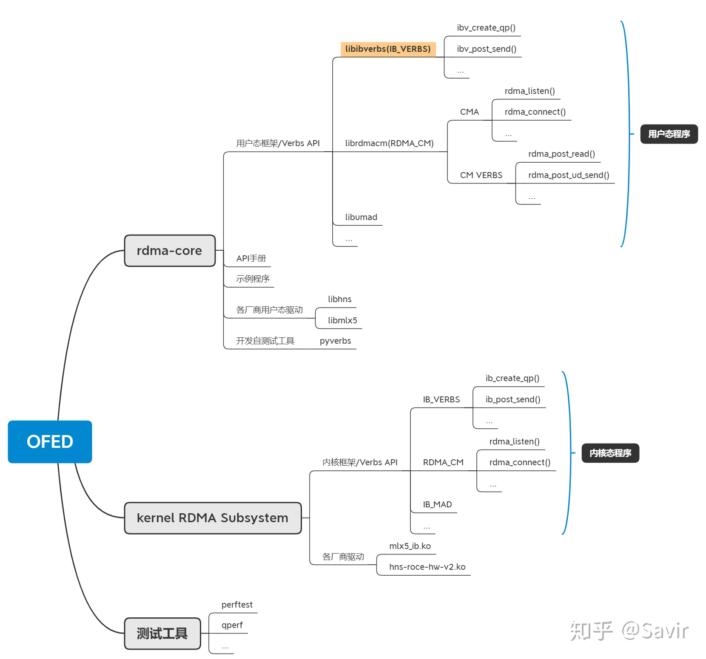

## Verbs
由IB规范所描述的一组抽象定义，规定了各厂商的软硬件在各种Verbs下应该执行的动作或者表现出的行为，IB规范并未规定如何编程实现这些Verbs，在这种含义下，Verbs是与操作系统无关的。
```
举个例子，IB规范要求所有RDMA设备必须支持Create QP的行为（IB 规范11.2.5.1）：
描述：
​ 为指定的设备创建一个QP。
​ 用户必须指定一组用于初始化QP的属性。
​ 如果创建QP所需的属性有非法值或者缺失，那么应该返回错误，该QP不会被创建；如果成功， 那么返回该QP的指针和QPN。
​ ……
输入：
​ 设备指针；
​ SQ关联到的CQ；
​ RQ关联到的CQ，如果是XRC的INI QP，则可以不携带此参数；
​ ……
输出：
​ 新创建的QP的指针；
​ QP Number;
​ SQ的最大WR容量。
​ ……
```

## Verbs API
由OpenFabrics推动实现的一组RDMA应用编程接口（API）。
既然是API，那么必然和运行的操作系统相关。Verbs API有Linux版本以及Windows版本（Windows版很久没有更新了）。
```
我们还是以Create QP为例，下文引用自Linux用户态Verbs API的帮助文档
（ibv_create_qp(3): create/destroy queue pair）：
名称：
​ ibv_create_qp - create a queue pair (QP)
概要：
#include <infiniband/verbs.h>
struct ibv_qp ibv_create_qp(struct ibv_pd pd, struct ibv_qp_init_attr *qp_init_attr); 
描述：
​ ibv_create_qp()通过一个关联的PD创建一个QP，参数qp_init_attr是一个ibv_qp_init_attr类型的结构体，其定义在<infiniband/verbs.h>中。
struct ibv_qp_init_attr {
struct ibv_cq          *send_cq;        /* CQ to be associated with the Send Queue (SQ) */
struct ibv_cq          *recv_cq;        /* CQ to be associated with the Receive Queue (RQ) */
struct ibv_srq         *srq;            /* SRQ handle if QP is to be associated with an SRQ, otherwise NULL */
struct ibv_qp_cap       cap;            /* QP capabilities */
enum ibv_qp_type        qp_type;        /* QP Transport Service Type: IBV_QPT_RC, IBV_QPT_UC, or IBV_QPT_UD */
...
};
​ 函数ibv_create_qp()会更新qp_init_attr->cap struct的内容，返回创建的QP所真正支持的规格……
返回值：
​ ibv_create_qp()返回被创建的QP的指针，或者在失败时返回NULL。QPN将在返回的指针所指向的结构体中。
```
可见Verbs API即是对IB规范中的Verbs定义的具体软件实现。

## rdma-core
指<u>**开源RDMA用户态软件协议栈**</u>，包含:用户态框架、各厂商用户态驱动、API帮助手册以及开发自测试工具等。  
rdma-core在github上维护，我们的用户态Verbs API实际上就是它实现的。

## kernel RDMA subsystem
指<u>**开源的Linux内核中的RDMA子系统**</u>，包含RDMA内核框架及各厂商的驱动。  
RDMA子系统跟随Linux维护，是内核的的一部分。一方面提供内核态的Verbs API，一方面负责对接用户态的接口。

## OFED
全称为OpenFabrics Enterprise Distribution，是一个开源软件包集合，其中包含：  
内核框架和驱动、用户框架和驱动、以及各种中间件、测试工具和API文档。  
开源OFED由OFA组织负责开发、发布和维护，  
**它会定期从rdma-core和内核的RDMA子系统取软件版本，并对各商用OS发行版进行适配。**  
除了协议栈和驱动外，还包含了perftest等测试工具。  

以上三者是包含关系。无论是用户态还是内核态，整个RDMA社区非常活跃，框架几乎每天都在变动，都是平均每两个月一个版本。而OFED会定期从两个社区中取得代码，进行功能和兼容性测试后发布版本，时间跨度较大，以年为单位计。

## MLNX_OFED/HW_OFED
除了开源OFED之外，各厂商也会提供定制版本的OFED软件包，比如华为的HW_OFED和Mellanox的MLNX_OFED。这些定制版本基于开源OFED开发，由厂商自己测试和维护，会在开源软件包基础上提供私有的增强特性，并附上自己的配置、测试工具等。


## Verbs API是什么
Verbs API是一组用于使用RDMA服务的最基本的软件接口，也就是说业界的RDMA应用，要么直接基于这组API编写，要么基于在Verbs API上又封装了一层接口的各种中间件编写。  

Verbs API向用户提供了有关RDMA的一切功能，典型的包括：注册MR、创建QP、Post Send、Poll CQ等等。

<u>**对于Linux系统来说，Verbs的功能由:rdma-core和kernel RDMA subsystem提供，  
分为用户态Verbs接口和内核态Verbs接口，分别用于用户态和内核态的RDMA应用。**</u>  
结合上一部分的内容，我们给出一个OFED的全景：
  

广义的Verbs API主要由两大部分组成：  
* IB_VERBS  
接口以ibv_xx（用户态）或者ib_xx（内核态）作为前缀，是最基础的编程接口，使用IB_VERBS就足够编写RDMA应用了。
* RDMA_CM  
以rdma_为前缀，主要分为两个功能：    
1）. CMA（Connection Management Abstraction）  
在Socket和Verbs API基础上实现的，用于CM建链并交换信息的一组接口。CM建链是在Socket基础上封装为QP实现，从用户的角度来看，是在通过QP交换之后数据交换所需要的QPN，Key等信息。  
2). CM VERBS  
<u>**RDMA_CM也可以用于数据交换，相当于在verbs API上又封装了一套数据交换接口。**</u>   
3). MAD(Management Datagram)  
...

需要注意的是，软件栈中的Verbs API具体实现和IB规范中的描述并不是完全一致的。IB规范迭代较慢，而软件栈几乎每天都有变化，  
所以编写应用或者驱动程序时，应以软件栈API文档中的描述为准。
狭义的Verbs API专指以ibv_/ib_为前缀的用户态Verbs接口，因为RDMA的典型应用是在用户态，下文主要介绍用户态的Verbs API。

## 设计Verbs API的原因
传统以太网的用户，基于Socket API来编写应用程序；而RDMA的用户，基于Verbs API来编写应用程序。
<u>**Verbs API支持IB/iWARP/RoCE三大RDMA协议，通过统一接口，让同一份RDMA程序可以无视底层的硬件和链路差异运行在不同的环境中。**</u>  

## Verbs API所包含的内容
用户态Verbs API主要包含两个层面的功能：
* 1、控制面  
```
设备管理：
device_list ibv_get_device_list()
device_context ibv_open_device(device)
pd ibv_alloc_pd(device_context)
...
```

* 2、数据面  
```
下发WR:
bad_wr, errno ibv_post_send(qp, wr)
bad_wr, errno ibv_post_recv(qp, wr)
获取WC
num, wc ibv_poll_cq(cq, max_num)
...
```

## 使用Verbs API编写RDMA应用程序
### 查看接口定义
#### 内核态  
内核态Verbs接口没有专门的API手册，编程时需要参考头文件中的函数注释。  
声明这些接口的头文件位于内核源码目录中的：  
.../include/rdma/ib_verbs.h

#### 用户态  
有多种方法查阅用户态的Verbs API：  
* 在线查阅最新man page    
用户态的Verbs API手册跟代码在一个仓库维护，手册地址：  
[linux-rdma/rdma-core](https://github.com/linux-rdma/rdma-core/tree/master/libibverbs/man)  
这里是按照Linux的man page格式编写的源文件，直接看源文件可能不太直观。有很多在线的man page网站可以查阅这些接口的说明，比如官方的连接：  
[Linux manual page](https://man7.org/linux/man-pages/man3/ibv_post_send.3.html)  
也有一些其他非官方网页，支持在线搜索：  
[Linux man page](https://linux.die.net/man/3/ibv_post_send)  

* 查阅系统man page  
如果你使用的商用OS安装了rdma-core或者libibverbs库，那么可以直接用man命令查询接口：  
```
man ibv_post_send
```

* 查询Mellanox的编程手册  
[《RDMA Aware Networks Programming User Manual Rev 1.7》](https://www.mellanox.com/related-docs/prod_software/RDMA_Aware_Programming_user_manual.pdf)  
最新版是2015年更新的。该手册写的比较详尽，并且附有示例程序，但是可能与最新的接口有一些差异。

## 链接

[InfiniBand](https://www.infinibandta.org/about-infiniband/)  
[rdma-core](https://github.com/linux-rdma/rdma-core)  
[RDMA杂谈-RDMA之Verbss](https://zhuanlan.zhihu.com/p/329198771)