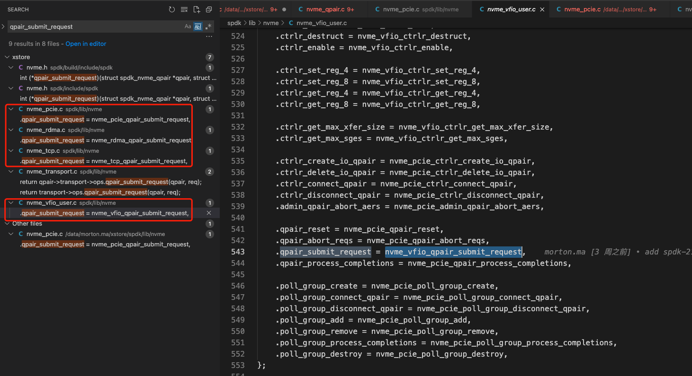
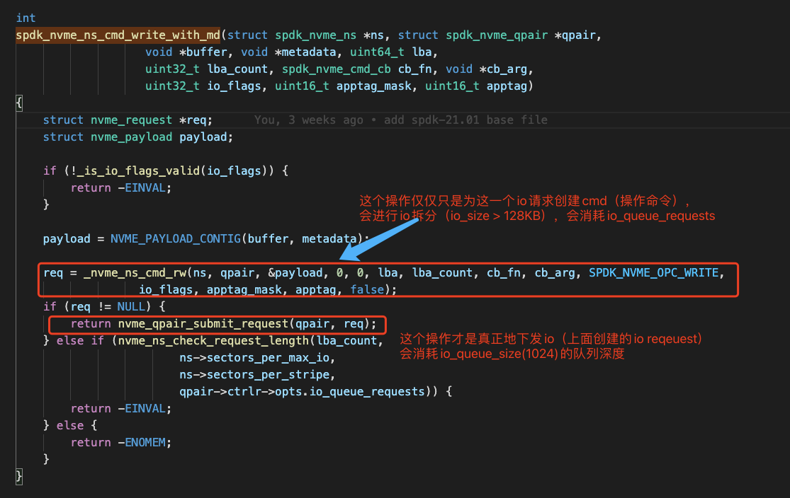
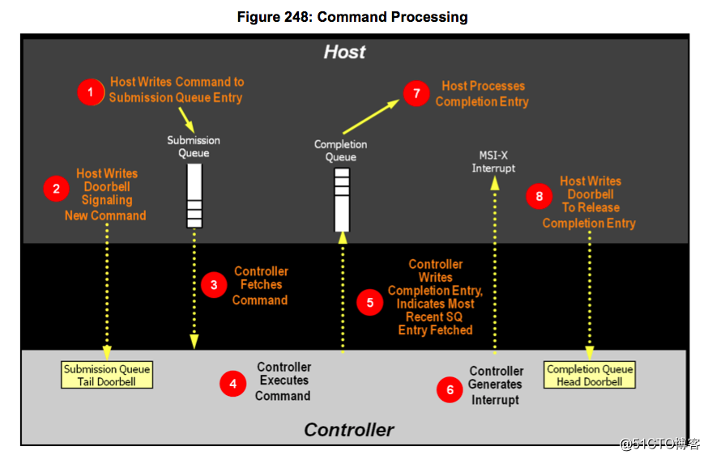

## NVMe Driver Design
* 1、NVMe I/O Submission：Nvme io提交模式

* 2、Fused operations：支持任意两个操作绑定为原子操作，提供绑定接口（ SPDK_NVME_CTRLR_COMPARE_AND_WRITE_SUPPORTED）

* 3、Scaling Performance：性能可扩展   
NVMe queue pairs (struct spdk_nvme_qpair) provide parallel submission paths for I/O. I/O may be submitted on multiple queue pairs simultaneously from different threads. 

* 4、NVMe Driver Internal Memory Usage：I/O路径数据0拷贝  
The SPDK NVMe driver provides a zero-copy data transfer path, which means that there are no data buffers for I/O commands. However, some Admin commands have data copies depending on the API used by the user.

## Introduction
The NVMe driver is a C library that may be linked directly into an application that provides direct, zero-copy data transfer to and from NVMe SSDs.
More recently, the library has been improved to also connect to remote NVMe devices via NVMe over Fabrics.Users may now call spdk_nvme_probe() on both local PCI busses and on remote NVMe over Fabrics discovery services. The API is otherwise unchanged.


## 常用Api
```
spdk_nvme_ctrlr_alloc_io_qpair
spdk_nvme_ns_cmd_read/write
```


## 重要代码分析
```
/*
    * Start the SPDK NVMe enumeration process.  probe_cb will be called
    *  for each NVMe controller found(当枚举到/找到一个NVMe设备的时候被调用), 
    *  giving our application a choice on whether to attach to each controller. 
    *  attach_cb will then be called for each controller after the SPDK NVMe driver has completed  
    *  initializing the controller we chose to attach(在SPDK NVMe驱动程序完成初始化我们选择挂载的控制器后，将为每个控制器调用 attach_cb).
*/
rc = spdk_nvme_probe(NULL, NULL, probe_cb, attach_cb, NULL);
```
每一块NVMe固态硬盘里都一个控制器(Controller);  
每一块NVMe固态硬盘都可以划分为多个NameSpace （类似逻辑分区的概念）;

[SSD设备的发现](https://www.cnblogs.com/vlhn/p/7727016.html)


## nvme磁盘相关代码分析
nvem盘底层支持四种传输方式：tcp、rdma、pcie、vfio


  


## 相关参考
  
[深入理解nvme hardware queue pair](https://blog.51cto.com/xiamachao/2380622)
