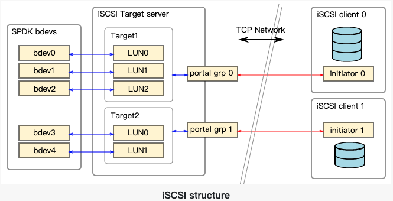

## Introduction
The following diagram shows relations between different parts of iSCSI structure described in this document
  

## iSCSI Login Redirection
The SPDK iSCSI target application supports iSCSI login redirection feature.
Typically users will use the login redirection feature in scale out iSCSI target system, which runs multiple SPDK iSCSI target applications.

[iSCSI Targe](https://spdk.io/doc/iscsi.html)