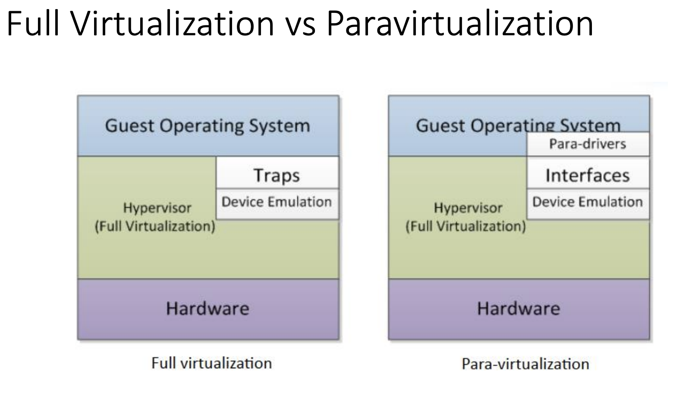
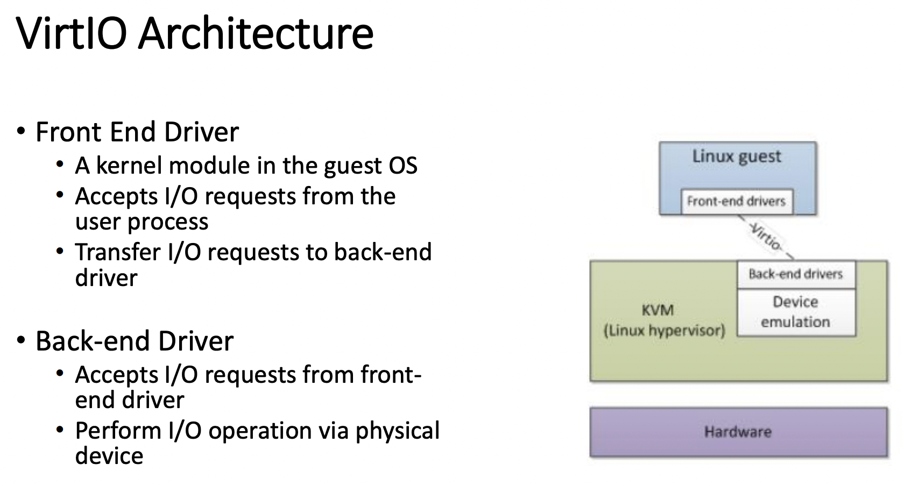
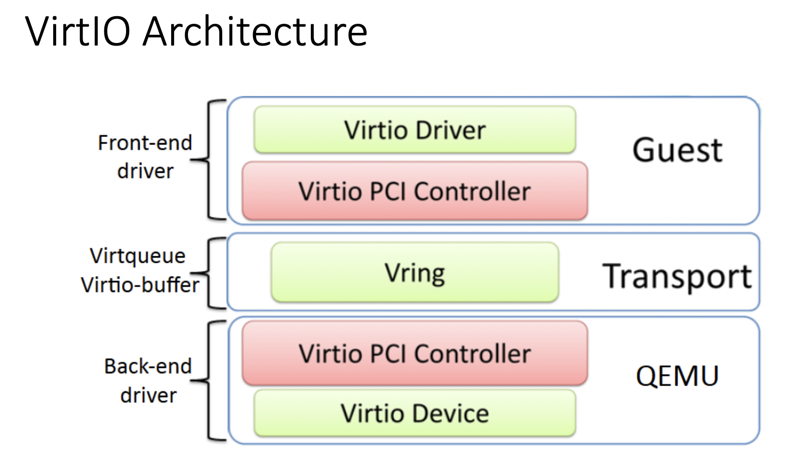
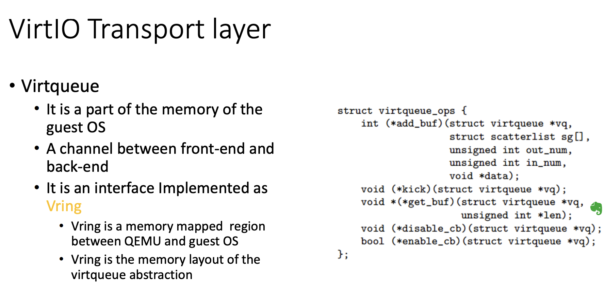
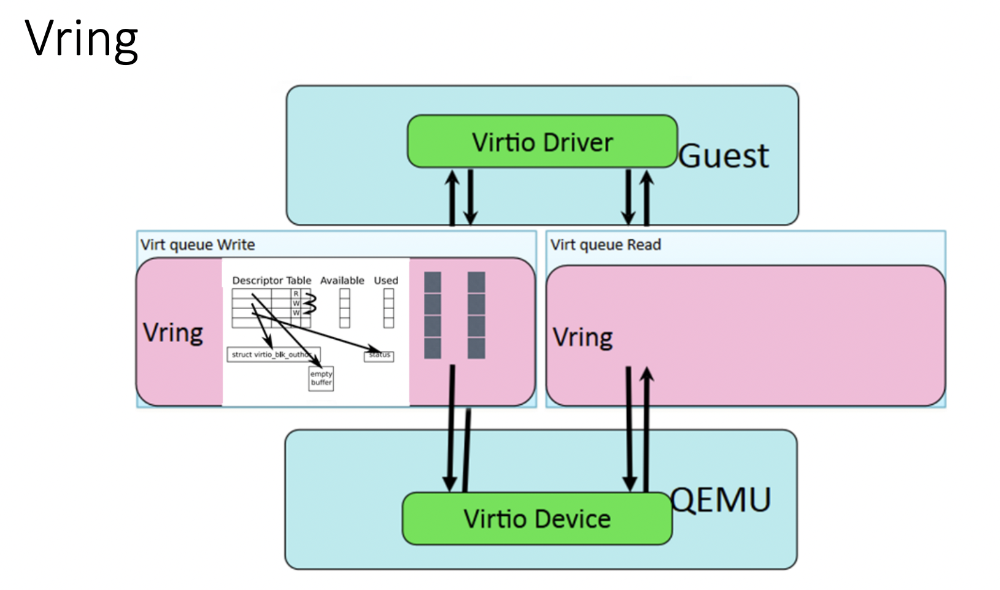

## 1、QEMU-KVM
### 1.1、KVM背景介绍
KVM实际是linux内核提供的虚拟化架构，可将内核直接充当hypervisor来使用。KVM需要处理器硬件本身支持虚拟化扩展，如intel VT 和AMD AMD-V技术。

### 1.2、KVM工作原理
KVM包含一个内核模块kvm.ko用来实现核心虚拟化功能，以及一个和处理器强相关的模块如kvm-intel.ko或kvm-amd.ko。
KVM本身不实现任何模拟，仅仅是暴露了一个/dev/kvm接口，这个接口可被宿主机用来主要负责vCPU的创建，虚拟内存的地址空间分配，vCPU寄存器的读写以及vCPU的运行。
有了KVM以后，guest os的CPU指令不用再经过QEMU来转译便可直接运行，大大提高了运行速度。但KVM的kvm.ko本身只提供了CPU和内存的虚拟化，所以它必须结合QEMU才能构成一个完整的虚拟化技术

### 1.3、QEMU-KVM
KVM负责cpu虚拟化+内存虚拟化，实现了cpu和内存的虚拟化，但kvm并不能模拟其他设备。还必须有个运行在用户空间的工具才行，KVM的开发者选择了比较成熟的开源虚拟化软件QEMU来作为这个工具，QEMU模拟IO设备（网卡，磁盘等），对其进行了修改，最后形成了QEMU-KVM。

在QEMU-KVM中，KVM运行在内核空间，QEMU运行在用户空间，实际模拟创建、管理各种虚拟硬件，QEMU将KVM整合了进来，通过/ioctl 调用 /dev/kvm，从而将CPU指令的部分交给内核模块来做，KVM实现了CPU和内存的虚拟化，但kvm不能虚拟其他硬件设备，因此qemu还有模拟IO设备（磁盘，网卡，显卡等）的作用，KVM加上QEMU后就是完整意义上的服务器虚拟化。  
综上所述，QEMU-KVM具有两大作用：  
**1、提供对cpu，内存（KVM负责），IO设备（QEMU负责）的虚拟**  
**2、对各种虚拟设备的创建，调用进行管理（QEMU负责）**

这个方案中，QEMU模拟其他的硬件，如Network, Disk，（Full virtualization）同样会影响这些设备的性能。于是又产生了半虚拟化(Para-virtualization)设备virtio_blk, virtio_net，提高设备性能。
  

## 2、VirtIO

### 2.1、VirtIO Architecture
  
  

### 2.2、VirtIO Transport layer
  
  

## 3、Vhost 
**virtio offload到host叫做vhost。可以在内核态或者用户态实现。**

### 3.1、在内核态的实现  
在内核态的实现主要在Linux的kernel实现。  
kernel代码位置：drivers/vhost   
Vhost作为字符设备使用，来与qemu进行交互。跟其他的很多driver一样，利用ioctl。
vhost-net 驱动会创建一个名为 /dev/vhost-net 的字符型设备，当 QEMU 通过-netdev tap,fd=,id=hostnet0,vhost=on,vhostfd=这样的参数启动时，QEMU 会打开这个设备（你可以通过 lsof -p $PID 查看，$PID 为 QEMU 的进程号）并通过 ioctl 初始化设备。   
初始化过程中 vhost 驱动会创建一个内核线程名为 vhost-$PID （$PID 为 QEMU 的进程号），这个线程是 vhost 的工作线程（worker thread），工作线程会始终等待 virtqueue 触发，然后处理 virtqueue 上的 buffer，然后送到 tap 设备的文件描述符。反过来，文件描述符的 polling 也是由工作线程完成的，也就是说 vhost-net 在内核模拟了 tx、rx 队列，而并没有完成整个 virtio PIC 设备的模拟，控制平面例如在线迁移、协商等依旧由 QEMU 实现。

### 3.2、在用户态的实现
待补充

### 3.2、Vhost-user(与vhost的区别)
上面讲到，Vhost是client与kernel（server）的交互，client与内核共享内存，局限性是如果client要发送消息到用户进程，很不方便。
Vhost-user使用unix domain来进行通信，两个用户进程共享内存，达到和vhost一样的效果。

### 3.3、Vhost-nvme

### 3.4、Virtio-blk与virtio-scsi
他们都是在 virtio spec 里面定义的两种块设备实现。区别是 virtio-blk 是作为 pci 设备挂在 qemu 里面，所以最多只能有16块 virtio-blk 盘。 而 virtio-scsi 作为 scsi 子系统，挂在 scsi 总线上，数量上可以多得多。由于 virtio-scsi 实现了 scsi 的协议 ，所以复杂度来说要高一些。 此时，在 qemu 里面看，这块盘跟普通的 scsi 盘一样，支持 scsi 命令查询，例如 sg3_utils 提供的工具。但是 virtio-blk 盘不支持 scsi 命令。

## 参考
[QEMU,KVM及QEMU-KVM介绍](https://www.jianshu.com/p/4e893b5bfe81)  
[VirtIO——这篇文章讲的很好](https://www.cs.cmu.edu/~412/lectures/Virtio_2015-10-14.pdf)
[VIRTIO & VHOST](https://zhuanlan.zhihu.com/p/38370357)