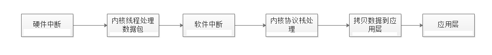
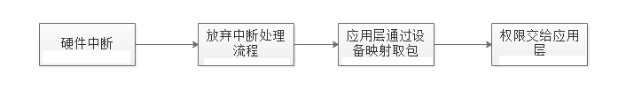

<!-- TOC -->

- [1、传统网络架构](#1传统网络架构)
- [2、dpdk](#2dpdk)
- [3、dpkd核心技术](#3dpkd核心技术)
  - [1. UIO](#1-uio)
  - [2. 内存池技术](#2-内存池技术)
  - [3. 大页内存分配](#3-大页内存分配)
  - [4. 无锁循环队列](#4-无锁循环队列)
  - [5. PMD(Poll Mode Driver)](#5-pmdpoll-mode-driver)
  - [6. NUMA](#6-numa)
  - [7. CPU亲和力](#7-cpu亲和力)
  - [8. 多核调度框架](#8-多核调度框架)
- [4、附](#4附)

<!-- /TOC -->

## 1、传统网络架构
传统的网络设备（交换机、路由器等）为了快速处理数据包而嵌入了NP处理器（Network Process）,内置硬件电路实现高速转发数据包。随着云计算的发展以CPU为核心、操作系统是linux,网络设备都是虚拟化，没有NP处理器。云计算需要高速的处理数据包的要求。  

传统的网络架构处理流程如下：
 
 

传统网络框架处理流程中没有控制层面和数据层面之分，大部分的处理都是在内核中完成。传统网络架构的劣势如下：  
1. 当收到大量数据包就会频繁产生硬件中断，硬件中断就会打断优先级较低的软件中断，从而存在频繁的切换损耗性能。  
2. 网卡收到数据包在内核经过协议栈处理要拷贝到应用层缓冲区，这样的拷贝很耗时间，据统计这个拷贝的时间占数据包处理 流程时间的57.1%。
3. 频繁到达的硬件中断和软中断都可能随时抢占系统调用的运行，这会产生大量的上下文切换开销。另外，在基于多线程的服务器设计框架中，线程间的调度也会产生频繁的上下文切换开销，同样，锁竞争的耗能也是一个非常严重的问题。
4. 如今主流的处理器都是多个核心的，这意味着一个数据包的处理可能跨多个 CPU 核心，比如一个数据包可能中断在 cpu0，内核态处理在 cpu1，用户态处理在 cpu2，这样跨多个核心，容易造成 CPU 缓存失效，造成局部性失效。如果是 NUMA 架构，更会造成跨 NUMA 访问内存，性能受到很大影响。
5. 传统服务器内存页为 4K，为了提高内存的访问速度，避免 cache miss，可以增加 cache 中映射表的条目，但这又会影响 CPU 的检索效率。

## 2、dpdk
dpdk 全称data plane development kit(数据平面转发工具)，为 Intel 处理器架构下用户空间高效的数据包处理提供了库函数和驱动的支持，数据包的控制层和数据层分开，dpdk绕过linux内核协议栈将数据包的接受处理放到应用层。
 

DPDK拦截中断，不触发后续中断流程，并绕过协议栈，通过UIO技术将网卡收到的报文拷贝到应用层处理，报文不再经过内核协议栈。减少了中断，DPDK的包全部在用户控件使用内存池管理，内核控件与用户空间的内存交互不用进行拷贝，只做控制权转移，减少报文拷贝过程，提高报文的转发效率。

## 3、dpkd核心技术  
### 1. UIO
UIO是用户空间的一种I/O技术，dpdk 能够绕过内核协议栈，本质上是得益于 UIO 技术，通过 UIO 能够拦截中断，并重设中断回调行为，从而绕过内核协议栈后续的处理流程。

UIO 设备的实现机制其实是对用户空间暴露文件接口，比如当注册一个 UIO 设备 uioX，就会出现文件 /dev/uioX，对该文件的读写就是对设备内存的读写。除此之外，对设备的控制还可以通过 /sys/class/uio 下的各个文件的读写来完成。

### 2. 内存池技术

dpdk 在用户空间实现了一套精巧的内存池技术，内核空间和用户空间的内存交互不进行拷贝，只做控制权转移。这样，当收发数据包时，就减少了内存拷贝的开销。

### 3. 大页内存分配

dpdk 实现了一组大页内存分配、使用和释放的 API，上层应用可以很方便使用 API 申请使用大页内存，同时也兼容普通的内存申请，通过更大的内存页（如1G内存页），减少TLB（Translation Lookaside Buffer，即快表） Miss，Miss对报文转发性能影响很大。

### 4. 无锁循环队列

dpdk 基于 Linux 内核的无锁环形缓冲 kfifo 实现了自己的一套无锁机制。支持单生产者入列/单消费者出列和多生产者入列/多消费者出列操作，在数据传输的时候，降低性能的同时还能保证数据的同步。

### 5. PMD(Poll Mode Driver)
PMD是Poll Mode Driver的缩写，即基于用户态的轮询机制的驱动。  
DPDK网卡驱动完全抛弃中断模式，基于轮询方式收包，避免了中断开销，简称PMD。

### 6. NUMA

dpdk 内存分配上通过 proc 提供的内存信息，使 CPU 核心尽量使用靠近其所在节点的内存，避免了跨 NUMA 节点远程访问内存的性能问题。

### 7. CPU亲和力

dpdk 利用 CPU 的亲和性将一个线程或多个线程绑定到一个或多个 CPU 上，这样在线程执行过程中，就不会被随意调度，一方面减少了线程间的频繁切换带来的开销，另一方面避免了 CPU 缓存的局部失效性，增加了 CPU 缓存的命中率。

DPDK将网卡接收队列分配给某个CPU核，该队列收到的报文都交给该核上的DPDK线程处理。存在两种方式将数据包发送到接收队列之上：

RSS（Receive Side Scaling，接收方扩展）机制：根据关键字，比如根据UDP的四元组<srcIP><dstIP><srcPort><dstPort>进行哈希
Flow Director机制：可设定根据数据包某些信息进行精确匹配，分配到指定的队列与CPU核

当网络数据包（帧）被网卡接收后，DPDK网卡驱动将其存储在一个高效缓冲区中，并在MBUF缓存中创建MBUF对象与实际网络包相连，对网络包的分析和处理都会基于该MBUF，必要的时候才会访问缓冲区中的实际网络包。

### 8. 多核调度框架

dpdk 基于多核架构，一般会有主从核之分，主核负责完成各个模块的初始化，从核负责具体的业务处理。

## 4、附
[DPDK框架核心介绍](https://zhuanlan.zhihu.com/p/403848127)