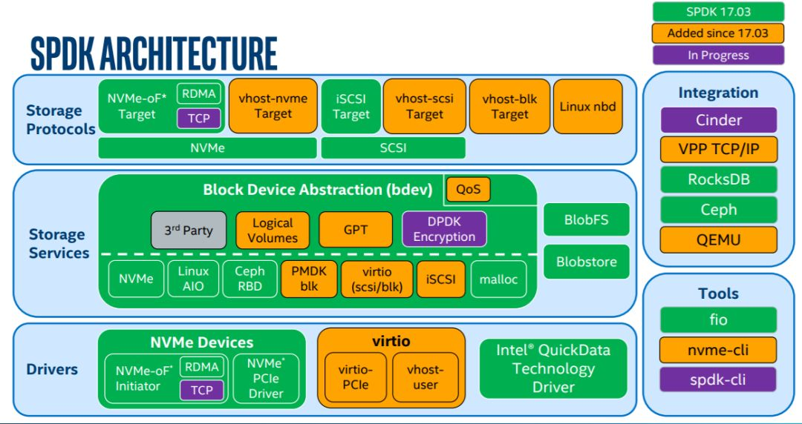

<!-- TOC -->

- [0. spdk应用场景（重点）](#0-spdk应用场景重点)
- [1. 什么是spdk](#1-什么是spdk)
- [2. spdk的设计理念](#2-spdk的设计理念)
- [3. 使用spdk加速NVMe存储](#3-使用spdk加速nvme存储)
- [4. spdk bdev](#4-spdk-bdev)
- [5. spdk 架构](#5-spdk-架构)
- [6. 附录](#6-附录)

<!-- /TOC -->

## 0. spdk应用场景（重点）
spdk最直接的使用方式是作为存储引擎加速访问NVMe SSD。在此之上spdk又抽象了bdev层，各种业务通过绑定bdev，可以将块存储设备通过某种方式暴露给用户，这就是我们下面要讲到的各种应用场景。

企业使用块存储的目的，就是将后端存储（可以是本地盘，也可以是分布式存储集群）暴露给用户，它的实现形式如公有云、私有云等等我们暂且不讨论。单就表现方式来讲，我们有很多方法将这个块设备暴露给用户，笔者主要接触到如下几种：

1. 使用网络存储协议如iSCSI/nbd/NVMeof，在用户使用的主机上建立client(iscsi/nvmeof协议中称之initiator)，访问块设备。
2. 通过virtio虚拟化的方式，使用将某种块设备在host os上提供给虚拟机，这其中又有不同的设备device对用不同的驱动，其IO链路也各不相同，如vhost-user-blk，vfio-pci，virtio-blk等等。  
3. bare-metal/smart-nic/DPU通过建立pf/vf，模拟NVMe/virtio块设备  

前两种方式，spdk都提供有对应的后端驱动，如iSCSI target，NVMe-oF target，vhost target等。  
第三类方式不同厂商具体实现方式有所不同，未必开源。我们使用spdk作为这些后端驱动，接收客户端的IO并进行处理，其好处是可以利用到spdk高性能存储框架，也就是之前提到的user space，polled-mode，asynchronous，lockless。  
spdk官网有很多测试文档介绍使用spdk和其他开源实现的性能比较，还是较为可观的。

## 1. 什么是spdk
**spdk是一个框架，而不是一个分布式系统，spdk的基石（官网用了bedrock 这个词）是用户态（user space）、轮询（polled-mode）、异步（asynchronous）、无锁（lockless）的NVMe驱动，其提供了零拷贝、高并发直接从用户态访问ssd的特性。其最初的目的是为了优化块存储落盘。但随着spdk的持续演进，大家发现spdk可以优化存储软件栈的各个方面。**
很多分布式存储系统都在思考如何吸纳spdk框架，或是采用spdk代表的高性能存储技术，来优化整条IO链路。

## 2. spdk的设计理念
spdk主要通过引入以下技术，实现其高性能方案。  

* 1、将存储用到的驱动转移到用户态，从而避免系统调用带来的性能损耗，顺便可以直接使用用户态内存落盘实现零拷贝  
* 2、使用polling模式  
  1. 轮询硬件队列，而不像之前那样使用中断模式，中断模式带来了不稳定的性能和延时的提升  
  2. 任何业务都可以在spdk的线程中将轮询函数注册为poller，注册之后该函数会在spdk中周期性的执行，避免了epoll等事件通知机制造成的overhead。  
* 3、避免在IO链路上使用锁。使用无锁队列传递消息/IO    
  1. spdk设计的主要**目标之一就随着使用硬件（e.g. SSD，NIC，CPU）的增多而获得性能的线性提升**，为了达到这目的，spdk的设计者就必须消除使用更多的系统资源带来的overhead，如：更多的线程、进程间通信，访问更多的存储硬件、网卡带来的性能损耗。
  2. 为了降低这种性能开销，spdk引入了无锁队列，使用lock-free编程，从而避免锁带来的性能损耗。**spdk的无锁队列主要依赖的dpdk的实现，其本质是使用cas（compare and swap）实现了多生产者多消费者FIFO队列**。有关无锁队列的实现可以看[这篇文章](https://blog.csdn.net/chen98765432101/article/details/69367633)

通俗的来讲spdk运行时会占用满指定的CPU core，**其本质就是一个大的while死循环，占满一个cpu core。去连续的跑用户指定的poller，轮询队列、网络接口等等**。因此，spdk编程最基本的准则，就是避免在spdk核上出现进程上下文切换。其会打破spdk高性能框架，造成性能降低甚至不能工作。

进程上下文切换会因为很多原因导致，大致列举如下，我们在spdk编程时切忌要避免。
1. cpu时间片耗尽  
2. 进程在系统资源不足（比如内存不足）时，要等到资源满足后才可以运行，这个时候进程也会被挂起，并由系统调度其他进程运行。  
3. 进程主动调用sleep等函数让出cpu使用权。
4. 当有优先级更高的进程运行时，为了保证高优先级进程的运行，当前进程会被挂起，由高优先级进程来运行。
5. 硬件中断会导致CPU上的进程被挂起，转而执行内核的中断服务程序。

## 3. 使用spdk加速NVMe存储
spdk希望通过在用户态直接访问NVMe SSD，而不经过kernel nvme 驱动（bypass kernel）。  

spdk将NVMe SSD从内核驱动解绑，再绑定到vfio或者uio驱动上。虽然这两个驱动本身不会对nvme设备做任何初始化操作。但它给了SPDK直接访问nvme设备的能力，后续的初始化和命令下发都由spdk负责。所以spdk访问NVMe SSD的调用基本上都是和nvme命令对应的.    
如admin cmd :  
spdk_nvme_ctrlr_cmd_set_feature spdk_nvme_ctrlr_cmd_get_log_page     
和io cmd :  
spdk_nvme_ctrlr_alloc_io_qpair   
spdk_nvme_ns_cmd_read  
...  
当然，iouring的sq和cq已经和这里nvme的交互方式比较相似了  

## 4. spdk bdev
spdk在上述加速访问NVMe存储的基础上，提供了块设备（bdev）的软件栈，这个块设备并不是linux系统中的块设备，spdk中的块设备只是软件抽象出的接口层。

<u>spdk已经提供了各种bdev，满足不同的后端存储方式、测试需求。如NVMe（NVMe bdev既有NVMe物理盘，也包括NVMeof）、内存（malloc bdev）、不落盘直接返回（null bdev）等等。用户也可以自定义自己的bdev，一个很常见的使用spdk的方式是，用户定义自己的bdev，用以访问自己的分布式存储集群。</u>

<u>spdk通过bdev接口层，统一了块设备的调用方法，使用者只要调用不同的rpc将不同的块设备加到spdk进程中，就可以使用各种bdev，而不用修改代码。</u>  并且用户增加自己的bdev也很简单，这极大的拓展了spdk的适用场景。

讲到这里，各位同学应该明白了，spdk目前的的应用场景主要是针对块存储，可以说块存储的整个存储的基石，再其之上我们又构建了各种文件存储、对象存储、表格存储、数据库等等，我们可以如各种云原生数据库一样将上层的分布式系统直接构建在分布式块存储、对象存储之上，也可以将其他存储需要管理的元数据、索引下推到块层，直接用spdk优化上层存储，比如目前的块存储使用lba作为索引粒度管控，我们可以将索引变为文件/对象，在其之上构建文件/对象存储系统。

## 5. spdk 架构
 

## 6. 附录
[什么是SPDK,以及什么场景需要它](https://zhuanlan.zhihu.com/p/362978954)