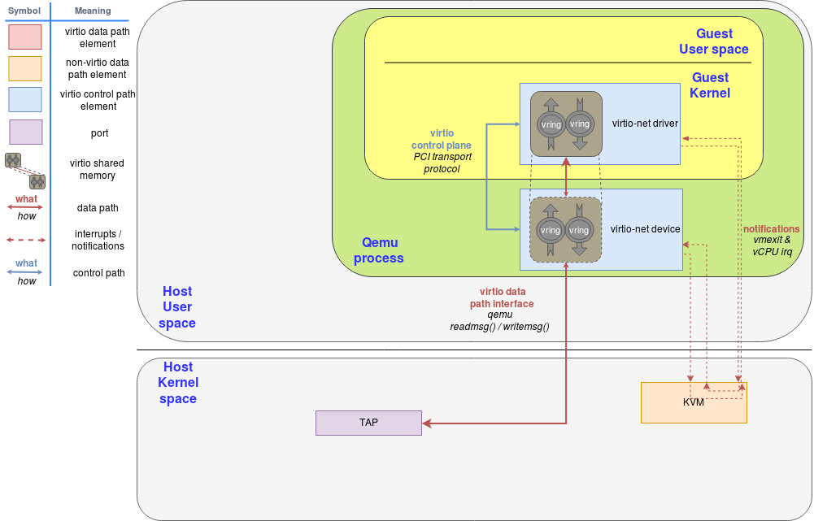

<!-- TOC -->

- [Virtio—>Vhost—>Vhost-user的演进之路](#virtiovhostvhost-user的演进之路)
  - [1、参考](#1参考)
  - [2、背景](#2背景)
  - [3、一些重要的概念](#3一些重要的概念)
  - [4、virtio虚拟化技术](#4virtio虚拟化技术)
    - [4.1、virtio-net驱动与设备（最原始的virtio网络）](#41virtio-net驱动与设备最原始的virtio网络)
    - [4.2、vhost-net(处于内核态的后端)](#42vhost-net处于内核态的后端)
    - [4.3、vhost-user(使用DPDK加速的后端)](#43vhost-user使用dpdk加速的后端)
    - [4.4、对比总结三种（virtio-net、vhost、vhost-user）virtio实现](#44对比总结三种virtio-netvhostvhost-uservirtio实现)
    - [4.5、vDPA:使用硬件加速数据面](#45vdpa使用硬件加速数据面)

<!-- /TOC -->

## Virtio—>Vhost—>Vhost-user的演进之路

### 1、参考

[Virtio和Vhost介绍——还可以](https://forum.huawei.com/enterprise/zh/thread-465473.html)

[Virtio网络的演化之路——写的很好](https://www.sdnlab.com/24468.html)

[网络虚拟化之virtio-net和vhost](https://zhuanlan.zhihu.com/p/134656862)

[虚拟化技术 - I/O虚拟化 [二]](https://zhuanlan.zhihu.com/p/69627614)

### 2、背景

完全虚拟化中，guest OS运行于物理机器上的hypevisor上，guest OS并不知道它已被虚拟化，并且不需要任何更改就可以在该配置下工作。半虚拟化中，guest OS不仅知道它运行在hypervisor之上，还包含让guest OS更高效地过渡到hypervisor的代码。

在完全虚拟化模式中，hypervisor必须模拟设备硬件，它是在会话的最低级别进行模拟的。尽管在该抽象中模拟很干净，但它同时也是最低效、最复杂的。在半虚拟化的模式中，guest OS和hypervisor能够共同合作，让模拟更加高效。

在虚拟机中，可以通过qemu模拟e1000网卡，这样的经典网卡一般各种客户操作系统都会提供inbox驱动，所以从兼容性上来看，使用类似e1000的模拟网卡是一个非常不错的选择。

但是，e1000网卡上也包含了复杂的io端口，寄存器，缓存配置，虚拟机每次收发包都会引起更多的io和mmio操作，使得虚拟机频繁的陷出，最终导致网络性能不佳。

**为了解决性能问题，IBM在2005年提出了virtio(PV Driver (事实上的标准))**, 虚拟机中的半虚拟化前端驱动和主机上的后端服务简单的使用virtqueue共享队列交换数据，大幅的减少了e1000模拟时复杂的io操作，从而可以较大程度的提升虚拟网络性能。

### 3、一些重要的概念

1、在virtio 网络中，所谓的前端即是虚拟机中的virtio-net网卡驱动。而后端的实现多种多样，后端的变化往往标志着virtio网络的演化。  

2、virtio标准将其对于队列的抽象称为Virtqueue。Vring即是对Virtqueue的具体实现。一个Virtqueue由一个Available Ring和Used Ring组成。前者用于前端向后端发送数据，而后者反之。

3、vhost-net：内核实现了一个新的virtio网络后端驱动，名为vhost-net。

4、vhost-user协议：基于vhost协议，DPDK设计了一套新的用户态协议，名为vhost-user协议，这套协议允许qemu将virtio设备的网络包处理offload到任何DPDK应用中（例如OVS-DPDK）。

5、vhost-user协议和vhost协议最大的区别其实就是通信信道的区别。Vhost协议通过对vhost-net字符设备进行ioctl实现，而vhost-user协议则通过unix socket进行实现。

### 4、virtio虚拟化技术

#### 4.1、virtio-net驱动与设备（最原始的virtio网络）

Virtio网络设备是一种虚拟的以太网卡，支持多队列的网络包收发。熟悉virtio的读者应该知道，在virtio的架构中有前后端之分。**在virtio 网络中，所谓的前端即是虚拟机中的virtio-net网卡驱动。而后端的实现多种多样，后端的变化往往标志着virtio网络的演化。**  
图一中的后端即是QEMU的实现版本，也是最原始的virtio-net后端（设备）。
 

virtio标准将其对于队列的抽象称为Virtqueue。Vring即是对Virtqueue的具体实现。一个Virtqueue由一个Available Ring和Used Ring组成。前者用于前端向后端发送数据，而后者反之。而**在virtio网络中的TX/RX Queue均由一个Virtqueue实现。所有的I/O通信架构都有数据平面与控制平面之分。**

而对于virtio来说，**通过PCI传输协议实现的virtio控制平面**正是为了**确保Vring能够用于前后端正常通信，并且配置好自定义的设备特性**。而**数据平面正是使用这些通过共享内存实现的Vring来实现虚拟机与主机之间的通信**。

举例来说，**当virtio-net驱动发送网络数据包时流程**如下：

```
1、virtio-net驱动会将数据放置于Available Ring中之后，会触发一次通知（Notification）（virtio-net驱动 Notificates kvm，目的是通知Qemu处理Available Ring中的数据）
2、这时QEMU(QEMU在用户态，kvm在内核态，他们之间怎么通信？)会接管控制，将此网络包传递到TAP设备（tap设备在内核态，什么是tap设备？）。接着QEMU将数据放于Used Ring中，并发出一次通知，这次通知会触发虚拟中断的注入。
3、虚拟机收到这个中断后，就会到Used Ring中取得后端已经放置的数据。至此一次发送操作就完成了。
```

接收网络数据包的行为也是类似，只不过这次virtio-net驱动是将空的buffer放置于队列之中，以便后端将收到的数据填充完成而已。

**以上1、2、3步涉及到的io路径总结如下：**

```
virtio-net driver & virtio-net device的io路径
	1.guest设置好tx;  //将数据放置于Available Ring中
	2.kick host;		 //virtio-net驱动 Notificates kvm
	3.guest陷出到kvm；
	4.kvm从内核切换到用户态的qemu进程；  //3-4步有两次用户态和内核态的切换
	5.qemu将tx数据投递到tap设备；	//3-5步对应上面的步骤2
```

* 特点总结：

  1、kvm和vitio-net device分别处于内核态和用户态;

  2、vitio-net device由qemu提供

以上分析结合如下两个连接：[Virtio和Vhost介绍](https://forum.huawei.com/enterprise/zh/thread-465473.html)，[Virtio网络的演化之路](https://www.sdnlab.com/24468.html)

下图1中的后端即是QEMU的实现版本，也是最原始的virtio-net后端（设备），对应上面的io路径

#### 4.2、vhost-net(处于内核态的后端)

QEMU实现的virtio网络后端带来的网络性能并不如意，究其原因是因为: 1、频繁的上下文切换、2、低效的数据拷贝、3、线程间同步等。于是，**内核实现了一个新的virtio网络后端驱动，名为vhost-net**。**<u>与之而来的是一套新的vhost协议</u>**。**vhost协议将允许VMM将virtio的数据面offload到另一个组件上，而这个组件正是vhost-net。**

**在这套实现中，QEMU和vhost-net内核驱动使用<u>ioctl来交换vhost消息，并且用eventfd来实现前后端的通知</u>。**

**当vhost-net内核驱动加载后，它会暴露一个字符设备在/dev/vhost-net。而QEMU会打开并初始化这个字符设备，并调用ioctl来与vhost-net进行控制面通信，其内容包含virtio的特性协商，将虚拟机内存映射传递给vhost-net等。**

**<u>对比最原始的virtio网络实现，控制平面在原有的基础上转变为vhost协议定义的ioctl操作（对于前端而言仍是通过PCI传输层协议暴露的接口），基于共享内存实现的Vring转变为virtio-net与vhost-net共享，数据平面的另一方转变为vhost-net，并且前后端通知方式也转为基于eventfd的实现。</u>**

 

```
virtio-net driver, vhost-net backend的io路径:
  1. guest设置好tx; 	//将数据放置于Available Ring中
  2. kick host;			//virtio-net驱动 Notificates kvm
  3. guest陷出到kvm；
  4. vhost-net将tx数据投递到tap设备;  //vhost-net通过virtqueue处理virtio-net driver的io请求
```

vhost将部分virio驱动的操作从用户态移到内核态，减少了用户态/内核态切换时间和包的拷贝次数，从而更进一步的提升了性能。

如图2所示，可以注意到，vhost-net仍然通过读写TAP设备来与外界进行数据包交换。而读到这里的读者不禁要问，那虚拟机是如何与本机上的其他虚拟机与外界的主机通信的呢？答案就是通过类似Open vSwitch (OVS)之类的软件交换机实现的。OVS相关的介绍这里就不再赘述。


#### 4.3、vhost-user(使用DPDK加速的后端)
DPDK社区一直致力于加速数据中心的网络数据平面，而virtio网络作为当今云环境下数据平面必不可少的一环，自然是DPDK优化的方向。而vhost-user就是结合DPDK的各方面优化技术得到的用户态virtio网络后端。这些优化技术包括：  
1、处理器亲和性——使用numa技术，加快中断响应速率；  
2、巨页的使用——采用了大页来作为host和vm之间通信的内存空间；  
3、轮询模式驱动等。  

除了vhost-user，DPDK还有自己的virtio PMD作为高性能的前端，本文将以vhost-user作为重点介绍。
**基于vhost协议，DPDK设计了一套新的用户态协议，名为vhost-user协议，这套协议允许qemu将virtio设备的网络包处理offload到任何DPDK应用中（例如OVS-DPDK）。<u>vhost-user协议和vhost协议最大的区别其实就是通信信道的区别。Vhost协议通过对vhost-net字符设备进行ioctl实现，而vhost-user协议则通过unix socket进行实现。</u>** 通过这个unix socket，vhost-user协议允许QEMU通过以下重要的操作来配置数据平面的offload：
1. 特性协商：virtio的特性与vhost-user新定义的特性都可以通过类似的方式协商，而所谓协商的具体实现就是QEMU接收vhost-user的特性，与自己支持的特性取交集。
2. 内存区域配置：QEMU配置好内存映射区域，vhost-user使用mmap接口来映射它们。
3. Vring配置：QEMU将Virtqueue的个数与地址发送给vhost-user，以便vhost-user访问。
4. 通知配置：vhost-user仍然使用eventfd来实现前后端通知。  

 

基于DPDK的Open vSwitch(OVS-DPDK)一直以来就对vhost-user提供了支持，读者可以通过在OVS-DPDK上创建vhost-user端口来使用这种高效的用户态后端。

```
vhost-user的io路径
  1. guest设置好tx;
  2. kick host;
  3. guest陷出到kvm；
  4. kvm将通知snabb；
  5. snabb将tx数据直接发送到nic设备。

vhost-user的提交者是Luke Gorrie，他也是snabbswitch的作者。从图上可以看到vhost-backend从原来咋kernel中的vhost-net 变成了用户空间的snabbswitch。 snabbswitch直接接管物理网卡的驱动，从而直接控制网络信息的输入输出。

snabbswitch主要使用了下面的技术来提高性能
1. 采用了大页来作为host和vm之间通信的内存空间
2. 用户态操作网卡，使用类似于netmap的zero copy技术来加速对物理设备的访问
3. 使用numa技术，加快中断响应速率
值得一提的是使用snabbswitch后，不用再使用原来的tap设备模拟的网卡。
使用vhost-user技术，从虚拟机到host上实现了数据的zero copy（通过大页共享），host到nic的zero copy（snabbswitch实现的驱动），能进一步加快数据的传输。
```

#### 4.4、对比总结三种（virtio-net、vhost、vhost-user）virtio实现
| 类型             | 实现者 | virtio控制平面: virtio-net driver（处于Guest内核态）和virtio-net device通信方式                                                                                                    | virtio控制平面: virtio-net driver和KVM（处于Host内核态）的通信方式 | virtio-net device和vhost-net(virtio-backend)的通信方式                  | virtio控制平面: KVM和vhost-net（backend）通信方式                        |
| ---------------- | ------ | ---------------------------------------------------------------------------------------------------------------------------------------------------------------------------------- | ------------------------------------------------------------------ | ----------------------------------------------------------------------- | ------------------------------------------------------------------------ |
| Virtio-net       | Qume   | virtio-net driver处于vm的内核态，virtio-net device由Qemu实现(Qemu处于Host用户空间)，两者在控制面通过PCI协议通信，目的是确保Vring能够用于前后端正常通信，并且配置好自定义的设备特性 | notification vmexit & cCPU irq                                     | 同在Qemu进程内部，进程内通信                                            | 需要从内核态切换到用户空间的virtio-net device去                          |
| Vhost(Vhost-net) | 内核   | virtio-net driver处于vm的内核态，virtio-net device由Qemu实现(Qemu处于Host用户空间)，两者在控制面通过PCI协议通信，目的是确保Vring能够用于前后端正常通信，并且配置好自定义的设备特性 | Notificates eventfd & irqfd                                        | Vhost协议通过对vhost-net字符设备进行ioctl实现，使用ioctl来交换vhost消息 | 同在内核态，进程内通信                                                   | 同在内核态空间，不需要切换 |
| Vhost-user       | SPDK   | virtio-net driver处于vm的内核态，virtio-net device（dpdk中也叫virtio-device model）由Qemu实现(Qemu处于Host用户空间)，两者在控制面通过PCI协议通信                                   | Notificates eventfd & irqfd                                        | vhost-user协议则通过unix socket进行实现设备发现                         | 需要从内核态切换到DPDK APP用户空间，通过call(irqfd)和kick(ioeventfd)实现 |


#### 4.5、vDPA:使用硬件加速数据面