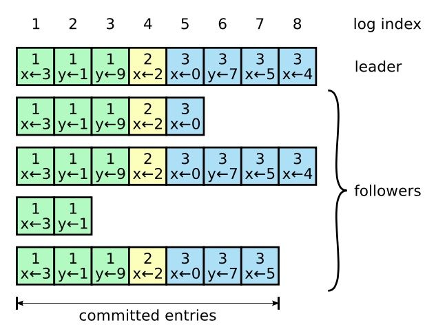
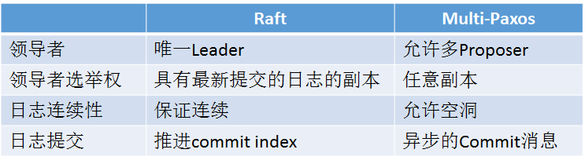
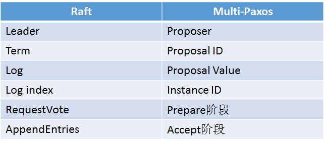

<!-- TOC -->

- [3、Raft算法](#3raft算法)
  - [3.0、Raft算法重点总结](#30raft算法重点总结)
  - [3.1、Raft算法概述](#31raft算法概述)
  - [3.2、Leader选举](#32leader选举)
  - [3.3、日志同步](#33日志同步)
  - [3.4、安全性](#34安全性)
  - [3.5、日志压缩](#35日志压缩)
  - [3.6、成员变更](#36成员变更)
  - [3.7、Raft与Multi-Paxos的异同](#37raft与multi-paxos的异同)

<!-- /TOC -->
## 3、Raft算法
Paxos算法详解一文讲述了晦涩难懂的Paxos算法，<u>**以可理解性和易于实现为目标的Raft算法**</u>极大的帮助了我们的理解，推动了分布式一致性算法的工程应用。

### 3.0、Raft算法重点总结
* 三种角色：
  Follower（追随者）
  Candidate（候选人——追随者抢主时的中间状态）
  Leader（领导者）

* 两种RPCs请求：   
  RequestVote(请求投票)
  AppendEntries(追加日志)  

Raft数据写请求也是在leader的心跳中被带到follwer去的。

### 3.1、Raft算法概述
**不同于Paxos算法直接从分布式一致性问题出发推导出来，Raft算法则是从多副本状态机的角度提出，用于管理多副本状态机的日志复制。Raft实现了和Paxos相同的功能，它将一致性分解为多个<u>子问题：Leader选举（Leader election）、日志同步（Log replication）、安全性（Safety）、日志压缩（Log compaction）、成员变更（Membership change）等。**</u> 同时，Raft算法使用了更强的假设来减少了需要考虑的状态，使之变的易于理解和实现。

Raft将系统中的角色分为领导者（Leader）、跟从者（Follower）和候选人（Candidate）：

  * Leader：接受客户端请求，并向Follower同步请求日志，当日志同步到大多数节点上后告诉Follower提交日志。  
  * Follower：接受并持久化Leader同步的日志，在Leader告之日志可以提交之后，提交日志。  
  * Candidate：Leader选举过程中的临时角色。  

Raft要求系统在任意时刻最多只有一个Leader，正常工作期间只有Leader和Followers。  

Follower只响应其他服务器的请求。如果Follower超时没有收到Leader的消息，它会成为一个Candidate并且开始一次Leader选举。收到大多数服务器投票的Candidate会成为新的Leader。Leader在宕机之前会一直保持Leader的状态。

Raft算法将时间分为一个个的任期（term），每一个term的开始都是Leader选举。在成功选举Leader之后，Leader会在整个term内管理整个集群。如果Leader选举失败，该term就会因为没有Leader而结束。

### 3.2、Leader选举  
Raft 使用心跳（heartbeat）触发Leader选举。当服务器启动时，初始化为Follower。Leader向所有Followers周期性发送heartbeat。如果Follower在选举超时时间内没有收到Leader的heartbeat，就会等待一段随机的时间后发起一次Leader选举。

Follower将其当前term加一然后转换为Candidate。它首先给自己投票并且给集群中的其他服务器发送 RequestVote RPC （RPC细节参见八、Raft算法总结）。结果有以下三种情况：

赢得了多数的选票，成功选举为Leader；
收到了Leader的消息，表示有其它服务器已经抢先当选了Leader；
没有服务器赢得多数的选票，Leader选举失败，等待选举时间超时后发起下一次选举。  

选举出Leader后，Leader通过定期向所有Followers发送心跳信息维持其统治。若Follower一段时间未收到Leader的心跳则认为Leader可能已经挂了，再次发起Leader选举过程。

Raft保证选举出的Leader上一定具有最新的已提交的日志，这一点将在四、安全性中说明。

### 3.3、日志同步
Leader选出后，就开始接收客户端的请求。Leader把请求作为日志条目（Log entries）加入到它的日志中，然后并行的向其他服务器发起 AppendEntries RPC （RPC细节参见八、Raft算法总结）复制日志条目。当这条日志被复制到大多数服务器上，Leader将这条日志应用到它的状态机并向客户端返回执行结果。  

某些Followers可能没有成功的复制日志，Leader会无限的重试 AppendEntries RPC直到所有的Followers最终存储了所有的日志条目。

日志由<u>**有序编号（log index）的日志条目组成。每个日志条目包含它被创建时的任期号（term），和用于状态机执行的命令。**</u>如果一个日志条目被复制到大多数服务器上，就被认为可以提交（commit）了。

Raft日志同步保证如下两点：
  * 如果不同日志中的两个条目有着相同的索引和任期号，则它们所存储的命令是相同的。  
  * 如果不同日志中的两个条目有着相同的索引和任期号，则它们之前的所有条目都是完全一样的。  

第一条特性源于Leader在一个term内在给定的一个log index最多创建一条日志条目，同时该条目在日志中的位置也从来不会改变。  
第二条特性源于 AppendEntries 的一个简单的一致性检查。当发送一个 AppendEntries RPC 时，Leader会把新日志条目紧接着之前的条目的log index和term都包含在里面。如果Follower没有在它的日志中找到log index和term都相同的日志，它就会拒绝新的日志条目。

一般情况下，Leader和Followers的日志保持一致，因此 AppendEntries 一致性检查通常不会失败。然而，Leader崩溃可能会导致日志不一致：旧的Leader可能没有完全复制完日志中的所有条目。

  

上图阐述了一些Followers可能和新的Leader日志不同的情况。一个Follower可能会丢失掉Leader上的一些条目，也有可能包含一些Leader没有的条目，也有可能两者都会发生。丢失的或者多出来的条目可能会持续多个任期。

Leader通过强制Followers复制它的日志来处理日志的不一致，Followers上的不一致的日志会被Leader的日志覆盖。

**Leader为了使Followers的日志同自己的一致，Leader需要找到Followers同它的日志一致的地方，然后覆盖Followers在该位置之后的条目。  
Leader会从后往前试，每次AppendEntries失败后尝试前一个日志条目，直到成功找到每个Follower的日志一致位点，然后向后逐条覆盖Followers在该位置之后的条目。**

### 3.4、安全性  
Raft增加了如下两条限制以保证安全性：  
 * 拥有最新的已提交的log entry的Follower才有资格成为Leader。  
这个保证是在RequestVote RPC中做的，Candidate在发送RequestVote RPC时，要带上自己的最后一条日志的term和log index，其他节点收到消息时，如果发现自己的日志比请求中携带的更新，则拒绝投票。日志比较的原则是，如果本地的最后一条log entry的term更大，则term大的更新，如果term一样大，则log index更大的更新。  

 * Leader只能推进commit index来提交当前term的已经复制到大多数服务器上的日志，旧term日志的提交要等到提交当前term的日志来间接提交（log index 小于 commit index的日志被间接提交）。    
见原文解释  

### 3.5、日志压缩
在实际的系统中，不能让日志无限增长，否则系统重启时需要花很长的时间进行回放，从而影响可用性。Raft采用对整个系统进行snapshot来解决，snapshot之前的日志都可以丢弃。

每个副本独立的对自己的系统状态进行snapshot，并且只能对已经提交的日志记录进行snapshot。

Snapshot中包含以下内容：

日志元数据。最后一条已提交的 log entry的 log index和term。这两个值在snapshot之后的第一条log entry的AppendEntries RPC的完整性检查的时候会被用上。
系统当前状态。
当Leader要发给某个日志落后太多的Follower的log entry被丢弃，Leader会将snapshot发给Follower。或者当新加进一台机器时，也会发送snapshot给它。发送snapshot使用InstalledSnapshot RPC（RPC细节参见八、Raft算法总结）。

做snapshot既不要做的太频繁，否则消耗磁盘带宽， 也不要做的太不频繁，否则一旦节点重启需要回放大量日志，影响可用性。推荐当日志达到某个固定的大小做一次snapshot。

做一次snapshot可能耗时过长，会影响正常日志同步。可以通过使用copy-on-write技术避免snapshot过程影响正常日志同步。

### 3.6、成员变更

成员变更是在集群运行过程中副本发生变化，如增加/减少副本数、节点替换等。

成员变更也是一个分布式一致性问题，既所有服务器对新成员达成一致。但是成员变更又有其特殊性，因为在成员变更的一致性达成的过程中，参与投票的进程会发生变化。

如果将成员变更当成一般的一致性问题，直接向Leader发送成员变更请求，Leader复制成员变更日志，达成多数派之后提交，各服务器提交成员变更日志后从旧成员配置（Cold）切换到新成员配置（Cnew）。

因为各个服务器提交成员变更日志的时刻可能不同，造成各个服务器从旧成员配置（Cold）切换到新成员配置（Cnew）的时刻不同。

成员变更不能影响服务的可用性，但是成员变更过程的某一时刻，可能出现在Cold和Cnew中同时存在两个不相交的多数派，进而可能选出两个Leader，形成不同的决议，破坏安全性。

由于成员变更的这一特殊性，成员变更不能当成一般的一致性问题去解决。

为了解决这一问题，Raft提出了两阶段的成员变更方法。集群先从旧成员配置Cold切换到一个过渡成员配置，称为共同一致（joint consensus），共同一致是旧成员配置Cold和新成员配置Cnew的组合Cold U Cnew，一旦共同一致Cold U Cnew被提交，系统再切换到新成员配置Cnew。  
见原文  

### 3.7、Raft与Multi-Paxos的异同  
Raft与Multi-Paxos都是基于领导者的一致性算法，乍一看有很多地方相同，下面总结一下Raft与Multi-Paxos的异同。  

Raft与Multi-Paxos中相似的概念：     
  

Raft与Multi-Paxos的不同：  
  

[Raft算法详解](https://zhuanlan.zhihu.com/p/32052223)  
[In Search of an Understandable Consensus Algorithm (Extended Version)](https://raft.github.io/raft.pdf)