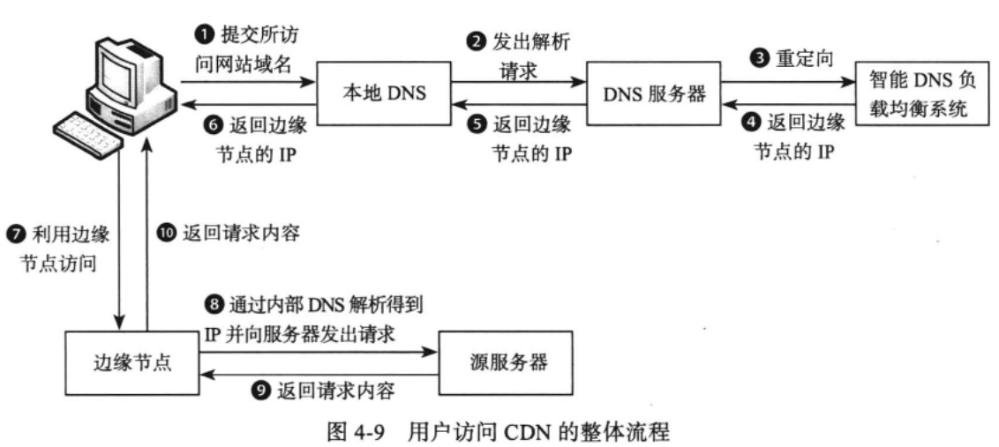
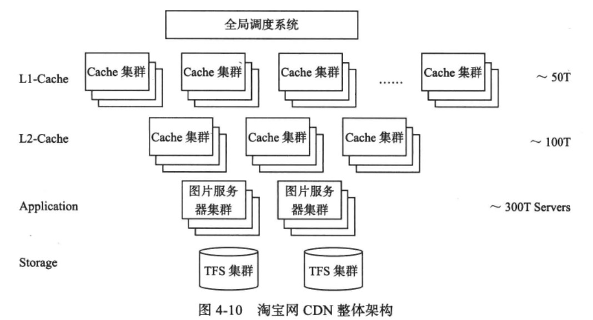
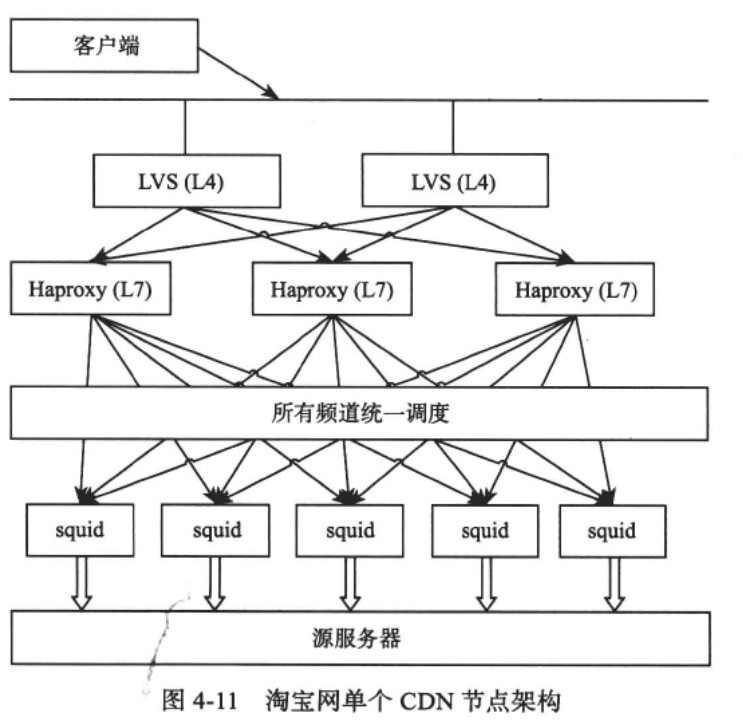

## 内容分发网络
CDN通过将网络内容发布到靠近用户的边缘节点，使不同地域的用户在访问相同网页时可以就近获取。这样既可以减轻源服务器的负担，也可以减少整个网络中的流量
分布不均的情况，进而改善整个网络性能。所谓的边缘节点是CDN服务提供商经过精心挑选的距离用户非常近的服务器节点，仅“一跳”（Single Hop)之遥。用户在访问时
就无需再经过多个路由器，大大减少访问时间。

从下图可以看出，DNS在对域名解析时不再向用户返回源服务器的IP,而是返回了由智能CDN负载均衡系统选定的某个边缘节点的IP.用户利用这个IP访问边缘节点，然后该节点通过其内部DNS解析得到源服务器IP并发出请求来获取用户所需的页面，如果请求成功，边缘节点会将页面缓存下来，下次用户访问时可以直接读取，而不需要每次都访问源服务器。

  

## CDN架构
淘宝CDN系统用于支持用户购物，尤其是“双11”光棍节时的海量图片请求。如图4-10所示，图片存储在后台的TFS集群中，CDN系统将这些图片缓存到离用户最近的边缘节点。CDN采用两级Cache:L1-Cache以及L2-Cache.用户访问淘宝网的图片时，通过全局调度系统（Global Load Balancing)调度到某个L1-Cache节点。如果L1-Cache命中，那么直接将图片数据返回用户；否则，请求L2-Cache节点，并将返回的图片数据缓存到L1-Cache节点。如果L2-Cache命中，直接将图片数据返回给L1-Cache节点；否则，请求源服务器的图片服务器集群。每台图片服务器是一个运行着Nginx的Web服务器，它还会在本地缓存图片，只有当本地缓存也不命中时才会请求后端的TFS集群，图片服务器集群和TFS集群部署在同一个数据中心内。  

  

对于每个CDN节点，其架构如下图所示。
   
从图中可以看出，每个CDN节点内部通过LVS+Haproxy的方式进行负载均衡。其中，LVS是四层负载均衡软件，性能好；Haproxy是七层负载均衡软件，能够支持更加灵活的负载均衡策略。通过有机结合两者，可以将不同的图片请求调度到不同的Squid服务器。

Squid服务器用来缓存Blob图片数据。用户的请求按照一定的策略发送给某台Squid服务器，如果缓存命中则直接返回；否则，Squid服务器首先会请求源服务器获取图片缓存到本地，接着再将图片数据返回给用户。数据通过一致性哈希的方式分布到不同的Squid服务器，使得增加／删除服务器只需要移动1/n(n为Squid服务器总数）的对象。
相比分布式存储系统，分布式缓存系统的实现要容易很多。这是因为缓存系统不需要考虑数据持久化，如果缓存服务器出现故障，只需要简单地将它从集群中剔除即可。

### 1.分级存储  
分级存储是淘宝CDN架构的一个很大创新。由于缓存数据有较高的局部性，在Squid服务器上使用SSD+SAS+SATA混合存储，图片随着热点变化而迁移，最热门的存储到SSD,中等热度的存储到SAS,轻热度的存储到SATA.通过这样的方式，能够很好地结合SSD的性能和SAS、SATA磁盘的成本优势。

### 2.低功耗服务器定制  
淘宝CDN架构的另外一个亮点是低功耗服务器定制。CDN缓存服务是IO密集型而不是CPU密集型的服务，因此，选用Intel Atom CPU定制低功耗服务器，在保证服务性能的前提下大大降低了整体功耗。  

## 讨论
<u>由于Blob存储系统读访问量大，更新和删除很少，特别适合通过CDN技术分发到离用户最近的节点。CDN也是一种缓存，需要考虑与源服务器之间的一致性。</u>源服务器更新或者删除了Blob数据，需要能够比较实时地推送到CDN缓存节点，否则只能等到缓存中的对象被淘汰，而对象的有效期一般很长，热门对象很难被淘汰。  
另外，淘宝在研发CDN的过程中也发现，随着系统的规模越来越大，商用软件往往很难满足需求，通过采用开源软件与自主开发相结合的方式，可以有更好的可控性，系统也有更高的可扩展性。互联网技术的优势在于规模效应，随着规模越来越大，单位成本也会越来越低。  
当然，随着硬件技术的发展，淘宝CDN架构也经历着变革。例如SSD价格快速下降，使得SSD+SAS+SATA分级存储的优势不再明显，新上线的CDN缓存节点配备的磁盘均为SSD。  