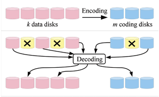

## 纠删码主流应用场景
<u>**冷存储 或者 热数据自动转冷**</u>  

## 纠删码来源  
通信领域的误码控制技术：检错码、纠错码、纠删码。  

纠删码则不仅具备识别错码和纠正错码的功能，而且当错码超过纠正范围时可把无法纠错的信息删除。

<u>一种数据冗余保护技术，RAID的延伸。</u>

## 基本结构
以磁盘做为单位存储设备的存储系统中，有以下参数说明：  
n : 存储系统中磁盘总数  
k : 原始数据盘个数或恢复数据需要的磁盘  
m : 校验盘个数 𝑚 = 𝑛 − 𝑘    

编码策略编码k个数据盘，得到m个校验盘，保证丢失若干个磁盘可以恢复出丢失磁盘数据，编码效率𝑅=𝑘/𝑚（磁盘可以推广为数据块或者任意存储节点）。  

    总数据块 = 原始数据块 + 校验块  
    n = k + m  
    允许故障：任意m个块，包括原始数据块 和 校验块。  

从k个原始数据块中计算出m个校验块。  
将这k+m个数据块分别存放在k+m个硬盘上，就能容忍任意m个硬盘故障。  
当出现硬盘故障时，只要任意选取k个幸存数据块就能计算得到所有的原始数据块。  
同理，如果将k+m个数据块分散在不同的存储节点上，就能容忍m个节点故障。
参考[纠删码学习笔记](https://www.cnblogs.com/tinoryj/p/Erasure-Codes-for-Storage-Systems-Summary.html) 

## 参数配置  
* n = k + m

    k值影响数据恢复代价。k值越小，数据分散度越小，故障影响面越大，重建代价也就越大；k值越大，多路数据拷贝增加的网络和磁盘负载越大，重建代价也越大。  
    m值影响可靠性与存储成本。取值大，故障容忍度高；m取值小，数据冗余低。在两者之间权衡。  
    k 取值 有时候也和数据块对齐，k/m 按照磁盘故障率来选择。

* 业界配置  

    EMC对象存储系统ECS 12 + 4（冗余度=1.33） 和 10 + 2（冗余度=1.2）

    阿里云盘古集群chunk存储 8+3 冗余度=1.375  

    Google RS(6,3) in GFS II (Colossus)  

    Google在2004年发布GFS的经典论文后，2009年开始开发第二代GFS（Colossus），它采用了最基本的RS（6,3）编码，将一个待编码数据单元(Data Unit)分为6个数据块, 再添加3个parity block，最多可容包括parity blocks在内的任意3个数据块错误。    
    数据恢复的网络I/O开销为：恢复任何一个数据块需要6次I/O，通过网络传输6个数据block，存储的空间冗余率 为（6+3)/6 = 1.5  

    Facebook早期在HDFS RAID中采用的编码方式RS(10,4)  

* 开源社区  

    <u>**ceph**</u>    
    [ERASURE CODE](https://docs.ceph.com/en/latest/rados/operations/erasure-code/)  

    Hadoop 3.0    

    Spark 数据也可以通过计算恢复，详见spark论文  

## 纠删码 （存储以RS为主）  
目前，纠删码技术在分布式存储系统中得到研究的主要有三类

* 阵列纠删码

* RS(Reed-Solomon)类纠删码

* LDPC(LowDensity Parity Check Code)纠删码

与RS编码相比，LDPC编码效率要略低，但编码和解码性能要优于RS码以及其他的纠删码，主要得益于编解码采用的相对较少并且简单的异或操作。  

详见原文

## 纠删码代价与优化
* 纠删码技术提高存储资源利用率  
  1. 提供近似三副本的可靠性
  2. 减小冗余存储

* 代价  
  1. CPU计算量  
  2. 网络负载  

    在出现硬盘故障后，重建数据非常耗CPU，而且计算一个数据块需要通过网络读出k倍的数据并传输，网络负载成倍增加。

* **主流应用场景**  
  <u>冷存储 或者 热数据自动转冷</u>

* 优化

    分析故障特征：    
    特征一：所有的故障都将导致同样的重建代价，无论是一个盘，还是M个盘  
    特征二：单个磁盘故障的几率远远大于多个磁盘同时故障的几率，通常在90%以上

  * LRC（Locally Repairable Codes）  

    局部校验编码：将校验块（parity block）分为全局校验块(global parity)、局部重建校验块(local reconstruction parity)，故障恢复时分组计算。  

    以微软Azure的云存储（Windows Azure Storage）实现为例，它采用LRC（12,2,2）编码，将12个数据块为一组编码，并进一步将这12个数据块平均分为2个本地组， 每个本地组包括6个数据块，并分别计算出一个local reconstruction parity，再根据所有12个数据块计算出2个global parities。  

    当发生任何一个数据块错误时，只用本地组内的数据块和校验块即可恢复出原始数据。而恢复代价（通过网络传输的数据块数量）就由传统RS（12,4）编码的12，变为6，恢复过程的网络I/O开销减半，同时数据冗余度保持不变，仍为（12+2+2）/ 12 = 1.33  

    微软Azure论文
    Erasure Coding in Windows Azure Storage
    Erasure Coding in Windows Azure Storage

    详见原文

## EC代码库  
Ceph集成4种纠删码实现

纠删码配置 - Ceph Documentation

    Jerasure 纠删码插件  
    ISA 纠删码插件  
    局部自修复纠删码插件  
    SHEC 纠删码插件  

详见原文

## EC数据块布局  

### 连续布局  
实现容易，适合大文件。  
client端需要缓存下足够的数据块，然后生成校验块并写入。  
以RS（6,3），blockSize=128M为例，client端需要缓存1.12G的数据。  
更适合的场景：由普通文件转化为EC编码  

### 条带布局  
优点：缓存少  
由于一个条的单元往往较小（通常为64K或1M），client端在写完一个条带的数据单元后就可以计算出校验单元并写出，因此client端需要缓存的数据很少。    
不足：位置敏感，原先在一个节点上的数据被分散到多个不同的节点上。  

## 附录
[纠删码 Erasure Code](https://zhuanlan.zhihu.com/p/69374970)    
[Erasure-Code(纠删码) 最佳实践](https://zhuanlan.zhihu.com/p/106096265)    
[Erasure Codes for Storage Systems](https://www.usenix.org/system/files/login/articles/10_plank-online.pdf)  

[HDFS纠删码设计](https://www.jianshu.com/p/9d1c5e614d14)    
[浅谈Ceph纠删码](https://blog.csdn.net/niuanxins/article/details/42239431)  