<!-- TOC -->

- [0 总结](#0-总结)
- [1 引言](#1-引言)
- [2 保证最终一致性的策略（ Cache Policy ）](#2-保证最终一致性的策略-cache-policy-)
  - [2.1 Cache-Aside(旁路缓存模式)](#21-cache-aside旁路缓存模式)
    - [2.1.1 为什么删除缓存，而不是更新缓存？](#211-为什么删除缓存而不是更新缓存)
    - [2.1.2 为什么先更新数据库，而不是先删除缓存？](#212-为什么先更新数据库而不是先删除缓存)
    - [2.1.3 如果选择先删除缓存，再更新数据库，那如何解决一致性问题呢？](#213-如果选择先删除缓存再更新数据库那如何解决一致性问题呢)
    - [2.1.4 那么 Cache-Aside 存在数据不一致的可能吗？](#214-那么-cache-aside-存在数据不一致的可能吗)
  - [2.2 补偿机制](#22-补偿机制)
    - [2.2.1 删除重试机制-消息队列](#221-删除重试机制-消息队列)
    - [2.2.2 基于数据库日志（ MySQL binlog ）增量解析、订阅和消费](#222-基于数据库日志-mysql-binlog-增量解析订阅和消费)
    - [2.2.3 数据传输服务 DTS](#223-数据传输服务-dts)
  - [2.3 Read-Through](#23-read-through)
  - [2.5 Write-Behind](#25-write-behind)
  - [2.6 Write-Around](#26-write-around)
- [附录](#附录)

<!-- /TOC -->
## 0 总结
<u>**在解决缓存一致性的过程中，有多种途径可以保证缓存的最终一致性，应该根据场景来设计合适的方案，读多写少的场景下，可以选择采用“ Cache-Aside 结合消费数据库日志做补偿”的方案，写多的场景下，可以选择采用“ Write-Through 结合分布式锁”的方案 ，写多的极端场景下，可以选择采用“ Write-Behind ” 的方案。**</u>

## 1 引言
对于一致性来说，包含强一致性和弱一致性，<u>强一致性保证写入后立即可以读取，弱一致性则不保证立即可以读取写入后的值，而是尽可能的保证在经过一定时间后可以读取到，在弱一致性中应用最为广泛的模型则是最终一致性模型，即保证在一定时间之后写入和读取达到一致的状态。</u>对于应用缓存的大部分场景来说，追求的则是最终一致性，少部分对数据一致性要求极高的场景则会追求强一致性。

## 2 保证最终一致性的策略（ Cache Policy ）
为了达到最终一致性，针对不同的场景，业界逐步形成了下面这几种应用缓存的策略。

### 2.1 Cache-Aside(旁路缓存模式)  
<u>Cache-Aside 意为旁路缓存模式，是应用最为广泛的一种缓存策略。下面的图示展示了它的读写流程，来看看它是如何保证最终一致性的。在读请求中，首先请求缓存，若缓存命中（ cache hit ），则直接返回缓存中的数据；若缓存未命中（ cache miss ），则查询数据库并将查询结果更新至缓存，然后返回查询出的数据（ demand-filled look-aside ）。在写请求中，先更新数据库，再删除缓存（write-invalidate）。</u>  

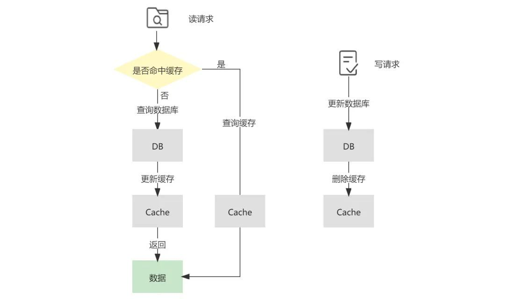    

#### 2.1.1 为什么删除缓存，而不是更新缓存？
<u>总结：性能—能够解决缓存扰动问题、安全—在并发场景下，在写请求中更新缓存可能会引发数据的不一致问题。惰性加载（写-删除和读-更新）可以在发生异常时触发重试，使得缓存和持久化存储一致。</u>  

在 Cache-Aside 中，对于读请求的处理比较容易理解，但在写请求中，可能会有读者提出疑问，为什么要删除缓存，而不是更新缓存？站在符合直觉的角度来看，更新缓存是一个容易被理解的方案，但站在性能和安全的角度，更新缓存则可能会导致一些不好的后果。

首先是性能，当该缓存对应的结果需要消耗大量的计算过程才能得到时，比如需要访问多张数据库表并联合计算，那么在写操作中更新缓存的动作将会是一笔不小的开销。同时，当写操作较多时，可能也会存在刚更新的缓存还没有被读取到，又再次被更新的情况（这常被称为缓存扰动），显然，这样的更新是白白消耗机器性能的，会导致缓存利用率不高。而等到读请求未命中缓存时再去更新，也符合懒加载的思路，需要时再进行计算。删除缓存的操作不仅是幂等的，可以在发生异常时重试，而且写-删除和读-更新在语义上更加对称。

其次是安全，在并发场景下，在写请求中更新缓存可能会引发数据的不一致问题。参考下面的图示，若存在两个来自不同线程的写请求，首先来自线程 1 的写请求更新了数据库（ step 1 ），接着来自线程 2 的写请求再次更新了数据库（ step 2 ），但由于网络延迟等原因，线程 1 可能会晚于线程 2 更新缓存（ step 4 晚于 step 3 ），那么这样便会导致最终写入数据库的结果是来自线程 2 的新值，写入缓存的结果是来自线程 1 的旧值，即缓存落后于数据库，此时再有读请求命中缓存（ step 5 ），读取到的便是旧值。
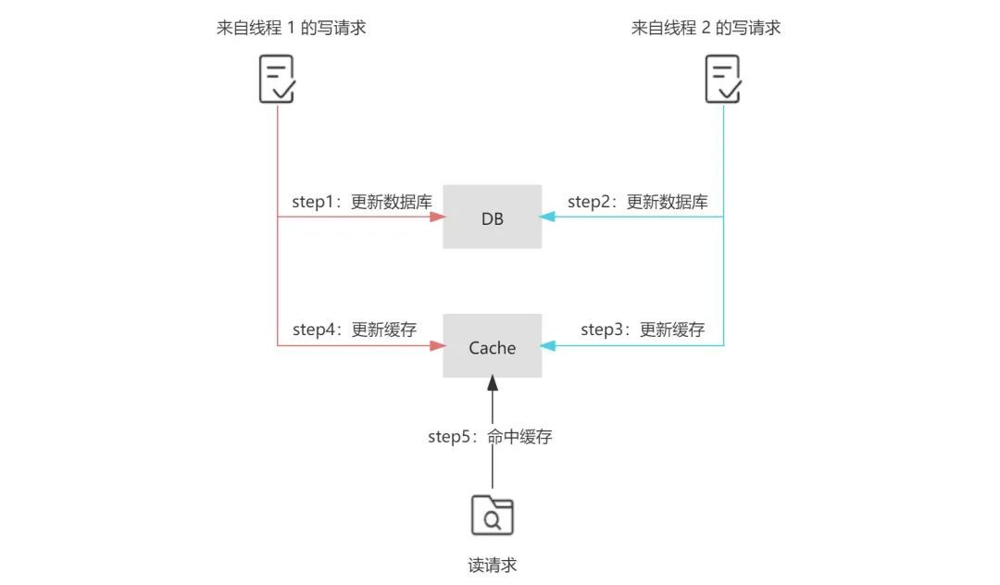   

#### 2.1.2 为什么先更新数据库，而不是先删除缓存？
<u>并发场景下会导致缓存落后于数据库</u>  

另外，有读者也会对更新数据库和删除缓存的时序产生疑问，那么为什么不先删除缓存，再更新数据库呢？在单线程下，这种方案看似具有一定合理性，这种合理性体现在删除缓存成功，但更新数据库失败的场景下，尽管缓存被删除了，下次读操作时，仍能将正确的数据写回缓存，相对于 Cache-Aside 中更新数据库成功，删除缓存失败的场景来说，先删除缓存的方案似乎更合理一些。那么，先删除缓存有什么问题呢？

问题仍然出现在并发场景下，首先来自线程 1 的写请求删除了缓存（ step 1 ），接着来自线程 2 的读请求由于缓存的删除导致缓存未命中，根据 Cache-Aside 模式，线程 2 继而查询数据库（ step 2 ），但由于写请求通常慢于读请求，线程 1 更新数据库的操作可能会晚于线程 2 查询数据库后更新缓存的操作（ step 4 晚于 step 3 ），那么这样便会导致最终写入缓存的结果是来自线程 2 中查询到的旧值，而写入数据库的结果是来自线程 1 的新值，即缓存落后于数据库，此时再有读请求命中缓存（ step 5 ），读取到的便是旧值。
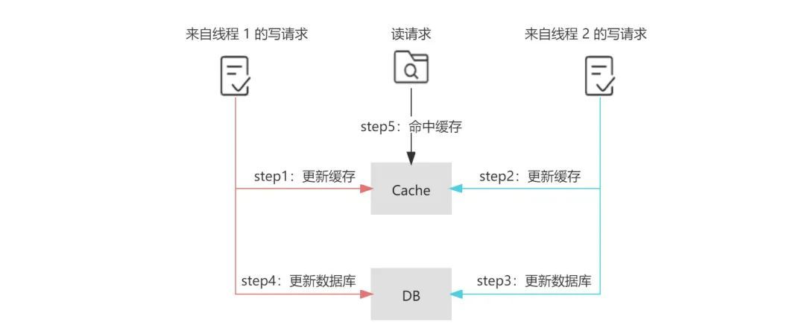   

#### 2.1.3 如果选择先删除缓存，再更新数据库，那如何解决一致性问题呢？
为了避免“先删除缓存，再更新数据库”这一方案在读写并发时可能带来的缓存脏数据，业界又提出了<u>延时双删的策略，即在更新数据库之后，延迟一段时间再次删除缓存，为了保证第二次删除缓存的时间点在读请求更新缓存之后，这个延迟时间的经验值通常应稍大于业务中读请求的耗时。延迟的实现可以在代码中 sleep 或采用延迟队列。显而易见的是，无论这个值如何预估，都很难和读请求的完成时间点准确衔接，这也是延时双删被诟病的主要原因。</u>
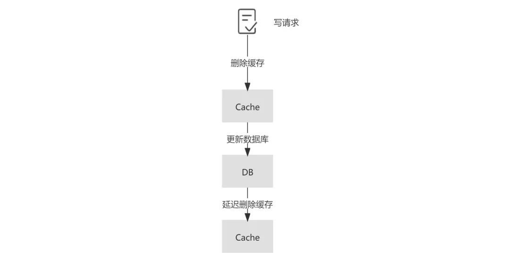   

#### 2.1.4 那么 Cache-Aside 存在数据不一致的可能吗？
在 Cache-Aside 中，也存在数据不一致的可能性。在下面的读写并发场景下，首先来自线程 1 的读请求在未命中缓存的情况下查询数据库（ step 1 ），接着来自线程 2 的写请求更新数据库（ step 2 ），但由于一些极端原因，线程 1 中读请求的更新缓存操作晚于线程 2 中写请求的删除缓存的操作（ step 4 晚于 step 3 ），那么这样便会导致最终写入缓存中的是来自线程 1 的旧值，而写入数据库中的是来自线程 2 的新值，即缓存落后于数据库，此时再有读请求命中缓存（ step 5 ），读取到的便是旧值。

这种场景的出现，不仅需要缓存失效且读写并发执行，而且还需要读请求查询数据库的执行早于写请求更新数据库，同时读请求的执行完成晚于写请求。足以见得，这种不一致场景产生的条件非常严格，在实际的生产中出现的可能性较小。
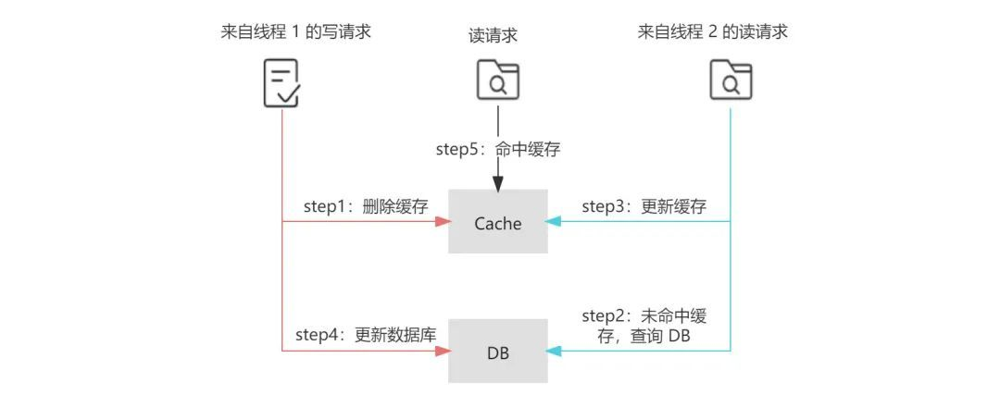     
除此之外，在并发环境下，Cache-Aside 中也存在读请求命中缓存的时间点在写请求更新数据库之后，删除缓存之前，这样也会导致读请求查询到的缓存落后于数据库的情况。

虽然在下一次读请求中，缓存会被更新，但如果业务层面对这种情况的容忍度较低，那么可以采用加锁在写请求中保证“更新数据库&删除缓存”的串行执行为原子性操作（同理也可对读请求中缓存的更新加锁）。加锁势必会导致吞吐量的下降，故采取加锁的方案应该对性能的损耗有所预期。
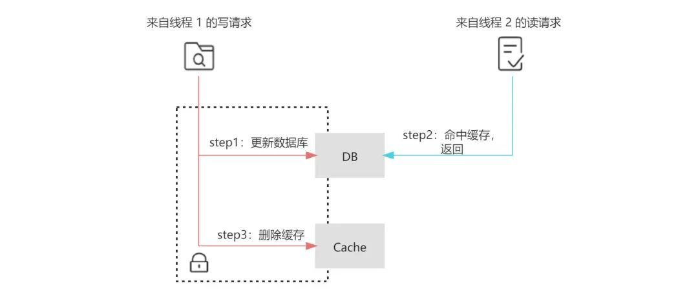         
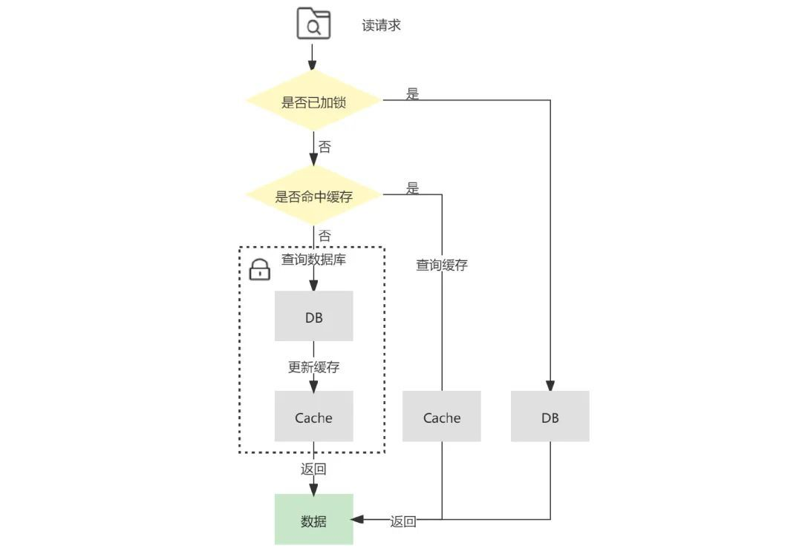    

### 2.2 补偿机制  
我们在上面提到了，在 Cache-Aside 中可能存在更新数据库成功，但删除缓存失败的场景，如果发生这种情况，那么便会导致缓存中的数据落后于数据库，产生数据的不一致的问题。<u>其实，不仅 Cache-Aside 存在这样的问题，在延时双删等策略中也存在这样的问题。针对可能出现的删除失败问题，目前业界主要有以下几种补偿机制。</u>  

#### 2.2.1 删除重试机制-消息队列
由于同步重试删除在性能上会影响吞吐量，所以常通过引入消息队列，将删除失败的缓存对应的 key 放入消息队列中，在对应的消费者中获取删除失败的 key ，异步重试删除。这种方法在实现上相对简单，但由于删除失败后的逻辑需要基于业务代码的 trigger 来触发 ，对业务代码具有一定入侵性。   
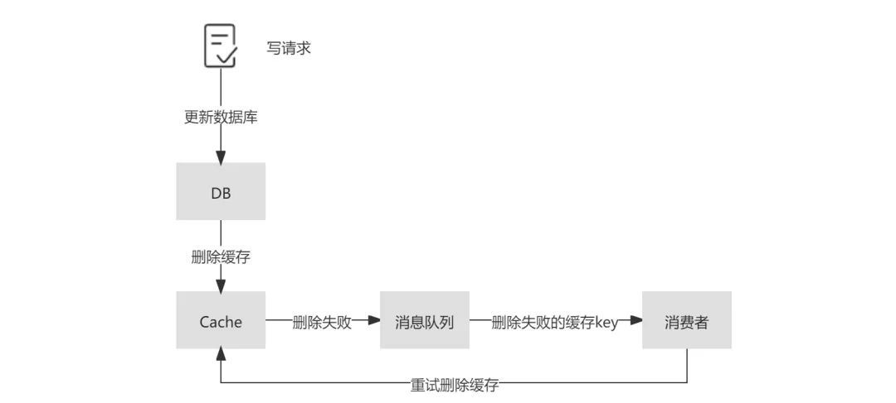   

#### 2.2.2 基于数据库日志（ MySQL binlog ）增量解析、订阅和消费
鉴于上述方案对业务代码具有一定入侵性，所以需要一种更加优雅的解决方案，让缓存删除失败的补偿机制运行在背后，尽量少的耦合于业务代码。一个简单的思路是通过后台任务使用更新时间戳或者版本作为对比获取数据库的增量数据更新至缓存中，这种方式在小规模数据的场景可以起到一定作用，但其扩展性、稳定性都有所欠缺。

一个相对成熟的方案是基于 MySQL 数据库增量日志进行解析和消费，这里较为流行的是阿里巴巴开源的作为 MySQL binlog 增量获取和解析的组件 canal （类似的开源组件还有 Maxwell、Databus 等）。canal sever 模拟 MySQL slave 的交互协议，伪装为 MySQL slave ，向 MySQL master 发送 dump 协议，MySQL master 收到 dump 请求，开始推送 binary log 给 slave （即 canal sever ），canal sever 解析 binary log 对象（原始为 byte 流），可由 canal client 拉取进行消费，同时 canal server 也默认支持将变更记录投递到 MQ 系统中，主动推送给其他系统进行消费。在 ack 机制的加持下，不管是推送还是拉取，都可以有效的保证数据按照预期被消费。当前版本的 canal 支持的 MQ 有 kafka 或者 RocketMQ 。另外， canal 依赖 zookeeper 作为分布式协调组件来实现 HA ，canal 的 HA 分为两个部分：

为了减少对 MySQL dump 的请求压力，不同 canal server 上的 instance 要求同一时间只能有一个处于运行状态，其他的 instance 处于 standby 状态；
为了保证有序性，对于一个 instance 在同一时间只能由一个 canal client 进行 get/ack 等动作；
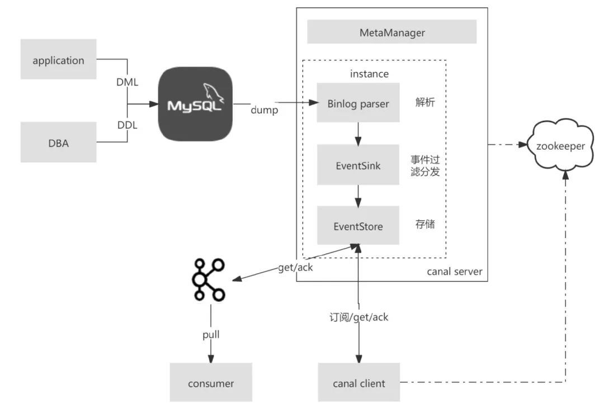   

那么，针对缓存的删除操作便可以在 canal client 或 consumer 中编写相关业务代码来完成。<u>这样，结合数据库日志增量解析消费的方案以及 Cache-Aside 模型，在读请求中未命中缓存时更新缓存（通常这里会涉及到复杂的业务逻辑），在写请求更新数据库后删除缓存，并基于日志增量解析来补偿数据库更新时可能的缓存删除失败问题，在绝大多数场景下，可以有效的保证缓存的最终一致性。</u>

另外需要注意的是，还应该隔离事务与缓存，确保数据库入库后再进行缓存的删除操作。比如考虑到数据库的主从架构，主从同步及读从写主的场景下，可能会造成读取到从库的旧数据后便更新了缓存，导致缓存落后于数据库的问题，这就要求对缓存的删除应该确保在数据库操作完成之后。所以，基于 binlog 增量日志进行数据同步的方案，可以通过选择解析从节点的 binlog，来避免主从同步下删除缓存过早的问题。  

#### 2.2.3 数据传输服务 DTS  
数据传输服务（ Data Transmission Service，简称 DTS）是云服务商提供的一种支持 RDBMS（关系型数据库）、NoSQL、OLAP 等多种数据源之间进行数据交互的数据流服务。DTS 提供了包括数据迁移、数据订阅、数据同步等在内的多种数据传输能力，常用于不停服数据迁移、数据异地灾备、异地多活(单元化)、跨境数据同步、实时数据仓库、查询报表分流、缓存更新、异步消息通知等多种业务应用场景。

相对于上述基于 canal 等开源组件自建系统，DTS 的优势体现在对多种数据源的支持、对多种数据传输方式的支持，避免了部署维护的人力成本。目前，各家云服务商的 DTS 服务已针对云数据库，云缓存等产品进行了适配，解决了 Binlog 日志回收，主备切换等场景下的订阅高可用问题。在大规模的缓存数据一致性场景下，优先推荐使用 DTS 服务。

### 2.3 Read-Through
Read-Through 意为读穿透模式，它的流程和 Cache-Aside 类似，不同点在于 Read-Through 中多了一个访问控制层，读请求只和该访问控制层进行交互，而背后缓存命中与否的逻辑则由访问控制层与数据源进行交互，业务层的实现会更加简洁，并且对于缓存层及持久化层交互的封装程度更高，更易于移植。

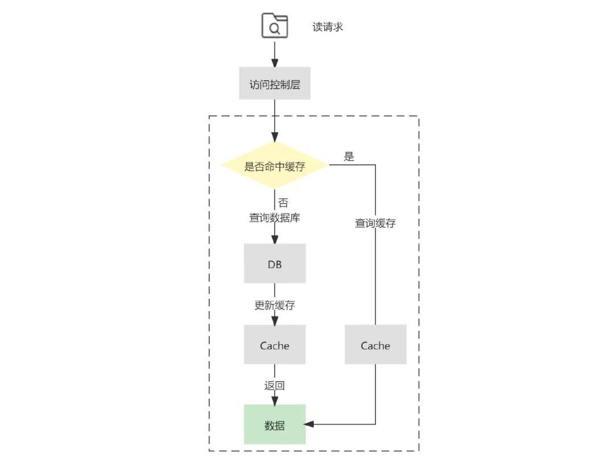  

2.4 Write-Through
Write-Through 意为直写模式，对于 Write-Through 直写模式来说，它也增加了访问控制层来提供更高程度的封装。不同于 Cache-Aside 的是，Write-Through 直写模式在写请求更新数据库之后，并不会删除缓存，而是更新缓存。  

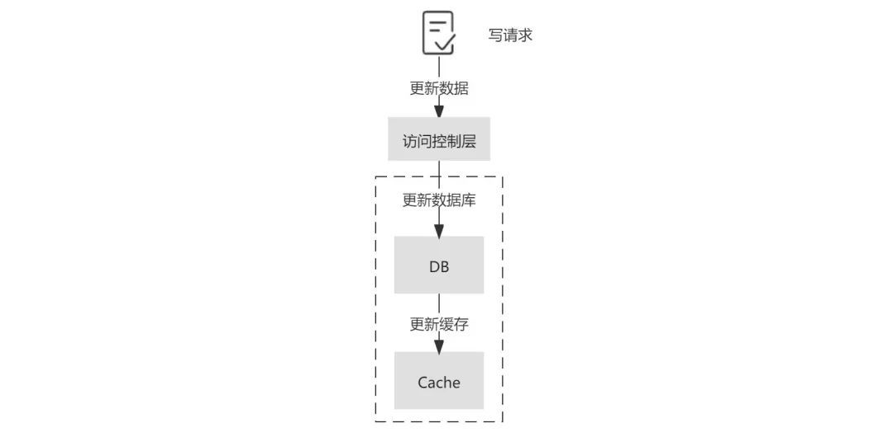  

这种方式的优势在于读请求过程简单，不需要查询数据库更新缓存等操作。但其劣势也非常明显，除了上面我们提到的更新数据库再更新缓存的弊端之外，这种方案还会造成更新效率低，并且两个写操作任何一次写失败都会造成数据不一致。

如果要使用这种方案，最好可以将这两个操作作为事务处理，可以同时失败或者同时成功，支持回滚，并且防止并发环境下的不一致。另外，为了防止缓存扰动的频发，也可以给缓存增加 TTL 来缓解。站在可行性的角度，不管是 Write-Through 模式还是 Cache-Aside 模式，理想状况下都可以通过分布式事务保证缓存层数据与持久化层数据的一致性，但在实际项目中，大多都对一致性的要求存在一些宽容度，所以在方案上往往有所折衷。

Write-Through 直写模式适合写操作较多，并且对一致性要求较高的场景，在应用 Write-Through 模式时，也需要通过一定的补偿机制来解决它的问题。首先，在并发环境下，我们前面提到了先更新数据库，再更新缓存会导致缓存和数据库的不一致，那么先更新缓存，再更新数据库呢？这样的操作时序仍然会导致下面这样线程 1 先更新缓存，最后更新数据库的情况，即由于线程 1 和 线程 2 的执行不确定性导致数据库和缓存的不一致。这种由于线程竞争导致的缓存不一致，可以通过分布式锁解决，保证对缓存和数据库的操作仅能由同一个线程完成。对于没有拿到锁的线程，一是通过锁的 timeout 时间进行控制，二是将请求暂存在消息队列中顺序消费。
   

在下面这种并发执行场景下，来自线程 1 的写请求更新了数据库，接着来自线程 2 的读请求命中缓存，接着线程 1 才更新缓存，这样便会导致线程 2 读取到的缓存落后于数据库。同理，先更新缓存后更新数据库在写请求和读请求并发时，也会出现类似的问题。面对这种场景，我们也可以加锁解决。
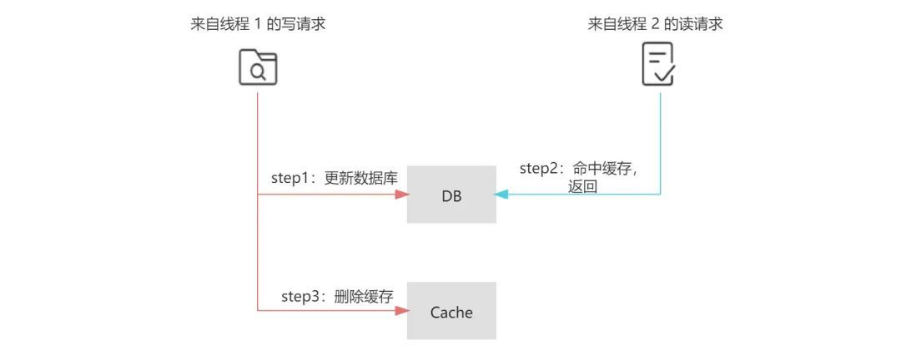   

另在，在 Write-Through 模式下，不管是先更新缓存还是先更新数据库，都存在更新缓存或者更新数据库失败的情况，上面提到的重试机制和补偿机制在这里也是奏效的。

### 2.5 Write-Behind
Write behind 意为异步回写模式，它也具有类似 Read-Through/Write-Through 的访问控制层，不同的是，Write behind 在处理写请求时，只更新缓存而不更新数据库，对于数据库的更新，则是通过批量异步更新的方式进行的，批量写入的时间点可以选在数据库负载较低的时间进行。
   

在 Write-Behind 模式下，写请求延迟较低，减轻了数据库的压力，具有较好的吞吐性。但数据库和缓存的一致性较弱，比如当更新的数据还未被写入数据库时，直接从数据库中查询数据是落后于缓存的。同时，缓存的负载较大，如果缓存宕机会导致数据丢失，所以需要做好缓存的高可用。显然，Write behind 模式下适合大量写操作的场景，常用于电商秒杀场景中库存的扣减。

### 2.6 Write-Around
<u>如果一些非核心业务，对一致性的要求较弱，可以选择在 cache aside 读模式下增加一个缓存过期时间，在写请求中仅仅更新数据库，不做任何删除或更新缓存的操作，这样，缓存仅能通过过期时间失效。这种方案实现简单，但缓存中的数据和数据库数据一致性较差，往往会造成用户的体验较差，应慎重选择。</u>

## 附录
[浅谈缓存最终一致性的解决方案](https://cloud.tencent.com/developer/article/1932934) 