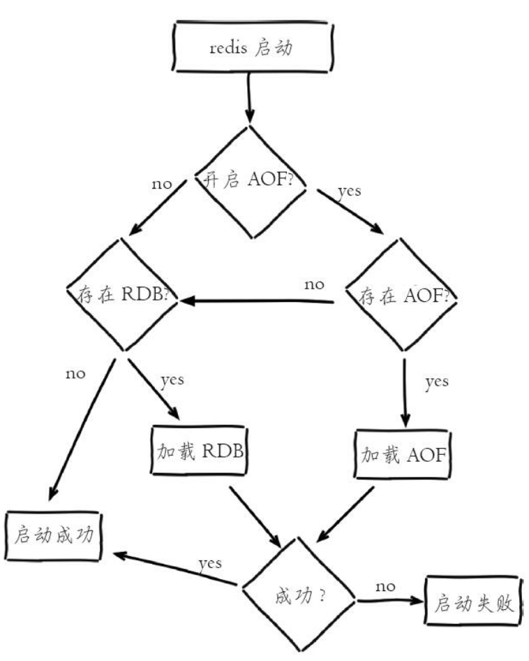
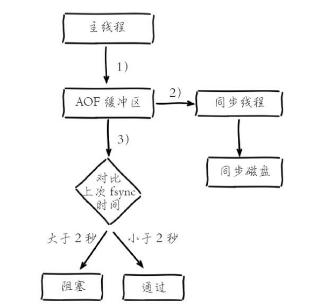

Redis支持RDB和AOF两种持久化机制，持久化功能有效地避免因进程退出造成的数据丢失问题，当下次重启时利用之前持久化的文件即可实现数据恢复。

## 1、RDB
RDB持久化是把当前进程数据**生成快照**保存到硬盘的过程，触发RDB持久化过程分为**手动触发和自动触发**。

### 1.1、手动触发
手动触发分别对应save和bgsave命令
save命令:阻塞当前Redis服务器，直到RDB过程完成为止，对于内存比较大的实例会造成长时间阻塞，线上环境不建议使用。
bgsave（background save）命令:Redis进程执行fork操作创建子进程，RDB持久化过程由子进程负责，完成后自动结束。**阻塞只发生在fork阶段，一般时间很短。**
显然bgsave命令是针对save阻塞问题做的优化。因此Redis内部所有的涉及RDB的操作都采用bgsave的方式，而save命令已经废弃。

### 1.2、自动触发
除了执行命令手动触发之外，Redis内部还存在自动触发RDB的持久化机制，例如以下场景:
1)使用save相关配置，如“save m n”。表示m秒内数据集存在n次修改时，自动触发bgsave。
2)如果从节点执行全量复制操作，主节点自动执行bgsave生成RDB文件并发送给从节点。
3)执行debug reload命令重新加载Redis时，也会自动触发save操作。
4)默认情况下执行shutdown命令时，如果没有开启AOF持久化功能则自动执行bgsave。

### 1.3、如何生成RDB文件
bgsave操作中，子进程创建RDB文件，**根据父进程内存生成临时快照文件，完成后对原有文件进行原子替换。**
Redis默认采用LZF算法对生成的RDB文件做压缩处理，压缩后的文件远远小于内存大小，默认开启，可以通过参数config set rdbcompression{yes|no}动态修改。

### 1.4、RDB的优缺点
* RDB的优点:  
1、RDB是一个紧凑压缩的二进制文件，代表Redis在某个时间点上的数据快照。**非常适用于备份，全量复制等场景**。比如每6小时执行bgsave备份，并把RDB文件拷贝到远程机器或者文件系统中(如hdfs)，用于灾难恢复。
2、Redis加载RDB恢复数据远远快于AOF的方式。
* RDB的缺点:  
1、RDB方式数据没办法做到实时持久化/秒级持久化。因为bgsave每次运行都要执行fork操作创建子进程，属于重量级操作，频繁执行成本过高。
2、RDB文件使用特定二进制格式保存，Redis版本演进过程中有多个格式的RDB版本，存在老版本Redis服务无法兼容新版RDB格式的问题。
针对RDB不适合实时持久化的问题，Redis提供了AOF持久化方式来解决。

## 2、AOF
AOF(append only file)持久化:  
**以独立日志的方式记录每次写命令，重启时再重新执行AOF文件中的命令达到恢复数据的目的。 AOF的主要作用是解决了数据持久化的实时性，目前已经是Redis持久化的主流方式。** 理解掌握好AOF持久化机制对我们兼顾数据安全性和性能非常有帮助。

### 2.1、AOF的使用方式
开启AOF功能需要设置配置:appendonly yes，默认不开启。AOF文件名通过appendfilename配置设置，默认文件名是appendonly.aof。保存路径同RDB持久化方式一致，通过dir配置指定。AOF的工作流程操作:  
1.命令写入 (append)  
2.文件同步(sync)  
3.文件重写(rewrite)  
4.重启加载 (load)  
流程如下:  
1)所有的写入命令会追加到aof_buf(缓冲区)中。  
2)AOF缓冲区根据**对应的策略**向硬盘做**同步**操作。  
3)随着AOF文件越来越大，需要定期对AOF文件进行重写，达到压缩的目的。  
4)当Redis服务器重启时，可以加载AOF文件进行数据恢复。   

#### 2.1.1、命令写入  
AOF命令写入的内容直接是文本协议格式。例如set hello world这条命令，在AOF缓冲区会追加如下文本:
```
*3\r\n$3\r\nset\r\n$5\r\nhello\r\n$5\r\nworld\r\n
```

AOF为什么把命令追加到aof_buf中?  
Redis使用单线程响应命令，如果每次写AOF文件命令都直接追加到硬盘，那么性能完全取决于当前硬盘负载。
先写入缓冲区aof_buf中，还有另一个好处，Redis可以提供多种缓冲区同步硬盘的策略，在性能和安全性方面做出平衡。

#### 2.1.2、文件同步
Redis提供了多种AOF缓冲区同步文件策略，**由参数appendfsync控制**，
不同值的含义下表所示。  

**always、everysec、no都是针对aof文件fsync磁盘所设置的。**  

**write操作会触发延迟写(delayed write)机制**。Linux在内核提供页缓冲区用来提高硬盘IO性能。write操作在写入系统缓冲区后直接返回。同步硬盘操作依赖于系统调度机制，例如:缓冲区页空间写满或达到特定时间周期。同步文件之前，如果此时系统故障宕机，缓冲区内数据将丢失。  

**fsync针对单个文件操作(比如AOF文件)，做强制硬盘同步，fsync将阻塞直到写入硬盘完成后返回，保证了数据持久化。**

* 配置为always  
  每次写入都要同步AOF文件，在一般的SATA硬盘上，Redis只能支持大约几百TPS写入，显然跟Redis高性能特性背道而驰，不建议配置。
* 配置为no  
  由于操作系统每次同步AOF文件的周期不可控，而且会加大每次同步硬盘的数据量，虽然提升了性能，但数据安全性无法保证。
* 配置为everysec  
  **<u>是建议的同步策略，也是默认配置，做到兼顾性能和数据安全性。理论上只有在系统突然宕机的情况下丢失1秒的数据。</u>**(严格来说最多丢失1秒数据是不准确的，5.3节会做具体介绍到。)

#### 2.1.3、重写机制
随着命令不断写入AOF，文件会越来越大，为了解决这个问题，Redis引入AOF重写机制压缩文件体积。AOF文件重写是把Redis进程内的数据转化为写命令同步到新AOF文件的过程。

重写后的AOF文件为什么可以变小?有如下原因:  
1)进程内已经超时的数据不再写入文件；  
2)旧的AOF文件含有无效命令，新的AOF文件只保留最终数据的写入命令；    
3)多条写命令可以合并为一个；  

* AOF重写过程可以手动触发和自动触发:    
手动触发:直接调用bgrewriteaof命令。  
自动触发:根据auto-aof-rewrite-min-size和auto-aof-rewrite-percentage参数确定自动触发时机。

#### 2.1.4、重启加载
AOF和RDB文件都可以用于服务器重启时的数据恢复。如下图所示， 表示Redis持久化文件加载流程。  

总结：优先加载AOF文件，没有开启或者没有AOF文件的情况下，加载RDB文件。

#### 2.1.5、文件校验
加载损坏的AOF、RDB文件时会拒绝启动  

对于错误格式的AOF文件，先进行备份，然后采用redis-check-aof--fix命令进行修复，修复后使用diff-u对比数据的差异，找出丢失的数据，有些可以人工修改补全。  

Redis提供的redis-check-dump工具检测RDB文件并获取对应的错误报告。

## 3、问题定位与优化   
Redis持久化功能一直是影响Redis性能的高发地，本节我们结合常见的持久化问题进行分析定位和优化。  
### 3.1、fork操作
fork耗时问题定位:对于高流量的Redis实例OPS可达5万以上，如果fork操作耗时在秒级别将拖慢Redis几万条命令执行，对线上应用延迟影响非常明显。正常情况下fork耗时应该是每GB消耗20毫秒左右。
如何改善fork操作的耗时:
1)优先使用物理机或者高效支持fork操作的虚拟化技术，避免使用Xen。 
2)控制Redis实例最大可用内存，fork耗时跟内存量成正比，线上建议每个Redis实例内存控制在10GB以内。 
3)合理配置Linux内存分配策略，避免物理内存不足导致fork失败，具体细节见12.1节“Linux配置优化“
4)降低fork操作的频率，如适度放宽AOF自动触发时机，避免不必要的全量复制等。

### 3.2、子进程开销监控和优化
子进程负责AOF或者RDB文件的重写，它的运行过程主要涉及CPU、内存、硬盘三部分的消耗。
#### 3.2.1、 CPU
* CPU开销分析    
子进程负责把进程内的数据分批写入文件，这个过程属于CPU密集操作，通常子进程对单核CPU利用率接近90%。  
* **CPU消耗优化**  
1、Redis是CPU密集型服务，不要做绑定单核CPU操作。由于子进程非常消耗CPU，会和父进程产生单核资源竞争。    
2、不要和其他CPU密集型服务部署在一起，造成CPU过度竞争。如果部署多个Redis实例，尽量保证同一时刻只有一个子进程执行重写工作，具体细节见5.4节多实例部署”。

#### 3.2.2、内存
* 内存消耗分析  
  子进程通过fork操作产生，占用内存大小等同于父进程，理论上需要两倍的内存来完成持久化操作，但Linux有写时复制机制 (copy-on-write)。父子进程会共享相同的物理内存页，当父进程处理写请求时会把要修改的页创建副本，而子进程在fork操作过程中共享整个父进程内存快照。

  RDB重写时，Redis日志输出容如下:
  ```  
  Background saving started by pid 7692
  DB saved on disk
  RDB: 5 MB of memory used by copy-on-write Background saving terminated with success
  ```
  如果重写过程中存在内存修改操作，父进程负责创建所修改内存页的副本，从日志中可以看出这部分内存消耗了5MB，可以等价认为RDB重写消耗了5MB的内存。
  
  AOF重写时，Redis日志输出容如下:
    ```
    Background append only file rewriting started by pid 8937 AOF rewrite child asks to stop sending diffs.
    Parent agreed to stop sending diffs. Finalizing AOF... Concatenating 0.00 MB of AOF diff received from parent. SYNC append only file rewrite performed
    AOF rewrite: 53 MB of memory used by copy-on-write
    Background AOF rewrite terminated with success
    Residual parent diff successfully flushed to the rewritten AOF (1.49 MB) Background AOF rewrite finished successfully
    ```
  父进程维护页副本消耗同RDB重写过程类似，不同之处在于AOF重写需要AOF重写缓冲区，因此根据以上日志可以预估内存消耗为: 53MB+1.49MB，也就是AOF重写时子进程消耗的内存量。

* **内存消耗优化**   
1)同CPU优化一样，如果部署多个Redis实例，尽量保证同一时刻只有一个子进程在工作。  
2)避免在大量写入时做子进程重写操作，这样将导致父进程维护大量 页副本，造成内存消耗。

#### 3.2.3、硬盘  
硬盘开销分析。子进程主要职责是把AOF或者RDB文件写入硬盘持久 化。势必造成硬盘写入压力。根据Redis重写AOF/RDB的数据量，结合系统 工具如sar、iostat、iotop等，可分析出重写期间硬盘负载情况。  
* 硬盘开销优化方法如下  
a)不要和其他高硬盘负载的服务部署在一起。如:存储服务、消息队列服务等。  
b)AOF重写时会消耗大量硬盘IO，可以开启配置 no-appendfsync-on-rewrite，默认关闭。表示在AOF重写期间不做fsync操作。  
c)当开启AOF功能的Redis用于高流量写入场景时，如果使用普通机械 磁盘，写入吞吐一般在100MB/s左右，这时Redis实例的瓶颈主要在AOF同步硬盘上。  
d)对于单机配置多个Redis实例的情况，可以配置不同实例分盘存储 AOF文件，分摊硬盘写入压力。  

### 3.3、AOF追加阻塞  
当开启AOF持久化时，常用的同步硬盘的策略是everysec，用于平衡性能和数据安全性。对于这种方式，Redis使用另一条线程每秒执行fsync同步硬盘。当系统硬盘资源繁忙时，会造成Redis主线程阻塞，如下图所示。  
  

通过对AOF阻塞流程可以发现两个问题:  
1)everysec配置最多可能丢失2秒数据，不是1秒。  
2)如果系统fsync缓慢，将会导致Redis主线程阻塞影响效率。  
化AOF追加阻塞问题主要是优化系统硬盘负载，优化方式见[4.2.3、硬盘]。  

## 4、多实例部署
Redis单线程架构导致无法充分利用CPU多核特性，通常的做法是在一台机器上部署多个Redis实例。当多个实例开启AOF重写后，彼此之间会产生对CPU和IO的竞争。本节主要介绍针对这种场景的分析和优化。  
上一节介绍了持久化相关的子进程开销。对于单机多Redis部署，如果同一时刻运行多个子进程，对当前系统影响将非常明显，因此需要采用一种措施，把子进程工作进行隔离。Redis在info Persistence中为我们提供了监控子进程运行状况的度量指标。
我们基于info Persistence中的指标，可以通过外部程序轮询控制AOF重写操作的执行  
大致流程说明:
```
1)外部程序定时轮询监控机器(machine)上所有Redis实例。
2)对于开启AOF的实例，查看(aof_current_size- aof_base_size)/aof_base_size确认增长率。
3)当增长率超过特定阈值(如100%)，执行bgrewriteaof命令手动触发当前实例的AOF重写。
4)运行期间循环检查aof_rewrite_in_progress和 aof_current_rewrite_time_sec指标，直到AOF重写结束。
5)确认实例AOF重写完成后，再检查其他实例并重复2)~4)步操作。从而保证机器内每个Redis实例AOF重写串行化执行。
```

## 5、本章重点回顾   
1)Redis提供了两种持久化方式:RDB和AOF。  
2)RDB使用一次性生成内存快照的方式，产生的文件紧凑压缩比更高，因此读取RDB恢复速度更快。由于每次生成RDB开销较大，无法做到实时持久化，一般用于数据冷备和复制传输。    
3)save命令会阻塞主线程不建议使用，bgsave命令通过fork操作创建子进程生成RDB避免阻塞。     
4)AOF通过追加写命令到文件实现持久化，通过appendfsync参数可以控制实时/秒级持久化。因为需要不断追加写命令，所以AOF文件体积逐渐变大，需要定期执行重写操作来降低文件体积。  
5)AOF重写可以通过auto-aof-rewrite-min-size和auto-aof-rewrite-percentage参数控制自动触发，也可以使用bgrewriteaof命令手动触发。  
6)子进程执行期间使用copy-on-write机制与父进程共享内存，避免内存消耗翻倍。AOF重写期间还需要维护重写缓冲区，保存新的写入命令避免数据丢失。    
7)持久化阻塞主线程场景有:fork阻塞和AOF追加阻塞。fork阻塞时间跟内存量和系统有关，AOF追加阻塞说明硬盘资源紧张。  
8)单机下部署多个实例时，为了防止出现多个子进程执行重写操作，建议做隔离控制，避免CPU和IO资源竞争。  