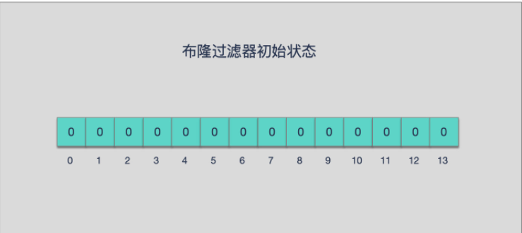

<!-- TOC -->

- [缓存设计](#缓存设计)
  - [缓存的收益和成本](#缓存的收益和成本)
  - [缓存更新策略](#缓存更新策略)
  - [缓存穿透优化](#缓存穿透优化)
    - [缓存空对象](#缓存空对象)
    - [布隆过滤器拦截](#布隆过滤器拦截)
    - [两种方案对比](#两种方案对比)
  - [无底洞优化](#无底洞优化)
    - [优化方法](#优化方法)
  - [雪崩优化](#雪崩优化)
    - [保证缓存层服务高可用性](#保证缓存层服务高可用性)
    - [依赖隔离组件为后端限流并降级](#依赖隔离组件为后端限流并降级)
    - [提前演练](#提前演练)
  - [热点key重建优化](#热点key重建优化)
    - [互斥锁（mutex key）](#互斥锁mutex-key)
    - [永远不过期](#永远不过期)
  - [重点回顾](#重点回顾)
  - [补充](#补充)
    - [布隆过滤器](#布隆过滤器)
      - [什么是 BloomFilter](#什么是-bloomfilter)
      - [布隆过滤器原理](#布隆过滤器原理)
      - [哈希函数](#哈希函数)
      - [布隆过滤器数据结构](#布隆过滤器数据结构)
      - [误判率](#误判率)
      - [特性](#特性)
      - [添加与查询元素步骤](#添加与查询元素步骤)
      - [优点](#优点)
      - [缺点](#缺点)
      - [布隆过滤器使用场景和实例](#布隆过滤器使用场景和实例)

<!-- /TOC -->

## 缓存设计
缓存能够有效地加速应用的读写速度，同时也可以降低后端负载，对日常应用的开发至关重要。但是将缓存加入应用架构后也会带来一些问题，包含如下内容：
1. 缓存的收益和成本分析。
2. 缓存更新策略的选择和使用场景。
3. 穿透问题优化。
4. 无底洞问题优化。
5. 雪崩问题优化。
6. 热点key重建优化。

### 缓存的收益和成本  

* 收益有：  
1. 加速读写  
2. 降低后端负载（帮助后端减少访问量和复杂计算）  

* 成本如下：
1. 数据不一致性  
2. 代码维护成本  
3. 运维成本：以Redis Cluster为例，加入后无形中增加了运维成本。  

### 缓存更新策略  
缓存中的数据通常都是有生命周期的，需要在指定时间后被删除或更新，这样可以保证缓存空间在一个可控的范围。

* 1. LRU/LFU/FIFO算法剔除（redis自带，配置相关配置项即可）    
* 2. 超时剔除（redisk设置key超时时间） 
* 3. 主动更新（App负责维护更新）  

|         策略         | 一致性 | 维护成本 |
| :------------------: | :----: | :------: |
| LRU/LFU/FIFO算法剔除 |  最差  |    底    |
|       超时剔除       |  较差  |   较低   |
|       主动更新       |   强   |    高    |

### 缓存穿透优化
缓存穿透是指查询一个根本不存在的数据，缓存层和存储层都不会命中，通常出于容错的考虑，如果从存储层查不到数据则不写入缓存层。   
所示整个过程分为如下3步：  
1）缓存层不命中。  
2）存储层不命中，不将空结果写回缓存。  
3）返回空结果。  

缓存穿透将导致不存在的数据每次请求都要到存储层去查询，失去了缓存保护后端存储的意义。  

缓存穿透问题可能会使后端存储负载加大，由于很多后端存储不具备高并发性，甚至可能造成后端存储宕掉。通常可以在程序中分别统计总调用
数、缓存层命中数、存储层命中数，如果发现大量存储层空命中，可能就是出现了缓存穿透问题。

造成缓存穿透的基本原因有两个。  
1. 自身业务代码或者数据出现问题
2. 一些恶意攻击、爬虫等造成大量空命中。

下面我们来看一下如何解决缓存穿透问题。

#### 缓存空对象
当第2步存储层不命中后，仍然将空对象保留到缓存层中，之后再访问这个数据将会从缓存中获取，这样就保护了后端数据源。    

缓存空对象会有两个问题：  
第一，空值做了缓存，意味着缓存层中存了更多的键，需要更多的内存空间（如果是攻击，问题更严重），比较有效的方法是针对这类数据设置一个较短的过期时间，让其自动剔除。  
第二，缓存层和存储层的数据会有一段时间窗口的不一致，可能会对业务有一定影响。    
例如过期时间设置为5分钟，如果此时存储层添加了这个数据，那此段时间就会出现缓存层和存储层数据的不一致，此时可以利用消息系统或者其他方式清除掉缓存层中的空对象。  

#### 布隆过滤器拦截
在访问缓存层和存储层之前，将存在的key用布隆过滤器提前保存起来，做第一层拦截。例如：一个推荐系统有4亿个用户id，每个小时算法工程师会根据每个用户之前历史行为计算出推荐数据放到存储层中，但是最新的用户由于没有历史行为，就会发生缓存穿透的行为，为此可以将所有推荐数据的用户做成布隆过滤器。如果布隆过滤器认为该用户id不存在，那么就不会访问存储层，在一定程度保护了存储层。  

#### 两种方案对比
存空对象和布隆过滤器方案对比
|  解决缓存穿透  |              适用场景               |                  维护成本                  |
| :------------: | :---------------------------------: | :----------------------------------------: |
|   缓存空对象   | 数据命中不高； 数据频繁变化实时性高 | 代码维护简单；需要过多缓存空间；数据不一致 |
| 布隆过滤器拦截 | 数据命中不高； 数据相对固定实时性低 |       代码维护复杂；缓存空间占用少；       |

### 无底洞优化  
2010年，Facebook的Memcache节点已经达到了3000个，承载着TB级别的缓存数据。但开发和运维人员发现了一个问题，为了满足业务要求添加了大量新Memcache节点，但是发现性能不但没有好转反而下降了，当时将这种现象称为缓存的“无底洞”现象。  

那么为什么会产生这种现象呢，通常来说添加节点使得Memcache集群性能应该更强了，但事实并非如此。键值数据库由于通常采用哈希函数将key映射到各个节点上，造成key的分布与业务无关，但是<u>由于数据量和访问量的持续增长，造成需要添加大量节点做水平扩容，导致键值分布到更多的节点上，所以无论是Memcache还是Redis的分布式，批量操作通常需要从不同节点上获取，相比于单机批量操作只涉及一次网络操作，分布式批量操作会涉及多次网络时间。</u>

####  优化方法  
* 串行命令  
由于n个key是比较均匀地分布在Redis Cluster的各个节点上，因此无法使用mget命令一次性获取，所以通常来讲要获取n个key的值，最简单的方法就是逐次执行n个get命令，这种操作时间复杂度较高，它的操作时间=n次网络时间+n次命令时间，网络次数是n。很显然这种方案不是最优的，但是实现起来比较简单。

* 串行IO  
Redis Cluster使用CRC16算法计算出散列值，再取对16383的余数就可以算出slot值，同时我们提到过Smart客户端会保存slot和节点的对应关系，有了这两个数据就可以将属于同一个节点的key进行归档，得到每个节点的key子列表，之后对每个节点执行mget或者Pipeline操作，它的操作时间=node次网络时间+n次命令时间，网络次数是node的个数，很明显这种方案比第一种要好很多，但是如果节点数太多，还是有一定的性能问题。

* 并行IO  
此方案是将方案2中的最后一步改为多线程执行，网络次数虽然还是节点个数，但由于使用多线程网络时间变为O（1），这种方案会增加编程的复杂度。

* hash_tag实现  
Redis Cluster提供hash_tag功能，它可以将多个key强制分配到一个节点上，它的操作时间=1次网络时间+n次命令时间。该方案的缺点是容易出现数据倾斜。   

### 雪崩优化
由于缓存层承载着大量请求，有效地保护了存储层，但是如果缓存层由于某些原因不能提供服务，于是所有的请
求都会达到存储层，存储层的调用量会暴增，造成存储层也会级联宕机的情况。缓存雪崩的英文原意是stampeding herd（奔逃的野牛），指的是缓存层宕掉后，流量会像奔逃的野牛一样，打向后端存储。

预防和解决缓存雪崩问题，可以从以下三个方面进行着手。  

#### 保证缓存层服务高可用性  
和飞机都有多个引擎一样，如果缓存层设计成高可用的，即使个别节点、个别机器、甚至是机房宕掉，依然可以提
供服务，例如Redis Sentinel和Redis Cluster都实现了高可用。

#### 依赖隔离组件为后端限流并降级  
无论是缓存层还是存储层都会有出错的概率，可以将它们视同为资源。作为并发量较大的系统，假如有一个资源不可用，可能会造成线程全部阻塞（hang）在这个资源上，造成整个系统不可用。降级机制在高并发系统中是非常普遍的：比如推荐服务中，如果个性化推荐服务不可用，可以降级补充热点数据，不至于造成前端页面是开天窗。在实际项目中，我们需要对重要的资源（例如Redis、MySQL、HBase、外部接口）都进行隔离，让每种资源都单独运行在自己的线程池中，即使个别资源出现了问题，对其他服务没有影响。但是线程池如何管理，比如如何关闭资源池、开启资源池、资源池阀值管理，这些做起来还是相当复杂的。

#### 提前演练  
在项目上线前，演练缓存层宕掉后，应用以及后端的负载情况以及可能出现的问题，在此基础上做一些预案设定。

### 热点key重建优化
开发人员使用“缓存+过期时间”的策略既可以加速数据读写，又保证数据的定期更新，这种模式基本能够满足绝大部分需求。但是有两个问题如果同时出现，可能就会对应用造成致命的危害：  
1. 当前key是一个热点key（例如一个热门的娱乐新闻），并发量非常大。  
2. 重建缓存不能在短时间完成，可能是一个复杂计算，例如复杂的SQL、多次IO、多个依赖等。  
在缓存失效的瞬间，有大量线程来重建缓存，造成后端负载加大，甚至可能会让应用崩溃。   

要解决这个问题也不是很复杂，但是不能为了解决这个问题给系统带来更多的麻烦，所以需要制定如下目标：  
1. 减少重建缓存的次数。  
2. 数据尽可能一致。  
3. 较少的潜在危险。  

#### 互斥锁（mutex key）  
此方法只允许一个线程重建缓存，其他线程等待重建缓存的线程执行完，重新从缓存获取数据即可。  

#### 永远不过期  
“永远不过期”包含两层意思：    
1. 从缓存层面来看，确实没有设置过期时间，所以不会出现热点key过期后产生的问题，也就是“物理”不过期。  
2. 从功能层面来看，为每个value设置一个逻辑过期时间，当发现超过逻辑过期时间后，会使用单独的线程去构建缓存。  

### 重点回顾
1. 缓存的使用带来的收益是能够加速读写，降低后端存储负载。   
2. 比较推荐的缓存更新策略是结合剔除、超时、主动更新三种方案共同完成。  
3. 穿透问题：使用缓存空对象和布隆过滤器来解决，注意它们各自的使用场景和局限性。  
4. 无底洞问题：分布式缓存中，有更多的机器不保证有更高的性能。有四种批量操作方式：串行命令、串行IO、并行IO、hash_tag。    
5. 雪崩问题：缓存层高可用、客户端降级、提前演练是解决雪崩问题的重要方法。    
6. 热点key问题：互斥锁、“永远不过期”能够在一定程度上解决热点key问题，开发人员在使用时要了解它们各自的使用成本。  

### 补充
#### 布隆过滤器   
##### 什么是 BloomFilter  
布隆过滤器（英语：Bloom Filter）是 1970 年由布隆提出的。它实际上是一个很长的二进制向量和一系列随机映射函数。主要用于判断一个元素是否在一个集合中。

通常我们会遇到很多要判断一个元素是否在某个集合中的业务场景，一般想到的是将集合中所有元素保存起来，然后通过比较确定。链表、树、散列表（又叫哈希表，Hash table）等等数据结构都是这种思路。但是随着集合中元素的增加，我们需要的存储空间也会呈现线性增长，最终达到瓶颈。同时检索速度也越来越慢，上述三种结构的检索时间复杂度分别为$O(n)$，$O(logn)$，$O(1)$。  

这个时候，布隆过滤器（Bloom Filter）就应运而生。

##### 布隆过滤器原理  
了解布隆过滤器原理之前，先回顾下 Hash 函数原理。

##### 哈希函数  
哈希函数的概念是：将任意大小的输入数据转换成特定大小的输出数据的函数，转换后的数据称为哈希值或哈希编码，也叫散列值。

所有散列函数都有如下基本特性：   
1. 如果两个散列值是不相同的（根据同一函数），那么这两个散列值的原始输入也是不相同的。这个特性是散列函数具有确定性的结果，具有这种性质的散列函数称为单向散列函数。   
2. 散列函数的输入和输出不是唯一对应关系的，如果两个散列值相同，两个输入值很可能是相同的，但也可能不同，这种情况称为“散列碰撞（collision）”。  
  
但是用 hash表存储大数据量时，空间效率还是很低，当只有一个 hash 函数时，还很容易发生哈希碰撞。   

##### 布隆过滤器数据结构   
BloomFilter 是由一个固定大小的二进制向量或者位图（bitmap）和一系列映射函数组成的。  
在初始状态时，对于长度为 m 的位数组，它的所有位都被置为0，如下图所示：  

当有变量被加入集合时，通过 K 个映射函数将这个变量映射成位图中的 K 个点，把它们置为 1（假定有两个变量都通过 3 个映射函数）。  

查询某个变量的时候我们只要看看这些点是不是都是 1 就可以大概率知道集合中有没有它了

  * 如果这些点有任何一个 0，则被查询变量一定不在；  
  * 如果都是 1，则被查询变量很可能存在  
  
为什么说是可能存在，而不是一定存在呢？那是因为映射函数本身就是散列函数，散列函数是会有碰撞的。

##### 误判率
布隆过滤器的误判是指多个输入经过哈希之后在相同的bit位置1了，这样就无法判断究竟是哪个输入产生的，因此误判的根源在于相同的 bit 位被多次映射且置 1。  

这种情况也造成了布隆过滤器的删除问题，因为布隆过滤器的每一个 bit 并不是独占的，很有可能多个元素共享了某一位。如果我们直接删除这一位的话，会影响其他的元素。(比如上图中的第 3 位)  

##### 特性
* <u>一个元素如果判断结果为存在的时候元素不一定存在，但是判断结果为不存在的时候则一定不存在。</u>
* <u>布隆过滤器可以添加元素，但是不能删除元素。因为删掉元素会导致误判率增加。</u>

##### 添加与查询元素步骤
* 添加元素  
  将要添加的元素给 k 个哈希函数
  得到对应于位数组上的 k 个位置
  将这k个位置设为 1

* 查询元素
  将要查询的元素给k个哈希函数
  得到对应于位数组上的k个位置
  如果k个位置有一个为 0，则肯定不在集合中
  如果k个位置全部为 1，则可能在集合中

##### 优点  
相比于其它的数据结构，布隆过滤器在空间和时间方面都有巨大的优势。布隆过滤器存储空间和插入/查询时间都是常数 $O(K)$，另外，散列函数相互之间没有关系，方便由硬件并行实现。布隆过滤器不需要存储元素本身，在某些对保密要求非常严格的场合有优势。

布隆过滤器可以表示全集，其它任何数据结构都不能；

##### 缺点  
但是布隆过滤器的缺点和优点一样明显。误算率是其中之一。随着存入的元素数量增加，误算率随之增加。但是如果元素数量太少，则使用散列表足矣。

另外，一般情况下不能从布隆过滤器中删除元素。我们很容易想到把位数组变成整数数组，每插入一个元素相应的计数器加 1, 这样删除元素时将计数器减掉就可以了。然而要保证安全地删除元素并非如此简单。首先我们必须保证删除的元素的确在布隆过滤器里面。这一点单凭这个过滤器是无法保证的。另外计数器回绕也会造成问题。

在降低误算率方面，有不少工作，使得出现了很多布隆过滤器的变种。

##### 布隆过滤器使用场景和实例  
<u>在程序的世界中，布隆过滤器是程序员的一把利器，利用它可以快速地解决项目中一些比较棘手的问题。  
如网页 URL 去重、垃圾邮件识别、大集合中重复元素的判断和缓存穿透等问题。

布隆过滤器的典型应用有：

* 数据库防止穿库。 Google Bigtable，HBase 和 Cassandra 以及 Postgresql 使用BloomFilter来减少不存在的行或列的磁盘查找。避免代价高昂的磁盘查找会大大提高数据库查询操作的性能。    
* 业务场景中判断用户是否阅读过某视频或文章，比如抖音或头条，当然会导致一定的误判，但不会让用户看到重复的内容。  
* 缓存宕机、缓存击穿场景，一般判断用户是否在缓存中，如果在则直接返回结果，不在则查询db，如果来一波冷数据，会导致缓存大量击穿，造成雪崩效应，这时候可以用布隆过滤器当缓存的索引，只有在布隆过滤器中，才去查询缓存，如果没查询到，则穿透到db。如果不在布隆器中，则直接返回。  
* WEB拦截器，如果相同请求则拦截，防止重复被攻击。用户第一次请求，将请求参数放入布隆过滤器中，当第二次请求时，先判断请求参数是否被布隆过滤器命中。可以提高缓存命中率。Squid 网页代理缓存服务器在 cache digests 中就使用了布隆过滤器。Google Chrome浏览器使用了布隆过滤器加速安全浏览服务  
* Venti 文档存储系统也采用布隆过滤器来检测先前存储的数据。  
* SPIN 模型检测器也使用布隆过滤器在大规模验证问题时跟踪可达状态空间。</u>  

[布隆过滤器，这一篇给你讲的明明白白](https://developer.aliyun.com/article/773205)