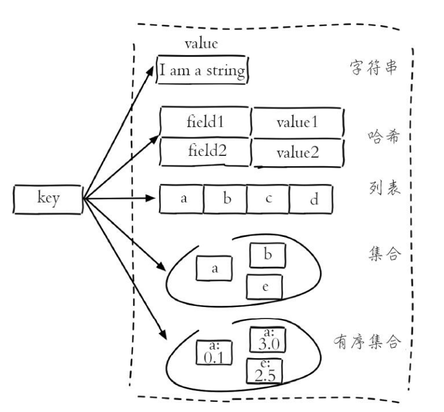
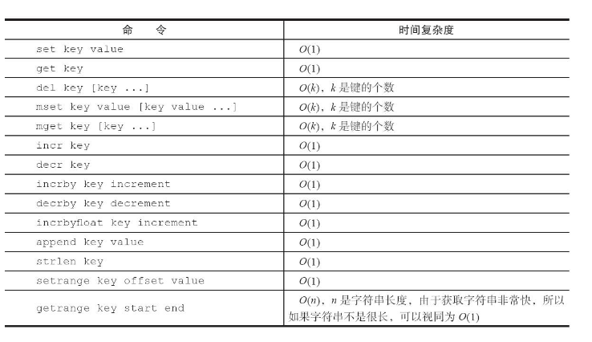
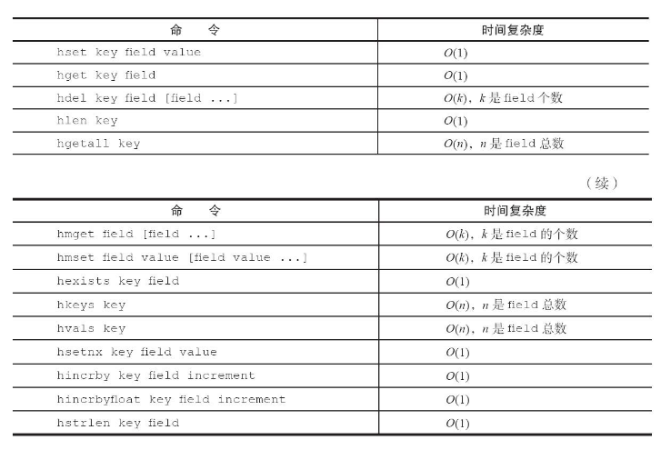
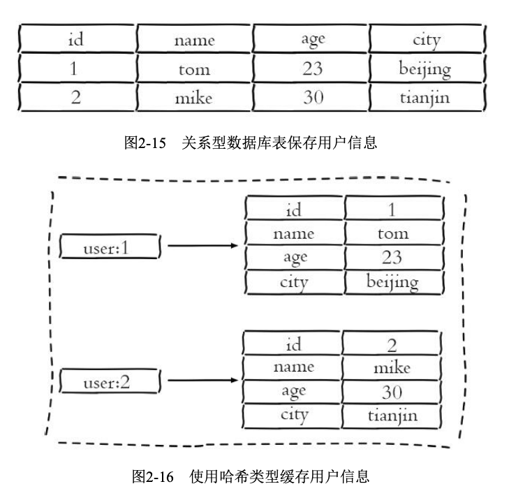
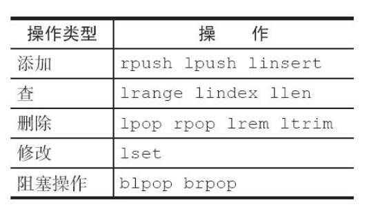
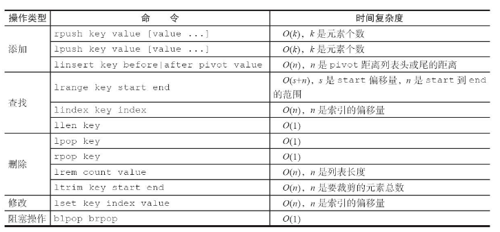
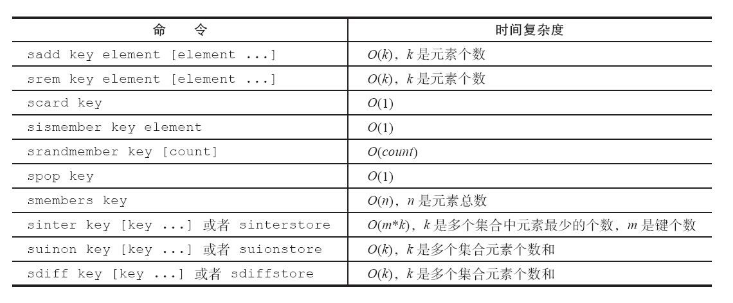
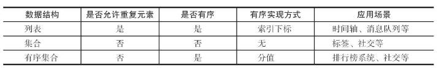
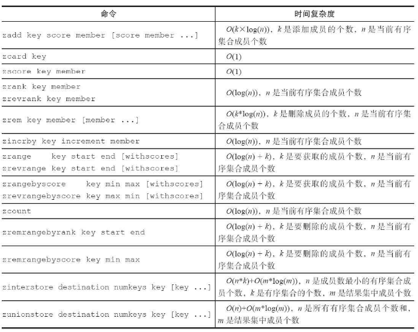

<!-- TOC -->

- [1、预备](#1预备)
  - [1.1、全局命令](#11全局命令)
  - [1.2、数据结构和内部编码](#12数据结构和内部编码)
  - [1.3、单线程架构](#13单线程架构)
- [2、字符串](#2字符串)
  - [2.1、命令](#21命令)
  - [2.2、内部编码](#22内部编码)
  - [2.3、典型使用场景](#23典型使用场景)
    - [2.3.1.缓存功能](#231缓存功能)
    - [2.3.2.计数](#232计数)
    - [2.3.3.共享Session](#233共享session)
    - [2.3.4.限速](#234限速)
  - [2.4、其他](#24其他)
- [3、哈希](#3哈希)
  - [3.1 命令](#31-命令)
  - [3.2 内部编码](#32-内部编码)
    - [3.2.1 ziplist(压缩列表)](#321-ziplist压缩列表)
    - [3.2.2 hashtable(哈希表)](#322-hashtable哈希表)
  - [3.3 使用场景](#33-使用场景)
    - [3.3.1、缓存用户信息](#331缓存用户信息)
- [4、列表](#4列表)
  - [4.1 命令](#41-命令)
  - [4.2 内部编码](#42-内部编码)
    - [4.2.1、ziplist(压缩列表)](#421ziplist压缩列表)
    - [4.2.2、linkedlist(链表)](#422linkedlist链表)
    - [4.2.3、quicklist(快表)](#423quicklist快表)
  - [4.3、使用场景](#43使用场景)
    - [4.3.1.消息队列](#431消息队列)
    - [4.3.2.文章列表](#432文章列表)
    - [4.3.3.其他很多场景](#433其他很多场景)
- [5、集合](#5集合)
  - [5.1 命令](#51-命令)
  - [5.2 内部编码](#52-内部编码)
    - [5.2.1、intset(整数集合)](#521intset整数集合)
    - [5.2.2、hashtable(哈希表)](#522hashtable哈希表)
  - [5.3、使用场景](#53使用场景)
    - [5.3.1、标签(tag)](#531标签tag)
    - [5.3.2、其他](#532其他)
- [6、有序集合](#6有序集合)
  - [6.1 命令](#61-命令)
  - [6.2 内部编码](#62-内部编码)
    - [6.2.1、ziplist(压缩列表)](#621ziplist压缩列表)
    - [6.2.2、skiplist(跳跃表)](#622skiplist跳跃表)
  - [6.3 使用场景](#63-使用场景)
- [7、本章重点回顾](#7本章重点回顾)

<!-- /TOC -->
## 1、预备
### 1.1、全局命令  
Redis有5种数据结构，它们是键值对中的值，对于键来说有一些通用的命令。
```
keys *  // 查看所有键,o(n)，遍历所有键
dbsize  // 键总数,o(1),直接获取Redis内置的 键总数变量
exists key         //检查键是否存在
del key [key ...]  //删除键
expire key seconds //设置键过期时间
ttl key            //返回键的剩余过期时间
type key           //键的数据结构类型
object encoding key//查看key的内部编码类型
scan/hscan/sscan/zscan cursor [match pattern] [count number]  //部分扫描
```

* 数据库管理方面的键
```
select dbIndex //切换数据库(Redis默认配置中是有16个数据库)
flushdb/flushall //flushdb只清除当前数据库，flushall会清除所有数据库
```

### 1.2、数据结构和内部编码  
type命令实际返回的就是当前键的数据结构类型，它们分别是: string(字符串)、hash(哈希)、list(列表)、set(集合)、zset(有序集 合)，但这些只是Redis对外的数据结构，如图2-1所示。    


实际上每种数据结构都有自己底层的内部编码实现，而且是多种实现，这样Redis会在合适的场景选择合适的内部编码，如图2-2所示。
可以看到每种数据结构都有两种以上的内部编码实现，例如list数据结构包含了linkedlist和ziplist两种内部编码。同时有些内部编码，例如ziplist，可以作为多种外部数据结构的内部实现，可以通过object encoding命令查询内部编码:
```
127.0.0.1:6379> object encoding hello "embstr"
127.0.0.1:6379> object encoding mylist "ziplist"
```


Redis这样设计有两个好处:  
第一，可以改进内部编码，而对外的数据结构和命令没有影响，这样一旦开发出更优秀的内部编码，无需改动外部数据结构和命令，例如Redis3.2提供了quicklist，结合了ziplist和linkedlist两者的优势，为列表类型提供了一种更为优秀的内部编码实现，而对外部用户来说基本感知不到。  
第二，多种内部编码实现可以在不同场景下发挥各自的优势，例如ziplist比较节省内存，但是在列表元素比较多的情况下，性能会有所下降，这时候Redis会根据配置选项将列表类型的内部实现转换为linkedlist。

### 1.3、单线程架构  
Redis使用了单线程架构和I/O多路复用模型来实现高性能的内存数据库服务。  
* 为什么单线程还能这么快？  
  第一，纯内存访问，Redis将所有数据放在内存中，内存的响应时长大 约为100纳秒，这是Redis达到每秒万级别访问的重要基础。  
  第二，非阻塞I/O，Redis使用epoll作为I/O多路复用技术的实现，再加上Redis自身的事件处理模型将epoll中的连接、读写、关闭都转换为事件，不在网络I/O上浪费过多的时间。    
  第三，单线程避免了线程切换和竞态产生的消耗。对于服务端开发来说，锁和线程切换通常是性能杀手。  

* 单线程的隐患    
  单线程会有一个问题:对于每个命令的执行时间是有要求的。如果某个命令执行过长，会造成其他命令的阻塞，对于Redis这种高性能的服务来说是致命的，所以Redis是面向快速执行场景的数据库。

## 2、字符串
### 2.1、命令
字符串类型是Redis最基础的数据结构。首先键都是字符串类型，而且其他几种数据结构都是在字符串类型基础上构建的，所以字符串类型能为其他四种数据结构的学习奠定基础。  
字符串类型的值实际可以是字符串(简单的字符串、复杂的字符串(例如JSON、XML))、数字 (整数、浮点数)，甚至是二进制(图片、音频、视频)，但是 **<u>值最大不能超过512MB</u>** 。
* 相关常用命令
  ```
  set key value [ex seconds] [px milliseconds] [nx|xx] //设置值
  get key //获取值
  mset key value [key value ...] //批量设置值
  mget key [key ...] //批量获取值
  incr/decr/incrby/decrby key //计数
  ```

* 相关不常用命令
  ```
  append key value //追加值
  strlen key //字符串长度
  getset key value //设置并返回原值
  setrange key offeset value //设置指定位置的字符
  getrange key start end //获取部分字符串
  ```


### 2.2、内部编码
字符串类型的内部编码有3种:  
```
int:8个字节的长整型。   
embstr:小于等于39个字节的字符串。   
raw:大于39个字节的字符串。
```

### 2.3、典型使用场景
#### 2.3.1.缓存功能
#### 2.3.2.计数
#### 2.3.3.共享Session  
分布式Web服务将用户的Session信息存入redis，避免刷新后重新登录。  

#### 2.3.4.限速  
网站限制一个IP地址不能在一秒钟之内访问超过n次、短信1min内不能重复发送n次。

### 2.4、其他
Redis没有命令空间，而且也没有 对键名有强制要求(除了不能使用一些特殊字符)。但设计合理的键名，有利于防止键冲突和项目的可维护性，比较推荐的方式是使用“业务名:对象 名:id:[属性]”作为键名(也可以不是分号)。例如MySQL的数据库名为 vs，用户表名为user，那么对应的键可以用"vs:user:1"，"vs:user:1: name"来表示

## 3、哈希
哈希类型中的映射关系叫作field-value，注意这里的value是指field对应的值，不是键对应的值，请注意value在不同上下文的作用。    

### 3.1 命令  


### 3.2 内部编码
#### 3.2.1 ziplist(压缩列表)  
当哈希类型元素个数小于hash-max-ziplist-entries配置(默认512个)、同时所有值都小于hash-max-ziplist-value配置(默认64字节)时，Redis会使用ziplist作为哈希的内部实现，ziplist使用更加紧凑的结构实现多个元素的连续存储，所以在节省内存方面比hashtable更加优秀。

#### 3.2.2 hashtable(哈希表)  
当哈希类型无法满足ziplist的条件时，Redis会使用hashtable作为哈希的内部实现，因为此时ziplist的读写效率会下降，而hashtable的读写时间复杂度为O(1)。

### 3.3 使用场景  
#### 3.3.1、缓存用户信息  
  

* 注意  
  哈希类型是稀疏的，而关系型数据库是完全结构化的，例如哈希类型 每个键可以有不同的field，而关系型数据库一旦添加新的列，所有行都要为其设置值(即使为NULL)，如图2-17所示。    
  关系型数据库可以做复杂的关系查询，而Redis去模拟关系型复杂查询开发困难，维护成本高。

## 4、列表
列表(list)类型是用来存储多个有序的字符串，如a、 b、c、d、e五个元素从左到右组成了一个有序的列表，列表中的每个字符串称为元素(element)，一个列表最多可以存储2^32-1个元素。  
* 列表类型有两个特点   
第一、列表中的元素是有序的，这就意味着可以通过索引下标获取某个元素或者某个范围内的元素列表;  
第二、列表中的元素可以是重复的。  

### 4.1 命令 
   

```
rpush key value [value ...] //从右边插入元素
lpush key value [value ...] //从左边插入元素
linsert key before|after pivot value //向某个元素前或者后插入元素

lrange key start end //获取指定范围内的元素列表
lindex key index //获取列表指定索引下标的元素
llen key //获取列表长度

lpop/rpop key //从列表左/右侧弹出元素
lrem key count value //删除指定元素
ltrim key start end //按照索引范围修剪列表
lset key index newValue //修改指定索引下标的元素

blpop key [key ...] timeout   //阻塞式弹出
brpop key [key ...] timeout
```
   

### 4.2 内部编码  
列表类型的内部编码有两种。
#### 4.2.1、ziplist(压缩列表)  
当列表的元素个数小于list-max-ziplist-entries配置 (默认512个)，同时列表中每个元素的值都小于list-max-ziplist-value配置时(默认64字节)，Redis会选用ziplist来作为列表的内部实现来减少内存的使用。
#### 4.2.2、linkedlist(链表)  
当列表类型无法满足ziplist的条件时，Redis会使用linkedlist作为列表的内部实现。
#### 4.2.3、quicklist(快表)    
Redis3.2版本提供了quicklist内部编码，简单地说它是以一个ziplist为节点的linkedlist，它结合了ziplist和linkedlist两者的优势，为列表类型提供了一种更为优秀的内部编码实现，它的设计原理可以参考Redis的另一个作者Matt Stancliff的博客:https://matt.sh/redis-quicklist。

### 4.3、使用场景  
#### 4.3.1.消息队列
如图2-21所示，Redis的lpush+brpop命令组合即可实现阻塞队列，生产者客户端使用lrpush从列表左侧插入元素，多个消费者客户端使用brpop命令阻塞式的“抢”列表尾部的元素，多个客户端保证了消费的负载均衡和高可用性。    
#### 4.3.2.文章列表 
每个用户有属于自己的文章列表，现需要分页展示文章列表。此时可以考虑使用列表，因为列表不但是有序的，同时支持按照索引范围获取元素。
#### 4.3.3.其他很多场景  
实际上列表的使用场景很多，在选择时可以参考以下口诀:
·lpush+lpop=Stack(栈)  
·lpush+rpop=Queue(队列) 
·lpsh+ltrim=Capped Collection(有限集合) 
·lpush+brpop=Message Queue(消息队列)

## 5、集合
集合(set)类型也是用来保存多个的字符串元素，但和列表类型不一样的是，集合中不允许有重复元素，并且集合中的元素是无序的，不能通过索引下标获取元素,一个集合最多可以存储2^32-1个元素。Redis除了支持集合内的增删改查，同时还支持多个集合取交集、并 集、差集。

### 5.1 命令 
   

### 5.2 内部编码  
#### 5.2.1、intset(整数集合)  
当集合中的元素都是整数且元素个数小于set-max-intset-entries配置(默认512个)时，Redis会选用intset来作为集合的内部实现，从而减少内存的使用。  

#### 5.2.2、hashtable(哈希表)  
当集合类型无法满足intset的条件时，Redis会使用hashtable作为集合的内部实现。

### 5.3、使用场景  
#### 5.3.1、标签(tag)  
集合类型比较典型的使用场景是标签(tag)。例如一个用户可能对娱乐、体育比较感兴趣，另一个用户可能对历史、新闻比较感兴趣，这些兴趣点就是标签。有了这些数据就可以得到喜欢同一个标签的人，以及用户的共同喜好的标签，这些数据对于用户体验以及增强用户黏度比较重要。例如一个电子商务的网站会对不同标签的用户做不同类型的推荐，比如对数码产品比较感兴趣的人，在各个页面或者通过邮件的形式给他们推荐最新的数码产品，通常会为网站带来更多的利益。

#### 5.3.2、其他  
前面只是给出了使用Redis集合类型实现标签的基本思路，实际上一个标签系统远比这个要复杂得多，不过集合类型的应用场景通常为以下几种:
·sadd=Tagging(标签)
·spop/srandmember=Random item(生成随机数，比如抽奖)
·sadd+sinter=Social Graph(社交需求)

## 6、有序集合
有序集合相对于哈希、列表、集合来说会有一点点陌生，但既然叫有序集合，那么它和集合必然有着联系，它保留了集合不能有重复成员的特性，但不同的是，有序集合中的元素可以排序。但是它和列表使用索引下标作为排序依据不同的是，它给每个元素设置一个分数(score)作为排序的依据。有序集合提供了获取指定 分数和元素范围查询、计算成员排名等功能，合理的利用有序集合，能帮助我们在实际开发中解决很多问题。
有序集合中的元素不能重复，但是score可以重复，就和一个班里的同学学号不能重复，但是考试成绩可以相同。  
表2-7给出了列表、集合、有序集合三者的异同点。
   

### 6.1 命令  
   

### 6.2 内部编码
#### 6.2.1、ziplist(压缩列表)  
当有序集合的元素个数小于zset-max-ziplist-entries配置(默认128个)，同时每个元素的值都小于zset-max-ziplist-value配置(默认64字节)时，Redis会用ziplist来作为有序集合的内部实现，ziplist可以有效减少内存的使用。  

#### 6.2.2、skiplist(跳跃表)  
当ziplist条件不满足时，有序集合会使用skiplist作为内部实现，因为此时ziplist的读写效率会下降。  

### 6.3 使用场景
有序集合比较典型的使用场景就是排行榜系统。例如视频网站需要对用户上传的视频做排行榜，榜单的维度可能是多个方面的:按照时间、按照播放数量、按照获得的赞数。本节使用赞数这个维度，记录每天用户上传视频的排行榜。  

## 7、本章重点回顾
1)Redis提供5种数据结构，每种数据结构都有多种内部编码实现。  
2)纯内存存储、IO多路复用技术、单线程架构是造就Redis高性能的三个因素。  
3)由于Redis的单线程架构，所以需要每个命令能被快速执行完，否则会存在阻塞Redis的可能，理解Redis单线程命令处理机制是开发和运维Redis的核心之一。  
4)批量操作(例如mget、mset、hmset等)能够有效提高命令执行的效率，但要注意每次批量操作的个数和字节数。  
5)了解每个命令的时间复杂度在开发中至关重要，例如在使用keys、hgetall、smembers、zrange等时间复杂度较高的命令时，需要考虑数据规模对于Redis的影响。  
6)persist命令可以删除任意类型键的过期时间，但是set命令也会删除字符串类型键的过期时间，这在开发时容易被忽视。  
7)move、dump+restore、migrate是Redis发展过程中三种迁移键的方式，其中move命令基本废弃，migrate命令用原子性的方式实现了dump+restore，并且支持批量操作，是Redis Cluster实现水平扩容的重要工具。   
8)scan命令可以解决keys命令可能带来的阻塞问题，同时Redis还提供了hscan、sscan、zscan渐进式地遍历hash、set、zset。