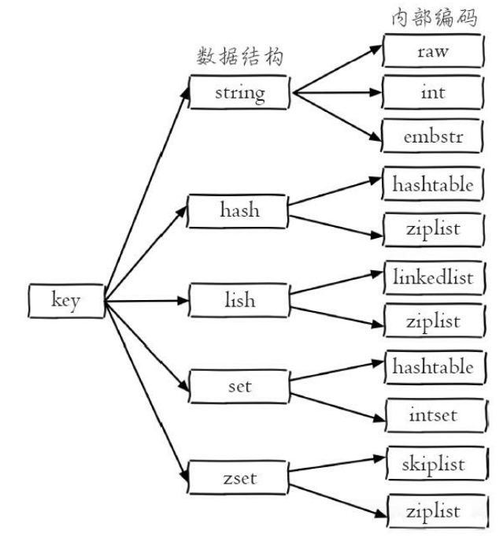
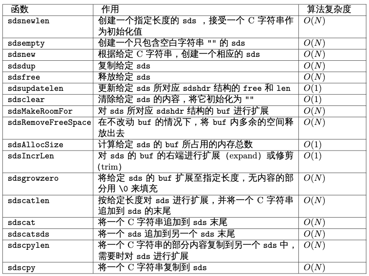
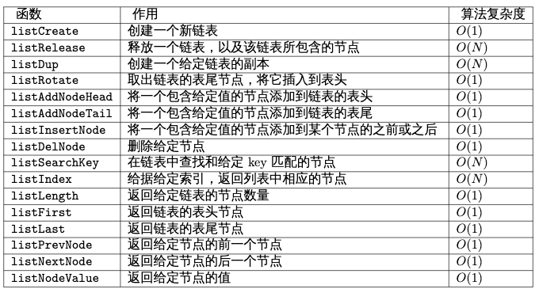
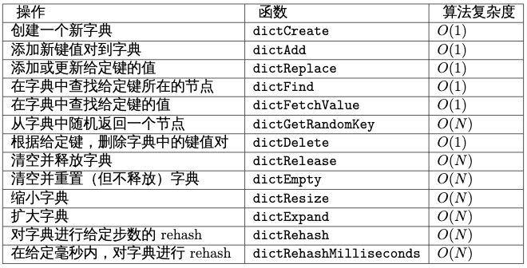
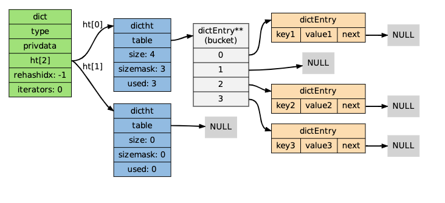
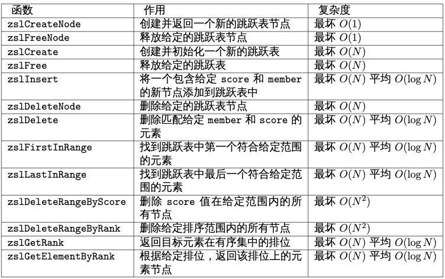
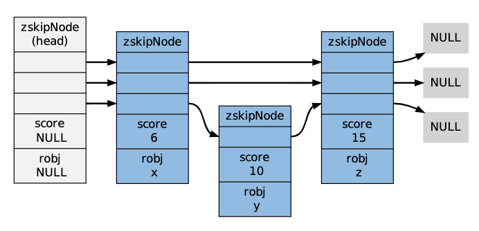
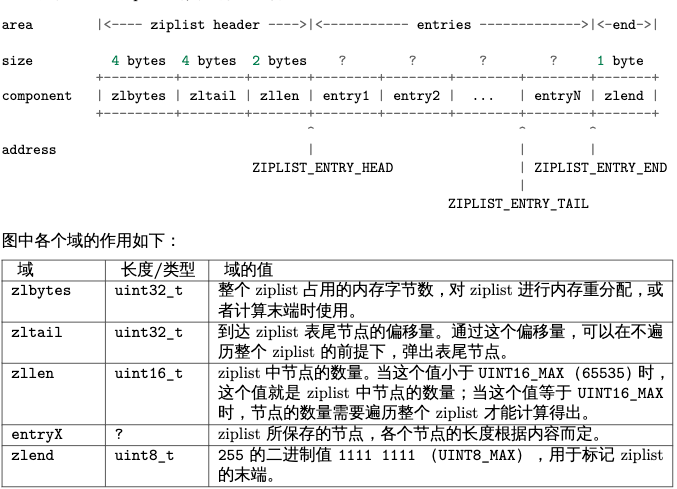
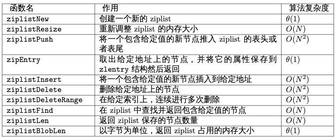
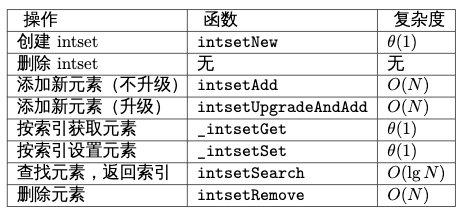

<!-- TOC -->

- [redis encoding type汇总](#redis-encoding-type汇总)
- [内部数据结构](#内部数据结构)
  - [SDS——简单动态字符串](#sds简单动态字符串)
    - [sds的用途](#sds的用途)
      - [实现字符串对像](#实现字符串对像)
      - [Redis中的字符串](#redis中的字符串)
    - [sds的实现](#sds的实现)
      - [优化追加操作](#优化追加操作)
      - [sds模块的API](#sds模块的api)
    - [sds总结](#sds总结)
  - [linkedlist](#linkedlist)
    - [双端链表的应用](#双端链表的应用)
      - [实现Redis的列表类型](#实现redis的列表类型)
      - [Redis自身功能的构建](#redis自身功能的构建)
    - [链表和链表节点定义](#链表和链表节点定义)
    - [链表实现特点](#链表实现特点)
    - [连表API及时间复杂度](#连表api及时间复杂度)
  - [hashtables（hash/set use）](#hashtableshashset-use)
    - [字典的应用](#字典的应用)
      - [实现数据库键空间（key space）](#实现数据库键空间key-space)
      - [用作Hash类型键的其中一种底层实现](#用作hash类型键的其中一种底层实现)
    - [字典的定义](#字典的定义)
    - [字典的方法](#字典的方法)
    - [字典的剖析](#字典的剖析)
  - [skiplist（zset use）](#skiplistzset-use)
    - [跳跃表的实现](#跳跃表的实现)
      - [跳跃表定义](#跳跃表定义)
      - [跳跃表api](#跳跃表api)
      - [跳跃表的应用](#跳跃表的应用)
      - [跳跃表小结](#跳跃表小结)
- [内存映射数据结构](#内存映射数据结构)
  - [ziplist———压缩列表(zset/hash/list内部元素个数小于512、128个&每个元素值小于64字节时使用)](#ziplist压缩列表zsethashlist内部元素个数小于512128个每个元素值小于64字节时使用)
    - [ziplist构成](#ziplist构成)
    - [ziplist api接口](#ziplist-api接口)
    - [ziplist中节点的构成](#ziplist中节点的构成)
    - [ziplist 总结](#ziplist-总结)
  - [整数集合（intset）](#整数集合intset)
    - [整数集合的应用](#整数集合的应用)
    - [intset定义](#intset定义)
    - [intset api](#intset-api)
    - [intset小结](#intset小结)
  - [quicklist（list使用）](#quicklistlist使用)

<!-- /TOC -->
# redis encoding type汇总




| type   | value inner type | describtion                                                                                                                        |
| ------ | ---------------- | ---------------------------------------------------------------------------------------------------------------------------------- |
| string | raw              | raw:大于39个字节的字符串                                                                                                           |
| string | int              | int:8个字节的长整型                                                                                                                |
| string | embstr           | raw:小于39个字节的字符串                                                                                                           |
| hash   | hashtables       | 当哈希类型无法满足ziplist的条件时，Redis会使用hashtable作为哈希的内部实现                                                          |
| hash   | ziplist          | 哈希类型元素个数小于hash-max-ziplist-entries配置(默认512个)、同时所有值都小于hash-max-ziplist-value配置(默认64字节)时              |
| list   | linkedlist       | 当列表类型无法满足ziplist的条件时                                                                                                  |
| list   | ziplist          | 当列表的元素个数小于list-max-ziplist-entries配置 (默认512个)，同时列表中每个元素的值都小于list-max-ziplist-value配置时(默认64字节) |
| list   | quicklist        | 简单地说它是以一个ziplist为节点的linkedlist，它结合了ziplist和linkedlist两者的优势                                                 |
| set    | hashtables       | 当集合类型无法满足intset的条件时                                                                                                   |
| set    | intset           | 当集合中的元素都是整数且元素个数小于set-max-intset-entries配置(默认512个)时                                                        |
| zset   | skiplist         | 当ziplist条件不满足时                                                                                                              |
| zset   | ziplist          | 有序集合的元素个数小于zset-max-ziplist-entries配置(默认128个)，同时每个元素的值都小于zset-max-ziplist-value配置(默认64字节)时      |


# 内部数据结构  
**Redis和其他很多key-value数据库的不同之处在于，Redis不仅支持简单的字符串键值对，它还提供了一系列数据结构类型值，比如列表、哈希、集合和有序集，并在这些数据结构类型上定义了一套强大的API。**  
通过对不同类型的值进行操作，Redis可以很轻易地完成其他只支持字符串键值对的key-value数据库很难（或者无法）完成的任务。在Redis的内部，数据结构类型值由高效的数据结构和算法进行支持，并且在Redis自身的构建当中，也大量用到了这些数据结构。这一部分将对Redis内存所使用的数据结构和算法进行介绍。  

## SDS——简单动态字符串
Sds（Simple Dynamic String，简单动态字符串）是Redis底层所使用的字符串表示，它被用在几乎所有的Redis模块中。本章将对sds的实现、性能和功能等方面进行介绍，并说明Redis使用sds而不是传统C字符串的原因。
### sds的用途  
Sds在Redis中的主要作用有以下两个：  
1.实现字符串对象（StringObject）；  
2.在Redis程序内部用作char*类型的替代品；  
以下两个小节分别对这两种用途进行介绍。  

#### 实现字符串对像
Redis是一个键值对数据库（key-value DB），数据库的值可以是字符串、集合、列表等多种类型的对象，而**数据库的键则总是字符串对象。对于那些包含字符串值的字符串对象来说，每个字符串对象都包含一个sds值**
将sds代替C默认的char* 类型  
因为char* 类型的功能单一，抽象层次低，并且不能高效地支持一些Redis常用的操作（比如追加操作和长度计算操作），所以在Redis程序内部，绝大部分情况下都会使用sds而不是char* 来表示字符串。

#### Redis中的字符串  
在C语言中，字符串可以用一个\0结尾的char数组来表示。比如说，hello world在C语言中就可以表示为"hello world\0"。这种简单的字符串表示在大多数情况下都能满足要求，但是，它并不能高效地支持长度计算和追加（append）这两种操作：  
• 每次计算字符串长度（strlen(s)）的复杂度为O(N)。  
• 对字符串进行N次追加，必定需要对字符串进行N次内存重分配（realloc）。  
在Redis内部，字符串的追加和长度计算并不少见，而APPEND和STRLEN更是这两种操作在Redis命令中的直接映射，这两个简单的操作不应该成为性能的瓶颈。另外，Redis除了处理C字符串之外，还需要处理单纯的字节数组，以及服务器协议等内容，所以为了方便起见，Redis的字符串表示还应该是二进制安全的：程序不应对字符串里面保存的数据做任何假设，数据可以是以\0结尾的C字符串，也可以是单纯的字节数组，或者其他格式的数据。  
考虑到这两个原因，Redis使用sds类型替换了C语言的默认字符串表示：**sds既可以高效地实现追加和长度计算，并且它还是二进制安全的。**

### sds的实现  
在前面的内容中，我们一直将sds作为一种抽象数据结构来说明，实际上，它的实现由以下两部分组成：
```
/*
 * 类型别名，用于指向 sdshdr 的 buf 属性
 */
typedef char *sds;

/*
 * 保存字符串对象的结构
 */
struct sdshdr {
    // buf 中已占用空间的长度
    int len;
    // buf 中剩余可用空间的长度
    int free;
    // 数据空间
    char buf[];
};
```
其中，类型sds是char *的别名(alias)，而结构sdshdr则保存了len、free和buf三个属性。  
作为例子，以下是新创建的，同样保存hello world字符串的sdshdr结构：  
```
structsdshdr {
  len=11;
  free=0;
  buf="hello world\0";// buf的实际长度为len + 1
  };
```
通过len属性，sdshdr可以实现复杂度为O(1)的长度计算操作。另一方面，通过对buf分配一些额外的空间，并使用free记录未使用空间的大小，sdshdr可以让执行追加操作所需的内存重分配次数大大减少，sds也对操作的正确实现提出了要求——所有处理sdshdr的函数，都必须正确地更新len和free属性，否则就会造成bug。

#### 优化追加操作  
在前面说到过，利用sdshdr结构，除了可以用O(1)复杂度获取字符串的长度之外，还可以减少追加(append)操作所需的内存重分配次数。当调用SET命令创建sdshdr时，sdshdr的free属性为0，Redis也没有为buf创建额外的空间——而在执行APPEND之后，Redis为buf创建了多于所需空间一倍的大小。
在目前版本的Redis中，SDS_MAX_PREALLOC的值为1024 * 1024，也就是说，当大小小于1MB的字符串执行追加操作时，sdsMakeRoomFor就为它们分配多于所需大小一倍的空间；当字符串的大小大于1MB，那么sdsMakeRoomFor就为它们额外多分配1MB的空间。 

#### sds模块的API  
sds模块基于sds类型和sdshdr结构提供了以下API：
  
sds还有另一部分功能性函数，比如sdstolower、sdstrim、sdscmp，等等，基本都是标准C字符串库函数的sds版本，这里不一一列举了。

### sds总结 
1. Redis的字符串表示为sds，而不是C字符串（以\0结尾的char*）。  
2. 对比C字符串，sds有以下特性：  
  –可以高效地执行长度计算（strlen）；  
  –可以高效地执行追加操作（append）；  
  –二进制安全；
3. sds会为追加操作进行优化：加快追加操作的速度，并降低内存分配的次数，代价是多占用了一些内存，而且这些内存不会被主动释放。  

## linkedlist
### 双端链表的应用
双端链表作为一种通用的数据结构，在Redis内部使用得非常多：它既是Redis列表结构的底层实现之一，还被大量Redis模块所使用，用于构建Redis的其他功能。主要有如下几种功能：  
#### 实现Redis的列表类型      
  双端链表是Redis列表类型的底层实现之一，当对列表类型的键进行操作——比如执行RPUSH、LPOP或LLEN等命令时，程序在底层操作的可能就是双端链表。
#### Redis自身功能的构建  
  除了实现列表类型以外，双端链表还被很多Redis内部模块所应用：  
  • 事务模块使用双端链表来按顺序保存输入的命令；  
  • 服务器模块使用双端链表来保存多个客户端；  
  • 订阅/发送模块使用双端链表来保存订阅模式的多个客户端；  
  • 事件模块使用双端链表来保存时间事件（time event）；  

### 链表和链表节点定义
```
// adlist.h
typedef struct listNode {
    struct listNode *prev;
    struct listNode *next;
    void *value;
} listNode;

typedef struct list {
    listNode *head;
    listNode *tail;
    void *(*dup)(void *ptr);
    void (*free)(void *ptr);
    int (*match)(void *ptr, void *key);
    unsigned long len;
} list;

typedef struct listIter {
    listNode *next;
    int direction;

} listIter;
```

### 链表实现特点
1、双端链表，含表头、尾节点;  
2、多态:   
a、listNode的value属性的类型是void *，说明这个双端链表对节点所保存的值的类型不做限制。  
b、对于不同类型的值，有时候需要不同的函数来处理这些值，因此，list类型保留了三个函数指针——dup、free和match，分别用于处理值的复制、释放和对比匹配。在对节点的值进行处理时，如果有给定这些函数，那么它们就会被调用。  
举个例子：当删除一个listNode时，如果包含这个节点的list的list->free函数不为空，那么删除函数就会先调用list->free(listNode->value)清空节点的值，再执行余下的删除操作（比如说，释放节点）。  

另外，从这两个数据结构的定义上，也可以看出它们的一些行为和性能特征：
* listNode带有prev和next两个指针，因此，对链表的遍历可以在两个方向上进行：从表头到表尾，或者从表尾到表头。
* list保存了head和tail两个指针，因此，对链表的表头和表尾进行插入的复杂度都为O(1)——这是高效实现LPUSH、RPOP、RPOPLPUSH等命令的关键。
* list带有保存节点数量的len属性，所以计算链表长度的复杂度仅为O(1)，这也保证了LLEN命令不会成为性能瓶颈。

### 连表API及时间复杂度
* api  
```
/* Prototypes */
list *listCreate(void);
void listRelease(list *list);
void listEmpty(list *list);
list *listAddNodeHead(list *list, void *value);
list *listAddNodeTail(list *list, void *value);
list *listInsertNode(list *list, listNode *old_node, void *value, int after);
void listDelNode(list *list, listNode *node);
listIter *listGetIterator(list *list, int direction);
listNode *listNext(listIter *iter);
void listReleaseIterator(listIter *iter);
list *listDup(list *orig);
listNode *listSearchKey(list *list, void *key);
listNode *listIndex(list *list, long index);
void listRewind(list *list, listIter *li);
void listRewindTail(list *list, listIter *li);
void listRotateTailToHead(list *list);
void listRotateHeadToTail(list *list);
void listJoin(list *l, list *o);
```

* 复杂度  


## hashtables（hash/set use）
### 字典的应用
字典在Redis中的应用广泛，使用频率可以说和SDS以及双端链表不相上下，基本上各个功能模块都有用到字典的地方。其中，字典的主要用途有以下两个：  
* 1.实现数据库键空间（key space）；
* 2.用作Hash类型键的其中一种底层实现；  

#### 实现数据库键空间（key space）
Redis是一个键值对数据库，数据库中的键值对就由字典保存：每个数据库都有一个与之相对应的字典，这个字典被称之为键空间（key space）。  
当用户添加一个键值对到数据库时（不论键值对是什么类型），程序就将该键值对添加到键空间；当用户从数据库中删除一个键值对时，程序就会将这个键值对从键空间中删除；等等。  
大部分针对数据库的命令，比如DBSIZE、FLUSHDB、:ref:RANDOMKEY，等等，都是构建于对字典的操作之上的；而那些创建、更新、删除和查找键值对的命令，也无一例外地需要在键空间上进行操作。
#### 用作Hash类型键的其中一种底层实现
Redis的Hash类型键使用以下两种数据结构作为底层实现:  
1.字典；  
2.压缩列表；  
因为压缩列表比字典更节省内存，所以程序在创建新Hash键时，默认使用压缩列表作为底层实现，当有需要时，程序才会将底层实现从压缩列表转换到字典。

### 字典的定义  
实现字典的方法有很多种：  
•最简单的就是使用链表或数组，但是这种方式只适用于元素个数不多的情况下；  
•要兼顾高效和简单性，可以使用哈希表；  
•如果追求更为稳定的性能特征，并且希望高效地实现排序操作的话，则可以使用更为复杂的平衡树；  
在众多可能的实现中，Redis选择了高效且实现简单的哈希表作为字典的底层实现。

```
/*
 * 哈希表节点
 */
typedef struct dictEntry {
    // 键
    void *key;
    // 值
    union {
        void *val;
        uint64_t u64;
        int64_t s64;
    } v;
    // 指向下个哈希表节点，形成链表
    // 使用链地址法（拉链发）来处理键碰撞
    struct dictEntry *next;
} dictEntry;

/*
 * 字典类型特定函数
 */
typedef struct dictType {
    // 计算哈希值的函数
    unsigned int (*hashFunction)(const void *key);
    // 复制键的函数
    void *(*keyDup)(void *privdata, const void *key);
    // 复制值的函数
    void *(*valDup)(void *privdata, const void *obj);
    // 对比键的函数
    int (*keyCompare)(void *privdata, const void *key1, const void *key2);
    // 销毁键的函数
    void (*keyDestructor)(void *privdata, void *key);
    // 销毁值的函数
    void (*valDestructor)(void *privdata, void *obj);
} dictType;

/*
 * 哈希表
 * 每个字典都使用两个哈希表，从而实现渐进式 rehash 。
 */
typedef struct dictht {
    // 哈希表数组
    dictEntry **table;
    // 哈希表大小
    unsigned long size;
    // 哈希表大小掩码，用于计算索引值
    // 总是等于 size - 1
    unsigned long sizemask;
    // 该哈希表已有节点的数量
    unsigned long used;
} dictht;

typedef struct dict {
    // 类型特定函数
    dictType *type;
    // 私有数据
    void *privdata;
    // 哈希表
    dictht ht[2];
    // rehash 索引
    // 当 rehash 不在进行时，值为 -1
    int rehashidx; /* rehashing not in progress if rehashidx == -1 */
    // 目前正在运行的安全迭代器的数量
    int iterators; /* number of iterators currently running */
} dict;

```
### 字典的方法
```

```


### 字典的剖析  
注意dict类型使用了两个指针分别指向两个哈希表。    
其中，0号哈希表（ht[0]）是字典主要使用的哈希表，  
而1号哈希表（ht[1]）则只有在程序对0号哈希表进行rehash时才使用。

在上图的字典示例中，字典虽然创建了两个哈希表，但正在使用的只有0号哈希表，这说明字典未进行rehash状态。

* hash函数  
  Redis目前使用两种不同的哈希算法：  
  1.MurmurHash2 32 bit算法：  
  这种算法的分布率和速度都非常好，具体信息请参考Mur-murHash的主页：http://code.google.com/p/smhasher/。  
  2.基于djb算 法 实 现 的 一 个 大 小 写 无 关 散 列 算 法： 具 体 信 息 请 参 考http://www.cse.yorku.ca/~oz/hash.html。  
  使用哪种算法取决于具体应用所处理的数据：  
  •命令表以及Lua脚本缓存都用到了算法2。  
  •算法1的应用则更加广泛：数据库、集群、哈希键、阻塞操作等功能都用到了这个算法

* 冲突解决  
  使用链地址法（拉链发）来处理键碰撞

* rehash
对于使用链地址法来解决碰撞问题的哈希表dictht来说，哈希表的性能依赖于它的大小（size属性）和它所保存的节点的数量（used属性）之间的比率：  
•比率在1:1时，哈希表的性能最好；  
•如果节点数量比哈希表的大小要大很多的话，那么哈希表就会退化成多个链表，哈希表本身的性能优势就不再存在；    

为了在字典的键值对不断增多的情况下保持良好的性能，字典需要对所使用的哈希表（ht[0]）进行rehash操作：  
在不修改任何键值对的情况下，对哈希表进行扩容，尽量将比率维持在1:1左右。dictAdd在每次向字典添加新键值对之前，都会对哈希表ht[0]进行检查，对于ht[0]的size和used属性，如果它们之间的比率ratio = used / size满足以下任何一个条件的话，rehash过程就会被激活    
 1.自然rehash：ratio >= 1，且变量dict_can_resize为真。  
 2.强制rehash：ratio大 于 变 量dict_force_resize_ratio（目 前 版 本 中，dict_force_resize_ratio的值为5）。  
 Note:什么时候dict_can_resize会为假？在前面介绍字典的应用时也说到过，一个数据库就是一个字典，数据库里的哈希类型键也是一个字典，当Redis使用子进程对数据库执行后台持久化任务时（比如执行BGSAVE或BGREWRITEAOF时），为了最大化地利用系统的copy on write机制，程序会暂时将dict_can_resize设为假，避免执行自然rehash，从而减少程序对内存的触碰（touch）。当持久化任务完成之后，dict_can_resize会重新被设为真。另一方面，当字典满足了强制rehash的条件时，即使dict_can_resize不为真（有BGSAVE或BGREWRITEAOF正在执行），这个字典一样会被rehash。

## skiplist（zset use）
跳跃表（skiplist）是一种随机化的数据，由William Pugh在论文《Skip lists: a probabilisticalternative to balanced trees》中提出，这种数据结构以有序的方式在层次化的链表中保存元素，它的效率可以和平衡树媲美——查找、删除、添加等操作都可以在对数期望时间下完成，并且比起平衡树来说，跳跃表的实现要简单直观得多。

跳跃表主要由以下部分构成：
 •表头（head）：负责维护跳跃表的节点指针。
 •跳跃表节点：保存着元素值，以及多个层。
 •层：保存着指向其他元素的指针。高层的指针越过的元素数量大于等于低层的指针，为了提高查找的效率，程序总是从高层先开始访问，然后随着元素值范围的缩小，慢慢降低层次。
 •表尾：全部由NULL组成，表示跳跃表的末尾。  
因为跳跃表的定义可以在任何一本算法或数据结构的书中找到，所以本章不介绍跳跃表的具体实现方式或者具体的算法，而只介绍跳跃表在Redis的应用、核心数据结构和API。

### 跳跃表的实现  
为了适应自身的功能需要，Redis基于William Pugh论文中描述的跳跃表进行了以下修改：
  1.允许重复的score值：多个不同的member的score值可以相同。
  2.进行对比操作时，不仅要检查score值，还要检查member：当score值可以重复时，单靠score值无法判断一个元素的身份，所以需要连member域都一并检查才行。
  3.每个节点都带有一个高度为1层的后退指针，用于从表尾方向向表头方向迭代：当执行ZREVRANGE或ZREVRANGEBYSCORE这类以逆序处理有序集的命令时，就会用到这个属性。

#### 跳跃表定义
这个修改版的跳跃表由redis.h/server.h结构定义：
```
/* ZSETs use a specialized version of Skiplists */
typedef struct zskiplistNode {
    sds ele;      //sds对象
    double score; //分值
    struct zskiplistNode *backward; //后退指针
    struct zskiplistLevel {         //层
        struct zskiplistNode *forward;  //前进节点
        unsigned long span;             //这个层跨越的节点个数
    } level[];
} zskiplistNode;

typedef struct zskiplist {
    struct zskiplistNode *header, *tail;  //头尾节点
    unsigned long length;  //节点个数
    int level;             //目前表内节点的最大层数
} zskiplist;

typedef struct zset {
    dict *dict;
    zskiplist *zsl;
} zset;
```

#### 跳跃表api


#### 跳跃表的应用
和字典、链表或者字符串这几种在Redis中大量使用的数据结构不同，**跳跃表在Redis的唯一作用，就是实现有序集数据类型。**
跳跃表将 **<u>指向有序集的score值和member域的指针作为元素，并以score值为索引，对有序集元素进行排序。</u>**
举个例子，以下代码就创建了一个带有3个元素的有序集：  
```
redis>ZADD s 6 x 10 y 15 z
(integer) 3
```
在底层实现中，Redis为x、y和z三个member分别创建了三个字符串，并为6、10和15分别创建三个double类型的值，然后用一个跳跃表将这些指针有序地保存起来，形成这样一个跳跃表：
  
为了展示的方便，在图片中我们直接将member和score值包含在表节点中，但是在实际的定义中，因为跳跃表要和另一个实现有序集的结构（字典）分享member和score值，所以跳跃表只保存指向member和score的指针。  


#### 跳跃表小结  
•跳跃表是一种随机化数据结构，它的查找、添加、删除操作都可以在对数期望时间下完成。  
•跳跃表目前在Redis的唯一作用就是作为有序集类型的底层数据结构（之一，另一个构成有序集的结构是字典）。  
•为了适应自身的需求，Redis基于William Pugh论文中描述的跳跃表进行了修改，包括：  
  1.score值可重复。  
  2.对比一个元素需要同时检查它的score和memeber。  
  3.每个节点带有高度为1层的后退指针，用于从表尾方向向表头方向迭代。  


# 内存映射数据结构
**虽然内部数据结构非常强大，但是创建一系列完整的数据结构本身也是一件相当耗费内存的工作，当一个对象包含的元素数量并不多，或者元素本身的体积并不大时，使用代价高昂的内部数据结构并不是最好的办法。<u>为了解决这一问题，Redis在条件允许的情况下，会使用内存映射数据结构来代替内部数据结构。内存映射数据结构是一系列经过特殊编码的字节序列，创建它们所消耗的内存通常比作用类似的内部数据结构要少得多，如果使用得当，内存映射数据结构可以为用户节省大量的内存。不过，因为内存映射数据结构的编码和操作方式要比内部数据结构要复杂得多，所以内存映射数据结构所占用的CPU时间会比作用类似的内部数据结构要多。</u>这一部分将对Redis目前正在使用的两种内存映射数据结构进行介绍。**

## ziplist———压缩列表(zset/hash/list内部元素个数小于512、128个&每个元素值小于64字节时使用)
**Ziplist是由一系列特殊编码的内存块构成的列表，一个ziplist可以包含多个节点（entry），每个节点可以保存一个长度受限的字符数组（不以\0结尾的char数组）或者整数，**包括：
 •字符数组
   –长度小于等于63（2^6 - 1）字节的字符数组
   –长度小于等于16383（2^14 - 1）字节的字符数组
   –长度小于等于4294967295（2^32 - 1）字节的字符数组
 •整数
   –4位长，介于0至12之间的无符号整数
   –1字节长，有符号整数
   –3字节长，有符号整数
   –int16_t类型整数
   –int32_t类型整数
   –int64_t类型整数
因为ziplist节约内存的性质，它被哈希键、列表键和有序集合键作为初始化的底层实现来使用

本章先介绍ziplist的组成结构，以及ziplist节点的编码方式，然后介绍ziplist的添加操作和删除操作的执行过程，以及这两种操作可能引起的连锁更新现象，最后介绍ziplist的遍历方法和节点查找方式。

### ziplist构成
下图展示了一个ziplist的典型分布结构：
  
因为ziplist header部分的长度总是固定的（4字节+4字节+2字节），因此将指针移动到表头节点的复杂度为常数时间；除此之外，因为表尾节点的地址可以通过zltail计算得出，因此将指针移动到表尾节点的复杂度也为常数时间。

### ziplist api接口
  
因为ziplist由连续的内存块构成，在最坏情况下，当ziplistPush、ziplistDelete这类对节点进行增加或删除的函数之后，程序需要执行一种称为连锁更新的动作来维持ziplist结构本身的性质，所以这些函数的最坏复杂度都为O(N2)。不过，因为这种最坏情况出现的概率并不高，所以大可以放心使用ziplist，而不必太担心出现最坏情况。

### ziplist中节点的构成  
一个ziplist可以包含多个节点，每个节点可以划分为以下几个部分：  
```
area        |<-------------------entry------------------------>   
            |+------------------+----------+--------+---------+  
component   |pre_entry_length|encoding|length|content|  
            +------------------+----------+--------+----------+  
```
以下几个小节将分别对这个四个部分进行介绍。

* pre_entry_length  
  pre_entry_length记录了前一个节点的长度，通过这个值，可以进行指针计算，从而跳转到上一个节点。
  根据编码方式的不同，pre_entry_length域可能占用1字节或者5字节：  
   •1字节：如果前一节点的长度小于254字节，那么只使用一个字节保存它的值。  
   •5字节：如果前一节点的长度大于等于254字节，那么将第1个字节的值设为254，然后用接下来的4个字节保存实际长度。

* encoding和lengthen  
  coding和length两部分一起决定了content部分所保存的数据的类型（以及长度）。  
  其中，encoding域的长度为两个bit，它的值可以是00、01、10和11：  
  •00、01和10表示content部分保存着字符数组。  
  •11表示content部分保存着整数。

* content  
  content部分保存着节点的内容，它的类型和长度由encoding和length决定。  
  以下是一个保存着字符数组hello world的节点的例子：
  ```
  area      |<----------------------entry----------------------->|
  size          ?                 2bit       6bit    11byte
            +------------------+----------+--------+---------------+
  component | pre_entry_length | encoding | length | content       |
            |                  |          |        |               |
  value     |       ?          |    00    | 001011 |  hello world  |
            +------------------+----------+--------+---------------+
  ```
  encoding域的值00表示节点保存着一个长度小于等于63字节的字符数组，  
  length域给出了这个字符数组的准确长度——11字节（的二进制001011），  
  content则保存着字符数组值hello world本身（为了表示的简单，content部分使用字符而不是二进制表示）。
  
  以下是另一个节点，它保存着整数10086：  
  ```
  area      |<----------------------entry----------------------->|
  size          ?                 2bit        6bit      2bytes
            +------------------+----------+--------+---------------+
  component|  pre_entry_length | encoding | length | content       |
           |                   |          |        |               |
  value    |        ?          |    11    | 000000 |    10086      |
           +------------------+----------+--------+---------------+
  ```
  encoding域的值11表示节点保存的是一个整数；而length域的值000000表示这个节点的值的类型为int16_t；  
  最后，content保存着整数值10086本身（为了表示的简单，content部分用十进制而不是二进制表示）。

### ziplist 总结  
添加和删除ziplist节点有可能会引起连锁更新，因此，添加和删除操作的最坏复杂度为O(N2)，不过，因为连锁更新的出现概率并不高，所以一般可以将添加和删除操作的复杂度视为O(N)。  

## 整数集合（intset）  
整数集合（intset）用于有序、无重复地保存多个整数值，它会根据元素的值，自动选择该用什么长度的整数类型来保存元素。举个例子，如果在一个intset里面，最长的元素可以用int16_t类型来保存，那么这个intset的所有元素都以int16_t类型来保存。另一方面，如果有一个新元素要加入到这个intset，并且这个元素不能用int16_t类型来保存——比如说，新元素的长度为int32_t，那么这个intset就会自动进行“升级”：先将集合中现有的所有元素从int16_t类型转换为int32_t类型，接着再将新元素加入到集合中。根据需要，intset可以自动从int16_t升级到int32_t或int64_t，或者从int32_t升级到int64_t。

### 整数集合的应用
Intset是集合键的底层实现之一，如果一个集合：  
1.只保存着整数元素；  
2.元素的数量不多；  
那么Redis就会使用intset来保存集合元素。  

### intset定义
以下是intset.h/intset类型的定义：  
```
typedef struct intset {
    // 编码方式
    uint32_t encoding;

    // 集合包含的元素数量
    uint32_t length;

    // 保存元素的数组
    int8_t contents[];

} intset;
```
encoding的值可以是以下三个常量的其中一个（定义位于intset.c）：  
```
#define INTSET_ENC_INT16 (sizeof(int16_t))  
#define INTSET_ENC_INT32 (sizeof(int32_t))  
#define INTSET_ENC_INT64 (sizeof(int64_t))  
```
contents数组是实际保存元素的地方，数组中的元素有以下两个特性：  
  •没有重复元素；  
  •元素在数组中从小到大排列；  
contents数组的int8_t类型声明比较容易让人误解，实际上，intset并不使用int8_t类型来保存任何元素，结构中的这个类型声明只是作为一个占位符使用：在对contents中的元素进行读取或者写入时，程序并不是直接使用contents来对元素进行索引，而是根据encoding的值，对contents进行类型转换和指针运算，计算出元素在内存中的正确位置。在添加新元素，进行内存分配时，分配的容量也是由encoding的值决定。  

### intset api
下表列出了处理intset的一些主要操作，以及这些操作的算法复杂度：
  

intset创建intset之后，就可以对它添加新元素了。添加新元素到intset的工作由intset.c/intsetAdd函数完成，它需要处理以下三种情况：  
1.元素已存在于集合，不做动作；  
2.元素不存在于集合，并且添加新元素并不需要升级；  
3.元素不存在于集合，但是要在升级之后，才能添加新元素；  
并且，intsetAdd需要维持intset->contents的以下性质：  
1.确保数组中没有重复元素；  
2.确保数组中的元素按从小到大排序；  

关于intset内部主要支持如下操作：  
1、升级：在添加新元素时，如果intsetAdd发现新元素不能用现有的编码方式来保存，它就会对contents进行升级；     
2、元素移动：在进行升级的过程中，需要对数组内的元素进行“类型转换”和“移动”操作。其中，移动不仅出现在升级（intsetUpgradeAndAdd）操作中，还出现其他对contents数组内容进行增删的操作上，比如intsetAdd和intsetRemove，因为这种移动操作需要处理intset中的所有元素；    
3、读取：有两种方式读取intset的元素，一种是_intsetGet，另一种是intsetSearch；  
4、写入：除了前面介绍过的intsetAdd和intsetUpgradeAndAdd之外，_intsetSet也对集合进行写入操作：它接受一个索引pos，以及一个new_value，将contents数组pos位置的值设为new_value。  
5、删除：删除单个元素的工作由intsetRemove操作，它先调用intsetSearch找到需要被删除的元素在contents数组中的索引，然后使用内存移位操作，将目标元素从内存中抹去，最后，通过内存重分配，对contents数组的长度进行调整。  
6、降级：Intset不支持降级操作。Intset定位为一种受限的中间表示，只能保存整数值，而且元素的个数也不能超过redis.h/REDIS_SET_MAX_INTSET_ENTRIES（目前版本值为512）这些条件决定了它被保存的时间不会太长，因此对它进行太复杂的操作，没有必要。

### intset小结  
•Intset用于有序、无重复地保存多个整数值，它会根据元素的值，自动选择该用什么长度的整数类型来保存元素。  
•当一个位长度更长的整数值添加到intset时，需要对intset进行升级，新intset中每个元素的位长度都等于新添加值的位长度，但原有元素的值不变。  
•升级会引起整个intset进行内存重分配，并移动集合中的所有元素，这个操作的复杂度为O(N)。   
•Intset只支持升级，不支持降级。  
•Intset是有序的，程序使用二分查找算法来实现查找操作，复杂度为O(lgN)。  

## quicklist（list使用）