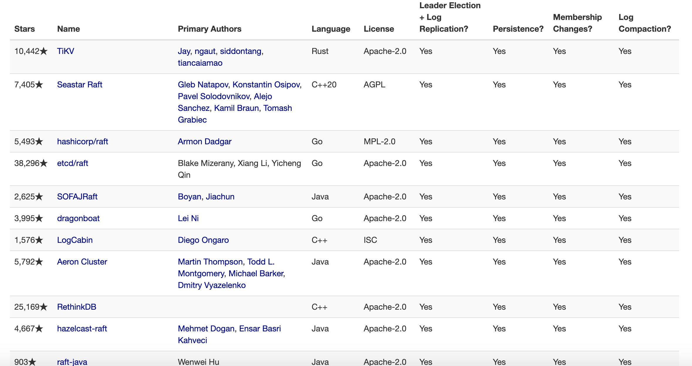
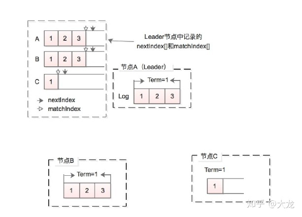

<!-- TOC -->

- [Raft使用介绍](#raft使用介绍)
- [实现了raft协议的应用](#实现了raft协议的应用)
- [Redis对于Raft的实现](#redis对于raft的实现)
  - [Leader Election](#leader-election)
    - [Raft的做法](#raft的做法)
    - [Redis集群的做法](#redis集群的做法)
  - [Log Replication](#log-replication)
    - [全量复制](#全量复制)
      - [Raft的做法](#raft的做法-1)
      - [Redis的做法](#redis的做法)
    - [部分复制](#部分复制)
      - [Raft的做法](#raft的做法-2)
      - [Redis的做法](#redis的做法-1)
  - [Log Compaction](#log-compaction)
    - [Copy-On-Write](#copy-on-write)
    - [AOF重写](#aof重写)

<!-- /TOC -->
## Raft使用介绍
[The Raft Consensus Algorithm](https://raft.github.io/)     
[Raft协议(1)——Raft协议与Redis集群中的一致性协议的异同](https://zhuanlan.zhihu.com/p/112651338)     

Raft协议大致有四大块：   
* Leader Election
* Log Replication
* Log Compaction
* Membership Change

## 实现了raft协议的应用
Raft仅仅只是Diego Ongaro的论文，关于Raft的具体实现有很多，官网中有一个实现raft的统计表，如下：
  
接下来我们重点看看redis中对于raft的实现。  


## Redis对于Raft的实现
分布式系统的一致性和性能常常是鱼和熊掌不可兼得。追求高的一致性，必然会带来性能的损失，而想要追求高的性能，也只能妥协于一定程度的非一致性。以下表中的数据写入为例，不同的一致性级别要求写入的节点个数是不同的， 写入节点个数越多，显然客户端需要等待的时间就会越久。Raft中采用的是QUORUM， 即确保至少大部分节点都接收到写操作之后才会返回结果给Client， 而Redis默认采用的实际上是ANY ONE, 即只要Master节点写入成功后，就立刻返回给Client，然后该写入命令被异步的发送给所有的slave节点，来尽可能地让所有地slave节点与master节点保持一致。

| Write   | 要求                                                 |
| ------- | ---------------------------------------------------- |
| ZERO    | 写操作将立即返回，不能保证写成功                     |
| ANY ONE | 确保该值被写入到至少一个节点                         |
| QUORUM  | 确保该至少大部分节点（（副本因子/2）+1）接受到写操作 |
| ALL     | 确保所有副本节点都接收到写操作之后，再返回           |

那么既然两者完全是不同的一致性强度要求，为什么我们还要在本篇文章中介绍Raft在Redis中地使用并进行对比呢？一方面，正因如此，我们才能通过对比二者更好的体会<u>不同的一致性强度要求对数据同步协议以及领导节点选举的协议的设计影响</u>。另一方面，Raft的设计目标是”在解决分布式系统一致性的前提下，尽可能地让算法易懂“，为了达到这个目的，作者论文中实际上有很多设计不是很适合在实际场景中使用，或者有一些细节没有被考虑到。我们以Redis为例，看Redis是如何设计解决这些问题的。  

<u>从作者的论文中看，Raft协议大致有四大块： Leader Election， Log Replication， Log Compaction, Membership Change。每一大点Redis都有对应的设计部分，但是我们这篇文章主要介绍对比前三点。即研究在Raft中领导节点选举、数据同步以及持久化措施与Redis中的对应措施的异同。</u>

### Leader Election
从系统设计人员的角度来看，当current leader节点故障之后，我们显然想从其所有的follower节点中选择一个最合适的节点出来成为新的leader来领导整个集群。那么如何去判定哪个节点最合适？<u>Raft和Redis在如何去判断最合适上实际采用了类似的准则：即选择follower中保存的数据最接近current leader节点数据的节点，但在具体的选举过程中两者采用了不同的策略。</u>  

#### Raft的做法
当follower判定当前的leader节点故障之后，follower会首先随机休眠一段时间，比如我们设置所有的节点休眠时间为150-300ms之间，即rand(150, 300)，每个节点休眠结束后，便向其他的节点发起拉票。比如A节点先唤醒，唤醒后向B、C节点发起拉票。每个Term期间，每个节点只能至多投一票给别人。那么这个时候B、C节点到底如何判断是不是该投给A，是Raft中Leader Election的核心。  

第一种Naive的做法就是，对B、C来说，手上的票是先到先得。即率先收到哪个节点的RequestVote的RPC，就返回给该节点True，对于同一个Term内后续其他节点的RequestVote请求，一律返回False。那显然，就是最先醒来的最有可能被选举为新的Master。

但显然这样做是没法确保我们选择到最合适的节点的。所以Raft又加入了更多的投票规则，即Election Restriction。 我们前面说过，所谓最合适，就是要选择和当前leader数据最一致的follower。而在Raft中，节点数据的更新程度是由Term和logIndex一起标记的。那么当A向B、C发起拉票请求时，会在请求中携带节点中Term和logIndex信息， B、C接到RequestVote之后，检查A节点上的数据更新程度，如果比自己新，那么就选择投票给他，否则就拒绝投票。
```cpp
if Term > myTerm or Term == myTerm and logIndex >= myLogIndex:
    VoteForThisNode()
else:
    DeclineThisNode()
```

前面我们提过，Raft采用的是QUOROM，即当Master节点接收到客户端的数据变更请求之后，Master确保至少一半的节点都接收到了该请求之后，才会向客户端返回操作结果。那么也就意味着有至少一半的节点其数据状态是和Master节点一致的。那么当当前的Master故障之后，新的Master有极大的概率是从这部分节点中选择出来的。

<u>总而言之，我们发现加入Election Restriction之后每个节点发起选举的过程实际上是没变的，都是随机休眠一段时间，然后向其他节点发起拉票。**变得是投票方的决策依据，没加入限制之前是选票是先到先得，加入了之后投票方倾向于选择比自己数据版本更新的节点。**</u>那么再结合上述的PreVote的概念，我们把选举的过程描述如下，我们待会会看到，Redis集群中选举过程几乎和上述流程一致：

1. 拉票方：
   1. 选举资格检查：首先检查自己是否能连接上集群的大部分节点来确定自己是否有资格发起选举  
   2. 随机休眠： 休眠rand(150, 300)这么久的时间，以避免所有的节点同时开始选举  
   3. 发起拉票： 休眠结束后向所有节点发起拉票请求，即RequestVote  
2. 投票方：
   1. 投票资格检查： 如果本Term内已经投出去票了，那么不再具备投票资格  
   2. 拉票方数据更新程度检查： 检查发起选举的节点的数据是否比自己的数据更新  
   3. 投票或拒绝： 根据第2步的结果决定投票或拒绝  

#### Redis集群的做法

Redis集群中，当Slave节点发现Master节点被判定为故障时，便知道自己需要发起failover的过程，即发起选举，替代掉故障的master。从系统设计人员角度看，Redis集群也希望在当前Master节点故障之后，选择一个数据版本最接近Master节点的Slave节点。<u>和Raft类似，Redis集群的节点的数据版本由config_epoch和repl_offset来标记。config_epoch就是Raft中的Term，repl_offset即Raft中的logIndex。</u>那么Raft中采用的Election Restriction在Redis集群中的Master节点选举也同样试用。我们按照上述总结的流程来描述Redis中的选举过程。

1. 拉票方：  
   1. 选举资格检查：与Raft的检查规则不同，每个slave节点不尝试连接集群中的其他节点，而是检查自己是否已经与之前的master节点太久未进行通信。正常来讲，master节点会定期向slave节点发送ping消息，如果长时间未通信，那么该slave节点极有可能在数据上落后Master节点过多，于是放弃发起选举，否则就进入第二步。
   2. 随机休眠： 与Raft统一随机休眠rand(150, 300)不同，Redis集群中每个参与选举的slave节点的休眠时间计算公式如下。其中的SLAVE_RANK即各个节点按照repl_offset的大小排序的结果。从休眠时间的计算公式上看，即数据更新的(repl_offset更大)的节点休眠时间短，最先醒来，也最有可能被选举。
   3. 发起拉票： 休眠结束后向所有节点发起拉票请求，即向其他节点发送CLUSTERMSG_TYPE_FAILOVER_AUTH_REQUEST消息
DELAY = 500 milliseconds + random delay between 0 and 500 milliseconds + SLAVE_RANK * 1000 milliseconds.
2. 投票方：  
   1. 投票资格检查： 和Raft一样，Redis集群中一个Term内每个节点至多只能投一票。如果本Term内已经投出去票了，那么不再具备投票资格
   2. 拉票方数据更新程度检查： 和Raft不同的是，Redis中只检查发起选举的节点的Term是否比自己的Term更大
   3. 投票或拒绝： 根据第2步的结果决定投票或拒绝  


<u>从上述的过程中我们看到，Redis和Raft进行leader选举的过程是基本一样的，且都采用了Election Restriction。但是由于Redis存储方案的实际情况，Restriction的检查工作分别由发起投票方（休眠时间的决定）和投票方共同完成，而Raft中则是完全放在了投票方那边进行检查。</u>

### Log Replication  
Log Replication即数据同步。Raft和Redis一样，数据只从Master节点流向Slave节点，同时二者都有全量复制和部分复制的概念。二者都在内存中开辟一个缓存区缓存来自客户端的请求，同时在特定的规则被触发之后，将缓存区的数据持久化落盘。接下来我们分别介绍全量复制和部分复制。

#### 全量复制

全量复制即把所有的数据都发送给子节点。我们分别看Redis和Raft的做法异同。这部分内容其实就是Raft中的Log Compaction。

##### Raft的做法

<u>Raft会在某些规则触发之后把内存缓冲区中的所有log落盘，或者生成application state machine的snapshot。生成的这两类数据即为全量数据。</u>当有新的节点加入集群或者某个follower节点落后leader节点太多时， leader节点就会选择将全量数据发送给follower节点做状态的初始化。

我们以作者重点描述的snapshot为例， 当follower节点接收到来自leader的snapshot文件时，会与自己的数据进行比较。如果自己的log相对来说比较新，那么就会选择忽视掉该文件，否则就用leader的snapshot初始化整个application state machine。

##### Redis的做法

在我们之前介绍Redis的时候我们就提到说，Redis有两种持久化措施，AOF持久化和RDB持久化。<u>其中AOF持久化就类似于Raft中的log落盘， RDB持久化就是生成整个Redis数据库的快照文件。</u>当一个新的节点加入成为slave节点或者当前的某个slave节点数据落后Master节点数据过多时，Master会生成RDB文件或者把已有的AOF文件直接发给slave节点进行状态初始化。

我们同样以快照为例， 与Raft不同的是， 在Redis中，只要slave节点接收到了来自master节点的RDB文件， 就会把application state machine（即Redis内存数据库）全部清空，并用RDB文件来初始化。

#### 部分复制
前面我们提到，Redis和Raft的master节点都在内存中维护一个buffer来缓存来自客户端的请求，同时在触发一些规则后把buffer的数据落盘。同时落盘的数据就从缓存中删除掉。那么当follower节点/slave节点的数据虽然落后于master节点，但是缺少的部分还被master节点缓存在内存中的时候，就会触发部分复制，即缺啥补啥。部分复制包含命令转发和补发过往数据。

在这部分Redis和Raft采用的策略是非常不一致的。Raft中数据是leader节点PUSH给follower节点的， 节点数据更新的进度是由Master节点维护的（即[]nextIndex数组）， 即Master决定该同步给follower节点什么数据，而Redis中数据同步是通过slave节点从master节点PULL数据完成，同步进度(repl_offset)是由各个slave节点自己维护的，即Slave节点决定需要同步哪些数据。接下来我们一一介绍下。  

##### Raft的做法

前面提到，Raft采用的是QUORUM， 即当Master节点接收到来自客户端的数据更改请求时，需要保证该请求被至少一半的节点接收到，才会返回客户端执行的结果。  

不管是master节点还是slave节点，内部都会维护一个log buffer用来缓存命令，同时在master节点会维护每个节点的nextIndex和matchIndex。如下图所示。nextIndex实际上表征的是某个follower节点的数据同步进度，理想情况下，nextIndex应该指向master节点中的logindex的下一个index， 这样说明follower节点完全与leader节点同步。但是有的节点比如下图中的C，由于一些原因，数据是落后于Leader节点的。  

    

我们发现C节点缺少的是Term1阶段的logIndex=2和logIndex=3的数据，如果这两部分数据还在Master节点的内存缓冲区中，那么Master节点就会补发这部分数据给C，让C与自己同步。但是如果这部分数据已经落盘了，进而内存中已经删除了这两个log，那么就会触发全量复制。

当然，当follower节点落后于Leader节点的时候，如何去寻找到二者一致的地方，这就是日志的consistency check问题了，实际上就是一个满足递归性质的检查， 具体细节限于篇幅就不在这里展开，感兴趣的话具体可以去读作者的博士论文。

<u>读到这里的话，我希望大家能够有印象的是，Leader节点维护每个follower节点的数据同步进度，并不断地去push数据给follower节点。</u>

##### Redis的做法

前文提到Redis采用的是ANY ONE的做法， 当接收到来自客户端的数据更改请求时， 只要Master处理完该请求，就立马返回客户端。同时异步的把这些命令转发给所有的slave节点。但是转发的过程中可能因为网络问题导致数据丢失。<u>于是Redis的master节点在内存中开辟一个默认大小为1M的环形缓冲区。</u>在转发给slave节点用户请求的同时把该请求写入环形缓冲区。每个slave节点接收到一个命令之后会自增repl_offset值用来记录复制偏移量。同时master节点也会记录当前缓冲区的最新命令的repl_offset， 与Raft中不同的是，这里的复制偏移量是字节偏移量，并不是命令的Index。salve节点会定期的向master节点发送PSYNC命令请求同步复制，master节点会检查slave节点的复制偏移量是否在当前master节点的缓冲区中，如果在则从缓冲区中发送命令，否则触发全量复制。

事实上Redis只是采用了repl_offset有很大的问题，就是顺序很可能会出错。可能Master接收到的请求是PUT(KEY, 1), PUT(KEY, 2)，但是salve接收到的顺序是PUT(KEY, 2), PUT(KEY, 1)。因为slave端没有办法去检查。而在Raft中是有一个递归性质来保证follower节点的log的顺序与leader节点的log顺序是一致的。


### Log Compaction
log compaction实际上就是持久化措施。这部分实际上在全量复制那里已经有涉及。就是日志持久化和application state machine的快照持久化。对应到Redis中就是AOF持久化和RDB持久化。限于篇幅，这里我们不过多的展开。重点讲两个内容：COW和AOF重写。

#### Copy-On-Write
快照持久化是个很耗时间的操作，Redis和Raft都采用fork一个子进程出来进行持久化。但是我们都知道，fork出来的子进程会拷贝父进程所有的数据，这样理论上当Redis要持久化2G的内存数据的时候，子进程也会占据几乎2G的内存，那么相关的进程内存占用就会达到4G左右，这在数据比较小的时候还不严重，但是比如你的电脑内存是8G，目前备份快照数据本身体积是5G，那么按照上面的计算备份一定是无法进行的，所幸在Unix类操作系统上面，做了如下的优化：在刚开始的时候父子进程共享相同的内存，直到父进程或者子进程进行内存的写入后，对被写入的内存共享才结束。这样就会减少快照持久化时对内存的消耗。这就是COW技术，减少了快照生成时候的内存使用的同时节省了不少时间。<u>备份期间多用的内存正比于在此期间接收到的数据更改请求。</u>

#### AOF重写

实际上，AOF重写是Redis里面的术语，但当涉及到log的备份的时候我想应该都需要这步操作。我们以Redis的AOF重写为例说明这个问题。AOF（AppendOnlyFile）持久化就是Redis把每次的用户写操作日志append到一个文件中，如果数据丢失了，那么按照AOF文件的操作顺序再进行操作一遍就可以恢复数据，而且这样每次我们都只需要写一小部分数据到文件中。但是这样会带来一个什么问题呢？由于程序一直在运行，所以不停的会往AOF文件中添加写的操作日志，这样终有一天AOF文件体积会大到不可想象。所以就又有一个操作叫AOF重写用于删除掉冗余的命令，比如用户对同一个key执行100遍SET操作，如果不AOF重写，那么AOF文件中就会有100条SET记录，数据恢复的时候也需要操作100次SET，但实际上只有最后一条SET命令是真正有意义的，所以AOF重写就会把前99条SET命令删除掉，只保留最后一条SET命令，这样不仅文件内存储的内容就变少了，Redis恢复数据的速度也加快了。

同样，Raft持久化日志的时候肯定也是需要考虑到无效日志的剔除的，不然日志的空间就会无限大了。


