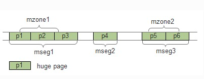
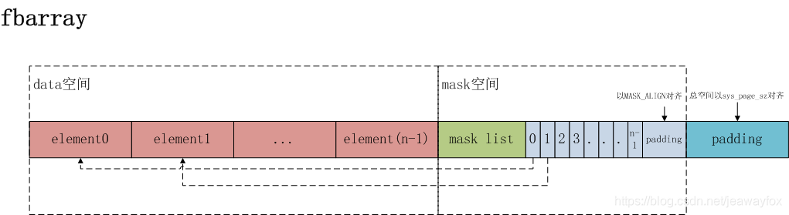

<!-- TOC -->

- [SPDK rte_eal_init函数中内存方面的一些分析](#spdk-rte_eal_init函数中内存方面的一些分析)
	- [1. 相关命令](#1-相关命令)
	- [2. 调试环境](#2-调试环境)
	- [3. DPDK内存重点概念](#3-dpdk内存重点概念)
		- [3.0. DPDK内存总结](#30-dpdk内存总结)
		- [3.1. DPDK一些限制细节](#31-dpdk一些限制细节)
		- [3.2. Memory Segments and Memory Zones (memzone)](#32-memory-segments-and-memory-zones-memzone)
			- [memzone,memseg,hugepage的关系](#memzonememseghugepage的关系)
			- [memsegs - Memery Segment](#memsegs---memery-segment)
			- [memzones - Memory Zone](#memzones---memory-zone)
			- [memsegs and memzones 的存储结构](#memsegs-and-memzones-的存储结构)
	- [4. 代码+GDB分析](#4-代码gdb分析)
		- [4.1. dpdk中的几个重要的全局变量](#41-dpdk中的几个重要的全局变量)
		- [4.2. rte_eal_init](#42-rte_eal_init)
		- [4.2.1. eal_hugepage_info_init](#421-eal_hugepage_info_init)
			- [`/var/run/dpdk/spdk0/hugepage_info`文件落盘](#varrundpdkspdk0hugepage_info文件落盘)
		- [4.2. rte_eal_memzone_init](#42-rte_eal_memzone_init)
			- [4.2.1 `/var/run/dpdk/spdk0/fbarray_memzone`文件落盘](#421-varrundpdkspdk0fbarray_memzone文件落盘)
		- [4.3. rte_eal_memory_init](#43-rte_eal_memory_init)
			- [4.3.1. `/var/run/dpdk/spdk0/fbarray_memseg-1048576k-socket_id-list_id`落盘](#431-varrundpdkspdk0fbarray_memseg-1048576k-socket_id-list_id落盘)
			- [4.3.2. `/dev/hugpages-x/spdkXmap_Y`预留大页文件创建](#432-devhugpages-xspdkxmap_y预留大页文件创建)
			- [4.3.3. internal_conf->hugepage_unlink 配置项的研究](#433-internal_conf-hugepage_unlink-配置项的研究)
		- [4.4. rte_eal_malloc_heap_init](#44-rte_eal_malloc_heap_init)
			- [4.4.1. 代码链路分析](#441-代码链路分析)
			- [4.4.2. GDB调试结果](#442-gdb调试结果)
		- [4.5. 用户申请内存接口](#45-用户申请内存接口)
			- [4.5.1 malloc_heap_alloc调用栈](#451-malloc_heap_alloc调用栈)
			- [4.5.2. GDB调试结果](#452-gdb调试结果)
			- [4.5.3. malloc_heap_alloc的另一个调用方](#453-malloc_heap_alloc的另一个调用方)
				- [malloc_socket的返回值是一个void*](#malloc_socket的返回值是一个void)
				- [memzone_reserve_aligned_thread_unsafe的返回值是struct rte_memzone *](#memzone_reserve_aligned_thread_unsafe的返回值是struct-rte_memzone-)
		- [4.6. 用户释放内存接口](#46-用户释放内存接口)
	- [5. 附录](#5-附录)

<!-- /TOC -->


## SPDK rte_eal_init函数中内存方面的一些分析

### 1. 相关命令

```shell
// 查看两个node下的大页内存使用情况
cat /sys/devices/system/node/node*/meminfo |grep Huge

// 查看机器上总的大页内存情况
cat /sys/kernel/mm/hugepages/hugepages-1048576kB

// 查看numa总体情况
numastat

// 查看大页挂载点
cat /proc/mounts

// 查看正在使用的大页文件
ls /dev/hugepages-X/*
```


### 2. 调试环境

* dpdk版本：spdk21.01中使用的dpdk版本（20.11）；
* 编译优化：

​	1、在编译spdk时增加上--enable-debug

```shell
./configure --enable-debug --disable-tests --disable-unit-tests --disable-examples --with-isal ${march_option}
# 在调试版本上，该选项还将日志输出级别设置为SPDK_LOG_DEBUG，DPDK中所有的DEBUG级别以上的日志都会输出
```

​	2、将CMAKE的编译调至O0

* 机器配置（48核 2Numa）

```
[root@hl-XXX-149-134 tools]# lscpu
Architecture:          x86_64
CPU op-mode(s):        32-bit, 64-bit
Byte Order:            Little Endian
CPU(s):                48
On-line CPU(s) list:   0-47
Thread(s) per core:    2
Core(s) per socket:    12
Socket(s):             2
NUMA node(s):          2
Vendor ID:             GenuineIntel
CPU family:            6
Model:                 85
Model name:            Intel(R) Xeon(R) Gold 5118 CPU @ 2.30GHz
Stepping:              4
CPU MHz:               2838.797
CPU max MHz:           3200.0000
CPU min MHz:           1000.0000
BogoMIPS:              4600.00
Virtualization:        VT-x
L1d cache:             32K
L1i cache:             32K
L2 cache:              1024K
L3 cache:              16896K
NUMA node0 CPU(s):     0-11,24-35
NUMA node1 CPU(s):     12-23,36-47
```


### 3. DPDK内存重点概念

#### 3.0. DPDK内存总结

DPDK在用户态实现了一套内存管理机制。

1、它通过memseg 描述连续的内存空间，dpdk最大支持2560个连续空间的管理；

2、用户通过使用hugetlbfs（内核文件系统） + dpdk启动时对系统相关资源的查看（/sys/kernel/mm/hugepages，主要查看当前系统不同numa下的HugePages_Free的个数），dpdk即可获知巨页大小，巨页个数，巨页起始地址等信息。当dpdk加载完memseg后，dkdp会构建一套memseg到heap的映射关系（为什么要做这样一层映射转换，我的理解是方便dpdk在不同的numa上创建内存空间。默认情况下，dpdk会优先为用户在本地（cpu运行的numa上）开辟内存空间，以获得更好的性能，当本地无法满足时，才跨numa为用户申请内存空间），heap主要用来描述每个numa上的memseg的情况。

3、dpdk支持内存预留，当用户app配置内存预留后，dpdk会按照用户要求的大小，优先从本地为用户预留内存，当本地无法满足时，则会跨numa为用户预留内存，比如用户app跑在numa0，app启动时预留4GB，dpdk则会优先在numa0上为用户预留4GB内存空间（按照用户的大页大小，如果为1GB的大页，则需要四个大页），如果numa0上的内存不够，则会会跨numa为用户创建，比如numa0上2GB大页，numa1上2GB大页。  

4、当用户通过dpdk api（malloc_heap_alloc）申请内存空间时，dpdk会优先从本地预留的内存中创建内存，如果本地的预留内存空间不够，则在本地的heap中创建内存（最终都会创建到本地的memseg中去），如果本地的heap中仍然不够，则会跨numa到相邻节点的预留内存中创建，如果相邻节点的预留内存不够，则会在相邻节点的heap中创建内存（创建到相邻节点的memseg中去）。


#### 3.1. DPDK一些限制细节

```
#define MAX_HUGEPAGE_SIZES 3  /** dpdk单个进程支持最多3种page size（如4K、2M、1G） */
#define RTE_MAX_NUMA_NODES 4  /** dpdk支持的最大4个numa **/


// file: rte_config.h
/* EAL defines */
#define RTE_MAX_HEAPS 32								/** dpdk最大支持32个heap **/
#define RTE_MAX_MEMSEG_LISTS 128	/** dpdk最大支持的memseg_list个数，memseg_list个数和numa num，总内存等有关系**/	
#define RTE_MAX_MEMSEG_PER_LIST 8192		/** dpdk每个memseg_list支持最大的memseg个数：8192 **/
#define RTE_MAX_MEM_MB_PER_LIST 32768		/** dpdk每个memseg_list支持最大的mem个数：32768 **/
#define RTE_MAX_MEMSEG_PER_TYPE 32768		/** dpdk每种memory type支持的最大memseg个数：32768 **/
#define RTE_MAX_MEM_MB_PER_TYPE 65536		/** dpdk每种memory type支持的最大容量：65536MB **/
#define RTE_MAX_MEMZONE 2560						/** dpdk最大支持的memzone个数：2560 **/
#define RTE_MAX_TAILQ 32
#define RTE_LOG_DP_LEVEL RTE_LOG_INFO
#define RTE_BACKTRACE 1
#define RTE_MAX_VFIO_CONTAINERS 64
```


#### 3.2. Memory Segments and Memory Zones (memzone)

[Memory Segments and Memory Zones (memzone)](http://doc.dpdk.org/guides/prog_guide/env_abstraction_layer.html#memory-segments-and-memory-zones-memzone)

[源码分析: Memzone(非常好的文章)](https://zzqcn.github.io/opensource/dpdk/code-analysis/memzone.html)    

[HugeTLB Pages](https://www.kernel.org/doc/html/latest/admin-guide/mm/hugetlbpage.html)

##### memzone,memseg,hugepage的关系

DPDK使用hugetlbfs内核文件系统支持大页的分配。连续的内存段抽象为rte_memseg，如果把rte_memseg中的一部分命名并以供使用，那么称为rte_memzone。三者的关系如下图所示。  
  


##### memsegs - Memery Segment

Memery SegMent(内存段，2560个，描述物理连续内存的一个结构)

* 相关结构(rte_memory.h)：

  ```cpp
  /**< Prevent this segment from being freed back to the OS. */
  struct rte_memseg {
  	rte_iova_t iova;            /**< Start IO address. */
  	RTE_STD_C11
  	union {
  		void *addr;         /**< Start virtual address. */
  		uint64_t addr_64;   /**< Makes sure addr is always 64 bits */
  	};
  	size_t len;               /**< Length of the segment. */
  	uint64_t hugepage_sz;       /**< The pagesize of underlying memory */
  	int32_t socket_id;          /**< NUMA socket ID. */
  	uint32_t nchannel;          /**< Number of channels. */
  	uint32_t nrank;             /**< Number of ranks. */
  	uint32_t flags;             /**< Memseg-specific flags */
  } __rte_packed;
  ```


* 相关说明：
dpdk最大支持2560个不连续物理内存空间，每个连续的物理内存空间被一个descriptor描述，结构为：rte_memseg，2560个descriptors 存储在全局变量 rte_mem_config.memzones 中，该文件如果需要共享，则最终会被mmap到文件：/var/run/dpdk/spdk-x/fbarray_memzone 落盘

##### memzones - Memory Zone

Memory Zone  
memzone的概念在memseg之上，memzone allocator的作用是申请连续的物理内存空间


* 相关结构(rte_memzone.h)：
```cpp
/**
 * A structure describing a memzone, which is a contiguous portion of
 * physical memory identified by a name.
 */
struct rte_memzone {

#define RTE_MEMZONE_NAMESIZE 32       /**< Maximum length of memory zone name.*/
	char name[RTE_MEMZONE_NAMESIZE];  /**< Name of the memory zone. */

	rte_iova_t iova;                  /**< Start IO address. */
	RTE_STD_C11
	union {
		void *addr;                   /**< Start virtual address. */
		uint64_t addr_64;             /**< Makes sure addr is always 64-bits */
	};
	size_t len;                       /**< Length of the memzone. */

	uint64_t hugepage_sz;             /**< The page size of underlying memory */

	int32_t socket_id;                /**< NUMA socket ID. */

	uint32_t flags;                   /**< Characteristics of this memzone. */
} __rte_packed;
```


##### memsegs and memzones 的存储结构

Both memsegs and memzones are stored using rte_fbarray structures.

```
struct rte_mem_config {
  ...
  struct rte_fbarray memzones; 
  ...
  struct rte_memseg_list memsegs[RTE_MAX_MEMSEG_LISTS];
  ...
}
```

### 4. 代码+GDB分析

#### 4.1. dpdk中的几个重要的全局变量

```c
/**
 * internal configuration
 * 内部配置信息全局变量
 */
struct internal_config {
	volatile size_t memory;           /**< amount of asked memory */
	volatile unsigned force_nchannel; /**< force number of channels */
	volatile unsigned force_nrank;    /**< force number of ranks */
	volatile unsigned no_hugetlbfs;   /**< true to disable hugetlbfs */
	unsigned hugepage_unlink;         /**< true to unlink backing files */
	volatile unsigned no_pci;         /**< true to disable PCI */
	volatile unsigned no_hpet;        /**< true to disable HPET */
	volatile unsigned vmware_tsc_map; /**< true to use VMware TSC mapping
										* instead of native TSC */
	volatile unsigned no_shconf;      /**< true if there is no shared config */
	volatile unsigned in_memory;
	/**< true if DPDK should operate entirely in-memory and not create any
	 * shared files or runtime data.
	 */
	volatile unsigned create_uio_dev; /**< true to create /dev/uioX devices */
	volatile enum rte_proc_type_t process_type; /**< multi-process proc type */
	/** true to try allocating memory on specific sockets */
	volatile unsigned force_sockets;
	volatile uint64_t socket_mem[RTE_MAX_NUMA_NODES]; /**< amount of memory per socket */
	volatile unsigned force_socket_limits;
	volatile uint64_t socket_limit[RTE_MAX_NUMA_NODES]; /**< limit amount of memory per socket */
	uintptr_t base_virtaddr;          /**< base address to try and reserve memory from */
	volatile unsigned legacy_mem;
	/**< true to enable legacy memory behavior (no dynamic allocation,
	 * IOVA-contiguous segments).
	 */
	volatile unsigned match_allocations;
	/**< true to free hugepages exactly as allocated */
	volatile unsigned single_file_segments;
	/**< true if storing all pages within single files (per-page-size,
	 * per-node) non-legacy mode only.
	 */
	volatile int syslog_facility;	  /**< facility passed to openlog() */
	/** default interrupt mode for VFIO */
	volatile enum rte_intr_mode vfio_intr_mode;
	/** the shared VF token for VFIO-PCI bound PF and VFs devices */
	rte_uuid_t vfio_vf_token;
	char *hugefile_prefix;      /**< the base filename of hugetlbfs files */
	char *hugepage_dir;         /**< specific hugetlbfs directory to use */
	char *user_mbuf_pool_ops_name;
	
    /**< user defined mbuf pool ops name */
	unsigned num_hugepage_sizes;                              /**< how many sizes on this system */
  
  /* 由eal_hugepage_info_init进行初始化 */
	struct hugepage_info hugepage_info[MAX_HUGEPAGE_SIZES];   // dpdk最多支持3种大小的大页（如4K、2M、1G）

	enum rte_iova_mode iova_mode ;    /**< Set IOVA mode on this system  */
	rte_cpuset_t ctrl_cpuset;         /**< cpuset for ctrl threads */
	volatile unsigned int init_complete;
	/**< indicates whether EAL has completed initialization */
	unsigned int no_telemetry; /**< true to disable Telemetry */
	struct simd_bitwidth max_simd_bitwidth;
	/**< max simd bitwidth path to use */
};

struct hugepage_info {
	uint64_t hugepage_sz;                   /**< size of a huge page */
	char hugedir[PATH_MAX];                 /**< dir where hugetlbfs is mounted */
	uint32_t num_pages[RTE_MAX_NUMA_NODES]; /**< number of hugepages of that size on each socket */
	int lock_descriptor;                    /**< file descriptor for hugepage dir */
};

其中
#define MAX_HUGEPAGE_SIZES 3  /** 支持最多3种page size（如4K、2M、1G） */
#define RTE_MAX_NUMA_NODES 4  /** dpdk支持的最大4个numa **/

/**
 * The global RTE configuration structure.
 * 全局运行时信息，主要包括mem_config——内存信息
 */
struct rte_config {
	uint32_t main_lcore;         /**< Id of the main lcore */
	uint32_t lcore_count;        /**< Number of available logical cores. */
	uint32_t numa_node_count;    /**< Number of detected NUMA nodes. */
	uint32_t numa_nodes[RTE_MAX_NUMA_NODES]; /**< List of detected NUMA nodes. */
	uint32_t service_lcore_count;/**< Number of available service cores. */
	enum rte_lcore_role_t lcore_role[RTE_MAX_LCORE]; /**< State of cores. */

	/** Primary or secondary configuration */
	enum rte_proc_type_t process_type;

	/** PA or VA mapping mode */
	enum rte_iova_mode iova_mode;

	/**
	 * Pointer to memory configuration, which may be shared across multiple
	 * DPDK instances
	 */
	struct rte_mem_config *mem_config;
} __rte_packed;

/**
 * Memory configuration shared across multiple processes.
 */
/* 该结构保存了DPDK管理的内存的所有信息。DPDK将内存统一的管理，就是将所有内存保存到memsegs中。 */
struct rte_mem_config {
	...

	/* rte_eal_memzone_init函数负责初始化该参数 
	在ChunkServer进程中，只有一中大页内存——1GB，ChunkServer所在机器有两个numa，
	这个结构记录着2560个struct rte_memseg结构，
	以上内容的元数据将会munmap到目录：/var/run/dpdk/spdk-x/fbarray_memzone进行落盘。*/

	struct rte_fbarray memzones; 


	/* eal_dynmem_memseg_lists_init函数负责初始化该参数；
	在ChunkServer进程中，只有一种大页内存大小——1GB，ChunkServer所在机器有两个numa，所以该结构只用了4个（RTE_MAX_MEMSEG_LISTS=128）
	dpdk eal会在每一个numa上，为ChunkServer进程初始化2条（n_seglists=2）32（n_segs = 32）节点的seglist
	每一个seglist上面虚拟出来32TB（n_segs = 32， pagesz = 1GB）的内存空间。
	以上内容的元数据将会munmap到目录：/var/run/dpdk/spdk-x/fbarray_memseg-1048576k-0-0（fbarray_memseg-1048576k-0(1)-0(1)）进行落盘。
	fbarray_memseg-1048576k-0-0存储的内容是32个struct rte_memseg结构。*/

	struct rte_memseg_list memsegs[RTE_MAX_MEMSEG_LISTS];


	struct rte_tailq_head tailq_head[RTE_MAX_TAILQ];
	/**< Tailqs for objects */


  // malloc_heaps数组的实际元素只有两个（两个numa（socket））
  // malloc_heaps结构是上面的memsegs（大页内存）在heap（堆）上的映射
  // 相关函数有：
  // 初始化：rte_eal_malloc_heap_init

	struct malloc_heap malloc_heaps[RTE_MAX_HEAPS];
	/**< DPDK malloc heaps */
	...
};

/**
 * memseg list is a special case as we need to store a bunch of other data
 * together with the array itself.
 */
struct rte_memseg_list {	
	...
	uint64_t page_sz; /**< Page size for all memsegs in this list. */
	int socket_id; /**< Socket ID for all memsegs in this list. */
	volatile uint32_t version; /**< version number for multiprocess sync. */
	size_t len; /**< Length of memory area covered by this memseg list. */
	unsigned int heap; /**< 1 if this list points to a heap */
	...
	struct rte_fbarray memseg_arr;  //重点结构
};

struct rte_fbarray {
	char name[RTE_FBARRAY_NAME_LEN]; /**< name associated with an array */
	unsigned int count;              /**< number of entries stored */
	unsigned int len;                /**< current length of the array */
	unsigned int elt_sz;             /**< size of each element */
	void *data;                      /**< data pointer */
	rte_rwlock_t rwlock;             /**< multiprocess lock */
};

```

#### 4.2. rte_eal_init

* rte_eal_init关于内存初始化方面的相关操作主要是下面几个

```c
int
rte_eal_init(int argc, char **argv)
{
    ...
    // 主要用来获取系统的大页配置信息——静态信息加载
    eal_hugepage_info_init()
    ...
    // memzone初始化
    rte_eal_memzone_init()
    ...
    // 大页内存初始化（按照用户配置的大页大小，系统numa个数，预留大页大小进行内存初始化）
    rte_eal_memory_init()
    ...
    // 建立memory segment和malloc heap链表的映射关系，以供之后使用
    rte_eal_malloc_heap_init()
    ...
}
```

接下来逐一分析

#### 4.2.1. eal_hugepage_info_init

```c
int
eal_hugepage_info_init(void)
{
    ...
    /** 获取系统配置大页大小、挂载目录，查看系统现存的相关大页数目等 **/
    hugepage_info_init()
    ...
    
    /** hugepage_info_init已经读取了系统的大页相关信息，以下两步是将大页运行时的相关信息（hugepage_info）
        落盘到 /var/run/dpdk/spdk0/hugepage_info文件 **/
    create_shared_memory   
    munmap(tmp_hpi, sizeof(internal_conf->hugepage_info)  
}

```

##### `/var/run/dpdk/spdk0/hugepage_info`文件落盘

DPDK管理的内存支持通过hugepage预留、也支持匿名大页，以下为预留大页分析。 这个函数主要获取预留的内存的信息，获取方法是读取 /sys/kernel/mm/hugepages 下的文件。 预留的内存按页大小分类（x86 CPUs have capability of supporting 4K and 2M page sizes (if architectural support is present, 1G of page size is also supported) and ia64 supports 4K, 8K, 64K, 256K and so on），可能会有多类，DPDK会把这些信息全部读取，使用struct hugepage_info进行保存，每一类对应一个struct hugepage_info类型的对象（包含页大小、页数、挂载点、目录锁），所有的这些对象保存在struct internal_config的hugepage_info数组中。

* 主要代码逻辑

```c
static int
hugepage_info_init(void)
{	
    ...
	  dir = opendir(sys_dir_path);    //打开/sys/kernel/mm/hugepages目录，查看配置的大页大小类型
    ...
    get_hugepage_dir
    ...
    clear_hugedir(hpi->hugedir)     //清空大页挂载目录下面的未使用页
    ...
    calc_num_pages(hpi, dirent)     //计算每一种大小的大页（如4K、2M、1G），记录在hugepage_info的num_pages数组中
    ...
    /* 根据大页大小对hugepage_info进行排序，大页的信息放前面，小页的信息放后面 */
	qsort(&internal_conf->hugepage_info[0], num_sizes,
	      sizeof(internal_conf->hugepage_info[0]), compare_hpi);
}

```

#### 4.2. rte_eal_memzone_init

##### 4.2.1 `/var/run/dpdk/spdk0/fbarray_memzone`文件落盘

rte_eal_memzone_init主要就是调用了rte_fbarray_init。 rte_fbarray_init用来创建一块内存，存放一组element(RTE_MAX_MEMZONE=2560)，每个element的大小(sizeof(struct rte_memzone)=72bytes)相同，最终这块内存会被落盘到磁盘文件：/var/run/dpdk/spdk0/fbarray_memzone。

* rte_eal_memzone_init主要操作的结构体

```c
#define RTE_MAX_MEMZONE 2560
/*
 * We use this to keep track of created/attached memory areas to prevent user
 * errors in API usage.
 */
struct mem_area {
	TAILQ_ENTRY(mem_area) next;
	void *addr;
	size_t len;
	int fd;
};
TAILQ_HEAD(mem_area_head, mem_area);
/* local per-process tailq */
static struct mem_area_head mem_area_tailq =
	TAILQ_HEAD_INITIALIZER(mem_area_tailq);

```

* rte_eal_memzone_init主要操作

```c
/*
 * Init the memzone subsystem
 */
int
rte_eal_memzone_init(void)
{
    // 如果是PRIMARY——主进程，则初始化fbarray，最大RTE_MAX_MEMZONE—2560个memzone
    rte_fbarray_init(&mcfg->memzones, "memzone", RTE_MAX_MEMZONE, sizeof(struct rte_memzone))

    // 如果是SECONDARY——副进程，则进行fbarray_attach
    rte_fbarray_attach(&mcfg->memzones)
}
```

* 以Primary Process分析rte_fbarray_init路径

```c
int
rte_fbarray_init(struct rte_fbarray *arr, const char *name, unsigned int len,
		unsigned int elt_sz)
{   /** len = RTE_MAX_MEMZONE = 2560, name = "memzone", 
        elt_sz = sizeof(struct rte_memzone) = 72 **/

    ...
    struct mem_area *ma = NULL;
    ma = malloc(sizeof(*ma));
    ...

    /** page_sz = 4096, len = RTE_MAX_MEMZONE = 2560, 
        elt_sz = sizeof(struct rte_memzone) = 72 **/   
    /** 
        mmap_len = data_sz + msk_sz 
        data_sz = 2560 * 72 = 184320
        msk_sz = sizeof(struct used_mask) + sizeof(uint64_t) * MASK_LEN_TO_IDX(len) 
               =  8 + 2560/8 =  328 
        mmap_len = 184320‬ + 328 = 184640‬，这个空间需以4k对齐，
        所以最后总空间为（184640‬/4096向上取整）*4096 = 46 * 4096 = 188416‬ bytes
    **/     
    mmap_len = calc_data_size(page_sz, elt_sz, len);  

    /** eal_get_virtual_area，获取fbarry空间所需的起始虚地址，且进行匿名mmap **/        
    data = eal_get_virtual_area(NULL, &mmap_len, page_sz, 0, 0);

    /** path = "/var/run/dpdk/spdk0/fbarray_memzone" **/
    eal_get_fbarray_path(path, sizeof(path), name);
    fd = eal_file_open(path, EAL_OPEN_CREATE | EAL_OPEN_READWRITE);
    eal_file_lock(fd, EAL_FLOCK_EXCLUSIVE, EAL_FLOCK_RETURN)
    eal_file_lock(fd, EAL_FLOCK_SHARED, EAL_FLOCK_RETURN)

    //将上面的data内存空间map到磁盘文件：/var/run/dpdk/spdk0/fbarray_memzone 
    resize_and_map(fd, data, mmap_len)

    /* 将mem_area对象ma挂到mem_area_tailq链上 */
    ma->addr = data;	
    ma->len = mmap_len;  // 188416‬
    ma->fd = fd;		     // /var/run/dpdk/spdk0/fbarray_memzone的fd
    TAILQ_INSERT_TAIL(&mem_area_tailq, ma, next);

    /* 将上面申请的memzone挂到arr（rte_config->mem_config->memzones）上去 */
    strlcpy(arr->name, name, sizeof(arr->name));
    arr->data = data; 		 
    arr->len = len;			  // = RTE_MAX_MEMZONE = 2560
    arr->elt_sz = elt_sz;	// = sizeof(struct rte_memzone) = 72
    arr->count = 0;
    ...
}

```

* GDB 调试

```c
Breakpoint 1, rte_fbarray_init (arr=0x1fffffff9028, name=0xee99a9 "memzone", len=2560, elt_sz=72)
    at ../lib/librte_eal/common/eal_common_fbarray.c:715
715	../lib/librte_eal/common/eal_common_fbarray.c: No such file or directory.
Missing separate debuginfos, use: debuginfo-install glibc-2.17-196.el7_4.2.x86_64 libaio-0.3.109-13.el7.x86_64 libgcc-4.8.5-28.el7_5.1.x86_64 libibverbs-51mlnx1-1.51237.x86_64 libnl3-3.2.28-4.el7.x86_64 librdmacm-51mlnx1-1.51237.x86_64 libstdc++-4.8.5-16.el7_4.2.x86_64 libuuid-2.23.2-43.el7_4.2.x86_64 numactl-libs-2.0.9-6.el7_2.x86_64
(gdb) bt
#0  rte_fbarray_init (arr=0x1fffffff9028, name=0xee99a9 "memzone", len=2560, elt_sz=72)
    at ../lib/librte_eal/common/eal_common_fbarray.c:715
#1  0x0000000000a02e4a in rte_eal_memzone_init () at ../lib/librte_eal/common/eal_common_memzone.c:386
#2  0x0000000000a211e2 in rte_eal_init (argc=13, argv=0x21d2d90) at ../lib/librte_eal/linux/eal.c:1182
#3  0x00000000009f6cac in spdk_env_init (opts=0x7ffff3acb7c0) at init.c:578
#4  0x0000000000bd24c1 in spdk::eal::<lambda()>::operator()(void) const (__closure=0x21e7e68)
    at /root/XXX/XXX/src/spdk/spdk_rte.cc:38

```

* 总结

fbarray的数据结构图如下，所占的内存空间为文件映射区，以全局变量next_baseaddr控制映射区的累加。rte_fbarray_init就是申请了memzone的fbarray空间。



- 每个element存储了一个rte_memzone的结构体变量

```
/**
 * A structure describing a memzone, which is a contiguous portion of
 * physical memory identified by a name.
 */
struct rte_memzone {
#define RTE_MEMZONE_NAMESIZE 32       /**< Maximum length of memory zone name.*/
	char name[RTE_MEMZONE_NAMESIZE];  /**< Name of the memory zone. */
	rte_iova_t iova;                  /**< Start IO address. */
	RTE_STD_C11
	union {
		void *addr;                   /**< Start virtual address. */
		uint64_t addr_64;             /**< Makes sure addr is always 64-bits */
	};
	size_t len;                       /**< Length of the memzone. */
	uint64_t hugepage_sz;             /**< The page size of underlying memory */
	int32_t socket_id;                /**< NUMA socket ID. */
	uint32_t flags;                   /**< Characteristics of this memzone. */
} __rte_packed;

```

#### 4.3. rte_eal_memory_init

* gdb 调用栈（文件/run/dpdk/spdk0/fbarray_memseg-1048576k-0-0（0-1/1-0/1-1）的操作）

```c
(gdb) bt
#0  rte_fbarray_init (arr=0x1fffffff90b0, name=0x7ffff3acb3f0 "memseg-1048576k-0-0", len=32, elt_sz=48)
    at ../lib/librte_eal/common/eal_common_fbarray.c:775
#1  0x0000000000a003c0 in eal_memseg_list_init_named (msl=0x1fffffff9088, name=0x7ffff3acb3f0 "memseg-1048576k-0-0",
    page_sz=1073741824, n_segs=32, socket_id=0, heap=true) at ../lib/librte_eal/common/eal_common_memory.c:192
#2  0x0000000000a004dc in eal_memseg_list_init (msl=0x1fffffff9088, page_sz=1073741824, n_segs=32, socket_id=0,
    type_msl_idx=0, heap=true) at ../lib/librte_eal/common/eal_common_memory.c:220
#3  0x0000000000a1dfae in eal_dynmem_memseg_lists_init () at ../lib/librte_eal/common/eal_common_dynmem.c:188
#4  0x0000000000a2e251 in memseg_primary_init () at ../lib/librte_eal/linux/eal_memory.c:1872
#5  0x0000000000a2e3e2 in rte_eal_memseg_init () at ../lib/librte_eal/linux/eal_memory.c:1942
#6  0x0000000000a00e2b in rte_eal_memory_init () at ../lib/librte_eal/common/eal_common_memory.c:1022
//以上是重点路径
#7  0x0000000000a211d1 in rte_eal_init (argc=13, argv=0x21d2d90) at ../lib/librte_eal/linux/eal.c:1188
#8  0x00000000009f6c66 in spdk_env_init (opts=0x7ffff3acb7c0) at init.c:578
#9  0x0000000000c00a9d in spdk::eal::<lambda()>::operator()(void) const (__closure=0x21e7e68)
    at /root/XXX/XXX/src/spdk/spdk_rte.cc:38

(gdb) p path
$4 = "/var/run/dpdk/spdk0/fbarray_memseg-1048576k-0-0\000\000\000\000\000\000\000\000\000\300\243\254\363\377\177\000\000\377\377\377\377\000\000\000\000\000\000\000\000\b\000\000\000\001\000\000\000;\000\000\000@$T\366\377\177\000\000\000\000\000\000\000\000\000\000r\353\237\000\000\000\000\000ؔ\356\000\000\000\000\000\000\000\000\000\b\000\000\000(\000\000\000\060\000\000\000\240\244\254\363\377\177\000\000\340\243\254\363\377\177\000\000\300\031\256\363;\000\000\000\000\027\256\363\377\177\000\000\000\000\000\000\000\000\000\000`~\036\002\000\000\000\000 \245\254\363\377\177\000\000\001\000\000\000\000\000\000\000\300\031\256"...

```


##### 4.3.1. `/var/run/dpdk/spdk0/fbarray_memseg-1048576k-socket_id-list_id`落盘

```c
/* init memory subsystem */
int
rte_eal_memory_init(void)
{
	...
	/** dpdk eal memseg最大支持128个（所有numa && 所有大页大小类型）memseg **/
	rte_eal_memseg_init(){
		// n_memtypes = 2 				/* 每个numa上一种类型的大页，（1GB的大页、2个numa） */
		// max_seglists_per_type = 64
		// pagesz = 1073741824 (1G)
		// max_segs_per_type = 64
		// max_mem_per_type = 68719476736 (64G)
		// max_mem_per_list = 34359738368 (32G)
		// max_segs_per_list = 64
		// n_segs = 32     /* calculate how many segments each segment list will have */
		// n_seglists = 2  /* calculate how many segment lists we can have */
		struct rte_mem_config *mcfg = rte_eal_get_configuration()->mem_config;
		msl_idx = 0;
		for (cur_type = 0; cur_type < n_memtypes; cur_type++) {

			/* 为每个numa上（socket_id标记）的seglists初始化 */
			for (cur_seglist = 0; cur_seglist < n_seglists; cur_seglist++) {

				/* seglists都是挂在mcfg->memsegs上的，获取全局变量中的memsegs元素，逐个开始初始化 */
				msl = &mcfg->memsegs[msl_idx++];

				/* 
				这个只是为每个memseg_list链初始化元数据，元数据会munmap到磁盘上去，这也就是为什么会看到
				fbarray_memseg-1048576k-0-0的原因，每个fbarray_memseg-1048576k-0-0的大小为4KB，是因为
				n_segs * sizeof(struct rte_memseg) = 32 * 48(上面fbarray_memzone时是72B,为什么这边是48B？) < 4KB，需要做4KB对齐。见下图1 & 2
				*/
				eal_memseg_list_init(msl, pagesz, n_segs, socket_id, cur_seglist, true){
					/* name 命名规则为：memseg-page_sz-socket_id-seglists_id */
					eal_memseg_list_init_named(msl, name, page_sz, n_segs, socket_id, heap){
						/** 
						如下函数在rte_eal_memzone_init中有分析过，会在内存中创建一块内存，存放一组（n_segs个）element，每个element是
						一个rte_memseg结构，并且最终munmap到磁盘上去。详见[以主进程ChunkServer分析rte_fbarray_init路径] 
						**/
						rte_fbarray_init(&msl->memseg_arr, name, n_segs, sizeof(struct rte_memseg)
							msl->page_sz = page_sz;
							msl->socket_id = socket_id;
							msl->base_va = NULL;
							msl->heap = heap;  //[ = ture ]
					}
				}

				/* 为单个seglist申请虚拟内存空间32TB */
				eal_memseg_list_alloc(msl, 0){
					/** page_sz = 1GB,  page_sz = 32, 会申请虚拟的32TB的内存空间 **/
					addr = eal_get_virtual_area(msl->base_va, &mem_sz, page_sz, 0, reserve_flags){
						//TODO（morton.ma）: 该函数还需要继续深入理解。
						mapped_addr = eal_mem_reserve(requested_addr, (size_t)map_sz, reserve_flags);
					}
					msl->base_va = addr;
					msl->len = mem_sz;
				}
			}
		}
	}

	// internal_conf->single_file_segments = 0说明是file-per-page mode
	eal_memalloc_init(){
		/* 由于每个seglist上面最大可挂载32个1GB的大页，所以为每个seglist创建32个fd */
		rte_memseg_list_walk(fd_list_create_walk, NULL)
	}

	//主进程调用rte_eal_hugepage_init()函数，从进程调用rte_eal_hugepage_attach()函数
	rte_eal_hugepage_init(){
		eal_dynmem_hugepage_init(){
			for (hp_sz_idx = 0; hp_sz_idx < (int) internal_conf->num_hugepage_sizes; hp_sz_idx++) {
				hpi = &internal_conf->hugepage_info[hp_sz_idx];
				rte_memseg_list_walk(hugepage_count_walk, &dummy);
				hpi->num_pages[i] = RTE_MIN(hpi->num_pages[i],dummy.num_pages[i]);
			}

      // internal_conf->num_hugepage_sizes = 1
      // RTE_MAX_NUMA_NODES = 2
			for (hp_sz_idx = 0; hp_sz_idx < (int)internal_conf->num_hugepage_sizes; hp_sz_idx++) {
				...
				hpi = &internal_conf->hugepage_info[hp_sz_idx];
				for (socket_id = 0; socket_id < RTE_MAX_NUMA_NODES; socket_id++) {
					...
					/* gdb结果为：hugepage_sz = 1073741824, hugedir = "/dev/hugepages-0", '\000' <repeats 4079 times>, 
					num_pages = {4, 0, 0, 0} */
					unsigned int num_pages = hpi->num_pages[socket_id];
					if (num_pages == 0)
						continue;	//此处的continue很重要
					do {
						needed = num_pages - num_pages_alloc;

						//这一步真正地在numa0上申请出来了4G的大页内存
						/* needed = 4, hpi->hugepage_sz = 1024GB */
						cur_pages = eal_memalloc_alloc_seg_bulk(pages, needed, hpi->hugepage_sz, socket_id, false){
							check_numa()
							prepare_numa(&oldpolicy, oldmask, socket);
              ...
              wa.exact = exact;    // exact = false
              wa.n_segs = n_segs;  // n_segs = 4
							wa.page_sz = page_sz; // page_sz = 1GB
              ...
							ret = rte_memseg_list_walk_thread_unsafe(alloc_seg_walk, &wa){
                need = wa->n_segs; // need = 4
                for(i = 0; i < need; i++){
                  /* 创建大页内存 */
									alloc_seg(cur, map_addr, wa->socket, wa->hi,msl_idx, cur_idx)
                }
							}
							restore_numa(&oldpolicy, oldmask);
						}
						num_pages_alloc += cur_pages;
					}while (num_pages_alloc != num_pages);
				}
		}
	}
	...
}

/* 
 * for file-per-page mode, each page will have its own fd, so 'memseg_list_fd'
 * will be invalid (set to -1), and we'll use 'fds' to keep track of page fd's.
*/
static struct {
	int *fds; /**< dynamically allocated array of segment lock fd's */
	int memseg_list_fd; /**< memseg list fd */
	int len; /**< total length of the array */
	int count; /**< entries used in an array */
} fd_list[RTE_MAX_MEMSEG_LISTS];
```


##### 4.3.2. `/dev/hugpages-x/spdkXmap_Y`预留大页文件创建

```c
static int alloc_seg_walk(const struct rte_memseg_list *msl, void *arg)
{
	for (i = 0; i < need; i++, cur_idx++) {
		 static int alloc_seg(struct rte_memseg *ms, void *addr, int socket_id, struct hugepage_info *hi, unsigned int list_idx, unsigned int seg_idx){
		   /* 这一步会创建文件：/dev/hugpages-x/spdkXmap_Y */
		   /* takes out a read lock on segment or segment list */
		   fd = get_seg_fd(path, sizeof(path), hi, list_idx, seg_idx);
       
       // alloc_sz = 1GB，修改文件长度
       ftruncate(fd, alloc_sz)
		 }
	}
}
```


##### 4.3.3. internal_conf->hugepage_unlink 配置项的研究

* 相关代码

```c
static int
alloc_seg(struct rte_memseg *ms, void *addr, int socket_id, struct hugepage_info *hi, unsigned int list_idx, unsigned int seg_idx){
		...
		fd = get_seg_fd(path, sizeof(path), hi, list_idx, seg_idx)
		ftruncate(fd, alloc_sz)
		...
    if (internal_conf->hugepage_unlink && !internal_conf->in_memory) {
    	// 如果用户配置unlink选项，则会设置该路径的unlink操作。
    	unlink(path);
    }
		...		
}
```


* unlink系统调用

```
unlink() deletes a name from the filesystem.  If that name was
the last link to a file and no processes have the file open, the
file is deleted and the space it was using is made available for
reuse.

If the name was the last link to a file but any processes still
have the file open, the file will remain in existence until the
last file descriptor referring to it is closed.

If the name referred to a symbolic link, the link is removed.

If the name referred to a socket, FIFO, or device, the name for
it is removed but processes which have the object open may
continue to use it.
```


* 结论

根据上面系统调用的解释，可以在ChunkServer启动时设置hugepage_unlink特性，不会给系统带来风险


#### 4.4. rte_eal_malloc_heap_init

##### 4.4.1. 代码链路分析

```cpp
int
rte_eal_malloc_heap_init(void)
{
		...
		/* 给两个heap起名字 */
		for (i = 0; i < rte_socket_count(); i++) { //rte_socket_count()获取出来的socket count应该为2
			...
			struct malloc_heap *heap = &mcfg->malloc_heaps[i];
			char heap_name[RTE_HEAP_NAME_MAX_LEN];
			int socket_id = rte_socket_id_by_idx(i);
			snprintf(heap_name, sizeof(heap_name), "socket_%i", socket_id);

			//给malloc_heaps中的相关元素赋值名字以及socket_id
			strlcpy(heap->name, heap_name, RTE_HEAP_NAME_MAX_LEN);
			heap->socket_id = socket_id;
		}

		...

		/* 将相关的连续内存空间和heap建立映射关系 */
		// 也即将rte_mem_config.memsegs 和 rte_mem_config.malloc_heaps 建立映射关系
		rte_memseg_contig_walk(malloc_add_seg, NULL);
		...
}


int
rte_memseg_contig_walk_thread_unsafe(rte_memseg_contig_walk_t func, void *arg)
{
	struct rte_mem_config *mcfg = rte_eal_get_configuration()->mem_config;
	int i, ms_idx, ret = 0;

  // 遍历每一条memseg_list
	for (i = 0; i < RTE_MAX_MEMSEG_LISTS; i++) {
		struct rte_memseg_list *msl = &mcfg->memsegs[i];
		const struct rte_memseg *ms;
		struct rte_fbarray *arr;

		if (msl->memseg_arr.count == 0) continue;
		arr = &msl->memseg_arr;

		ms_idx = rte_fbarray_find_next_used(arr, 0);
		while (ms_idx >= 0) { // 遍历一条特定的memseg_list中的所有物理连续的memseg
			int n_segs;
			size_t len;

			ms = rte_fbarray_get(arr, ms_idx);
			/* find how many more segments there are, starting with this one. */
			// n_segs = 4(预留的4GB大页内存)
			// msl->page_sz = 1GB(1073741824)
      // 重点：找到连续的内存块
			n_segs = rte_fbarray_find_contig_used(arr, ms_idx);
			len = n_segs * msl->page_sz;

			// 重点：将一个连续的内存块映射到heap中去
			ret = func(msl, ms, len, arg);
			...
		}
	}
	return 0;
}


static int
malloc_add_seg(const struct rte_memseg_list *msl,
		const struct rte_memseg *ms, size_t len, void *arg __rte_unused)
{
	struct rte_mem_config *mcfg = rte_eal_get_configuration()->mem_config;
	struct rte_memseg_list *found_msl;
	struct malloc_heap *heap;
	int msl_idx, heap_idx;

	if (msl->external) return 0;

	heap_idx = malloc_socket_to_heap_id(msl->socket_id);
	heap = &mcfg->malloc_heaps[heap_idx];
	
	/* msl is const, so find it */
	msl_idx = msl - mcfg->memsegs;
	if (msl_idx < 0 || msl_idx >= RTE_MAX_MEMSEG_LISTS) return -1;
	found_msl = &mcfg->memsegs[msl_idx];


	/* 重点函数
	heap：heap是指向本次创建的rte_memseg_list所属的heap（总共有4条链，分属于两个heap，各自的list上的内存需要和两个heap建立映射关系）
	found_msl：found_msl是本次内存创建所属的rte_memseg_list
	ms->addr：ms->addr指向了本次内存创建的起始物理地址
	len：len表示本次内存创建的大小（4GB）
	这个函数的重点内容就是将用户预留的内存插入到heap的空闲链表中，以备用户将来创建时使用
	*/
	malloc_heap_add_memory(heap, found_msl, ms->addr, len);

	heap->total_size += len;
	return 0;
}


static struct malloc_elem *
malloc_heap_add_memory(struct malloc_heap *heap, struct rte_memseg_list *msl,
		void *start, size_t len)
{
	struct malloc_elem *elem = start;

	malloc_elem_init(elem, heap, msl, len, elem, len);

	malloc_elem_insert(elem);

	elem = malloc_elem_join_adjacent_free(elem);

  // 将elem插入heap的空闲链表
	malloc_elem_free_list_insert(elem);

	return elem;
}

/*
	将一个准备好的堆插入它的空闲堆链表，以备将来使用
 * Add the specified element to its heap's free list.
 */
void
malloc_elem_free_list_insert(struct malloc_elem *elem)
{
	size_t idx;

	idx = malloc_elem_free_list_index(elem->size - MALLOC_ELEM_HEADER_LEN);
	elem->state = ELEM_FREE;
	LIST_INSERT_HEAD(&elem->heap->free_head[idx], elem, free_list);
}
```

根据以上代码分析和如下GDB调试结果，malloc_add_seg只被调用过一次，也即malloc_elem_free_list_insert只在heap中插入过一个4GB大小的堆。


##### 4.4.2. GDB调试结果


#### 4.5. 用户申请内存接口

```
/**
 * Allocate dma/sharable memory based on a given dma_flg. It is a memory buffer
 * with the given size, alignment and socket id.
*/
void *spdk_malloc(size_t size, size_t align, uint64_t *phys_addr, int socket_id, uint32_t flags);

/**
 * Allocate dma/sharable memory based on a given dma_flg. It is a memory buffer
 * with the given size, alignment and socket id. Also, the buffer will be zeroed.
*/
void *spdk_zmalloc(size_t size, size_t align, uint64_t *phys_addr, int socket_id, uint32_t flags);
```

##### 4.5.1 malloc_heap_alloc调用栈

```c
void *
malloc_heap_alloc(const char *type, size_t size, int socket_arg,
		unsigned int flags, size_t align, size_t bound, bool contig)
{
	...
	// 1、优先在本地heap上为用户创建内存
	ret = malloc_heap_alloc_on_heap_id(type, size, heap_id, flags, align,
			bound, contig);
	if (ret != NULL || socket_arg != SOCKET_ID_ANY)
		return ret;


	for (i = 0; i < (int) rte_socket_count(); i++) {
		//跳过之前已经尝试失败的本地heap
		if (i == heap_id)
			continue;

		//2、在本机器的其他heap上为用户创建内存
		ret = malloc_heap_alloc_on_heap_id(type, size, i, flags, align,
				bound, contig);
		if (ret != NULL)
			return ret;
	}
}

/* this will try lower page sizes first */
static void *
malloc_heap_alloc_on_heap_id(const char *type, size_t size,
		unsigned int heap_id, unsigned int flags, size_t align,
		size_t bound, bool contig){
	...
	// 1、先在预留的堆上为用户创建内存空间
	ret = heap_alloc(heap, type, size, size_flags, align, bound, contig)
	if (ret != NULL)
		//创建成功，返回
		goto alloc_unlock;

	
	//2、在预留的堆上已不足为用户创建出来指定大小的内存，则扩展dpdk在指定heap上的内存空间
	alloc_more_mem_on_socket(heap, size, socket_id, flags, align, bound, contig){
		for (i = 0; i < n_requested_pg_sz; i++) {
			uint64_t pg_sz = requested_pg_sz[i];

			...
			//2.1. 扩展dpdk heap上的内存空间
			try_expand_heap(heap, pg_sz, size, socket, size_flags, align, bound, contig){
								...
					try_expand_heap_primary(heap, pg_sz, elt_size, socket, flags, align, bound, contig){
						...
						n_segs = alloc_sz / pg_sz;
						...
						elem = alloc_pages_on_heap(heap, pg_sz, elt_size, socket, flags, align,
							bound, contig, ms, n_segs);
						...
						RTE_LOG(DEBUG, EAL, "Heap on socket %d was expanded by %zdMB\n",
							socket, alloc_sz >> 20ULL);
				}
			}
		}

		for (i = 0; i < n_other_pg_sz; i++) {
			uint64_t pg_sz = other_pg_sz[i];
			...
			//2.2. 扩展dpdk heap上的内存空间
			try_expand_heap(heap, pg_sz, size, socket, flags, align, bound, contig)
		}
		...
	}

	//3、扩展完成以后，继续为用户创建内存空间
	ret = heap_alloc(heap, type, size, flags, align, bound, contig);
	...
}

```

##### 4.5.2. GDB调试结果

```
(gdb) b try_expand_heap
Breakpoint 2 at 0xa2e672: file ../lib/librte_eal/common/malloc_heap.c, line 496.
(gdb) r
The program being debugged has been started already.
Start it from the beginning? (y or n) n
Program not restarted.
(gdb) c
Continuing.
[New Thread 0x7ffff5cf8700 (LWP 13659)]
[New Thread 0x7ffff54f7700 (LWP 13660)]
[New Thread 0x7ffff4ae3700 (LWP 13661)]
[New Thread 0x7ffff42e2700 (LWP 13662)]
[New Thread 0x7ffff3ae1700 (LWP 13663)]
[New Thread 0x7ffff32e0700 (LWP 13664)]
[New Thread 0x7ffff2adf700 (LWP 13665)]
[New Thread 0x7ffff22de700 (LWP 13666)]
[New Thread 0x7ffff1add700 (LWP 13668)]
[Switching to Thread 0x7ffff32e0700 (LWP 13664)]

Breakpoint 2, try_expand_heap (heap=0x1fffffffdac0, pg_sz=1073741824, elt_size=2644508672, socket=0, flags=0, align=2097152, bound=0, contig=false)
    at ../lib/librte_eal/common/malloc_heap.c:496
496	../lib/librte_eal/common/malloc_heap.c: No such file or directory.
(gdb) bt
#0  try_expand_heap (heap=0x1fffffffdac0, pg_sz=1073741824, elt_size=2644508672, socket=0, flags=0, align=2097152, bound=0, contig=false)
    at ../lib/librte_eal/common/malloc_heap.c:496

/* try_expand_heap是从malloc_heap.c:627调用进入的，且第一次是在socket 0上尝试expand */
#1  0x0000000000a2eb11 in alloc_more_mem_on_socket (heap=0x1fffffffdac0, size=2644508672, socket=0, flags=0, align=2097152, bound=0, contig=false)
    at ../lib/librte_eal/common/malloc_heap.c:627

#2  0x0000000000a2ec82 in malloc_heap_alloc_on_heap_id (type=0x0, size=2644508672, heap_id=0, flags=0, align=2097152, bound=0, contig=false)
    at ../lib/librte_eal/common/malloc_heap.c:683
#3  0x0000000000a2edb2 in malloc_heap_alloc (type=0x0, size=2644508672, socket_arg=-1, flags=0, align=2097152, bound=0, contig=false)
    at ../lib/librte_eal/common/malloc_heap.c:721
#4  0x0000000000a31e2c in malloc_socket (type=0x0, size=2644508672, align=2097152, socket_arg=-1, trace_ena=true)
    at ../lib/librte_eal/common/rte_malloc.c:77
#5  0x0000000000a320c7 in rte_malloc_socket (type=0x0, size=2644508672, align=2097152, socket_arg=-1) at ../lib/librte_eal/common/rte_malloc.c:92
#6  0x00000000009fd46e in spdk_malloc (size=2644508672, align=2097152, phys_addr=0x0, socket_id=-1, flags=1) at env.c:71
...

(gdb) f 1
#1  0x0000000000a2eb11 in alloc_more_mem_on_socket (heap=0x1fffffffdac0, size=2644508672, socket=0, flags=0, align=2097152, bound=0, contig=false)
    at ../lib/librte_eal/common/malloc_heap.c:627
627	in ../lib/librte_eal/common/malloc_heap.c

/* n_requested_pg_sz == 0 */
(gdb) p n_requested_pg_sz
$1 = 0


(gdb) c  //继续运行程序
Continuing.
[Thread 0x7ffff4ae3700 (LWP 13661) exited]

Breakpoint 2, try_expand_heap (heap=0x1fffffffdb80, pg_sz=1073741824, elt_size=2644508672, socket=1, flags=0, align=2097152, bound=0, contig=false)
    at ../lib/librte_eal/common/malloc_heap.c:496
496	in ../lib/librte_eal/common/malloc_heap.c
(gdb) bt
#0  try_expand_heap (heap=0x1fffffffdb80, pg_sz=1073741824, elt_size=2644508672, socket=1, flags=0, align=2097152, bound=0, contig=false)
    at ../lib/librte_eal/common/malloc_heap.c:496

/* try_expand_heap是从malloc_heap.c:627调用进入的，且第二次是在socket 1上尝试expand */
#1  0x0000000000a2eb11 in alloc_more_mem_on_socket (heap=0x1fffffffdb80, size=2644508672, socket=1, flags=0, align=2097152, bound=0, contig=false)
    at ../lib/librte_eal/common/malloc_heap.c:627
#2  0x0000000000a2ec82 in malloc_heap_alloc_on_heap_id (type=0x0, size=2644508672, heap_id=1, flags=0, align=2097152, bound=0, contig=false)
    at ../lib/librte_eal/common/malloc_heap.c:683
#3  0x0000000000a2ee05 in malloc_heap_alloc (type=0x0, size=2644508672, socket_arg=-1, flags=0, align=2097152, bound=0, contig=false)
    at ../lib/librte_eal/common/malloc_heap.c:732
#4  0x0000000000a31e2c in malloc_socket (type=0x0, size=2644508672, align=2097152, socket_arg=-1, trace_ena=true)
    at ../lib/librte_eal/common/rte_malloc.c:77
#5  0x0000000000a320c7 in rte_malloc_socket (type=0x0, size=2644508672, align=2097152, socket_arg=-1) at ../lib/librte_eal/common/rte_malloc.c:92
#6  0x00000000009fd46e in spdk_malloc (size=2644508672, align=2097152, phys_addr=0x0, socket_id=-1, flags=1) at env.c:71

/* n_requested_pg_sz == 0 */
(gdb) p n_requested_pg_sz
$2 = 0
```


##### 4.5.3. malloc_heap_alloc的另一个调用方

malloc_heap_alloc的调用方有两个：

malloc_socket—见上面分析

memzone_reserve_aligned_thread_unsafe—本次分析

###### malloc_socket的返回值是一个void* 

代码阅读下来发现这个函数一般多是给用户的调用接口。

```cpp
static void *
malloc_socket(const char *type, size_t size, unsigned int align,
		int socket_arg, const bool trace_ena)
{
	...
	ptr = malloc_heap_alloc(type, size, socket_arg, 0, align == 0 ? 1 : align, 0, false);
	...
	return ptr;
}
```


###### memzone_reserve_aligned_thread_unsafe的返回值是struct rte_memzone *

代码阅读下来发现这个函数多是dpdk内部函数调用

内存分配通过malloc_heap_alloc完成，之后构造memzone结构体并返回。

```cpp
static const struct rte_memzone *
memzone_reserve_aligned_thread_unsafe(const char *name, size_t len,
		int socket_id, unsigned int flags, unsigned int align,
		unsigned int bound)
{
	struct rte_memzone *mz;
  
  ...
  mz_addr = malloc_heap_alloc(NULL, requested_len, socket_id, flags, align, bound, contig);
  ...
  
  /* 构造 memzone 结构 */
  strlcpy(mz->name, name, sizeof(mz->name));
	mz->iova = rte_malloc_virt2iova(mz_addr);
	mz->addr = mz_addr;
	mz->len = requested_len == 0 ?
			elem->size - elem->pad - MALLOC_ELEM_OVERHEAD :
			requested_len;
	mz->hugepage_sz = elem->msl->page_sz;
	mz->socket_id = elem->msl->socket_id;
	mz->flags = 0;
  /* 构造 memzone 结构 */

	return mz;
}
```


#### 4.6. 用户释放内存接口

```cpp
//file: eal_common_memzone.c
//求得memzone对应的idx，然后把该memzone结构体清0，最后释放堆内存。
int
rte_memzone_free(const struct rte_memzone *mz)
{
	...
	mcfg = rte_eal_get_configuration()->mem_config;
	arr = &mcfg->memzones;

	rte_rwlock_write_lock(&mcfg->mlock);
  
	idx = rte_fbarray_find_idx(arr, mz);
	found_mz = rte_fbarray_get(arr, idx);
  
  addr = found_mz->addr;
  memset(found_mz, 0, sizeof(*found_mz));
  rte_fbarray_set_free(arr, idx);

	rte_rwlock_write_unlock(&mcfg->mlock);
	...
}
```

### 5. 附录
[DPDK学习记录9 - 内存初始化2之rte_eal_memzone_init](https://blog.csdn.net/jeawayfox/article/details/105827788)