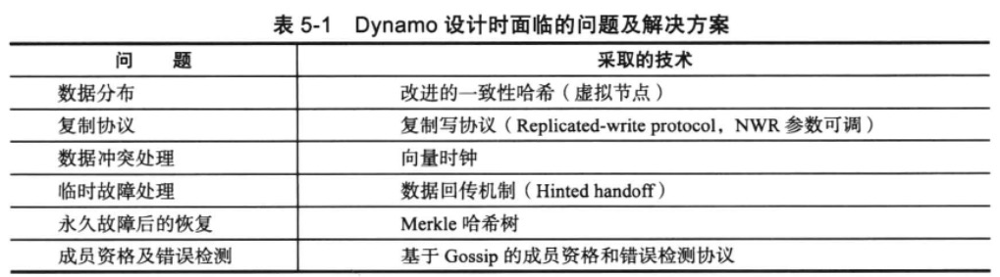

Dynamo以很简单的键值方式存储数据，不支持复杂的查询。Dynamo中存储的是数据值的原始形式，不解析数据的具体内容。<u>Dynamo主要用于Amazon的购物车及S3云存储服务。</u>  
Dynamo通过组合P2P的各种技术打造了线上可运行的分布式键值系统，表5-1中列出了 Dynamo 设计时面临的问题及最终采取的解决方案。

  

### 数据分布  
### 一致性与复制  
### 容错  
### 负载均衡  
### 读写流程  
### 单机实现  
### 讨论  