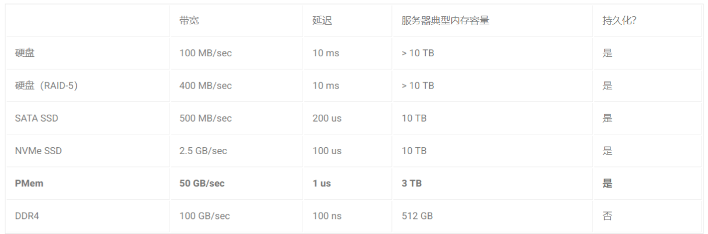

## Intel Optane Persistent Memory——PMem
持久内存三个最重要的特征：大， 快，持久性：  
* 大：  
目前持久内存单条内存容量最大可以达到 512 GB，而目前服务器单条内存一般最多到 32/64 GB。也就是说，单台服务器使用持久内存可以轻松到达 TB 级别的内存容量。另一方面，单位价格来说，持久内存为普通内存的一半左右。

* 快：  
既然也号称为内存，那必然不能慢。可以看到，持久内存相比较于普通 SSD 有 1-2 个数量级的延迟性能优势，相比较于硬盘优势更加巨大。当然对比与 DRAM，其会有一定的性能差距。但是实际使用中由于性能瓶颈不一定在内存上，所以一般不会有特别明显的差距（一般性能衰退在一倍以内）。

* 持久性：  
通俗来说，就是持久内存有跟硬盘一样的特性，断电以后重启，内存中的数据依然存在。此项特性可以说是秒杀内存，内存中的数据我们都知道断电或者程序以外退出以后就不复存在。此项特性使得持久内存即可以当做一个高速持久化设备使用，也可以满足内存应用某些场景下的快速恢复的需求。

如下表格总结了对于数据中心单台服务器上的典型配置，以及相应的大致的性能数字作为参考。  

## 持久内存主要优势场景
### 场景 1：大内存低成本解决方案
如果你的应用内存消耗量是关键，是整个系统的资源瓶颈，那么使用持久内存将会是你降低成本的最佳解决方案。你的系统一般在两种情况下对于大内存有特别的需求

1. 基于内存性能的考量，你必须使用基于内存的解决方案，而不可能使用基于磁盘的方案，比如内存数据库（Redis, MemSQL）。

2. 虽然你的应用可以接受基于磁盘而带来的性能损耗，但是显然如果内存扩大，你的应用可以跑得更快更加节省时间，比如基于 Spark 搭建的应用。

此种场景下，你可以考虑使用持久内存来提供一个大内存低成本的解决方案。

### 场景 2：高性能持久化需求的应用
持久内存作为一个内存和外存的混合体，其高速持久化的特性在某些磁盘 IO 作为性能瓶颈的场景下是一个破局的解法。虽然 SSD 一定程度上也可以缓解磁盘 IO 性能瓶颈，但是相比较于 PMem 这种可以实现两个数量级的吞吐和延迟改进的持久化设备来说，PMem 无疑是具有革命性的意义的。以下抛砖引玉举几个磁盘 IO 作为性能瓶颈的场景。

* 消息队列：  
  大家熟悉的开源消息队列 Kafka，由于其消息持久化逻辑的存在，其吞吐最终会卡在硬盘 IO 上。目前的解法是不断堆机器来扩展整个 Kafka 集群的吞吐。

* 搜索系统：  
  类似于 Kafka，流行的开源搜索系统 Elasticsearch，也将部分的数据结构存放在磁盘上。那么最终影响整体延迟和吞吐的将会是磁盘 IO 的性能。

* 数据库或者 KV 存储引擎：  
  比如 MySQL 或者 RocksDB，都具有重要的面向外存的数据持久化逻辑。

* 分布式文件系统：  
  在人工智能场景中，常常会有大量的小文件存在。比如在 Ceph 的文件系统中，在 metadata server 上对大量小文件的管理常常由于大量随机读写的存在而产生性能问题。

### 场景 3：内存数据持久性的应用
这种场景下，本质上还是把 PMem 当做一个内存来使用，和上一个高性能持久化的场景有所相似有所区别。上一个场景主要是针对本来软件架构设计就有持久化逻辑（比如文件系统本来就需要存在硬盘上），然后我们把持久化逻辑搬移到 PMem 上就可以。其本身可能并不涉及到复杂的数据结构的修改，因为其本来的设计就已经带有了持久化逻辑。但是在场景 3 这种内存数据持久化场景中，软件本身的内存数据结构的设计是没有考虑到持久化逻辑的。因此你需要针对内存中的数据结构重新设计持久化数据结构和逻辑。这一类应用对开发的要求是最高的，同时也是最能完全发挥 PMem 的特点。

此种场景往往是本来就是基于纯内存的应用，但是希望增加数据持久的特性，最常见的需求是因为要快速数据恢复。此种需求一般来自线上服务系统（比如数据库 Redis，或者人工智能场景下的参数服务器、特征工程数据库等），线上服务一旦节点离线，都会造成服务质量的影响。由于系统是基于内存数据结构，离线以后的数据恢复往往需要小时级别的时间来重新抓取数据，并且重新构建内存中的数据结构。如果有了持久内存，此类服务不仅能够通过大内存降低成本，而且可以增加快速恢复功能，保证线上服务质量。

[关于持久内存（PMem）你知道多少？](https://learnku.com/articles/59125)