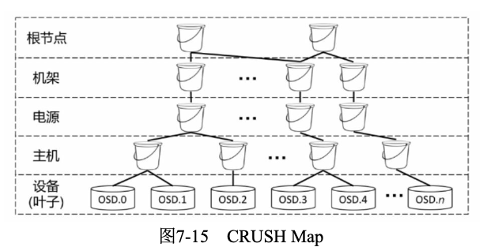

<!-- TOC -->

- [概念定义](#概念定义)
- [第7章 分布式存储与Ceph](#第7章-分布式存储与ceph)
  - [前言](#前言)
  - [7.1 Ceph体系结构](#71-ceph体系结构)
    - [7.1.1 对象存储](#711-对象存储)
    - [7.1.2 RADOS](#712-rados)
    - [7.1.3 OSD](#713-osd)
      - [1.OSD的状态](#1osd的状态)
      - [2.OSD状态检测](#2osd状态检测)
    - [7.1.4 数据寻址](#714-数据寻址)
    - [7.1.5 存储池](#715-存储池)
    - [7.1.6 Monitor——管理节点](#716-monitor管理节点)
    - [7.1.7 数据操作流程](#717-数据操作流程)
    - [7.1.8 Cache Tiering](#718-cache-tiering)
    - [7.1.9 块存储[重点]](#719-块存储重点)
    - [7.1.10 Ceph FS](#7110-ceph-fs)
  - [7.2 后端存储ObjectStore](#72-后端存储objectstore)
  - [7.3 CRUSH算法](#73-crush算法)
    - [7.3.1 CRUSH算法的基本特性](#731-crush算法的基本特性)
    - [7.3.2 CRUSH算法中的设备位置及状态](#732-crush算法中的设备位置及状态)
      - [1. CRUSH Map与设备的物理组织](#1-crush-map与设备的物理组织)
      - [2. CRUSH Map 叶子](#2-crush-map-叶子)
      - [3. CRUSH Map桶](#3-crush-map桶)
      - [4.OSDMap与设备的状态](#4osdmap与设备的状态)
    - [7.3.3 CRUSH中的规则与算法细节](#733-crush中的规则与算法细节)
      - [1.CRUSH Rule基础](#1crush-rule基础)
      - [2.CRUSH Rule的step take与step emit](#2crush-rule的step-take与step-emit)
      - [3.step choose与CRUSH算法原理](#3step-choose与crush算法原理)
        - [1)选择方式、选择个数与失效域](#1选择方式选择个数与失效域)
        - [2)选择备份的策略:firstn与indep](#2选择备份的策略firstn与indep)
        - [3)选择桶的子元素的方式:Bucket Type](#3选择桶的子元素的方式bucket-type)
    - [7.3.4 CRUSH算法实践](#734-crush算法实践)
      - [1.创建和维护CRUSH Map桶结构](#1创建和维护crush-map桶结构)
      - [2.维护CRUSH设备的位置](#2维护crush设备的位置)
      - [3.调整 CRUSH算法](#3调整-crush算法)
        - [1)Tunables](#1tunables)
        - [2)主OSD设备的亲和性](#2主osd设备的亲和性)
        - [3)控制主OSD设备的选择范围](#3控制主osd设备的选择范围)
        - [4.测试CRUSH算法](#4测试crush算法)
    - [7.3.5 CRUSH算法在Ceph中的应用](#735-crush算法在ceph中的应用)
      - [1.存储池](#1存储池)
      - [2.PG](#2pg)
  - [7.4 Ceph可靠性](#74-ceph可靠性)
    - [7.4.1 OSD多副本](#741-osd多副本)
    - [7.4.2 OSD纠删码](#742-osd纠删码)
    - [7.4.3 RBD mirror](#743-rbd-mirror)
    - [7.4.4 RBD Snapshot](#744-rbd-snapshot)

<!-- /TOC -->

# 概念定义
RADOS：Reliable，Autonomous，Distributed Object Storage(可靠的、自动化的、分布式的对象存储);  
RBD: 提供了一个标准的块设备接口;  
RADOS GW: Ceph对象网关RADOS GW（RADOS Gateway)。RADOS GW是一个基于librados库构建的对象存储接口, 为应用访问Ceph集群提供了一个与Amazon S3和Swift兼容的RESTful风格的网关;  
Ceph FS是一个可移植操作系统接口兼容的分布式存储系统;  

# 第7章 分布式存储与Ceph

## 前言

Ceph起源于Sage  Weil在2004年的一篇博士学术论文，截至2010年3月底，Linux 2.6.34内核开始对Ceph进行支持。Ceph作为一个强调性能的典型系统项目，是<u>使用C++语言进行开发的</u>。目前Ceph已经成为OpenStack社区中呼声较高的开源存储方案。

Ceph的官方定义为：Ceph  is  a  unified，  distributed  storage  system
designed for excellent performance， reliability and scalability.（Ceph是一种为优秀的性能、可靠性和可扩展性而设计的统一的、分布式的存储系统。）
这里面比较关键的两个词是“unified”（统一的），以及“distributed”（分布式的）。<u>“unified”意味着Ceph可以用一套存储系统同时提供对象存储、块存储和文件系统存储3种功能</u>，以便在满足不同应用需求的前提下简化部署和运维的步骤。<u>“distributed”则意味着无中心结构，系统规模的扩展可以没有理论上限。</u>

Ceph最初针对的目标应用场景，就是大规模的、分布式的存储系统。在Sage的思想中，**Ceph需要很好地适应这样一个大规模存储系统的动态特性**（以下部分内容来自章宇的“Ceph浅析”）。
1. 存储系统规模的变化：这样大规模的存储系统，往往不是在构建的第一天就能预料到其最终的规模的，甚至根本就不存在最终规模这个概念。只能是随着业务的不断拓展，业务规模的不断扩大，让系统承载越来越大的数据容量。
2. 存储系统中设备的变化
3. 存储系统中数据的变化

为了适应这种动态变化的应用场景，Ceph在设计时就**预期要具有如下技术特性**。
1. 高可靠性。所谓“高可靠”，首先，对存储在系统中的数据而言，尽可能保证数据不会丢失。其次，也包括数据写入过程中的可靠性，即在用户将数据写入Ceph存储系统的过程中，不会因为意外情况的出现而造成数据丢失。
2. 高度自动化。<u>具体包括数据的自动复制、自动再平衡、自动故障检测（Failure Detection）和自动故障恢复（Failure Recovery）。</u>总体而言，这些自动化特性一方面保证了系统的高度可靠，另一方面也保证了在系统规模扩大之后，其运维难度仍能保持在一个相对较低的水平。
3. 高可扩展性。这里的“可扩展”概念比较广义，既包括了系统规模和存储容量的可扩展，也包括了随着系统节点数增加的聚合数据访问带宽的线性扩展，还包括了基于强大的底层API支持多种功能、多种应用的功能性可扩展。

针对上述技术特性，**Sage对于Ceph的设计思路**基本上可以概括为以下两点。
1. 充分发挥存储设备自身的计算能力。事实上，采用具有计算能力的设备（最简单的例子就是普通的服务器）作为存储系统的存储节
点，这种思路即便是在Ceph发布的当时来看也并不新鲜。<u>但是，Sage认为那些已有系统基本上都只是将这些节点作为功能简单的存储节点。而如果充分发挥节点上的计算能力，则可以实现上述预期的技术特性。这一点成了Ceph系统设计的核心思想。</u>
2. 去除所有的中心点。一旦系统中出现中心点，一方面会引入单点故障点，另一方面也必然面临当系统规模扩大时出现的规模和性能瓶
颈。除此之外，如果中心点出现在数据访问的关键路径上，事实上也必然导致数据访问的延迟增大。而这些显然都是Sage所设想的系统中不应该出现的问题。<u>虽然在大多数系统的工程实践中，单点故障点和性能瓶颈的问题可以通过为中心点增加备份加以缓解，但Ceph系统最终采用创新的方法更为彻底地解决了这个问题。</u>

一般而言，一个**大规模分布式存储系统，必须要能够解决两个最基本的问题**。
1. “我应该把数据写到什么地方。”——数据分布理论决定了存储单元寿命、存储可靠性、写入延迟、数据访问速度等；
2. “我之前把数据写到什么地方了。”对于一个存储系统而言，高效、准确地处理数据寻址问题也是其基本能力之一；

传统的分布式存储系统常用的解决方案是引入专用的服务器节点，在其中存储用于维护数据存储空间映射关系的数据结构。在用户写入或访问数据时，首先连接这一服务器进行查找操作，待查到数据实际存储位置后，再连接对应节点进行后续操作。由此可见，传统的解决方案一方面容易导致单点故障和性能瓶颈问题，另一方面也容易导致更长的操作延迟问题。

<u>**Ceph寻址采用基于计算的方式**</u>  
针对这些问题，Ceph彻底放弃了基于查表的数据寻址方式，而改用基于计算的方式。简言之，任何一个Ceph存储系统的客户端程序，仅仅使用不定期更新的少量本地元数据，加以简单计算，就可以根据一个数据的ID决定其存储位置。

## 7.1 Ceph体系结构
* 1. Ceph存储集群
Ceph基于可靠的、自动化的、分布式的对象存储（Reliable，Autonomous，Distributed  Object  Storage，RADOS）提供了一个可无限扩展的存储集群。<u>RADOS，顾名思义，这一层本身就是一个完整的对象存储系统，所有存储在Ceph系统中的用户数据事实上最终都是由这一层来存储的。而Ceph的高可靠、高可扩展、高性能、高自动化等特性本质上也是由这一层提供的。</u>因此，理解RADOS是理解Ceph的基础与关键。
物理上，RADOS由大量的存储设备节点组成，每个节点拥有自己的硬件资源（CPU、内存、硬盘、网络），并运行着操作系统和文件系
统。

* 2. 基础库librados——本地API
Ceph客户端用一定的协议和存储集群进行交互，Ceph 把此功能封装进了librados库，这样基于librados库我们就能创建自己的定制客户端了。
<u>librados库实际上是对RADOS进行抽象和封装，并向上层提供API的，以便可以基于RADOS（而不是整个Ceph）进行应用开发。</u>特别要注意的是，RADOS是一个对象存储系统，因此，librados库实现的API也只是针对对象存储功能的。
RADOS采用C++语言进行开发，所提供的原生librados API包括C语言和C++语言两种。在物理上，librados和基于其上开发的应用位于同一台机器中，因而也被称为本地API。应用调用本机上的librados API，再由后者通过socket与RADOS集群中的节点通信并完成各种操作。

* 3. <u>高层应用接口RADOS GW、RBD与Ceph FS</u>
这一层的作用是在librados库的基础上提供抽象层次更高、更便于应用或客户端使用的上层接口。

<u>Ceph对象网关RADOS GW（RADOS Gateway）是一个构建在librados库之上的对象存储接口</u>，为应用访问Ceph集群提供了一个与Amazon S3和Swift兼容的RESTful风格的网关。

<u>**RBD则提供了一个标准的块设备接口，常用于在虚拟化的场景下为虚拟机创建存储卷。Red Hat已经将RBD驱动集成在KVM/QEMU中，以提高虚拟机的访问性能。**</u>

<u>Ceph FS是一个可移植操作系统接口兼容的分布式存储系统</u>，使用Ceph存储集群来存储数据。  

* 4. 应用层
<u>**这一层包含的是在不同场景下对应Ceph各个应用接口的各种应用方式。例如，基于librados库直接开发的对象存储应用，基于RADOS GW开发的对象存储应用，基于RBD实现的云硬盘**</u>，等等。

### 7.1.1 对象存储
<u>**严格意义上讲，Ceph只提供对象存储接口，所谓的块存储接口和文件系统存储接口都算是对象存储接口应用程序。**</u>不同于传统文件系统提供的open/read/write/close/lseek，<u>对象存储只提供put/get/delete</u>，对象存储的逻辑单元就是对象而不是我们通常概念中的文件。    
如图7-2所示，<u>对于Ceph来说，**RADOS GW是一个基于librados库构建的对象存储接口，为应用程序提供Ceph存储集群的RESTful网关**，这样Ceph就作为Amazon S3和OpenStack Swift的后端对象存储，应用程序可以直接通过librados的C语言或C++语言API实现对象操作了。</u>

对象存储和我们接触的硬盘和文件系统等存储形态不同，它有两个显著特征，如下所示。
1. 对象存储采用Key/Value（K/V）方式的RESTful数据读/写接口，并且常以网络服务的形式提供数据的访问。
2. 扁平的数据组织结构。对比文件系统，对象存储采用扁平的数据组织结构，往往是两层或三层。例如AWS S3和华为的UDS，每个用
户可以把他的存储空间划分为“容器”，然后往每个容器里放对象，对象不能直接放到用户的根存储空间里，必须放到某个容器下面，而且不能嵌套，也就是说，容器下面不能再放一层容器，只能放对象。OpenStack Swift也类似。

### 7.1.2 RADOS  
如图7-3所示，<u>RADOS集群主要由两种节点组成：为数众多的OSD，负责完成数据存储和维护；若干个Monitor，负责完成系统状态
检测和维护。</u>OSD和Monitor之间互相传递节点的状态信息，共同得出系统的总体运行状态，并保存在一个全局的数据结构中，即所谓的集群运行图（Cluster Map）里。集群运行图与RADOS提供的特定算法相配合，便实现了Ceph的许多优秀特性。  

<u>在使用RADOS系统时，大量的客户端程序向Monitor索取最新的集群运行图，然后直接在本地进行计算，得出对象的存储位置后，便直接与对应的OSD进行通信，完成数据的各种操作。一个Monitor集群确保了某个Monitor失效时的高可用性。</u>

Ceph客户端、Monitor和OSD可以直接交互，这意味着<u>OSD可以利用本地节点的CPU和内存执行那些传统集群架构中有可能拖垮中央服务器的任务，充分发挥节点上的计算能力</u>。

### 7.1.3 OSD
OSD用于实现数据的存储与维护。根据定义，<u>OSD可以**被抽象为系统和守护进程（OSD Daemon）两个部分**</u>。

<u>**OSD的系统部分本质上就是一台安装了操作系统和文件系统的计算机**</u>，其硬件部分**至少包括**一个单核的处理器、一定数量的内存、一块硬盘及一张网卡。

由于这么小规模的X86架构服务器并不实用（事实上也见不到），因**实际应用中**通常将多个OSD集中部署在一台更大规模的服务器上。在选择系统配置时，应当能够保证每个OSD占用一定的计算能力、一定数量的内存和一块硬盘（**在通常情况下一个OSD对应一块硬盘**）。同时，应当保证该服务器具备足够的网络带宽。
在上述系统平台上，每个OSD拥有一个自己的OSD Daemon。**这个Daemon负责完成OSD的所有逻辑功能，包括与Monitor和其他OSD（事实上是其他OSD的Daemon）通信，以维护及更新系统状态，与其他OSD共同完成数据的存储和维护操作，与客户端通信完成各种数据对象操作，等等。**
RADOS集群从Ceph客户端接收数据（无论是来自Ceph块设备、Ceph对象存储、Ceph文件系统，还是基于librados的自定义实现），然后**存储为对象**。如图7-4所示，**每个对象是文件系统中的一个文件，它们存储在OSD的存储设备上，由OSD Daemon处理存储设备上的读/写操作。**

OSD在扁平的命名空间内把所有数据存储为对象（也就是没有目录层次）。**对象包含一个标识符、二进制数和由名/值对组成的元数据，元数据语义完全取决于Ceph客户端**。比如，Ceph FS用元数据存储文件属性，包括文件所有者、创建日期、最后修改日期等。

#### 1.OSD的状态  
OSD的状态直接影响数据的重新分配，所以监测OSD的状态是Monitor的主要工作之一。
OSD状态用两个维度表示：up或down（OSD Daemon与Monitor连接是否正常）；in或out（OSD是否含有PG）。因此，对于任意一个
OSD，共有4种可能的状态。
* up & out：  
  OSD Daemon与Monitor通信正常，但是没有PG分配到该OSD上。这种状态一般是OSD Daemon刚刚启动时。

* up & in：  
  OSD Daemon工作的正常状态，有PG分配到OSD上。  

* down  &  in：  
  OSD  Daemon不能与Monitor或其他OSD进行正常通信，这可能是因为网络中断或Daemon进程意外退出。
  
* down  &  out：  
  OSD无法恢复，Monitor决定将OSD上的PG进行重新分配。之所以会出现该状态，是考虑OSD可能会在短时间内恢复，尽量减少数据的再分配。

#### 2.OSD状态检测  
Ceph是基于通用计算机硬件构建的分布式系统，发生故障的概率要远高于专用硬件的分布式系统。如何及时检测节点故障和网络故障是检验Ceph高可用性的重要一环。由于心跳（Heartbeat）机制简单有效，所以Ceph采用这种方式，但是会增加监测维度。  

* OSD之间的心跳包
  同时由于Ceph提供<u>公众网络（Public Network）（OSD与客户端通信）和集群网络（Cluster Network）（OSD之间的通信）</u>，所以Peer OSD之间的心跳包也分为前端（公众网络）和后端（集群网络），这样可最大限度地监测OSD及公众网络和集群网络的状态，及时上报Monitor。

* OSD与Monitor之间的心跳包
  这个心跳包可以看作是Peer OSD之间心跳包的补充。如果OSD不能与其他OSD交换心跳包，那么就必须与Monitor按照一定频率进行通信，比如OSD状态是up & out时就需要这种心跳包。

### 7.1.4 数据寻址  
如前所述，一个大规模分布式存储系统，必须要能够解决两个最基本的问题，即“我应该把数据写到什么地方”与“我之前把数据写到什么
地方了”，因此会涉及数据如何寻址的问题。  

* File：  
  此处的File就是用户需要存储或访问的文件。对于一个基于Ceph开发的对象存储应用而言，这个File也就对应于应用中的“对象”，也就是用户直接操作的“对象”。
* Object：  
  此处的Object是RADOS所看到的“对象”。Object与File的区别是，Object的最大尺寸由RADOS限定（通常为2MB或4MB），以便实现底层存储的组织管理。因此，当上层应用向RADOS存入尺寸很大的File时，需要将File切分成统一大小的一系列Object（最后一个的大小可以不同）进行存储。
* PG（Placement  Group）：  
  顾名思义，PG的用途是对Object的存储进行组织和位置映射的。具体而言，一个PG负责组织若干个Object（可以为数千个甚至更多），但一个Object只能被映射到一个PG中，即PG和Object之间是“一对多”的映射关系。同时，一个PG会被映射到n 个OSD上，而每个OSD上都会承载大量的PG，即PG和OSD之间是“多对多”的映射关系。在实践当中，n 至少为2，如果用于生产环境，则至少为3。一个OSD上的PG可达到数百个。事实上，PG数量的设置关系到数据分布的均匀性问题。
* OSD：  
  OSD的数量事实上也关系到系统的数据分布均匀性，因此不应该太少。在实践当中，至少也应该是数百个的量级才有助于Ceph系统发挥其应有的优势。

1）File→Object映射  
这次映射的目的是，将用户要操作的File映射为RADOS能够处理的Object，其十分简单，本质上就是按照Object的最大尺寸对File进行切分，相当于磁盘阵列中的条带化过程。这种切分的好处有两个：一是让大小不限的File变成具有一致的最大尺寸、可以被RADOS高效管理的Object；二是让对单一File实施的串行处理变为对多个Object实施的并行化处理。

2）Object → PG映射  
在File被映射为1个或多个Object之后，就需要将每个Object独立地映射到1个PG中去。这个映射过程也很简单，如图7-5所示，其计算公式如下：
```
hash(oid) & mash = pgid
```
由此可见，其计算由两步组成。首先，使用Ceph系统指定的一个静态哈希算法计算oid的哈希值，将oid映射为一个近似均匀分布的伪随机值。然后，将这个伪随机值和mask按位相与，得到最终的PG序号（pgid）。根据RADOS的设计，给定PG的总数为m（m 应该为2的整数幂），则mask的值为m-1。因此，哈希值计算和按位与操作的整体结果事实上是从所有m 个PG中近似均匀地随机选择1个。基于这一机制，当有大量Object和大量PG时，RADOS能够保证Object和PG之间的近似均匀映射。又因为Object是由File切分而来的，大部分Object的尺寸相同，因此，这一映射最终保证了各个PG中存储的Object的总数据量近似均匀。
这里反复强调了“大量”，意思是只有当Object和PG的数量较多时，这种伪随机关系的近似均匀性才能成立，Ceph的数据存储均匀性才有保证。为保证“大量”的成立，一方面，Object的最大尺寸应该被合理配置，以使得同样数量的File能够被切分成更多的Object；另一方面，Ceph也推荐PG总数应该为OSD总数的数百倍，以保证有足够数量的PG可供映射。  

3）PG → OSD映射  
第3次映射就是将作为Object的逻辑组织单元的PG映射到数据的实际存储单元OSD上。如图7-5所示，RADOS采用一个名为CRUSH的算法，将pgid代入其中，然后得到一组共n 个OSD。这n个OSD共同负责存储和维护一个PG中的所有Object。<u>前面提到过，n 的数值可以根据实际应用中对于可靠性的需求而配置，在生产环境下通常为3</u>。具体到每个OSD，则由其上运行的OSD Daemon负责执行映射到本地的Object在本地文件系统中的存储、访问、元数据维护等操作。  
和“Object  →  PG”映射中采用的哈希算法不同，CRUSH算法的结果不是绝对不变的，而会受到其他因素的影响。其影响因素主要有两个。  
**一是当前系统状态，也就是在前面有所提及的集群运行图。**当系统中的OSD状态、数量发生变化时，集群运行图也可能发生变化，而这种变化将会影响到PG与OSD之间的映射关系。  

**二是存储策略配置。这里的策略主要与安全相关。**利用策略配置，系统管理员可以指定承载同一个PG的3个OSD分别位于数据中心的不同服务器或机架上，从而进一步改善存储的可靠性。

因此，只有在系统状态和存储策略都不发生变化的时候，PG和OSD之间的映射关系才是固定不变的。在实际使用中，策略一经配置通
常不会改变。而系统状态的改变或是因为设备损坏，或是因为存储集群规模扩大。好在Ceph本身提供了对这种变化的自动化支持，因而，即便PG与OSD之间的映射关系发生了变化，也并不会对应用产生影响。事实上，Ceph正是利用了CRUSH算法的动态特性，可以将一个PG根据需要动态迁移到不同的OSD组合上，从而自动化地实现高可靠性、数据分布再平衡等特性。

<u>**之所以在此次映射中使用CRUSH算法，而不使用其他哈希算法，一方面原因是CRUSH算法具有上述可配置特性，可以根据管理员的配置参数决定OSD的物理位置映射策略；另一方面原因是CRUSH算法具有特殊的“稳定性”，也即，当系统中加入新的OSD，导致系统规模增大时，大部分PG与OSD之间的映射关系不会发生改变，只有少部分PG的映射关系会发生变化并引发数据迁移。这种可配置性和稳定性都不是普通哈希算法所能提供的。因此，CRUSH算法的设计也是Ceph的核心内容之一。**</u>  

至此为止，Ceph通过3次映射，完成了从File到Object、Object到PG、PG再到OSD的整个映射过程。从整个过程可以看到，这里没有任何的全局性查表操作需求。至于唯一的全局性数据结构：集群运行图。它的维护和操作都是轻量级的，不会对系统的可扩展性、性能等因素造成影响。  

接下来的一个问题是：为什么需要引入PG并在Object与OSD之间增加一层映射呢？
**引入PG的好处至少有两方面：一方面实现了Object和OSD之间的动态映射，从而为Ceph的可靠性、自动化等特性的实现留下
了空间；另一方面也有效简化了数据的存储组织，大大降低了系统的维护与管理成本**。
这种分层或分级的设计思路在很多复杂系统的寻址问题上都有应用，比如操作系统里的内存管理多级页表的使用，英特尔MPX（Memory  Protection  Extensions）技术里引入的Bound  Directory等。

### 7.1.5 存储池  
存储池是一个逻辑概念，是对存储对象的逻辑分区。Ceph安装后，会有一个默认的存储池，用户也可以自己创建新的存储池。一个存储池包含若干个PG及其所存储的若干个对象。  
Ceph客户端从监视器获取一张集群运行图，并把对象写入存储池。<u>**存储池的大小或副本数、CRUSH存储规则和归置组数量决定Ceph如何放置数据。**</u>
我们可以使用以下命令来创建存储池:
```
$ ceph osd pool create {pool-name} {pg-num} [{pgp-num}] [replicated]\[crush-ruleset-name]
$ ceph osd pool create {pool-name} {pg-num} [{pgp-num}] [erasure]\[erasure-code-profile] [crush-ruleset-name]
```
从代码中可以看出，存储池支持的内容如下。
· 设置数据存储的方法属于多副本模式还是纠删码模式。如果是多副本模式，则可以设置副本的数量；如果是纠删码模式，则可以设置数据块和非数据块的数量（纠删码存储池把各对象存储为K+M个数据块，其中有K 个数据块和M 个编码块）。默认为多副本模式（即存储每个对象的若干个副本），如果副本数为3，则每个PG映射到3个OSD节点上。换句话说，对于每个映射到该PG的对象，其数据存储在对应的3个OSD节点上。
· 设置PG的数目。合理设置PG的数目，可以使资源得到较优的均衡。
· 设置PGP的数目。在通常情况下，与PG数目一致。当需要增加PG数目时，用户数据不会发生迁移，只有进一步增加PGP数目时，用户数据才会开始迁移。
· 针对不同的存储池设置不同的CRUSH存储规则。比如可以创建规则，指定在选择OSD时，选择拥有固态硬盘的OSD节点。

另外，通过存储池，还可以进行如下操作。
· 提供针对存储池的功能，如存储池快照等。
· 设置对象的所有者或访问权限。
我们看到这里在PG的基础上又出现了PGP的概念
<u>**PG = Placement Group**</u>
<u>**PGP =  Placement Group for Placement purpose**</u>
<u>**pg_num = number of placement groups mapped to an OSD**</u>

PG数目的增加会引起PG的分裂，新的PG仍然在原来的OSD上，而PGP数目的增加则会引起部分PG的分布发生变化（触发迁移重平衡）。

### 7.1.6 Monitor——管理节点  
Ceph客户端读或写数据前必须先连接到某个Ceph监视器上，获得最新的集群运行图副本。Ceph支持监视器集群（冗灾）。在集群中，各个Monitor的功能总体上是一样的，其之间的关系可以被简单理解为主从备份关系。

由若干个Monitor组成的监视器集群共同负责整个Ceph集群中所有OSD状态的发现与记录，并且形成集群运行图的主副本，包括集群成员、状态、变更，以及Ceph存储集群的整体健康状况。<u>随后，这份集群运行图被扩散至全体OSD及客户端，OSD使用集群运行图进行数据的维护，而客户端使用集群运行图进行数据的寻址。</u>

<u>**集群运行图**实际上是多个Map的统称，包括Monitor Map、OSDMap、PG Map、CRUSH Map及MDS Map等，各运行图维护着各自运行状态的变更。</u>

1.Monitor与客户端的通信
2.Monitor与OSD的通信

### 7.1.7 数据操作流程  
<u>**Ceph的读/写操作采用Primary-Replica模型**</u>，客户端只向Object所对应OSD set的Primary发起读/写请求，这保证了数据的强一致性。当Primary收到Object的写请求时，它负责把数据发送给其他副本，只有这个数据被保存在所有的OSD上时，Primary才应答Object的写请求，这保证了副本的一致性。
当然，这种可靠性机制必然导致较长的延迟，特别是，如果等到所有的OSD都将数据写入磁盘后再向客户端发送确认信号，则整体延迟可能难以忍受。<u>因此，Ceph可以分两次向客户端进行确认。当各个OSD都将数据写入内存缓冲区后，就先向客户端发送一次确认，此时客户端即可以向下执行。待各个OSD都将数据写入磁盘后，会向客户端发送一个最终确认信号，此时客户端可以根据需要删除本地数据。</u>
<u>在目前的Ceph设计中，被读取的数据默认由Primary OSD提供，但也可以设置允许从其他OSD中获取，以分散读取压力从而提高性能。</u>

### 7.1.8 Cache Tiering
分布式的集群一般都采用廉价的PC与传统的机械硬盘进行搭建， 所以在磁盘的访问速度上有一定的限制，没有理想的IOps数据。当去优化一个系统的I/O性能时，最先想到的就是添加快速的存储设备作为缓存，热数据在缓存被访问到，缩短数据的访问延时。Ceph也从Firefly 0.80版本开始引入这种存储分层技术，即Cache Tiering。

Cache Tiering的理论基础，就是存储的数据是有热点的，数据并不是均匀访问的。也就是80%的应用只访问20%的数据，那么这20%的数 据就称为热点数据，如果把这些热点数据保存到固态硬盘等性能比较高的存储设备上，那么就可以减少响应的时间。

<u>所以Cache Tiering的做法就是，**用固态硬盘等相对快速、昂贵的存储设备组成一个存储池作为缓存层存储热数据，然后用相对慢速、廉价的设备作为存储后端存储冷数据(Storage层或Base层)。缓存层使用多副本模式，Storage层可以使用多副本或纠删码模式。**</u>

如图7-9所示，Ceph的对象管理器(Objecter，位于osdc即OSD客户端模块)决定往哪里存储对象，分层代理决定何时把缓存内的对象“刷回”Storage层，所以缓存层和Storage层对Ceph客户端来说是完全透明的。需要注意的是，Cache Tiering是基于存储池的，在缓存层和Storage层之间的数据移动是两个存储池之间的数据移动。

目前Cache Tiering主要支持如下几种模式。
· 写回模式:对于写操作，当请求到达缓存层完成写操作后，直接应答客户端，之后由缓存层的代理线程负责将数据写入Storage层。对于读操作则看是否命中缓存层，如果命中直接在缓存层读，没有命中可以重定向到Storage层访问，如果Object近期有访问过，说明比较热，可以提升到缓存层中。
· forward模式:所有的请求都重定向到Storage层访问。
· readonly模式:写请求直接重定向到Storage层访问，读请求命中缓存层则直接处理，没有命中缓存层需要从Storage层提升到缓存层中进 而完成请求，下次再读取直接命中缓存。
· readforward模式:读请求都重定向到Storage层中，写请求采用写回模式。
· readproxy模式:读请求发送给缓存层，缓存层去Storage层中读取，获得Object后，缓存层自己并不保存，而是直接发送给客户端，写请求采用写回模式。
· proxy模式:对于读/写请求都是采用代理的方式，不是转发而是代表客户端去进行操作，缓存层自己并不保存。

这里提及的重定向、提升与代理等几种操作的具体含义如下。
· 重定向:客户端向缓存层发送请求，缓存层应答客户端发来的请求，并告诉客户端应该去请求Storage层，客户端收到应答后，再次发送请求给Storage层请求数据，并由Storage层告诉客户端请求的完成情况。
· 代理:客户端向缓存层发送读请求，如果未命中，则缓存层自 己会发送请求给Storage层，然后由缓存层将获取的数据发送给客户端， 完成读请求。在这个过程中，虽然缓存层读取到了该Object，但不会将 其保存在缓存层中，下次仍然需要重新向Storage层请求。
· 提升:客户端向缓存层发送请求，如果缓存层未命中，则会选 择将该Object从Storage层中提升到缓存层中，然后在缓存层进行读/写操 作，操作完成后应答客户端请求完成。在这个过程中，和代理操作的区别是，在缓存层会缓存该Object，下次直接在缓存中进行处理。

### 7.1.9 块存储[重点]
如前所述，Ceph可以用一套存储系统同时提供对象存储、块存储和 文件系统存储3种功能。Ceph存储集群RADOS自身是一个对象存储系 统，基础库librados提供一系列的API允许用户操作对象和OSD、MON等进行通信。基于RADOS与librados库，Ceph通过RBD提供了一个标准的块设备接口，提供基于块设备的访问模式。
<u>**Ceph中的块设备称为Image，是精简配置的**</u>，即按需分配，大小可调且将数据条带化存储到集群内的多个OSD中。

条带化是指把连续的信息分片存储于多个设备中。当多个进程同时访问一个磁盘时，可能会出现磁盘冲突的问题。大多数磁盘系统都对访 问次数(每秒的I/O操作)和数据传输率(每秒传输的数据量，TPS)有限制，当达到这些限制时，后面需要访问磁盘的进程就需要等待，这时就是所谓的磁盘冲突。避免磁盘冲突是优化I/O性能的一个重要目标， 而优化I/O性能最有效的手段是将I/O请求最大限度地进行平衡。

条带化就是一种能够自动将I/O负载均衡到多个物理磁盘上的技 术。通过将一块连续的数据分成多个相同大小的部分，并把它们分别存 储到不同的磁盘上，条带化技术能使多个进程同时访问数据的不同部分 而不会造成磁盘冲突，而且能够获得最大限度上的I/O并行能力。

条带化能够将多个磁盘驱动器合并为一个卷，这个卷所能提供的速度比单个盘所能提供的速度要快很多。<u>Ceph的块设备就对应于LVM的逻辑卷，</u>块设备被创建时，可以指定如下参数实现条带化。
· stripe-unit:条带的大小。
· stripe-count:在多少数量的对象之间进行条带化。

使用Ceph的块设备有两种路径。
· 通过Kernel Module:即创建了RBD设备后，把它映射到内核中，成为一个虚拟的块设备，这时这个块设备同其他通用块设备一样，设备文件一般为/dev/rbd0，后续直接使用这个块设备文件就可以了，可以把/dev/rbd0格式化后挂载到某个目录，也可以直接作为裸设备进行使用。
· 通过librbd: 即创建了RBD设备后，使用librbd、librados库访问和管理块设备。这种方式直接调用librbd提供的接口，实现对RBD设备的访问和管理，不会在客户端产生块设备文件。

<u>**其中第二种方式主要是为虚拟机提供块存储设备。在虚拟机场景中，一般会用QEMU/KVM中的RBD驱动部署Ceph块设备，宿主机通过 librbd向客户机提供块存储服务。QEMU可以直接通过librbd，像访问虚拟块设备一样访问Ceph块设备。**</u>

### 7.1.10 Ceph FS
Ceph FS是一个可移植操作系统接口兼容的分布式存储系统，与通常的网络文件系统一样，要访问Ceph FS，需要有对应的客户端。Ceph FS支持两种客户端:Ceph FS FUSE和Ceph FS Kernel。也就是说有两种使用Ceph FS的方式:
一是通过Kernle Module，Linux内核里包含了Ceph FS的实现代码;
二是通过FUSE(用户空间文件系统)的方式。通过调用libcephfs库来实现Ceph FS的加载，而libcephfs库又调用librados库与RADOS进通信。

<u>之所以会通过FUSE的方式实现Ceph FS的加载，主要是考虑Kernel客户端的功能、稳定性、性能都与内核绑定，在不能升级内核的情况下，很多功能可能就不能使用。而FUSE基本就不存在这个限制。</u>

上层是支持客户端的Ceph FS Kernel Object、Ceph FS FUSE、Ceph FS Library等，底层还是基础的OSD和Monitor，<u>此外添加了元数据服务器(MDS)。Ceph FS要求Ceph存储集群内至少有一个元数据服务器， 负责提供文件系统元数据(目录、文件所有者、访问模式等)的存储与操作。MDS只为Ceph FS服务，如果不需要使用Ceph FS，则不需要配置MDS。</u>

Ceph FS从数据中分离出元数据，并存储于MDS，文件数据存储于集群中的一个或多个对象。<u>MDS(称为ceph-mds的守护进程)存在的原因是，**简单的文件系统操作，比如ls、cd这些操作会不必要地扰动OSD**，所以把元数据从数据里分离出来意味着Ceph文件系统既能提供高性能服务，又能减轻存储集群负载。</u>    


## 7.2 后端存储ObjectStore

## 7.3 CRUSH算法
作为一个分布式存储系统，如何合理地分布数据非常重要。Ceph系统的许多特性，如去中心化、易扩展性和负载均衡等都和它采用的 CRUSH数据分布算法是密不可分的。经过不断地实践和优化，Ceph作 为开源云存储重要的后端之一，被大家认可，这也离不开CRUSH算法 的先进设计。

### 7.3.1 CRUSH算法的基本特性
在单一设备或节点上存储数据，它的容量总是有限的。随着计算机 技术的发展，单个节点已经远远无法满足人们日益增长的存储需求。这时，就需要一个通过网络连接的多节点存储系统，同时提供给上层应用稳定和统一的存储接口使用，并在必要的时候能够通过增加节点来达到理论上无限的扩容空间。

要在多个硬盘或节点中存储数据，方法有如下几个：

* 方法1:将新数据写到新盘或空闲盘中——顺序分布  
缺点：  
a. 首先新数据会集中保存在新盘中，而往往新数据也会是热数据，这会导致存储系统中的输入、输出集中在少数几个盘中，从而形成性能瓶颈。  
b. 删除旧数据后形成的空间碎片不经过整理会很难得到 有效利用。

* 方法2: 哈希算法——随机混合的数据分布：  
将数据块随机均匀地分布到整个集群中，同时由于哈希算法的稳定性，读取时也能够快速索引到需要的内容。  
优点：  
a. 实现让读/写均匀地分布在集群中，最大化利用带宽资源  
b. 可以保证数据删除的行为在哈希后也是均匀分布的。若数据块大小不一致，也可以通过事先分割来达到数据的均匀分布。    
缺点：  
a. 当集群大小发生变化，如扩容或设备失效时，简单的基于节点数量的哈希算法会导致所有集群数据的剧烈迁移，甚至导致存储系统处于不可用的状态，这是不能被接受的。

* 方法3:一致性哈希算法——随机混合的数据分布：   
优点：  
a. 解决了扩容带来的数据迁移问题，甚至能够接近理论上的最优解。即在存有k个数据块的n个节点存储系统中，再增加m个节点只会导致平均k ×m /(n + m )个数据块从n个节点向m个节点迁移，而非所有k个数据块全部重新分布。    
缺点：  
a. 一致性哈希算法的模型仍然过于简单，不足以应对存储系统中出现的各种可能的情况。<u>最突出的就是数据失效问题</u>，因为所有用户数据都是均匀分布在系统中的，所以一个设备的失效将会影响所有用户数据的完整性。  
b. 由于一致性哈希算法没有感知存储节点的实际物理分布的能力，<u>如何合理地控制数据的失效域更是无从谈起</u>。

由此可见，为一个分布式存储系统实现数据分布算法不简单，至少需要考虑下述情况。  
<u>· 实现数据的随机分布，并在读取时能快速索引。</u>   
<u>**· 能够高效地重新分布数据，在设备加入、删除和失效时最小化数据迁移。**</u>   
<u>**· 能够根据设备的物理位置合理地控制数据的失效域。**</u>    
<u>· 支持常见的镜像、磁盘阵列、纠删码等数据安全机制。</u>    
<u>· 支持不同存储设备的权重分配，来表示其容量大小或性能。</u>  

CRUSH算法在设计时就考虑了上述5种情况。CRUSH算法根据输入x得到随机的n个(图7-14为3个)有序的位置，即OSD.k ，并保证在相同的元数据下，对于输入x的输出总是相同的。    
<u>**CRUSH元数据包含了CRUSH Map、OSDMap和CRUSH Rule。**</u> 
其中，<u>CRUSH Map保存了集群中所有设备或OSD存储节点的位置信息和权重设置，使CRUSH算法能够感知OSD的实际分布和特性</u>，并通过<u>用户定义的CRUSH Rule来保证算法选择出来的位置能够合理分布在不同的失效域中</u>。而<u>OSDMap保存了各个OSD的运行时状态，能够让CRUSH算法感知存储节点的失效、删除和加入情况，产生最小化的数据迁移，提高Ceph在各种情况下的可用性和稳定性。</u>

### 7.3.2 CRUSH算法中的设备位置及状态
在介绍CRUSH算法的细节之前，我们有必要先介绍一下CRUSH元数据是如何维护OSD设备信息的。其中，<u>**CRUSH Map主要保存了OSD 的物理组织结构，而OSDMap保存了各OSD设备的运行时状态。**</u> <u>CRUSH 算法即通过一系列精心设计的哈希算法去访问和遍历CRUSH Map，按照用户定义的规则选择正常运行的OSD来保存数据对象。</u>

#### 1. CRUSH Map与设备的物理组织
CRUSH Map本质上是一种有向无环图(DAG)，用来描述OSD的物理组织和层次结构。其结构如图7-15所示，<u>所有的叶子节点表示OSD 设备，而所有的非叶子节点表示桶。</u>桶根据层次来划分可以定义不同的类型(CRUSH Type或Bucket Class)，如根节点、机架、电源等。
  

在默认情况下，Ceph会创建两种类型的桶，分别是根节点和主机，
 
然后把所有的OSD设备都放在对应的主机类型桶中，再把所有主机类型桶放入一个根节点类型桶中。在更复杂的情况下，例如，要防止由于机架网络故障或电源失效而丢失数据，就需要用户自行创建桶的类型层次 并建立对应的CRUSH Map结构。
查看当前集群的CRUSH Map可以使用如下命令:
```
$ ceph osd crush tree
```  
其中，负数ID的行表示CRUSH桶，非负数ID的行表示OSD设备，CLASS表示OSD设备的Device Class，TYPE表示桶类型，即CRUSH Type。

#### 2. CRUSH Map 叶子
CRUSH Map中所有的叶子节点即OSD设备，每个OSD设备在 CRUSH Map中具有名称、Device Class和全局唯一的非负数ID。<u>其中， 默认的Device Class有硬盘驱动器、固态硬盘和NVMe 3种，用于区分不同的设备类型。</u> Ceph可以自动识别OSD的Device Class类型，当然也可以由用户手动创建和指定。当前Ceph内部会为每个Device Class维护一个Shadow CRUSH Map，在用户规则中指定选择某一个Device Class，比如固态硬盘时，CRUSH算法会自行基于对应的Shadow CRUSH Map执行。可以使用以下命令查看Device Class和Shadow CRUSH Map:
```
// 列出所有的Device Class
$ceph osd crush class ls

// 显示Shadow CRUSH Map
$ceph osd crush tree --show-Shadow
```

#### 3. CRUSH Map桶  
<u>CRUSH Map中所有的非叶子节点即桶，桶也具有名称、Bucket Class和全局唯一的负数ID。**属于同一种Bucket Class的桶往往处于CRUSH Map中的同一层次，其在物理意义上往往对应着同一类别的失效域，如主机、机架等。

**</u>作为保存其他桶或设备的容器，桶中还可以定义具体的子元素列表、对应的权重(Weight)、CRUSH算法选择子元素的具体策略，以及哈希算法。其中，**权重可以表示各子元素的容量或性能**，当表示为容量时，其值默认以TB为单位，可以根据不同的磁盘性能适当微调具体的权重。**CRUSH算法选择桶的子元素的策略又称为Bucket Type，默认为Straw方式**，它与CRUSH算法的实现有关，我们只需要知道不同的策略与数据如何重新分布、计算效率和权重的处理方式密切相关，具体的 细节后续会进行介绍。**桶中的哈希算法默认值为0，其意义是rjenkins1，即Robert Jenkin's Hash。它的特点是可以保证即使只有少量的数据变化，或者有规律的数据变化也能导致哈希值发生巨大的变化，并让哈希值的分布接近均匀。**同时，其计算方式能够很好地利用32位或64位处理器的计算指令和寄存器，达到较高的性能。在CRUSH Map中，Bucket Class与桶的具体定义如下:  
```
// Bucket Class的定义  
type <Bucket Class ID> <Bucket Class名称>  
// 桶的定义
<Bucket Class名称> <桶名>{
  id <负数ID>
  alg <Bucket Type: Uniform/List/Tree/Straw/Straw2>
  hash <哈希算法：0/1>
  item <子桶名或设备名1> weight <权重1>
  item <子桶名或设备名2> weight <权重2>
  ...
}
```

#### 4.OSDMap与设备的状态  
在运行时期，Ceph的Monitor会在OSDMap中维护一种所有OSD设 备的运行状态，并在集群内同步。其中，OSD运行状态的更新是通过 OSD-OSD和OSD-Monitor的心跳完成的。任何集群状态的变化都会导致 Monitor中维护的OSDMap版本号(Epoch)递增，这样Ceph客户端和OSD服务就可以通过比较版本号大小来判断自己的Map是否已经过时， 并及时进行更新。  

OSD设备的具体状态可以是在集群中(in)或不在集群中(out)， 以及正常运行(up)或处于非正常运行状态(down)。其中OSD设备的in、out、up和down状态可以任意组合，只是当OSD同时处于in和down状态时，表示集群处于不正常状态。在OSD快满时，也会被标记 为full。我们可以通过以下命令查询OSDMap的状态，或者手动标记OSD设备的状态:  
```
// 查看OSD状态和OSDMap epoch
$ ceph osd stat

// 手动标记OSD设备状态
$ ceph osd up<OSD-ids>
$ ceph osd down<OSD-ids>
$ ceph osd in<OSD-ids>
$ ceph osd out<OSD-ids>
```

### 7.3.3 CRUSH中的规则与算法细节  
在了解了CRUSH Map是如何维护OSD设备的物理组织，以及OSDMap是如何维护OSD设备的运行时状态后，我们就更容易理解CRUSH Rule是如何做到个性化的数据分布策略，以及CRUSH算法的实现机制了。    

#### 1.CRUSH Rule基础  
仅仅了解了OSD设备的位置和状态，CRUSH算法还是无法确定数据该如何分布。由于具体使用需求和场景的不同，用户可能会需要截然 不同的数据分布方式，而CRUSH Rule就提供了一种方式，即通过用户定义的规则来指导CRUSH算法的具体执行。其场景主要如下所示。
<u>· 数据备份的数量:</u> 规则需要指定能够支持的备份数量。
<u>· 数据备份的策略:</u> 通常来说，多个数据副本是不需要有顺序的;但是纠删码不一样，纠删码的各个分片之间是需要有顺序的。所以CRUSH算法需要了解各个关联的副本之间是否存在顺序性。
<u>· 选择存储设备的类型:</u> 规则需要能够选择不同的存储设备类型来满足不同的需求，比如高速、昂贵的固态硬盘类型设备，或者低速、廉价的硬盘驱动器类型设备。
<u>**· 确定失效域:**</u> 为了保证整个存储集群的可靠性，规则需要根据CRUSH Map中的设备组织结构选择不同的失效域，并依次执行CRUSH算法。

Ceph集群通常能够自动生成默认的规则，但是默认规则只能保证集群数据备份在不同的主机中。实际情况往往更加精细和复杂，这就需要用户根据失效域自行配置规则，保存在CRUSH Map中，代码如下:  
```
// CRUSH Rule的定义
rule <规则名称>{
  ruleset <唯一的规则ID>
  type <备份策略：replicated/erasure>
  min_size <规则支持的最少备份数量>
  max_size <规则支持的最多备份数量>
  // 选择设备范围，确定失效域
  step take ...
  step choose ...
  ......
  step emit
}
```
其中，规则能够支持的备份数量是由min_size和max_size确定的， type确定了规则所适用的备份策略。Ceph在执行CRUSH算法时，会通过 ruleset对应的唯一ID来确定具体执行哪条规则，并通过规则中定义的 step来选择失效域和具体的设备。
所有规则的详细定义如下:
```
$ ceph osd crush rule dump
```

#### 2.CRUSH Rule的step take与step emit   
CRUSH Rule执行步骤中的第一步和最后一步分别是step take与step emit。step take通过桶名称来确定规则的选择范围，对应CRUSH Map中的某一个子树。同时，也可以选择Device Class来确定所选择的设备类型，如固态硬盘或硬盘驱动器，CRUSH算法会基于对应的Shadow CRUSH Map来执行接下来的step choose。step take的具体定义如下:  
```
step take <桶名称> [class <Device Class>]
```
step emit非常简单，即表示步骤结束，输出选择的位置。

#### 3.step choose与CRUSH算法原理
CRUSH Rule的中间步骤为step choose，其执行过程即对应CRUSH算法的核心实现。每一step choose需要确定一个对应的失效域，以及在当前失效域中选择子项的个数。由于数据备份策略的不同(如镜像与纠删码)，step choose还要确定选择出来的备份位置的排列策略。其定义如下:
```
  step <选择方式: choose/chooseleaf>
       <选择备份的策略: firshn/indep>
       <选择个数：n>
       type <失效域所对应的Bucket Class>
```
此外，CRUSH Map中的桶定义也能影响CRUSH算法的执行过程。 例如，CRUSH算法还需要考虑桶中子项的权重来决定它们被选中的概率，同时，在OSDMap中的运行状态发生变化时，尽量减少数据迁移。具体的子元素选择算法是由桶定义里面的Bucket Type来确定的。
桶定义还能决定CRUSH算法在执行时所选择的哈希算法。哈希算法往往会导致选择冲突的问题。类似地，当哈希算法选择出OSD设备 后，可能会发现其在OSDMap被标记为不正常的运行状态。这时，CRUSH算法需要有自己的一套机制来解决选择冲突和选择失败问题。  

##### 1)选择方式、选择个数与失效域  
在step的配置中，可以定义在当前步骤下选择的Bucket Class，即失效域，以及选择的具体个数n。<u>例如，让数据备份分布在不同的机架中</u>，代码如下:  
```
step take root
step chooseleaf firstn/indep 0 type rack
step emit
```
或者是<u>让数据分布在两个电源下面的两个主机中</u>，代码如下:  
```
step take root
step choose firstn/indep 2 type power
step chooseleaf firstn/indep  2 type host
step emit
```
其中，当选择个数n的值为0时，表示选择与备份数量一致的桶;当 n的值为负数时，表示选择备份数量减去n个桶;当n的值为正数时，即选择n个桶。  
chooseleaf可以被看作choose的一种简写方式，它会在选择完指定的Bucket Class后继续递归直到选择出OSD设备。<u>例如，让数据备份分布在不同的机架的规则也可以写成:</u>
```
step take root
step choose firstn/indep 0 type rack
step choose firstn/indep 1 type osd
step emit
```

##### 2)选择备份的策略:firstn与indep
CRUSH算法的选择策略主要和备份的方式有关。firstn对应的是以镜像的方式备份数据。镜像备份的主要特征是各数据备份之间是无顺序的，即当主要备份失效时，任何从属备份都可以转为主要备份来进行数据的读/写操作。其内部实现可以理解为CRUSH算法维护了一个基于哈希算法选择出来的设备队列，当一个设备在OSDMap中标记为失效时，该设备上的备份也会被认为失效。这个设备会被移出这个虚拟队列，后续的设备会作为替补。firstn的字面意思是选出虚拟队列中前n个设备来保存数据，这样的设计可以保证在设备失效和恢复时，能够最小化数据迁移量。

而indep对应的是以纠删码的方式来备份数据的。纠删码的数据块和校验块是存在顺序的，也就是说它无法像firstn一样去替换失效设备，这将导致后续备份设备的相对位置发生变化。而且，在多个设备发生临时失效后，无法保证设备恢复后仍处于原来的位置，这就会导致不必要的数据迁移。indep通过为每个备份位置维护一个独立的(Independent)虚拟队列来解决这个问题。这样，任何设备的失效就不会影响其他设备的正常运行了;而当失效设备恢复运行时，又能保证它处于原来的位置，降低了数据迁移的成本。  

虚拟队列是通过计算索引值来实现的。简单来讲，对于firstn策略， 当第2个设备b(索引值为2)失效时，第2个镜像位置会重新指向索引值 为2+1的设备，即第r个镜像位置会指向索引值为r +f 的设备，其中f为前序失效设备的个数。而对于indep策略，如图7-17所示，当第2个设备b 失效时，第2个镜像位置会指向索引值为2+1×6的设备h，也就是说，第r个镜像位置会指向索引值为r +f ×n 的设备，其中f为设备失效计数，n为总备份数。其精确的算法描述可以参考CRUSH论文。


##### 3)选择桶的子元素的方式:Bucket Type
CRUSH算法在确定了最终选择的索引值后，并不是按照索引值从 对应的桶中直接选出子桶或子设备的，而是提供了多个选择，让用户能 够根据不同情况进行配置。子元素的选择算法通过Bucket Type来配置， 分别有Uniform、List、Tree、Straw和Straw2 5种。它们各自有不同的特 性，可以在算法复杂度、对集群设备增减的支持，以及对设备权重的支 持3个维度进行权衡。
根据Bucket Type的算法实现可以将子元素的选择算法分为三大类。 首先是Uniform，它假定整个集群的设备容量是均匀的，并且设备数量 极少变化。它不关心子设备中配置的权重，直接通过哈希算法将数据均 匀分布到集群中，所以也拥有最快的计算速度O (1)，但是其适用场景极为有限。
其次是分治算法。List会逐一检查各个子元素，并根据权重确定选 中对应子元素的概率，拥有O (n )的复杂度，优点是在集群规模不断 增加时能够最小化数据迁移，但是在移除旧节点时会导致数据重新分布。Tree使用了二叉搜索树，让搜索到各子元素的概率与权重一致。它 拥有O (logn )的算法复杂度，并且能够较好地处理集群规模的增减。 但是Tree算法在Ceph实现中仍有缺陷，已经不再推荐使用。
分治算法的问题在于各子元素的选择概率是全局相关的，所以子元素的增加、删除和权重的改变都会在一定程度上影响全局的数据分布，由此带来的数据迁移量并不是最优的。第三类算法的出现即为了解决这些问题。Straw会让所有子元素独立地互相竞争，类似于抽签机制，让子元素的签长基于权重分布，并引入一定的伪随机性，这样就能解决分治算法带来的问题。Straw的算法复杂度为O (n )，相对List耗时会稍长，但仍是可以被接受的，甚至成为了默认的桶类型配置。然而，Straw并没有能够完全解决最小数据迁移量问题，这是因为子元素签长的计算仍然会依赖于其他子元素的权重。<u>Straw2的提出解决了Straw存在的问题，在计算子元素签长时不会依赖于其他子元素的状况，**保证数据分布遵循权重分布，并在集群规模变化时拥有最佳的表现。**</u>    

### 7.3.4 CRUSH算法实践
在了解CRUSH算法的基本原理后，本节通过介绍如何在Ceph集群中使用与维护CRUSH Map来加深对CRUSH算法的理解。  

#### 1.创建和维护CRUSH Map桶结构
Ceph集群在创建时能够自动生成默认的CRUSH Map和规则，即为每个OSD设备生成对应的CRUSH叶子，为每个主机生成对应的CRUSH 桶，包含在一个名为root的根桶中。默认规则的名称是replicated_rule，它将数据镜像分布到不同的OSD设备中。我们可以通过以下命令获得默认的CRUSH Map字面定义:  
```
$ ceph osd getcrushmap > crush.bin
$ crushtool -d crush.bin -o crush.txt
```
从集群中直接获得的CRUSH Map是一个二进制文件(crush.bin)， 需要通过crushtool解码成为可读的文本文件(crush.txt)。获得的CRUSH Map拥有以下结构:

#### 2.维护CRUSH设备的位置  
当启动OSD服务时，Ceph需要知道该OSD在CRUSH Map中的具体 位置，也称CRUSH Location。默认地，Ceph会自动识别OSD所在的主 机名称，并将它放入对应的主机桶中。此外，我们还能通过多种方式维 护OSD设备的CRUSH位置。
其中，最普遍的方式是在ceph.conf文件中配置crush_location，用来 描述当前主机上所有设备的位置，例如:

#### 3.调整 CRUSH算法
CRUSH算法发展到现在，其实已经经历了多次迭代，提供了一些 额外特性进行调整。这里主要介绍CRUSH Tunables及CRUSH算法如何 更精细地控制主OSD的选择。

##### 1)Tunables   
<u>CRUSH算法经历过几次内部调整，每次的调整都会带来新的微调参数，比如子元素选择失败的次数、允许的桶类型和一些算法细节的优化开关等，这些调整选项就称为CRUSH Tunables</u>。它们在不同的Ceph版本之间会有不兼容的问题，而且大部分调整都是为了解决CRUSH算法的原有缺陷，每个版本都有自己的最优配置。所以用户一般不需要知道具体如何调整CRUSH Tunables，一般可以选择名为optimal的描述文件，在出现兼容性问题时，也可以选择旧版本的描述文件:  
```
$ ceph osd crush tunables optimal
```

##### 2)主OSD设备的亲和性
在使用镜像策略时，由于主OSD承载了与客户端的连接和主要的 读/写任务，所以Ceph对主OSD的性能要求会比较高。在一个拥有不同 性能设备的Ceph集群中，我们只需要知道集群哪些设备适合作为主OSD 使用，哪些是不适合的，可以使用以下命令来实现:
```
// 权重为0表示不适合做为主OSD设备，1表示适合作为主OSD设备
$ ceph osd primary-affinity <OSD设备ID> <权重：0~1>
```
  
##### 3)控制主OSD设备的选择范围
除了使用亲和性设置，我们还可以使用自定义的CRUSH Rule定义更清晰的规则，以确定主OSD的选择范围，命令如下:

##### 4.测试CRUSH算法  
这里将介绍用于协助调试和优化Ceph集群中的CRUSH Map和CRUSH Rule的工具。   

* 1) crushtool工具  
前面已经了解到crushtool能协助我们编码及解码二进制的CRUSH Map，实际上它还能协助我们对CRUSH Map进行测试。例如，测试我们编写的规则在当前的CRUSH Map中是否会出现运行失败的情况，命令如下:  

```
$ ceph osd getcrushmap > crush.bin
$ crushtool -i crush.bin --test --show-statistics
```

上述命令会为crush.bin中定义的所有规则中所有支持的镜像数量 (numrep从min_size至max_size)进行测试，每轮测试会生成从0至1023 共1024个输入x，进入CRUSH算法执行。“--show-statistics”会输出当前 测试的执行结果，例如:

使用crushtool来测试数据分布是否均匀，命令如下:

使用crushtool来测试规则执行过程中发生的冲突和重试情况，命令 如下:

* 2)crush小程序  
除了官方的crushtool，还可以选择第三方的工具对CRUSH Map进行测试，如crush，其安装命令如下:
```
$ pip install crush
```

类似crushtool的--show-utilization测试，crush也能用于分析Map是否能按照权重均匀地分布数据，命令如下

<u>crush工具的一个更为强大的地方是它能够用于检测和比较OSD设备的增加或移除导致的数据迁移量问题。</u>例如，当Bucket Type配置为Straw算法时，结果如下:

通过上述的运行结果，可以看出在增加一个device8后，整体的数据迁移量能控制在20.59%。仔细观察后我们可以发现部分设备之间的数据迁移量会非常高，这是由于Straw算法存在一定的缺陷。
<u>当换成Straw2算法后，在相同的条件下整体数据迁移量能被控制在12.40%，约等于1/8的数据量。这基本上能与理论上最低的迁移量保持一致，这也表示Straw2算法做出的改进是相当不错的。</u>运行结果如下:


### 7.3.5 CRUSH算法在Ceph中的应用  
Ceph并不是直接通过CRUSH算法将数据对象一一映射到OSD中的，这样做将非常复杂与低效。而且，Ceph用户并不需要了解实际的 CRUSH算法是怎么运行的，只需要关心数据保存在哪里即可。<u>Ceph通过两个逻辑概念，即存储池和PG，很好地将CRUSH算法的复杂性隐藏起来，并向用户提供了一个直观的对象存储接口，即RADOS。</u>  

#### 1.存储池  
Ceph中的存储池是由管理员创建的，用于隔离和保存数据的逻辑结构。不同的存储池可以关联不同的CRUSH规则，指定不同的备份数量，以镜像或纠删码的方式保存数据，或是指定不同的存取权限和压缩方式。用户还可以以存储池为单位做快照，甚至建立上层应用，比如块存储、文件存储和对象存储。至于存储池本身是如何保证数据安全性和分布的，这是由存储池关联的CRUSH规则决定的，用户不需要深入了解这些细节，只需要记住数据名称，选择合适的存储池即可在RADOS中执行读/写操作。创建一个存储池的命令如下:
```
$ ceph osd pool create <存储池名称> <PG数量> <replicated|erasure> <CRUSH规则名称> 
```

#### 2.PG
存储池在创建时需要指定PG的数量。PG是存储池中保存实际数据对象的逻辑概念。Ceph中的数据对象总是唯一地保存在某个存储池中的一个PG里，或者存储池通过维护固定数量的PG来管理和保存所有的用户数据对象。
和存储池概念不同的是，用户无法决定对象具体保存在哪个PG中，这是由Ceph自行计算的。<u>**PG的意义在于为存储空间提供了一层抽象，它在概念上对应操作系统的虚拟地址空间，将数据对象的逻辑位置和其具体保存在哪些OSD设备的细节相互隔离。**</u>这样能够实现将各存储池的虚拟空间相互隔离，还能更好地利用和维护OSD设备的物理空间。其具体实现如图7-18所示，<u>Ceph首先将数据对象通过哈希算法分布到不同的逻辑PG中，再由CRUSH算法将PG合理分布到所有的OSD设备中。 也就是说，CRUSH算法实际上是以PG而不是数据对象为单位确定数据分布和控制容灾域的</u>，而在逻辑上一组PG组成了一个连续的虚拟空间来保存存储池中的数据对象。

<u>PG概念的出现增加了Ceph整体实现的复杂度，但是它的优点也显而易见。Ceph中能够保存的数据对象的数量是非常多的，以PG为单位给数据对象分组，也以PG为单位管理大块的数据，例如执行数据的恢复、校验和故障处理等操作，其日常维护开销就不会随着数据对象数量的增加而明显增加。这就能够在设计上减少大规模数据量的计算资源开销，包括CPU、内存和网络资源。</u>

虽然更少的PG数目能够降低资源开销，提高处理性能，但是过少的PG数目容易导致数据分布不均匀，以及更差的容灾性能。所以如何 配置存储池的PG数目，对整个Ceph集群意义重大。<u>一般来说，每个OSD上维护50~100个PG时，集群能够有更平衡的表现。但是在复杂的存储池配置下往往难以计算具体的值，好在Ceph社区提供了pgcalc工具来协助配置所有的PG数目。</u>


## 7.4 Ceph可靠性
* <u>**采用CRUSH算法，客户端可以和OSD的守护进程直接打交道，从而实现去中心化，保证系统的高可用性。**</u>    
在一个传统的架构中，客户端是和一个中心化的组件进行对话的，比如网关、代理、API，这些组件充当后续复杂子系统的一个单点接入口。这就对系统的性能和可扩展性带来了限制，而且还引入了单点故障，即如果这个中心化的组件失效，则整个系统将无法工作。

Ceph消除了这个中心化的组件使客户端可以和OSD的守护进程直接打交道。为了去中心化，Ceph使用CRUSH算法来保证数据在后端OSD上的分布式存储，Ceph客户端和OSD守护进程都使用CRUSH算法来有效地计算出对象存储的位置，而不是基于一个中心化的查找表格，而且随着OSD守护进程拓扑的变化，比如有新节点加入或旧节点退出，CRUSH算法会重新在OSD上分布数据，不会由于单个OSD的故障而影响整个集群的存储。

* <u>**Ceph还利用Monitor集群来保证集群结构的高可靠性**</u>   
Ceph客户端 在读/写数据之前，必须与Monitor通信来获得最新的集群运行图的副本。原则上来说，一个Ceph的存储集群可以只使用一个Monitor，然而这就相当于引入了单点故障，如果这个单一的Monitor宕机，则Ceph客户端将无法正常读/写数据。因此为了保证Ceph的高可靠性和容错性，Ceph支持Monitor集群来消除该单点故障，当一个Monitor失效时，由其他Monitor来接管。

Ceph作为一个分布式存储系统，基于分布式算法和集群的概念，从架构上保证了去中心化并消除单点故障。

* <u>**存储数据的高可靠性（数据冗余备份（RBD的冗余备份（镜像+快照） + OSD副本备份机制）和纠删码机制）**</u>
除了在架构上保证消除集群中的单点故障，Ceph还要保证其集群中存储数据的高可靠性。保证数据的高可靠性主要有两种方式:数据冗余备份和纠删码机制。在Ceph中数据的冗余备份又分为两种:一种是RBD的冗余备份，另一种是OSD的备份机制。
RBD的冗余备份包括如下内容。
· RBD mirror，即在两个独立的Ceph集群间建立实时的数据镜像备份。
· RBD Snapshot，即RBD的快照，通过设置快照将增量数据定期备份到灾备中心，在灾难发生时，可以将数据文件回滚到某个快照状态。  
RBD数据的镜像和快照能成功恢复的前提是后端，即OSD端存储系统是正常的，而一旦存储系统被破坏了，镜像会丢失，快照也会失效，因此OSD端也有数据冗余的办法:副本和纠删码。OSD端以备份副本和纠删码的方式来保证数据冗余，一旦发生数据损坏可以从剩下的数据中恢复完全的数据。

### 7.4.1 OSD多副本   
传统存储的可靠性都是依靠多副本实现的，Ceph也不例外。用户给定一份数据，Ceph在后台自动存储多个副本(一般使用3个副本)，从而保证在硬盘损坏、服务器故障、机柜停电等情况下，数据不会丢失，甚至数据仍能保持在线。  
Ceph提供的是强一致性副本策略，只有当数据的多个副本都写入之后，OSD才告知给客户端写入完成。  
副本定义的数量也就决定了只要超过副本数量的服务器宕机，整个存储系统就面临部分数据不可用的情况。  

<u>Ceph OSD守护进程也像Ceph客户端一样使用CRUSH算法，OSD使用CRUSH算法计算对象副本所存储的OSD并进行重新平衡。在一个典型的写情境下，Ceph客户端使用CRUSH算法计算对象应该存储在哪里，映射对象到一个存储池和PG中，然后查找CRUSH Map来确定该PG的主OSD。
**客户端把对象写入相应的主OSD的PG后，该主OSD通过自身带有的CRUSH Map来确定副本所在的第二和第三OSD**，并且将对象写入相应的第二和第三OSD的PG中，一旦确定对象及其副本已经成功存储之后就发送响应给客户端。</u>
基于Ceph这种本身所具有的多副本能力，Ceph OSD进程代替Ceph客户端承担了提高数据高可靠性和高安全性的责任。

### 7.4.2 OSD纠删码  
<u>**Ceph的多副本存储可以保证数据的高可靠性，但是针对大容量存储场景会耗费大量的存储空间，从而增加存储成本。针对这个问题，纠删码是通用的解决方案，尤其是一次写多次读的场景，比如镜像文件、多媒体影像等。**</u> 纠删码是一种编码技术，<u>用1.5副本就可以实现丢失任意两块数据都可以恢复出原始数据的效果，但纠删码的缺点是修复数据的代价太大。</u>    

副本策略和编码策略是保证数据冗余度的两个重要方法，纠删码属于编码策略的一种。虽然编码策略比副本策略具有更高的计算开销而且修复需要一定的时间，但其能极大减少存储开销的优势还是为自己赢得了巨大的空间。<u>实际中，副本策略和编码策略也往往共存于一个存储系统中，比如**在分布式存储系统中热数据往往通过副本策略保存，冷数据则通过编码策略保存，以节省存储空间**。比如在上述Cache Tiering的实现里，Storage层可以使用纠删码提高存储容量，而缓存层使用多副本解决纠删码引起的速度降低问题。</u>

比如在以磁盘为单位的存储设备的存储系统中，假设磁盘总数为n，编码策略通过编码k个数据盘，得到m个校验盘(n = k + m)，保证丢失若干个磁盘(不超过m个)可以恢复出丢失磁盘数据。磁盘可以推广为数据块或任意存储节点。  

<u>Ceph纠删码常用的编码是RS(k，m)，k块数据块，编码为m块校验块，可以容忍任意m块丢失。**所以，为了保证数据一致性，纠删码的写操作需要至少完成k块才算写成功。** Ceph为保证这样的一致性，引入了回滚机制，任意操作都是可回滚的，保证在出错时，能够恢复为上一个完整的版本。</u>Ceph默认的纠删码库是Jerasure。   

纠删码基于一定高技术含量的算法，提供了和多副本近似的可靠性，同时减少了额外所需的冗余设备，从而提高了存储设备的利用率。<u>但纠删码带来了计算量和网络负载等额外的负担，数据的重建非常耗费CPU资源，重建一个数据块需要通过网络读取多倍的数据并进行传输，网络负载也有数倍甚至数十倍的增加。因此纠删码适用的场景主要是镜像等冷数据的存储，而热数据可以通过缓存层使用快速设备去存储。</u>  

整体来看，若采用纠删码技术，则需要在容错能力、存储资源利用 率和数据重建所需的代价之间做一个平衡。

### 7.4.3 RBD mirror  
Ceph在保障数据安全这方面做了非常多的工作。例如:
1. 在保存比特数据和在网络传输时 采用了CRC进行数据的完整性检查</u>;  
2. 在数据落盘时 使用日志来应对系统意外崩溃或硬件发生故障时可能出现的数据损坏; 
3. 在RADOS对象层 使用了CRUSH算法让数据能够在集群内进行自动复制，或者使用纠删码来实现对RADOS对象数据的冗余保存;  
4. 在PG层使用了PG日志来应对副本之间的数据同步和恢复问题。
5. Ceph将数据副本分布到不同的硬件，从而有效地避免了由于硬件故障而导致数据丢失的问题，从而实现数据的高可用性。    

但是，这些都不能应对整个集群失效的情形，Ceph需要有自己的灾备方案来实现不同集群间的数据备份。因此，Ceph从Jewel版本开始引入了RBD mirror功能，为集群间的异地容灾和高可用性提供了较为可靠的解决方案。  

由于集群间的距离更远，网络延迟大大增加，若仍使用集群内部的强一致性同步模型，主集群就需要等待所有备份完成更新才能继续执行写操作，这将会影响主集群的写性能。所以，<u>**集群间的镜像基于日志实现了最终一致性模型，它提供了基于时间点的故障恢复机制**，这也大大降低了集群间延迟对主集群读/写性能的影响。在主集群内部，对于所有开启了RBD日志的存储池或Image，它们的写操作会首先以日志形式保存在RADOS对象中，再根据CRUSH算法将数据真正保存到本地集群中。</u> 由于写日志的创建是严格有序的，远端集群可以读取主集群的写日志，再按顺序将修改重放到备份集群中。这样，一旦主集群发生失效，备份集群能有一份完整有效的最近数据，尽可能降低数据丢失的风险。而重放过的日志是可以被安全删除的，这样又能不断释放空间来保存更新的日志。  

除了集群的日志机制，Ceph还需要启动rbd-mirror服务来管理、同步镜像数据和连接镜像集群。它负责从远端集群拉取日志更新，并应用到当前集群中。由于RADOS实现了对象的watch/notify操作，rbd-mirror可基于此获得远端镜像的状态变化和镜像日志更新的通知。在为RBD Image启动镜像功能时，主集群会在本地为该Image创建一个内部快照，并开始记录日志。当远端rbd-mirror服务监听到Image状态的变化时，它就会建立对应的Image镜像，开始读取并重放日志。  

目前RBD mirror已经实现了多种常用的功能，例如可以选择对Image或存储池进行镜像，并支持两个集群间的相互备份，同时提供为已有的Image或存储池开启或关闭镜像功能。   

RBD mirror备份模式中最成熟的是active/standby，即主集群负责读/写任务，从集群只负责镜像同步和读操作。用户可以通过命令降级 (Demote)主集群，并提升从集群来切换同伴集群内的主从角色。在发生主集群失效时，用户也能操作从集群承担读/写任务，并回滚失效的主集群来重新达到一致的状态。

### 7.4.4 RBD Snapshot  
